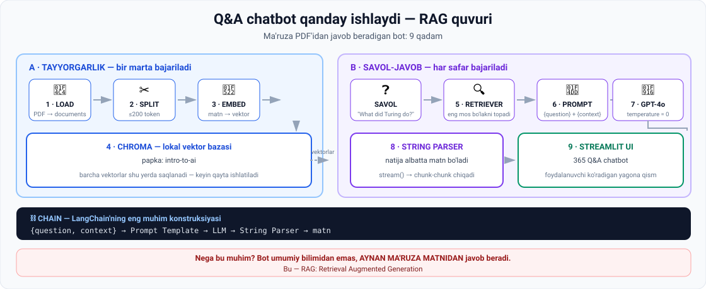
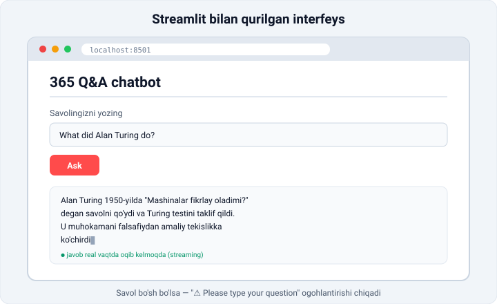
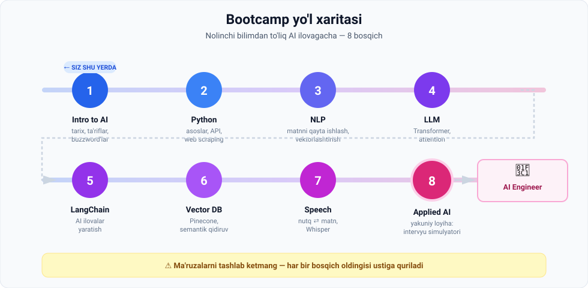

# 1-dars. 5 daqiqada AI vositasini yaratish — amaliy demo

> **Modul:** 01. Intro to AI — Getting started · **Manba:** `1. Building an AI tool in 5 minutes A quick demo.vtt`
> ⏱ **O'qish vaqti:** ~18 daqiqa · 🎯 **Daraja:** ko'rib chiqish (hozir kod yozish shart emas)

---

## 🎬 Boshlashdan oldin

O'qituvchi kursning **eng birinchi darsida** shunday deydi:

> "Men hozir noldan to'liq ishlaydigan AI chatbot quraman. Backend ham, interfeys ham. **Besh daqiqada.**"

**Nega u buni birinchi darsda qiladi?**

Chunki u sizga bir narsani ko'rsatmoqchi: **oxirida siz qayerda bo'lasiz.** Bu dars — kurs oxiridagi o'zingizga qarashdir.

> 😰 **Muhim ogohlantirish:** bu darsdagi kodning **hech narsasini** hozir tushunishingiz shart emas. Agar 30% ni tushunsangiz — bu allaqachon zo'r. Har bir atama keyingi modullarda alohida ochib beriladi. Hozir vazifangiz — **ilhomlanish**, tushunish emas.

---

## 1. Maqsad

Boshlovchi uchun AI ilova yaratish murakkab ko'rinadi. Ushbu demoda o'qituvchi **atigi bir necha satr kod** bilan noldan to'liq ishlaydigan **Q&A chatbot** quradi.

**Chatbot nima qiladi?** "Intro to AI" modulining transkripti bo'yicha savollarga javob beradi.

> 🧐 **Diqqat:** bu ChatGPT emas. Bu — **aynan sizning hujjatlaringiz** bo'yicha javob beradigan bot. Farq juda katta va uni pastda ko'rasiz.

---

## 2. Ishlatiladigan texnologiyalar

| Vosita | Vazifasi | Bir jumlada |
|---|---|---|
| **LangChain** | Ilovaning "umurtqa pog'onasi" | AI komponentlarini bir-biriga ulaydi |
| **Streamlit** | Foydalanuvchi interfeysi | 10 satr Python → chiroyli veb-sahifa |
| **OpenAI GPT-4o** | Til modeli (LLM) | Javobni o'ylab topadi |
| **OpenAI Embeddings** | Matnni vektorga aylantirish | Matnni sonlarga o'giradi |
| **Chroma** | Lokal vektor bazasi | Sonlarni saqlaydi va tez qidiradi |
| **Jupyter Notebook** | Prototiplash muhiti | Kodni bo'lak-bo'lak sinash |

---

## 3. To'liq sxema



Bu sxemani **hozir yodlash shart emas** — lekin unga qaytib qarab turing. Kurs oxirida siz uni yodlab emas, **tushunib** o'qiysiz.

---

## 4. Backend qurish — 9 qadam

### Qadam 1 · Hujjatni yuklash (Load)

Intro to AI modulining transkripti PDF sifatida tayyorlangan. LangChain uni yuklab, **documents ro'yxati** ko'rinishida qaytaradi.

```python
# taxminiy ko'rinish
from langchain_community.document_loaders import PyPDFLoader
documents = PyPDFLoader("intro_to_ai.pdf").load()
```

---

### Qadam 2 · Bo'laklarga ajratish (Split / Chunking)

Har bir bo'lak **200 tokendan** oshmasligi kerak — bu taxminan **150 ta so'z**.

**Nima uchun?** Q&A bosqichida modelga imkon qadar qisqa matn beriladi → **ilova narxi optimallashadi**.

> 💰 **Bu shunchaki nazariya emas — bu pul.** LLM lar **har bir token uchun** pul oladi. Agar botga har savolda 50 sahifalik PDF ni yuborsangiz, har bir savol qimmatga tushadi. 1 ta bo'lak yuborsangiz — arzon.
>
> **Analogiya:** ustozdan savol so'raganda unga butun darslikni emas, faqat kerakli sahifani ko'rsatasiz.

---

### Qadam 3 · Embedding (vektorlashtirish)

Har bir hujjat raqamlar massiviga — **vektor** yoki **embedding** ga aylantiriladi.

**Nima uchun?** Bu chatbotga berilgan savolga **eng mos matnni tez topish** imkonini beradi.

> 🗺 **Analogiya:** embedding — bu **ma'no xaritasidagi koordinata**. "It" va "kuchuk" so'zlari xaritada yonma-yon turadi, "it" va "traktor" esa uzoqda. Shuning uchun kompyuter ma'noni **masofa orqali** o'lchay oladi.
>
> Bu haqda **Vector Databases** modulida chuqur gaplashiladi.

---

### Qadam 4 · Vektor bazasini yaratish

Hujjatlar ro'yxati + embedding funksiyasi → **Chroma** vektor bazasi.

Barcha vektorlar **lokal papkada** saqlanadi. Papka nomi: `intro-to-ai`.

> 🔁 **Muhim:** bu **bir marta** bajariladi. Keyin har safar qayta hisoblash shart emas — tayyor baza qayta ishlatiladi.

---

### Qadam 5 · Retriever (izlovchi)

Retriever vazifasi — berilgan savolga **eng mos hujjatni topish**.

**Sinov:**
```
Savol:   "What did Alan Turing do?"
Natija:  aynan Turing haqidagi bo'lak qaytdi  ✅
```

> Retriever benuqson ishladi.

---

### Qadam 6 · Prompt yozish

> ⭐ **Bu chatbot yaratishning eng kritik qismi.**

Prompt modelga uning **xulq-atvori va maqsadini** tushuntiradi.

**Prompt template nima?**

```
"Quyidagi kontekstga tayanib savolga javob ber.

Kontekst: {context}
Savol: {question}"
```

- Jingalak qavslar `{...}` ichidagi kalit so'zlar — **o'rin egallovchilar (placeholders)**
- Ular promptni **qayta ishlatiladigan** qiladi
- Qayta ishlatiladigan prompt → **prompt template**

Bizning shablon ikkita narsani kutadi: **foydalanuvchi savoli** va **retriever konteksti**.

---

### Qadam 7 · Til modelini sozlash

| Sozlama | Qiymat | Nima uchun |
|---|---|---|
| Model | **GPT-4o** | Kuchli va tez |
| `temperature` | **0** | Har safar **o'xshash javoblar** olinadi |

> 🌡 **Temperature nima?** Bu — modelning "ijodkorlik darajasi".
> - `0` → deterministik, bir xil savolga bir xil javob. **Faktlar uchun ideal.**
> - `1` → ijodkor, har safar boshqacha. **She'r yozish uchun yaxshi.**
>
> Q&A bot uchun `0` — to'g'ri tanlov, chunki bizga **barqaror faktlar** kerak.

---

### Qadam 8 · Output parser

**String output parser** — natija albatta **string** (matn) ko'rinishida chiqishini kafolatlaydi.

---

### Qadam 9 · Chain (zanjir)

> ⛓ **LangChain'ning eng muhim konstruksiyasi.**

**Vazifasi:** bir komponent chiqishini keyingisiga argument sifatida uzatish.

```
{question, context}
        ↓
  Prompt Template
        ↓
   LLM (GPT-4o)
        ↓
   String Parser
        ↓
  chop etiladigan matn
```

Ya'ni:
1. Savol va kontekst **lug'at (dictionary)** ichida saqlanadi
2. Lug'at **prompt shablonga** beriladi
3. Hosil bo'lgan prompt **til modeliga** uzatiladi
4. Model javobi **parserga** beriladi

> 🏭 **Analogiya:** chain — bu **konveyer lentasi**. Har bir stansiya o'z ishini bajaradi va natijani keyingisiga uzatadi.

---

## 5. Test va streaming

`stream()` funksiyasi + `for` sikli orqali javobning har bir bo'lagi (**chunk**) uzluksiz ekranga chiqariladi.

> ⚡ **Nima uchun streaming?** ChatGPT javobni harfma-harf yozganini ko'rgansiz-ku? Sabab — **psixologik**. Foydalanuvchi 10 soniya bo'sh ekranga qarab turgandan ko'ra, darrov birinchi so'zni ko'rgani afzal. Texnik jihatdan javob tezroq kelmaydi — lekin **shunday tuyuladi**.

### 🔑 Eng muhim kuzatuv

Chatbot javobi **ChatGPT ning oddiy javobidan farq qiladi** — u qisqaroq va boshqacha formatlangan.

> **Demak, bot o'zining umumiy bilimidan emas, aynan ma'ruza kontekstidan foydalanmoqda.** ✅

Bu shunchaki texnik detal emas — bu **butun yondashuvning mohiyati**:

| | Oddiy ChatGPT | Bizning bot |
|---|---|---|
| Manba | Internetdagi umumiy bilim | **Aynan sizning PDF** |
| Yangi ma'lumot | Bilmaydi (kesish sanasi bor) | **Darrov biladi** — PDF ni yangilang, tamom |
| To'qib chiqarish xavfi | Yuqoriroq | **Pastroq** — kontekst bilan cheklangan |
| Ichki hujjatlar | Ko'ra olmaydi | **Ko'radi** |

> 📌 Bu yondashuvning nomi bor: **RAG — Retrieval Augmented Generation**. Kursning **LangChain** modulida to'liq o'rganiladi.

---

## 6. Frontend — Streamlit qismi



### Kod tuzilishi

1. **Import**lar — LangChain va Streamlit
2. **Modellar** — OpenAI chat modeli va embedding modeli
3. **String output parser**, **Chroma vector store**, **retriever**
   > Diqqat: avval yaratilgan **`intro-to-ai` lokal vektor bazasi** qayta ishlatiladi
4. **System prompt** + **prompt template**
5. **Chain** qo'shiladi

### Streamlit UI elementlari

| Element | Kod g'oyasi |
|---|---|
| Sarlavha | `"365 Q&A chatbot"` |
| Ajratuvchi chiziq | divider |
| Matn kiritish maydoni | savolni kutadi |
| **"Ask"** tugmasi | javob streamingini ishga tushiradi |

### Validatsiya mantiqi

```
Tugma bosildimi?
    ↓ ha
Savol to'ldirilganmi?
    ↓ yo'q
⚠️ "Please type your question"  (mos ikonka bilan)
```

> 💡 **O'qituvchining maslahati:** jarayonni tez-tez **sanity check** qilib turish muhim — ya'ni har bir bo'lakni yozgach, darrov sinab ko'rish. Bu 100 satr yozib, keyin xato qidirishdan ancha tez.

### Javobni ko'rsatish

1. Matn uchun **placeholder** va bo'sh string yaratiladi
2. `chain.stream()` → `for` sikli ichida har bir chunk stringga qo'shiladi
3. Streamlit metodi to'plangan matnni ekranga chiqaradi

### Ishga tushirish

```bash
streamlit run <fayl_nomi>.py
```

---

## 7. Natija

Faylni saqlab, brauzer sahifasi yangilandi va `"What did Alan Turing do?"` savoli berildi → **bot benuqson ishladi**.

> ⏱ 5 daqiqa me'yoriga aniq yetib borilmadi, lekin natija a'lo darajada.
>
> O'qituvchining o'zi shunday deydi: *"Ba'zan lahzaning o'zi sizni yetaklashiga yo'l qo'yish kerak."*

---

## 8. 🗺 Kurs yo'l xaritasi

Demo oxirida o'qituvchi butun bootcamp rejasini e'lon qiladi:



| № | Modul | Nima o'rganasiz |
|---|---|---|
| 1 | **Intro to AI** | Tarix, asosiy tushunchalar, buzzword'lar |
| 2 | **Python** | Keyingi bosqichlar uchun kodlash ko'nikmalari |
| 3 | **NLP + LLM** | Matnni qayta ishlash, klassifikatsiya, vektorlashtirish, **attention**, **Transformer** |
| 4 | **LangChain** | AI ilovalarini yaratish |
| 5 | **Vector Databases** | **Pinecone** bilan semantik qidiruv |
| 6 | **Speech Recognition** | Nutqni matnga va matnni nutqqa aylantirish |
| 7 | **Applied AI Engineering** | Yakuniy loyiha: **Data Scientist lavozimi uchun intervyu simulyatori** (OpenAI + Streamlit) |

---

## 9. ⚡ Amaliy topshiriqlar

> Bu darsda kod yozish **shart emas**. Lekin qiziqsangiz — quyidagilar sizni ilhomlantiradi.

### 🟢 Oson — 10 daqiqa · **Terminologiya kartochkalari**

Quyidagi 8 ta atamani **o'z so'zingiz bilan**, bittadan jumlada tushuntiring. Aniq bo'lmasa ham — taxmin qiling. Kurs oxirida qaytib kelib, javoblaringizni solishtiring.

```
1. LangChain    → ______________________________
2. Streamlit    → ______________________________
3. Embedding    → ______________________________
4. Retriever    → ______________________________
5. Prompt       → ______________________________
6. Chain        → ______________________________
7. Token        → ______________________________
8. Temperature  → ______________________________
```

> 📌 **Bu topshiriqni saqlab qo'ying.** Kurs oxirida uni qayta to'ldirish — o'z o'sishingizni ko'rishning eng yaxshi usuli.

### 🟡 O'rta — 20 daqiqa · **Farqni his qiling**

1. ChatGPT'ni oching.
2. So'rang: **"Alan Turing nima qilgan?"**
3. Javob uzunligini o'lchang — necha jumla?
4. Endi 4-darsdagi Turing haqidagi bo'limni o'qing.
5. **Solishtiring:** ChatGPT javobi va ma'ruza matni nimasi bilan farq qiladi?

**Savol:** agar sizga **aynan shu ma'ruza asosida** javob kerak bo'lsa, ChatGPT yetarlimi? Nega yo'q?

### 🔴 Qiyin — mini-loyiha · **O'z botingizni rejalashtiring**

Kod yozmasdan, faqat **rejasini** tuzing:

```
1. Qanday hujjat ustida ishlaydi?
   (masalan: universitet nizomi / darslik / kompaniya qo'llanmasi)
   → ______________________________

2. Kimlar foydalanadi?
   → ______________________________

3. Ular qanday 5 ta savol beradi?
   1) ____________  2) ____________  3) ____________
   4) ____________  5) ____________

4. Nima uchun oddiy qidiruv (Ctrl+F) yetarli emas?
   → ______________________________
```

> 🎯 Bu — real AI loyihasining **birinchi qadami**. Kod eng oxirgi bosqich.

---

## 10. 🧠 O'zini tekshirish savollari

1. Demoda qanday ikkita asosiy Python kutubxonasi ishlatildi?
2. Hujjat nima uchun bo'laklarga ajratiladi? Bo'lak hajmi qancha?
3. Embedding nima va u nima uchun kerak?
4. Retriever nima qiladi?
5. `temperature = 0` nimani anglatadi?
6. Chain ning vazifasi nima?
7. Bot javobi ChatGPT javobidan nimasi bilan farq qildi va bu nimani isbotladi?

<details>
<summary>✅ Javoblar</summary>

1. **LangChain** (backend) va **Streamlit** (interfeys).
2. Q&A bosqichida modelga **imkon qadar qisqa matn** berish va **ilova narxini optimallashtirish** uchun. Bo'lak: **≤200 token** ≈ **150 so'z**.
3. Matnni **raqamlar massiviga (vektorga)** aylantirish. Bu chatbotga savolga **eng mos matnni tez topish** imkonini beradi.
4. Berilgan savolga **eng mos hujjatni topadi**.
5. Har safar **o'xshash (barqaror) javoblar** olinadi — deterministik xatti-harakat.
6. **Komponentlarni bog'lash** — birining chiqishini keyingisiga argument sifatida uzatish.
7. Bot javobi **qisqaroq va boshqacha formatlangan** edi → bu bot **umumiy bilimidan emas, ma'ruza kontekstidan** foydalanganini isbotladi.

</details>

---

## 🔖 Atamalar

| Atama | Inglizcha | Izoh |
|---|---|---|
| LangChain | *LangChain* | AI komponentlarini bog'lovchi Python kutubxonasi |
| Streamlit | *Streamlit* | Minimal kod bilan veb-interfeys yaratuvchi kutubxona |
| Token | *token* | Model matnni bo'lish birligi (~200 token ≈ 150 so'z) |
| Chunking | *chunking* | Hujjatni kichik bo'laklarga ajratish |
| Embedding / Vektor | *embedding / vector* | Matnning raqamlar massivi ko'rinishi |
| Vektor bazasi | *vector database* | Vektorlarni saqlash va tez qidirish (Chroma, Pinecone) |
| Retriever | *retriever* | Eng mos hujjatni topuvchi komponent |
| Prompt | *prompt* | Modelga beriladigan ko'rsatma |
| Prompt template | *prompt template* | Placeholder'li, qayta ishlatiladigan prompt |
| Chain | *chain* | Komponentlarni ketma-ket bog'lovchi konstruksiya |
| Temperature | *temperature* | Tasodifiylik parametri; `0` → deterministik |
| Streaming | *streaming* | Javobni bo'lak-bo'lak uzatish |
| RAG | *Retrieval Augmented Generation* | Tashqi hujjatdan kontekst olib javob berish |
| Sanity check | *sanity check* | Jarayonni tez-tez sinab ko'rish odati |

---

🏠 [Modul boshiga](README.md) · ➡️ [Keyingi dars: Kurs nimalarni qamrab oladi](02-What-does-the-course-cover.md)
