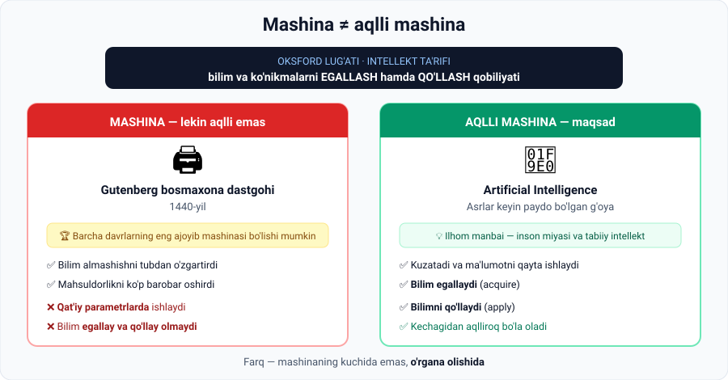

# 3-dars. Tabiiy va sun'iy intellekt

## 🎬 Boshlashdan oldin: bir savol

Kir yuvish mashinasi **aqllimi?**

U dasturni tanlaydi, suv miqdorini o'lchaydi, aylanish tezligini o'zgartiradi, hatto "aqlli" (*smart*) deb yozilgan bo'lishi ham mumkin.

> Javobni hozir ayting. Dars oxirida qaytib keling — javobingiz o'zgaradimi?

---

## 1. Tabiiy intellekt (Natural Intelligence)

Ma'ruza to'rtta misol bilan boshlanadi:

| | |
|---|---|
| 🚗 | Magistralda avtomobil boshqarayotgan odam |
| ➗ | Murakkab matematik masalani yechayotgan odam |
| ✍️ | She'r yozayotgan erkak |
| 🎵 | Musiqani egallayotgan qiz |

Bularning barchasi — **yangi ko'nikmalarni egallash va o'rganishga bo'lgan tug'ma qobiliyatimiz** namoyishi.

### Muhim nuans

> ❗ **Biz bu qobiliyatlar bilan tug'ilmaymiz.** Ularni o'rganish **vaqt talab qiladi**.

Lekin tabiat bizni to'g'ri vositalar bilan ta'minlagan:

- 🧠 **Miyamiz katta hajmdagi ma'lumotni kuzatish va qayta ishlashga mo'ljallangan**
- Aynan shu tarzda biz o'rganamiz va **kechagidan ko'ra aqlliroq** bo'lamiz

> 🍼 **Tasavvur qiling:** yangi tug'ilgan chaqaloq gapira olmaydi, yura olmaydi, hech kimni tanimaydi. 5 yildan keyin u — tilni biladi, yuguradi, hazil qiladi, yolg'on gapiradi.
>
> **Hech kim unga "dastur yozmagan".** U shunchaki **kuzatgan va o'rgangan**.
>
> Aynan shu — AI olimlari nusxalashga urinayotgan narsa.

---

## 2. 📖 Intellekt ta'rifi

Butun darsning **kalit jumlasi**:

> ## **Oksford lug'ati:**
> ### intellekt — **bilim va ko'nikmalarni egallash hamda qo'llash qobiliyati**
> *("the ability to acquire and apply knowledge and skills")*

Bu ta'rif — **mezon**. Endi istalgan narsani shu ta'rifga solib ko'rishimiz mumkin.

**Ikkita shart:**

| Shart | Inglizcha | Savol |
|---|---|---|
| 1 · **Egallash** | *acquire* | Yangi narsa **o'rgana oladimi?** |
| 2 · **Qo'llash** | *apply* | O'rganganini **ishlata oladimi?** |

> ⚠️ **Ikkalasi ham** kerak. Faqat bittasi yetmaydi.

---

## 3. Insonlar — vosita quruvchilar

Insoniyatning eng kuchli tomonlaridan biri — biz **vosita quruvchimiz (tool builders)**.

Tarix davomida biz mahsuldorlikni oshirish yo'llarini **qayta-qayta topganmiz**. Shulardan biri — **mashinalar yaratish**.

---

## 4. Sinov: Gutenberg bosmaxona dastgohi (1440)



### Bu qanchalik zo'r mashina?

> Barcha davrlarning eng ajoyib mashinalari reytingida u **1-o'rinni egallashi mumkin**, chunki u **bilim almashish usulini tubdan o'zgartirdi**.

**Nima o'zgardi?** Kitob qo'lda ko'chirilganda bir nusxa oylar talab qilardi va nihoyatda qimmat edi. Bosmaxona kitobni **ommaviy** qildi — bu Uyg'onish davri, Reformatsiya va zamonaviy fanning yo'lini ochdi.

### Lekin u aqllimi?

Ta'rifga solib ko'ramiz:

| Shart | Bosmaxona dastgohi | Natija |
|---|---|---|
| **Egallash** (*acquire*) | Yangi narsa o'rgana oladimi? | ❌ **Yo'q** |
| **Qo'llash** (*apply*) | O'rganganini ishlata oladimi? | ❌ **O'rganmagan narsani qo'llab bo'lmaydi** |

> ### **Xulosa: bu aqlli mashina emas.**
>
> U **qat'iy belgilangan parametrlar** (*fixed parameters*) asosida ishlaydi va **bilim hamda ko'nikmalarni egallay va qo'llay olmaydi**.

### 🔑 Asosiy sabot

> **Kuchli ≠ aqlli.**
>
> Mashina qanchalik foydali, murakkab yoki inqilobiy bo'lmasin — agar u **o'rgana olmasa**, u intellektga ega emas.

---

## 5. Sun'iy intellektning tug'ilishi

Aqlli mashinalar tushunchasi paydo bo'lishi uchun **asrlar** kerak bo'ldi.

Kompyuter olimlari **tabiiy intellekt va inson miyasi jarayonlaridan ilhomlanib**, shunday intellektni mashinalarga singdirishni tasavvur qildilar.

> ## Shu maqsadga erishishga qaratilgan yangi fan sohasi —
> ## **sun'iy intellekt (Artificial Intelligence, AI)**

---

## 6. ⚡ Amaliy topshiriqlar

### 🟢 Oson — 5 daqiqa · **Aqllimi yoki yo'q?**

Har birini ta'rifga soling: **o'rgana oladimi?**

| № | Qurilma | Aqlli? | Nega? |
|---|---|---|---|
| 1 | Kalkulyator | | |
| 2 | Netflix tavsiya tizimi | | |
| 3 | Kir yuvish mashinasi | | |
| 4 | Avtomobildagi kruiz-kontrol | | |
| 5 | Tesla Autopilot | | |
| 6 | Lift | | |
| 7 | Telefondagi Face ID | | |
| 8 | Mikroto'lqinli pech | | |

<details>
<summary>✅ Javoblar</summary>

**Aqlli emas** (qat'iy parametrlar): 1, 3, 4, 6, 8
— Kalkulyator har doim bir xil qoida bo'yicha hisoblaydi. Kir yuvish mashinasi dasturni **tanlaydi**, lekin **o'rganmaydi**. Kruiz-kontrol tezlikni ushlab turadi, lekin sizning haydash uslubingizga moslashmaydi.

**Aqlli** (ma'lumotdan o'rganadi): 2, 5, 7
— Netflix sizning ko'rish tarixingizdan **o'rganadi**. Autopilot millionlab kilometr ma'lumotidan **o'rganilgan**. Face ID sizning yuzingizni **o'rgangan** va vaqt o'tishi bilan moslashadi.

**🎯 Bosh savolga qaytamiz:** kir yuvish mashinasi **aqlli emas** — u zamonaviy, foydali, hatto "smart" deb yozilgan bo'lishi mumkin, lekin u **o'rganmaydi**.

</details>

### 🟡 O'rta — 15 daqiqa · **O'z tarixingizni yozing**

Ma'ruzada aytiladi: biz bu qobiliyatlar bilan tug'ilmaymiz.

Bitta ko'nikmangizni tanlang (velosiped, chet tili, o'yin, cholg'u asbobi) va yozing:

```
Ko'nikma:                    ______________________
Necha yoshda boshladingiz:   ______________________
Qancha vaqt ketdi:           ______________________
Nechi marta muvaffaqiyatsiz  ______________________
bo'ldingiz:
Nima yordam berdi:           ______________________
```

**Savol:** AI modelini o'rgatish jarayoni bunga o'xshaydimi? Nimasi bilan?

> 💡 **Javob ilgagi:** AI ham **ko'p misol ko'radi**, **xato qiladi**, **xatosini tuzatadi** va **asta-sekin yaxshilanadi**. Bu tasodif emas — jarayon ataylab inson o'rganishidan nusxa olingan.

### 🔴 Qiyin — muhokama · **Chegara qayerda?**

Bahsli savol: **kalkulyator "bilim va ko'nikmalarni qo'llaydimi"?**

U matematik qoidalarni "biladi" va ularni "qo'llaydi". Demak, u ta'rifning **yarmiga** javob beradi.

```
Sizning argumentingiz (3 jumla):
_________________________________________
_________________________________________
_________________________________________
```

> 🤔 Bu savolning **yagona to'g'ri javobi yo'q** — va aynan shuning uchun u qimmatli. AI ta'riflari doim bahsli bo'lgan; 6-darsda ko'rasizki, hatto **AGI** ning ham aniq chegarasi yo'q.

---

## 7. 🧠 O'zini tekshirish savollari

1. Oksford lug'ati intellektni qanday ta'riflaydi?
2. Ta'rifdagi **ikkita** shart qanday?
3. Nima uchun biz bu qobiliyatlar bilan tug'ilmaymiz, lekin baribir ularni egallay olamiz?
4. Gutenberg dastgohi qachon ixtiro qilingan va nima uchun u inqilobiy?
5. Nima uchun u **aqlli mashina emas**?
6. AI sohasi qanday ilhom asosida paydo bo'ldi?

<details>
<summary>✅ Javoblar</summary>

1. **Bilim va ko'nikmalarni egallash hamda qo'llash qobiliyati.**
2. **Egallash** (*acquire*) va **qo'llash** (*apply*).
3. Chunki **miyamiz katta hajmdagi ma'lumotni kuzatish va qayta ishlashga mo'ljallangan** — shu tarzda biz o'rganamiz.
4. **1440-yil.** U **bilim almashish usulini tubdan o'zgartirdi**.
5. Chunki u **qat'iy belgilangan parametrlar** asosida ishlaydi va **bilim egallay hamda qo'llay olmaydi**.
6. Kompyuter olimlari **tabiiy intellekt va inson miyasi jarayonlaridan ilhomlanib**, shu intellektni mashinalarga singdirishni tasavvur qildilar.

</details>

---

## 📌 Xulosa

```
Mashina  ─────────────────────►  qat'iy parametrlar, o'rganmaydi
   │                              (bosmaxona, kalkulyator, lift)
   │
   └── + o'rganish qobiliyati ──►  AQLLI MASHINA
                                   (AI — sun'iy intellekt)
```

> **Bitta jumlada:** intellektning belgisi — kuch emas, **o'zgarish qobiliyati**.

---

## 🔖 Atamalar

| Atama | Inglizcha | Izoh |
|---|---|---|
| Tabiiy intellekt | *natural intelligence* | Insonning tug'ma o'rganish qobiliyati |
| Sun'iy intellekt | *artificial intelligence* | Mashinaga intellekt singdirish sohasi |
| Egallash | *acquire* | Yangi bilim olish |
| Qo'llash | *apply* | Olingan bilimni ishlatish |
| Qat'iy parametrlar | *fixed parameters* | O'zgarmas, oldindan belgilangan qoidalar |
| Vosita quruvchi | *tool builder* | Insonning mahsuldorlikni oshirish uchun vosita yaratish xususiyati |

---

⬅️ [Oldingi: Kurs nimalarni qamrab oladi](02-What-does-the-course-cover.md) · ➡️ [Keyingi: AI ning qisqacha tarixi](04-Brief-history-of-AI.md)
