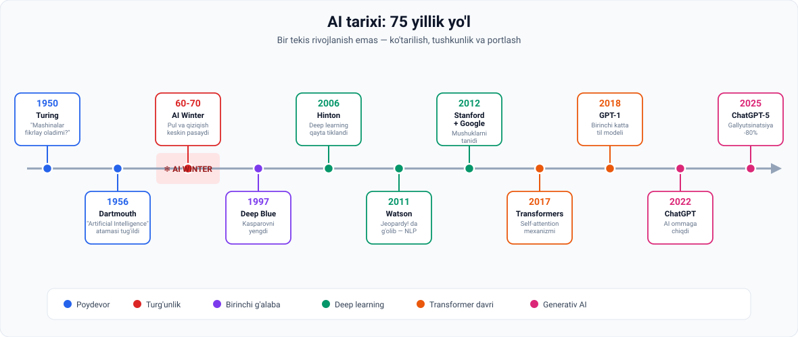
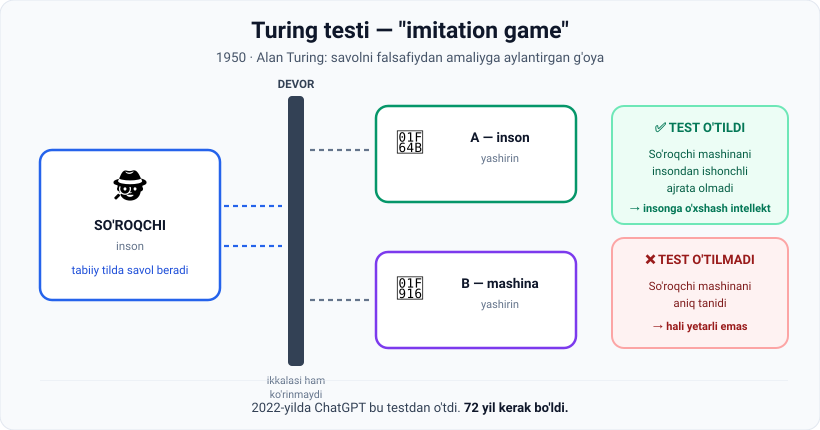

# 4-dars. AI ning qisqacha tarixi

## 🎬 Boshlashdan oldin

Ko'pchilik o'ylaydi: **"AI 2022-yilda ChatGPT bilan paydo bo'ldi."**

Aslida ChatGPT — **72 yillik ishning natijasi**. Va bu 72 yilning katta qismi — **muvaffaqiyatsizlik**, **pul yo'qligi** va **odamlar ishonmasligi** bilan o'tgan.

> Bu dars — texnologiya tarixi emas. Bu — **sabr haqidagi hikoya**.

---

## 1. To'liq xronologiya



| Yil | Voqea | Ahamiyati |
|---|---|---|
| **1950** | **Alan Turing** ilmiy maqolada *"Mashinalar fikrlay oladimi?"* savolini qo'yadi | Muhokamani **nazariy/falsafiydan amaliy va eksperimental** tekislikka ko'chirdi. **Turing testi** mezonini taklif qildi |
| **1956** | **Dartmouth konferensiyasi** — "artificial intelligence" atamasi kiritildi | AI **rasmiy fan sohasiga** aylandi |
| **1960–70** | ❄️ **AI Winter (AI qishi)** | Texnologiya va ma'lumot yetishmasligi → moliyalashtirish va qiziqish kamaydi |
| **1997** | IBM **Deep Blue** shaxmat bo'yicha jahon chempioni **Garri Kasparov**ni yengdi | AI qayta sarlavhalarga chiqdi |
| **1990-yillar oxiri – 2000-yillar** | Kompyuter quvvati keskin oshdi, **Internet** dunyo bo'ylab tarqaldi | **Zarur ingredientlar** shakllandi |
| **2006** | **Geoffrey Hinton** hammuallif maqolasi | **Deep learning** texnikalari bilan neyron tarmoqlarga qiziqishni tikladi |
| **2011** | IBM **Watson** *Jeopardy!* viktorinasida g'olib | **NLP** dagi jiddiy yutuq — AI **inson tili** bilan ishlay oldi |
| **2012** | Stanford va Google (**Jeff Dean**, **Andrew Ng**) — *"Building high-level features using large-scale unsupervised learning"* | **Ko'p qatlamli (chuqur) neyron tarmoqlar**ni ilgari surdi. Tizim **mushuklarni tanib olishda** ajoyib natija ko'rsatdi |
| **2017** | **Google Brain** jamoasi — **Transformers** arxitekturasi | **Self-attention** mexanizmi tufayli NLP da katta yutuq |
| **2018** | **OpenAI** — **GPT** seriyasining birinchi versiyasi | Generativ AI Transformer'lardan foydalanib **ulkan LLM** larni quradi |
| **2022 (oxiri)** | **ChatGPT** — foydalanuvchiga qulay AI chat interfeysi | AI ommaga chiqdi |
| **2025** | **OpenAI ChatGPT-5** | **Gallyutsinatsiyalar 80% gacha kamaydi**, matematika, dasturlash va **multimodal reasoning** da rekord natijalar |

---

## 2. 1950 · Alan Turing va uning testi

### Turing nima qildi?

Bu savol **birinchi marta** so'ralmagan edi. Turingning **asosiy hissasi** boshqa narsada:

> U muhokamani **nazariy va falsafiydan** → **amaliy va eksperimental** tekislikka ko'chirdi.

Ya'ni: *"Mashina fikrlay oladimi?"* degan cheksiz falsafiy bahs o'rniga u **aniq, sinab ko'rish mumkin bo'lgan mezon** taklif qildi.

### Turing testi qanday ishlaydi



**Qoidasi:**

1. **Inson-so'roqchi** (*interrogator*) tabiiy tilda suhbat quradi
2. Suhbatdoshlar: **bitta inson** va **bitta mashina**, ikkalasi ham **ko'rinmaydi**
3. Agar so'roqchi **mashinani insondan ishonchli tarzda ajrata olmasa** → mashina **testdan o'tgan** va **insonga o'xshash intellekt** namoyish etgan hisoblanadi

> 🧩 **Nozik nuqta:** test **mashina fikrlayaptimi** deb so'ramaydi. U **mashina fikrlayotgandek ko'rinadimi** deb so'raydi. Bu — atayin qilingan. Turing "fikrlash" ni ta'riflashning imkonsiz ekanini tushungan va uni **kuzatiladigan xatti-harakat** bilan almashtirgan.

> 🏆 **Turingning savoli AI tarixidagi burilish nuqtasi bo'ldi** va AI ga zamonaviy hisoblash yondashuvlari uchun zamin yaratdi.

---

## 3. 1956 · Dartmouth konferensiyasi

Bu yerda **"artificial intelligence"** atamasi **birinchi marta** ishlatildi va AI **rasmiy fan sohasiga** aylandi.

**Ishtirokchilar quyidagi sohalar mutaxassislarini birlashtirishga kelishdilar:**

| Soha | Inglizcha |
|---|---|
| Neyron tarmoqlar | *neural networks* |
| Hisoblash nazariyasi | *theory of computation* |
| Avtomatlar nazariyasi | *automata theory* |

**Maqsad:** mashinalar inson intellektining turli jihatlarini **simulyatsiya qila oladimi**, shuni o'rganish.

> 🔁 **Diqqat qiling:** 1956-yilda ham, bugun ham — asosiy g'oya bir xil. Olimlar **inson intellektidan ilhom olib**, uni mashinalarga singdirishga harakat qilishgan.

---

## 4. ❄️ 1960–70 · AI Winter

> **AI tadqiqot hamjamiyati boshidanoq ko'plab qiyinchiliklarga duch keldi.**

**Sabablari:**
- Texnologiya cheklovlari
- Ma'lumot yetishmasligi

**Oqibati:**
- Moliyalashtirish **qisqardi**
- AI tadqiqotlariga qiziqish **pasaydi**

> 💔 **Bu darsning eng muhim qismi.** Tasavvur qiling: 1956-yilda hamma "10 yilda mashinalar odamdek fikrlaydi" deb ishongandi. 10 yil o'tdi — hech narsa bo'lmadi. Pul kesildi. Olimlar sohani tark etdi.
>
> **AI o'nlab yillar davomida katta sarlavhalarga chiqmadi.**
>
> Bugungi ChatGPT — o'sha qorong'u yillarda sohani tark etmagan odamlarning mehnati.

---

## 5. 1997 · Deep Blue

IBM ning **Deep Blue** kompyuteri shaxmat bo'yicha jahon chempioni **Garri Kasparov**ni yengdi.

> ♟ **Nega bu shov-shuv bo'ldi?** Shaxmat asrlar davomida **inson zakovatining ramzi** hisoblangan. Mashinaning jahon chempionini yengishi — psixologik zarba edi.

---

## 6. 🔑 Burilish nuqtasi: ikki ingredient

**1990-yillar oxiri – 2000-yillar boshi:**

| Ingredient | Nima bo'ldi |
|---|---|
| 💾 **Ma'lumot** | Internet dunyo bo'ylab tez tarqaldi. Odamlar **ulkan hajmdagi raqamli ma'lumot** ishlab chiqara boshladi |
| ⚡ **Hisoblash quvvati** | Kompyuter quvvati **keskin oshdi** (*skyrocketed*) |

> **Deyarli bir kechada zarur ingredientlar joyiga tushdi.**
>
> Bu **AI tadqiqotlari uchun burilish nuqtasi** bo'lib chiqdi.

> 🍳 **Analogiya:** retsept (algoritmlar) 1950-yillardayoq bor edi. Lekin **mahsulotlar** (ma'lumot) va **pech** (hisoblash quvvati) yo'q edi. 2000-yillarda ikkalasi ham paydo bo'ldi — va taom pishdi.
>
> 📌 Aynan shuning uchun **02-modul butunlay ma'lumotga bag'ishlangan**.

---

## 7. 2006 · Deep Learning qayta tug'ildi

**Geoffrey Hinton** hammuallif maqolasi **deep learning** texnikalari bilan neyron tarmoqlarga **qiziqishni tikladi**.

### Deep Learning nima?

> **Deep learning neyron tarmoqlari** — bu **inson miyasi ishlashidan ilhomlangan** AI turi.

**Talablari:**
- **Ko'p ma'lumot**
- **Yuqori hisoblash quvvati**

> ⏳ **Shuning uchun bunday modelni o'n yil oldin yaratish mumkin emas edi.**
>
> G'oya yangi emas edi — **imkoniyat** yangi edi.

---

## 8. 2011–2012 · AI ko'ra va gapira boshladi

| Yil | Voqea | Nima isbotlandi |
|---|---|---|
| **2011** | IBM **Watson** *Jeopardy!* da g'olib | AI **inson tili** bilan ishlay oladi — **NLP** da jiddiy yutuq |
| **2012** | Stanford + Google tizimi **mushuklarni tanidi** | **Ko'p qatlamli neyron tarmoqlar** ishlaydi |

> 🐱 **"Mushuklar" hikoyasi.** Tizimga hech kim "bu mushuk" deb aytmagan. U shunchaki millionlab YouTube kadrlarini ko'rgan va **o'zi** mushuk tushunchasini shakllantirgan.
>
> Bu — 02-moduldagi **unlabelled data** ning eng mashhur namunasi. Sarlavha ham shundan: *"...using **large-scale unsupervised** learning"*.

---

## 9. ⭐ 2017 · Transformers

**Google Brain** jamoasi **fundamental ilmiy hissa** qo'shdi — **Transformers** arxitekturasini taqdim etdi.

> Bu model **NLP dagi katta yutuq** bo'ldi — sababi uning **self-attention mexanizmi**dan foydalanishi. U **matn kabi ma'lumot ketma-ketliklarini samarali** qayta ishlash imkonini beradi.

> 🎯 **Nega bu shunchalik muhim?** Bugungi **hamma narsa** — ChatGPT, Claude, Gemini, Copilot — **Transformer** ustida qurilgan. GPT dagi **"T"** harfi ham aynan shu: **Generative Pre-trained Transformer**.
>
> Bu haqda **LLM moduli**da to'liq o'rganiladi.

---

## 10. 2018–2025 · Generativ AI davri

```
2018  GPT-1        →  Transformer'lardan foydalanib ulkan LLM lar quriladi
  ↓
      keyingi versiyalarda sezilarli takomillashuv
  ↓
2022  ChatGPT      →  foydalanuvchiga qulay AI chat interfeysi
  ↓
2025  ChatGPT-5    →  gallyutsinatsiyalar -80%,
                      matematika, kod va multimodal reasoning'da rekordlar
```

> 🗣 **Gallyutsinatsiya (hallucination) nima?** LLM ning **ishonch bilan noto'g'ri ma'lumot berishi**. Model "bilmayman" demaydi — u ishonarli ko'rinadigan javob **to'qib chiqaradi**. Bu bugungi eng katta texnik muammolardan biri.
>
> 1-darsdagi RAG yondashuvi — aynan shu muammoga qarshi kurashning bir usuli.

---

## 11. ⚡ Amaliy topshiriqlar

### 🟢 Oson — 5 daqiqa · **Vaqt lentasi**

Voqealarni to'g'ri tartibga soling (yodlab emas, mantiqan):

```
___  ChatGPT ommaga chiqdi
___  "Artificial intelligence" atamasi kiritildi
___  Transformers arxitekturasi
___  Turing testi taklif qilindi
___  Deep Blue Kasparovni yengdi
___  AI Winter
___  Watson Jeopardy! da g'olib
```

<details>
<summary>✅ Javob</summary>

1. Turing testi (**1950**)
2. "Artificial intelligence" atamasi (**1956**)
3. AI Winter (**1960–70**)
4. Deep Blue (**1997**)
5. Watson (**2011**)
6. Transformers (**2017**)
7. ChatGPT (**2022**)

</details>

### 🟡 O'rta — 20 daqiqa · **Turing testini o'zingiz o'tkazing**

1. ChatGPT'ni oching.
2. Unga **5 ta savol** bering — shundayki, **inson bilan mashinani farqlash** maqsadida:

```
Namuna savollar:
• "Kecha tushingizda nima ko'rdingiz?"
• "Bolaligingizdagi eng noqulay xotirangiz qaysi?"
• "Hozir xonangizda nima hidi bor?"
• "17 × 4823 nechchi?"       ← bu teskarisini ko'rsatadi
```

3. Har bir javob uchun belgilang: **"inson shunday javob berardimi?"**

**Xulosa savoli:** qaysi turdagi savollar mashinani **oshkor qildi**? Nima uchun?

> 💡 **Ilgak:** juda **yaxshi** javob ham shubhali. Hech kim 17×4823 ni bir soniyada hisoblamaydi.

### 🔴 Qiyin — tadqiqot · **AI Winter takrorlanadimi?**

Tarix ko'rsatadi: AI da **umid to'lqini** → **hafsala pir bo'lishi** → **turg'unlik** sikli bo'lgan.

Ikki tomonni ham asoslang:

```
"HA, yangi AI Winter bo'lishi mumkin, chunki..."
_________________________________________
_________________________________________

"YO'Q, bu safar boshqacha, chunki..."
_________________________________________
_________________________________________
```

> 📌 **Ilgak:** 1960-yillarda AI **pul ishlab bermasdi**. Bugun — ishlab beryapti. Bu farq muhimmi?

---

## 12. 🧠 O'zini tekshirish savollari

1. Turingning asosiy hissasi nima edi? (Savolni qo'yish emas — boshqa narsa)
2. Turing testi qanday o'tkaziladi? 3 ta qadamda ayting.
3. Qaysi yili va qayerda "artificial intelligence" atamasi kiritildi?
4. Dartmouth konferensiyasida qaysi 3 ta soha mutaxassislari birlashtirildi?
5. AI Winter qachon bo'ldi va sabablari nima?
6. Qaysi **ikkita ingredient** AI portlashini keltirib chiqardi?
7. Nima uchun deep learning modelini 1990-yillarda yaratib bo'lmasdi?
8. Transformers qachon va kim tomonidan taqdim etildi? Uning asosiy mexanizmi nima?
9. ChatGPT-5 qanday natijalarga erishdi?

<details>
<summary>✅ Javoblar</summary>

1. Muhokamani **nazariy/falsafiydan amaliy va eksperimental** tekislikka ko'chirish va **aniq mezon** (Turing testi) taklif qilish.
2. (a) Inson-so'roqchi tabiiy tilda suhbat quradi; (b) suhbatdoshlar — bitta inson, bitta mashina, ikkalasi ko'rinmaydi; (c) so'roqchi mashinani ishonchli ajrata olmasa — test o'tildi.
3. **1956**, **Dartmouth konferensiyasi**.
4. **Neyron tarmoqlar**, **hisoblash nazariyasi**, **avtomatlar nazariyasi**.
5. **1960–70-yillar.** Texnologiya va ma'lumot yetishmasligi → moliyalashtirish va qiziqish kamaydi.
6. **Katta hajmdagi raqamli ma'lumot** (Internet) va **yuqori hisoblash quvvati**.
7. Deep learning uchun **ko'p ma'lumot** va **yuqori hisoblash quvvati** kerak — o'sha paytda ikkalasi ham yetarli emas edi.
8. **2017**, **Google Brain**. Mexanizm — **self-attention**.
9. Aniqlikda yangi mezonlar: **gallyutsinatsiyalar 80% gacha kamaydi**, matematika, dasturlash va **multimodal reasoning** da rekord natijalar.

</details>

---

## 📌 Xulosa

```
1950  g'oya          →  Turing: "sinab ko'rish mumkin bo'lgan mezon"
1956  soha           →  AI rasmiy fan bo'ldi
60-70 turg'unlik     →  ❄️ ingredientlar yo'q edi
1997  isbot          →  mashina chempionni yengdi
2000+ ingredientlar  →  💾 ma'lumot + ⚡ quvvat
2006  usul           →  deep learning tiklandi
2017  arxitektura    →  Transformer
2022  ommaviylik     →  ChatGPT
```

> **Bitta jumlada:** AI 75 yil davomida **g'oyaga ega edi, lekin vositasi yo'q edi**. Vositalar paydo bo'lgach — hammasi bir necha yilda o'zgardi.

---

## 🔖 Atamalar

| Atama | Inglizcha | Izoh |
|---|---|---|
| Turing testi | *Turing test* | Mashina intellektini baholash mezoni |
| Imitatsiya o'yini | *imitation game* | Turing testining asl nomi |
| So'roqchi | *interrogator* | Testda savol beruvchi inson |
| AI Winter | *AI winter* | Moliyalashtirish va qiziqish pasaygan davr |
| Neyron tarmoq | *neural network* | Miyadan ilhomlangan hisoblash modeli |
| Deep learning | *deep learning* | Ko'p qatlamli neyron tarmoqlar |
| Transformer | *Transformer* | 2017-yilgi arxitektura; NLP da inqilob |
| Self-attention | *self-attention* | Transformer'ning asosiy mexanizmi |
| Unsupervised learning | *unsupervised learning* | Belgilanmagan ma'lumotdan o'rganish |
| GPT | *Generative Pre-trained Transformer* | OpenAI ning LLM seriyasi |
| Gallyutsinatsiya | *hallucination* | LLM ning ishonch bilan noto'g'ri javob berishi |
| Multimodal | *multimodal* | Matn, rasm, ovoz bilan bir vaqtda ishlash |

---

⬅️ [Oldingi: Tabiiy va sun'iy intellekt](03-Natural-vs-Artificial-Intelligence.md) · ➡️ [Keyingi: AI, DS, ML va DL farqi](05-Demystifying-AI-DS-ML-DL.md)
