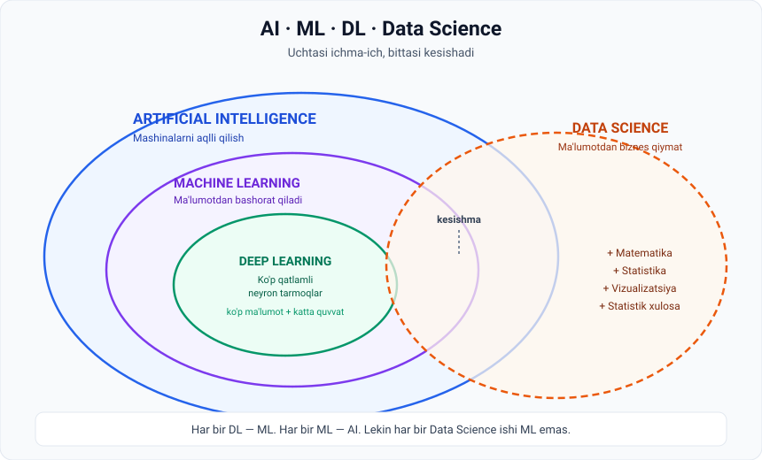

# 5-dars. AI, Data Science, Machine Learning va Deep Learning farqi

## 🎬 Boshlashdan oldin

Bitta ish e'lonini o'qing:

> *"Biz **AI** yechimlari ustida ishlaydigan **Data Scientist** qidiryapmiz. Talab: **Machine Learning** tajribasi, **Deep Learning** bo'yicha bilim."*

To'rtta atama, bitta jumlada. **Ular bir xilmi? Yo'q bo'lsa — farqi nima?**

> Ko'p odam bu atamalarni **bir-birining o'rniga** ishlatadi. Bu chalkashlik keltirib chiqaradi. 12 daqiqadan keyin siz bu chalkashlikdan xalos bo'lasiz.

---

## 1. To'liq manzara



Diqqat qiling: **uchtasi ichma-ich joylashgan**, bittasi esa **kesishadi**. Bu tasodif emas.

---

## 2. Artificial Intelligence (AI)

> **Mashinalarni aqlli qilish**, ularga **o'rganish va yangi ko'nikmalar egallash** imkonini berish da'vosi.

**AI — bu bir necha kichik sohani qamrab oluvchi keng intizom** (*broad discipline*).

> 📦 **AI — bu qutining nomi, ichidagi narsaning emas.** "Bu AI" deyish — "bu transport vositasi" deyish bilan bir xil. Velosipedmi, samolyotmi, raketami — hammasi transport.

---

## 3. Machine Learning (ML)

> AI ning **asosiy kichik sohalaridan biri**. **Ma'lumotdan foydalanib natijalarni bashorat qiladi** — oddiy korrelyatsiyadan chuqurroq **murakkab bog'liqliklarni (intricate dependencies)** aniqlash orqali.

### Mohiyati — matematik funksiyaga o'xshaydi

```
Input ma'lumot  →  [ MODEL: ma'lumotni ma'lum tarzda qayta ishlaydi ]  →  Output
```

### Ma'ruzadagi ikkita misol

| Input | Model nima qiladi | Output |
|---|---|---|
| Foydalanuvchining **film ko'rish tarixi** | Tahlil qiladi | Keyingi **yoqishi mumkin bo'lgan filmlar** bashorati |
| Mijozning **moliyaviy tranzaksiyalari** | Tahlil qiladi | **Kredit reytingi** → qarzni qaytarish ehtimoli prognozi |

### 🔍 "Korrelyatsiyadan chuqurroq" nimani anglatadi?

Bu jumla darsdagi eng nozik joy. Misol bilan:

```
Oddiy korrelyatsiya:
  "Muzqaymoq sotuvi oshsa, cho'kish holatlari ham oshadi"
  → ikkalasi birga o'sadi, lekin biri ikkinchisining sababi emas.
    Yashirin sabab: YOZ.

ML nima qiladi:
  Yuzlab omilni bir vaqtda hisobga oladi — harorat, ta'til mavsumi,
  hafta kuni, hudud, yosh guruhi — va murakkab bog'liqlikni topadi.
```

> ML — "A va B birga o'sadi" demaydi. U **"shu 40 ta belgi shunday bo'lsa, natija 87% ehtimol bilan X bo'ladi"** deydi.

> 📌 ML modellarining turlari kursning keyingi qismlarida ko'rib chiqiladi. Hozircha **ta'rifni** va **ML — AI ning muhim tarmog'i** ekanini eslab qoling.

---

## 4. Deep Learning (DL)

> 4-darsdan eslang: **inson miyasi ishlashidan ilhomlangan, ko'p qatlamli neyron tarmoqlar.**

DL — **ML ning ichida**. Ya'ni **har bir deep learning modeli — machine learning modeli**, lekin teskarisi to'g'ri emas.

| Talabi | Nima uchun |
|---|---|
| **Ko'p ma'lumot** | Qatlamlar ko'p → o'rganiladigan parametr ko'p |
| **Yuqori hisoblash quvvati** | Millionlab hisob-kitob |

> 🧅 **"Deep" nima uchun?** Chunki tarmoqda **ko'p qatlam** bor. Har bir qatlam oldingisining natijasini yanada mavhumroq darajada qayta ishlaydi:
> ```
> 1-qatlam:  chiziqlar va burchaklar
> 2-qatlam:  shakllar
> 3-qatlam:  ko'z, burun, quloq
> 4-qatlam:  yuz
> ```
> Hech kim bu bosqichlarni dasturlashtirmagan — model **o'zi** shunday tashkil qilgan.

---

## 5. Data Science (DS) — bu boshqacha

Mana bu yerda ko'pchilik adashadi.

### DS va AI munosabati

> **AI va machine learning — data science ning muhim qismi.**
> Har bir munosib data scientist (*worth their salt*) ML algoritmlari bilan ishlay oladi.

### **Lekin** — muhim "lekin"

> Data scientist lar ko'pincha **an'anaviyroq statistik usullardan** ham foydalanadilar:
>
> - **Data visualization** — ma'lumotni vizuallashtirish
> - **Statistical inference** — statistik xulosalar
>
> Ko'pincha ular **ML ga tayanmagan holda** ma'lumotdan insight chiqarishga intiladilar.

### Xulosa

> **Data science AI va uning kichik sohasi ML bilan muhim kesishmaga ega**, lekin ayni paytda **matematika, statistika va data visualization** ga ham tayanadi — maqsad: **ma'lumotdan biznes qiymat olish**.

---

## 6. 🎯 Ma'ruzaning yakuniy misoli

Bitta data scientist ikki xil ish qila oladi:

| Yo'l | Nima qiladi | Bu ML mi? |
|---|---|---|
| **1** | Kelajakdagi mijoz buyurtmalarini bashorat qiluvchi **murakkab algoritm** ishlab chiqadi | ✅ Ha |
| **2** | Mijozlar buyurtmalarini **do'kon tashriflariga nisbatan grafikda** tasvirlab, **qimmatli biznes insight**larni ochib beradi | ❌ Yo'q — oddiy vizualizatsiya |

> 💡 **Va ikkinchi yo'l ham to'liq qiymatli ish.** Ba'zan bitta yaxshi grafik murakkab modeldan ko'ra ko'proq foyda keltiradi — chunki uni **rahbariyat tushunadi va unga asoslanib qaror qabul qiladi**.

---

## 7. 📊 Bir qarashda solishtirish

| | AI | ML | DL | Data Science |
|---|---|---|---|---|
| **Nima bu?** | Keng intizom | AI ning kichik sohasi | ML ning kichik sohasi | Alohida soha, AI/ML bilan kesishadi |
| **Maqsad** | Mashinani aqlli qilish | Ma'lumotdan bashorat | Murakkab naqshlarni topish | Ma'lumotdan biznes qiymat |
| **Ma'lumot hajmi** | Har xil | O'rta | **Juda katta** | Har xil |
| **Hisoblash quvvati** | Har xil | O'rta | **Juda yuqori** | O'rta |
| **Tipik vosita** | — | Regressiya, daraxtlar | Neyron tarmoqlar | Grafiklar, statistika, SQL, ML |
| **Misol** | Umumiy soha | Kredit reytingi | Yuzni tanish | Savdo hisoboti + prognoz |

---

## 8. ⚡ Amaliy topshiriqlar

### 🟢 Oson — 5 daqiqa · **Qaysi qutiga tushadi?**

| № | Vazifa | AI / ML / DL / DS ? |
|---|---|---|
| 1 | Savdo ma'lumotini grafikda tasvirlab, mavsumiy trendni ko'rsatish | |
| 2 | Rasmda kimning yuzi borligini aniqlash | |
| 3 | Mijoz keyingi oy ketib qolish ehtimolini bashorat qilish | |
| 4 | O'rtacha chek summasi va uning standart og'ishini hisoblash | |
| 5 | Ovozli buyruqni matnga aylantirish | |
| 6 | A/B testi natijasi statistik ahamiyatlimi — tekshirish | |

<details>
<summary>✅ Javoblar</summary>

1. **DS** — vizualizatsiya, ML emas
2. **DL** (⊂ ML ⊂ AI) — yuzni tanish uchun neyron tarmoq kerak
3. **ML** (⊂ AI) — klassik bashorat masalasi
4. **DS** — oddiy statistika
5. **DL** (⊂ ML ⊂ AI) — nutqni tanish neyron tarmoqda ishlaydi
6. **DS** — statistical inference

**Naqsh sezdingizmi?** 1, 4, 6 — ML **ishlatmaydi**, lekin baribir **data science**. Aynan shu ma'ruzaning asosiy g'oyasi.

</details>

### 🟡 O'rta — 15 daqiqa · **Ish e'lonlarini tahlil qiling**

1. Istalgan ish saytini oching (LinkedIn, hh.uz, Indeed).
2. **3 ta e'lon** toping: *Data Scientist*, *ML Engineer*, *AI Engineer*.
3. Jadval to'ldiring:

| | Data Scientist | ML Engineer | AI Engineer |
|---|---|---|---|
| Talab qilingan vositalar | | | |
| Statistika kerakmi? | | | |
| Deep learning kerakmi? | | | |
| Kod yozish ulushi | | | |

**Savol:** qaysi lavozim sizga ko'proq mos? Nega?

### 🔴 Qiyin — muhukama · **Chegara qayerda?**

Bugungi kunda ko'p kompaniya oddiy `if-else` qoidalarini ham **"AI-powered"** deb reklama qiladi.

```
Sizning mezoningiz — qanday tekshirasiz, bu haqiqiy AI mi?
(3-darsdagi ta'rifni eslang!)
_________________________________________
_________________________________________

Uchta savol, o'sha mahsulot ishlab chiquvchisiga beradigan:
1) ______________________________________
2) ______________________________________
3) ______________________________________
```

> 💡 **Ilgak:** eng kuchli savol — **"U yangi ma'lumotdan o'rganadimi, yoki qoidalar qo'lda yozilganmi?"**

---

## 9. 🧠 O'zini tekshirish savollari

1. AI ning ta'rifi nima?
2. ML nima qiladi va u qanday ishlaydi (sxema bilan)?
3. ML ning ikkita amaliy misolini keltiring (ma'ruzadan).
4. DL va ML munosabati qanday?
5. Data science AI dan nimasi bilan farq qiladi?
6. Data scientist ML siz qanday ish qila oladi? Misol keltiring.
7. "Har bir DL — ML, lekin har bir ML — DL emas" — bu to'g'rimi? Nega?

<details>
<summary>✅ Javoblar</summary>

1. **Mashinalarni aqlli qilish**, ularga o'rganish va yangi ko'nikmalar egallash imkonini berish; **bir necha kichik sohani qamrovchi keng intizom**.
2. **Ma'lumotdan foydalanib natijalarni bashorat qiladi**, korrelyatsiyadan chuqurroq murakkab bog'liqliklarni aniqlaydi. Sxema: `Input → Model → Output`.
3. (a) Film ko'rish tarixi → keyingi filmlar tavsiyasi; (b) moliyaviy tranzaksiyalar → kredit reytingi.
4. **DL — ML ning ichida**. Har bir DL modeli ML modeli, lekin teskarisi emas.
5. DS **AI/ML bilan kesishadi**, lekin **matematika, statistika va vizualizatsiya**ga ham tayanadi; maqsad — **biznes qiymat**.
6. **Data visualization** va **statistical inference** orqali. Misol: mijozlar buyurtmalarini do'kon tashriflariga nisbatan grafikda tasvirlab, biznes insight chiqarish.
7. **Ha, to'g'ri** — chunki DL bu ML ning kichik sohasi. Masalan, oddiy chiziqli regressiya — ML, lekin DL emas.

</details>

---

## 📌 Xulosa

```
┌─────────────── AI ────────────────┐
│  ┌──────── ML ─────────┐          │        ┌─── DATA SCIENCE ───┐
│  │   ┌─── DL ────┐     │          │  ⟷    │  + Matematika      │
│  │   └───────────┘     │          │kesishma│  + Statistika      │
│  └─────────────────────┘          │        │  + Vizualizatsiya  │
└───────────────────────────────────┘        └────────────────────┘
```

> **Bitta jumlada:** AI — soha, ML — uning usuli, DL — usulning eng kuchli turi, Data Science — ma'lumotdan qiymat chiqaruvchi kasb (ba'zan AI bilan, ba'zan ularsiz).

---

## 🔖 Atamalar

| Atama | Inglizcha | Izoh |
|---|---|---|
| Sun'iy intellekt | *AI* | Mashinani aqlli qilish sohasi |
| Machine learning | *ML* | Ma'lumotdan bashorat qilishni o'rganish |
| Deep learning | *DL* | Ko'p qatlamli neyron tarmoqlar |
| Data science | *DS* | Ma'lumotdan biznes qiymat olish sohasi |
| Kichik soha | *subfield* | Kengroq sohaning ichidagi yo'nalish |
| Murakkab bog'liqlik | *intricate dependency* | Korrelyatsiyadan chuqurroq aloqa |
| Vizualizatsiya | *data visualization* | Ma'lumotni grafik shaklda ko'rsatish |
| Statistik xulosa | *statistical inference* | Namunadan umumiy xulosa chiqarish |
| Insight | *insight* | Ma'lumotdan chiqarilgan qimmatli xulosa |

---

⬅️ [Oldingi: AI ning qisqacha tarixi](04-Brief-history-of-AI.md) · ➡️ [Keyingi: Weak vs Strong AI](06-Weak-vs-Strong-AI.md)
