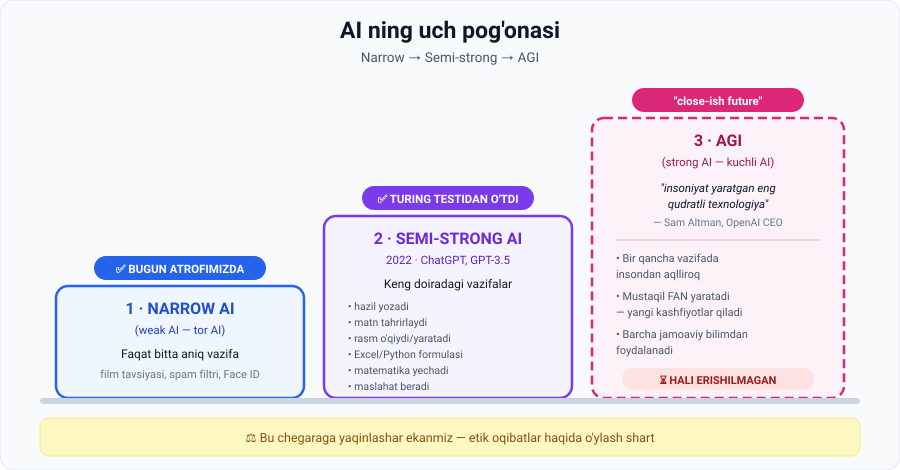

# 6-dars. Weak (Narrow) AI va Strong AI (AGI)

## 🎬 Boshlashdan oldin

Telefoningizda bugun nechta AI ishlatdingiz?

```
🔓 Face ID ochdi              → AI
📱 Lenta sizga video tanladi   → AI
⌨️ Klaviatura so'zni taklif qildi → AI
🗺 Navigator yo'l tanladi      → AI
📷 Kamera yuzni fokusladi      → AI
```

**Beshtasi. Nonushtadan oldin.**

> Lekin ularning hech biri **bir-birining ishini qila olmaydi**. Face ID yo'l ko'rsata olmaydi. Navigator yuzingizni tanimaydi.
>
> **Nima uchun? Shu dars aynan shu haqda.**

---

## 1. Uch pog'ona



---

## 2. Narrow AI (Weak AI) — tor AI

Oldingi darsdagi misol — ko'rish tarixi asosida film tavsiya qiluvchi ML algoritmi.

Biz uni **sun'iy intellekt** shakli deb ta'rifladik. Lekin kelishishimiz mumkin: bu — **cheklangan intellekt**.

> ### **Mashina faqat o'zi mo'ljallangan aniq bir vazifani bajara oladi.**
>
> Bu turdagi AI — **narrow AI** deb ataladi.

### Xususiyatlari

- ✅ Allaqachon **kundalik hayotimizga integratsiyalashgan**
- ✅ **Biznes uchun qimmatli** ekanligini isbotlagan

### Misollar

| Mahsulot | Bitta vazifa |
|---|---|
| Netflix / TikTok tavsiyasi | Keyingi kontentni tanlash |
| Spam filtri | Xatni spam/spam emas deb ajratish |
| Face ID | Bitta yuzni tanish |
| Shazam | Qo'shiqni aniqlash |
| Navigator | Eng qisqa yo'lni topish |

> ⚠️ **"Weak" so'ziga aldanmang.** Narrow AI **kuchsiz emas** — u ko'pincha o'z vazifasida **insondan ancha ustun**. Shaxmatda Deep Blue chempionni yengdi. "Weak" — bu **tor**, "kuchsiz" degani emas.

---

## 3. Semi-strong AI — yarim kuchli AI

### 2022-yil — burilish

> OpenAI **ChatGPT** va **GPT-3.5** modellarini chiqarganda, biz **semi-strong AI** yaratishga qaratilgan **birinchi muvaffaqiyatli urinishlardan birini** ko'rdik.

### Nima qila oladi?

> ChatGPT'ni sinab ko'rgan har bir kishi biladi — u **keng doiradagi vazifalarni** hal qila oladi.
>
> U hatto **insondan farq qilmaydigan** javoblar generatsiya qila oladi — bu aynan **Alan Turing** o'zining **imitation game**ida tasavvur qilgan narsa.

### 🏆 Katta xulosa

> ## **Biz AI Turing testidan muvaffaqiyatli o'ta oladigan nuqtaga yetdik.**

*(4-darsdagi Turing testini eslang — 1950-yildan 2022-yilgacha **72 yil** kerak bo'ldi.)*

### ChatGPT ning bugungi imkoniyatlari

| | |
|---|---|
| 😄 | Hazillar yozadi |
| ✍️ | Matnni tahrirlaydi (*proofread*) |
| 🧭 | Eng maqbul harakat yo'nalishini tavsiya qiladi |
| 🖼 | Rasmlarni **o'qiydi va yaratadi** |
| 📊 | **Excel va Python** formulalarini yaratadi |
| ➗ | Matematik masalalarni yechadi |

> ### → Hech bo'lmaganda buni **semi-strong AI** deb atash mumkin.

> 💡 **Nega "semi" (yarim)?** Chunki u ko'p narsani qila oladi, lekin:
> - Yangi **fan yarata olmaydi**
> - Mustaqil **maqsad qo'ymaydi**
> - Ba'zan ishonch bilan **noto'g'ri javob beradi** (gallyutsinatsiya)
>
> Ya'ni u **keng**, lekin hali **to'liq** emas.

---

## 4. AGI — Artificial General Intelligence (Strong AI)

> **OpenAI, Google va boshqa yetakchi AI tadqiqot institutlari hali AGI ga erishmagan.**

### Sam Altman ta'rifi

**Sam Altman** — OpenAI bosh direktori — AGI ni (**strong AI** deb ham ataladi) shunday ta'riflaydi:

> ## **"Insoniyat yaratgan eng qudratli texnologiya."**

### Xususiyatlari

| Xususiyat | Izoh |
|---|---|
| **Umumiy ustunlik** | AGI **bir qancha vazifalarda insonlardan umuman aqlliroq va qobiliyatliroq** bo'ladi |
| **Fan yaratish** | Ko'pchilik fikricha, AI ni AGI deb hisoblash uchun u **mustaqil ravishda fan yarata olishi** kerak |
| **Bilimni sintez qilish** | Ya'ni **jamoaviy mavjud bo'lgan barcha bilimdan** foydalanib **yangi kashfiyot va g'oyalar** yaratishi lozim |

### Qachon?

> **Sam Altman:** AGI **"oqilona, yaqinroq kelajakda"** (*reasonable, close-ish future*) yaratilishi mumkin.

Ma'ruza savol beradi: *"Strong AI ga qanchalik yaqinmiz?"* va javob beradi: **"Ehtimol, ancha yaqin."**

---

## 5. ⚖️ Etik ogohlantirish

Ma'ruza aynan shu jumla bilan tugaydi:

> ### Bu chegaraga yaqinlashar ekanmiz, biz **fikrlay oladigan, o'rgana oladigan va hatto bizdan yaxshiroq fan yarata oladigan** mashinalarni yaratishning **ulkan salohiyati va etik oqibatlari** haqida o'ylashimiz shart.

> 📌 Bu tasodifiy jumla emas. Kursda **AI Ethics** nomli butun modul bor (68–76-bo'limlar) — u aynan shu savollarga bag'ishlangan.

---

## 6. 📊 Uch pog'ona — solishtirma jadval

| Mezon | Narrow AI | Semi-strong AI | AGI (Strong AI) |
|---|---|---|---|
| **Vazifalar doirasi** | Bitta aniq vazifa | Keng doira | Deyarli cheksiz |
| **Holati** | ✅ Bugun mavjud | ✅ 2022-dan beri | ⏳ Hali yo'q |
| **Turing testi** | O'tmaydi | ✅ **O'tadi** | ✅ O'tadi |
| **Yangi fan yaratadimi** | ❌ | ❌ | ✅ Kerak |
| **Insondan ustunmi** | O'z vazifasida — ha | Ba'zi vazifalarda | **Ko'p vazifada** |
| **Misol** | Spam filtri, Face ID | ChatGPT, GPT-3.5 | — |

---

## 7. ⚡ Amaliy topshiriqlar

### 🟢 Oson — 5 daqiqa · **Qaysi pog'ona?**

| № | Tizim | Narrow / Semi-strong / AGI ? |
|---|---|---|
| 1 | Instagram lenta algoritmi | |
| 2 | ChatGPT | |
| 3 | Avtomobil raqamini o'qiydigan kamera | |
| 4 | Ovozli yordamchi (Siri, Alisa) | |
| 5 | Mustaqil ravishda dori kashf qiladigan tizim | |
| 6 | Shahmat dasturi | |

<details>
<summary>✅ Javoblar</summary>

1. **Narrow** — faqat kontent tanlaydi
2. **Semi-strong** — keng doiradagi vazifalar
3. **Narrow** — bitta vazifa
4. **Narrow** yoki chegaraviy — cheklangan buyruqlar to'plami *(zamonaviy LLM-asosli yordamchilar semi-strong'ga yaqinlashmoqda)*
5. **AGI belgisi** — mustaqil fan yaratish. Hozircha bunday tizim yo'q; mavjud vositalar odamga **yordam beradi**, mustaqil kashf qilmaydi
6. **Narrow** — insondan kuchli, lekin faqat shaxmatda

</details>

### 🟡 O'rta — 20 daqiqa · **ChatGPT chegarasini toping**

ChatGPT bilan **4 xil vazifa** sinab ko'ring va natijani baholang:

| Vazifa | Namuna so'rov | Baho (1–5) |
|---|---|---|
| Ijod | "Kuz haqida 4 qatorli she'r yoz" | |
| Tahlil | "Bu matnning asosiy fikri nima?" | |
| Kod | "Python'da 1 dan 100 gacha juft sonlarni chiqar" | |
| **Yangi bilim** | "Hech kim bilmaydigan yangi matematik teorema kashf et va isbotla" | |

**Xulosa savoli:** oxirgi vazifada nima bo'ldi? Bu **semi-strong** va **AGI** o'rtasidagi farqni ko'rsatadimi?

### 🔴 Qiyin — insho · **AGI: umid yoki xavf?**

Ma'ruza etik savol bilan tugaydi. O'z pozitsiyangizni shakllantiring.

```
1. AGI insoniyatga beradigan ENG KATTA 3 ta foyda:
   a) ______________________________
   b) ______________________________
   c) ______________________________

2. AGI bilan bog'liq ENG JIDDIY 3 ta xavf:
   a) ______________________________
   b) ______________________________
   c) ______________________________

3. Sizning pozitsiyangiz (5 jumla):
   _________________________________________
   _________________________________________
   _________________________________________
   _________________________________________
   _________________________________________

4. Bu pozitsiyangizni o'zgartirishi mumkin bo'lgan yagona dalil:
   _________________________________________
```

> 🎯 **4-savol eng muhimi.** Agar hech qanday dalil fikringizni o'zgartira olmasa — bu fikr emas, e'tiqod. Yaxshi muhandis bu ikkisini farqlaydi.

---

## 8. 🧠 O'zini tekshirish savollari

1. Narrow AI ning ta'rifi nima?
2. Nima uchun "weak AI" nomi chalg'ituvchi bo'lishi mumkin?
3. Qaysi yili va qaysi modellar semi-strong AI ning birinchi namunasi bo'ldi?
4. ChatGPT qanday vazifalarni bajara oladi? Kamida 5 tasini sanang.
5. Turing testi bilan bog'liq qanday tarixiy chegara bosib o'tildi?
6. Sam Altman AGI ni qanday ta'riflaydi?
7. Ko'pchilik fikricha, AI ni AGI deb hisoblash uchun u nima qila olishi kerak?
8. Ma'ruza qanday etik ogohlantirish bilan tugaydi?

<details>
<summary>✅ Javoblar</summary>

1. Mashina **faqat o'zi mo'ljallangan aniq bir vazifani** bajara oladi.
2. Chunki "weak" — **tor** degani, "kuchsiz" emas. Narrow AI o'z vazifasida ko'pincha insondan **ustun**.
3. **2022-yil**, **ChatGPT** va **GPT-3.5**.
4. Hazil yozish, matn tahrirlash, harakat yo'nalishini tavsiya qilish, rasm o'qish va yaratish, Excel/Python formulalari, matematik masalalar.
5. **AI Turing testidan muvaffaqiyatli o'ta oladigan nuqtaga yetildi** — Turing 1950-yilda tasavvur qilgan *imitation game*.
6. **"Insoniyat yaratgan eng qudratli texnologiya."**
7. **Mustaqil ravishda fan yarata olishi** — jamoaviy mavjud barcha bilimdan foydalanib yangi kashfiyot va g'oyalar yaratishi.
8. Fikrlay, o'rgana va bizdan yaxshiroq fan yarata oladigan mashinalarni yaratishning **ulkan salohiyati va etik oqibatlari** haqida o'ylash shartligi bilan.

</details>

---

## 📌 Xulosa

```
NARROW AI              SEMI-STRONG AI            AGI
bitta vazifa    →      keng doira        →       deyarli cheksiz
✅ bugun               ✅ 2022-dan               ⏳ hali yo'q
Face ID, spam          ChatGPT                   mustaqil fan yaratadi
```

> **Bitta jumlada:** biz mashinani **bitta ishda** ustun qilishni o'rgandik, so'ng **ko'p ishda yaxshi** qilishni — endi savol: uni **hamma ishda insondan ustun** qilish kerakmi va bunga tayyormizmi?

---

## 🔖 Atamalar

| Atama | Inglizcha | Izoh |
|---|---|---|
| Tor AI | *narrow AI / weak AI* | Faqat bitta aniq vazifani bajaradi |
| Yarim kuchli AI | *semi-strong AI* | Keng doiradagi vazifalar (ChatGPT) |
| Kuchli AI | *strong AI / AGI* | Ko'p vazifada insondan ustun, mustaqil fan yaratadi |
| AGI | *Artificial General Intelligence* | Umumiy sun'iy intellekt |
| Imitatsiya o'yini | *imitation game* | Turing testining asl nomi |
| Etik oqibatlar | *ethical implications* | Texnologiyaning axloqiy natijalari |

---

⬅️ [Oldingi: AI, DS, ML va DL farqi](05-Demystifying-AI-DS-ML-DL.md) · 🏠 [Modul boshiga](README.md)

➡️ **Keyingi qadam:** **Quiz 1** (`7.1 Quiz 1.html`), so'ngra **[02-modul: Ma'lumot — AI ning asosiy ingredienti](../02-Data-is-essential-for-building-AI/README.md)**
