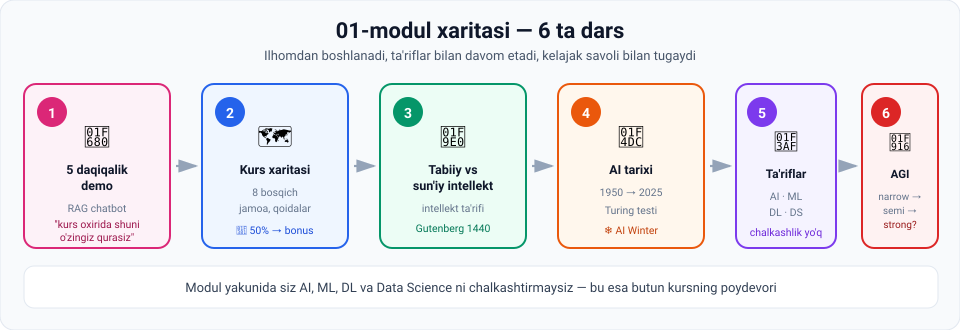

# 01-Modul · Intro to AI — Getting Started

## 🚀 Bir jumlada

> **Bu modul sizga AI ni o'rgatmaydi — u sizga AI nima ekanini tushuntiradi.**
>
> Farq katta: birinchisi yillar oladi, ikkinchisi bir soat. Lekin ikkinchisisiz birinchisi boshlanmaydi.

---

## 🗺 Modul xaritasi



---

## 📚 Darslar

| № | Dars | Vaqt | Asosiy g'oya |
|---|---|---|---|
| 1 | [5 daqiqada AI vositasini yaratish — demo](01-Building-an-AI-tool-in-5-minutes.md) | ~18 daq | RAG chatbot: `Load → Split → Embed → Store → Retrieve → Prompt → LLM → Parse` |
| 2 | [Kurs nimalarni qamrab oladi](02-What-does-the-course-cover.md) | ~8 daq | 8 bosqichli yo'l xaritasi · **ma'ruzalarni tashlab ketmang** |
| 3 | [Tabiiy va sun'iy intellekt](03-Natural-vs-Artificial-Intelligence.md) | ~10 daq | Intellekt = **egallash + qo'llash** · kuchli ≠ aqlli |
| 4 | [AI ning qisqacha tarixi](04-Brief-history-of-AI.md) ⭐ | ~18 daq | 1950 → 2025 · Turing testi · ❄️ AI Winter · Transformers |
| 5 | [AI, DS, ML va DL farqi](05-Demystifying-AI-DS-ML-DL.md) ⭐ | ~12 daq | **AI ⊃ ML ⊃ DL**, Data Science esa kesishadi |
| 6 | [Weak vs Strong AI (AGI)](06-Weak-vs-Strong-AI.md) | ~12 daq | Narrow → Semi-strong → AGI |

⭐ = eng ko'p imtihon savoli chiqadigan darslar

---

## 🎯 Modul yakunida siz bilasiz

- [ ] Intellekt ta'rifini aytasiz va uni istalgan qurilmaga qo'llay olasiz
- [ ] Nima uchun bosmaxona dastgohi **aqlli mashina emasligini** tushuntirasiz
- [ ] Turing testining **3 ta qadamini** aytasiz
- [ ] AI tarixidagi **8 ta asosiy sanani** joyiga qo'yasiz
- [ ] **AI Winter** nima va nega bo'lganini bilasiz
- [ ] AI portlashini keltirgan **ikkita ingredientni** nomlaysiz
- [ ] **AI / ML / DL / DS** ni chalkashtirmaysiz — bu modulning eng qimmatli natijasi
- [ ] **Narrow / Semi-strong / AGI** ni farqlaysiz
- [ ] RAG chatbotning **9 qadamini** umumiy tasavvur qilasiz
- [ ] `LangChain`, `embedding`, `retriever`, `chain`, `temperature` atamalari sizni qo'rqitmaydi

---

## 🖼 Modul grafikalari

Barchasi `assets/` papkasida, `.svg` formatda:

| Fayl | Nima ko'rsatadi |
|---|---|
| [`00-module-map.svg`](assets/00-module-map.svg) | Modulning 6 ta darsi |
| [`01-rag-chain.svg`](assets/01-rag-chain.svg) | RAG chatbotning to'liq quvuri — 9 qadam |
| [`01-streamlit-ui.svg`](assets/01-streamlit-ui.svg) | Tayyor chatbot interfeysi |
| [`02-course-roadmap.svg`](assets/02-course-roadmap.svg) | Butun bootcamp — 8 bosqich |
| [`03-machine-vs-intelligence.svg`](assets/03-machine-vs-intelligence.svg) | Gutenberg dastgohi ⟷ aqlli mashina |
| [`04-ai-timeline.svg`](assets/04-ai-timeline.svg) | 1950 → 2025 vaqt lentasi |
| [`04-turing-test.svg`](assets/04-turing-test.svg) | Imitation game sxemasi |
| [`05-ai-ml-dl-ds.svg`](assets/05-ai-ml-dl-ds.svg) | AI ⊃ ML ⊃ DL + Data Science kesishmasi |
| [`06-narrow-to-agi.svg`](assets/06-narrow-to-agi.svg) | Uch pog'ona: narrow → semi-strong → AGI |

---

## ⚡ Amaliy topshiriqlar xaritasi

Har bir darsda 🟢 oson / 🟡 o'rta / 🔴 qiyin darajali topshiriqlar bor.

| Dars | 🟢 Oson | 🟡 O'rta | 🔴 Qiyin |
|---|---|---|---|
| 1 | Terminologiya kartochkalari | ChatGPT vs ma'ruza farqi | O'z botingizni rejalashtiring |
| 2 | O'quv rejangizni tuzing | "Nega" ni yozing | Portfolio rejasi |
| 3 | Aqllimi yoki yo'q? (8 qurilma) | O'z o'rganish tarixingiz | Kalkulyator bahsi |
| 4 | Vaqt lentasini tartiblang | Turing testini o'zingiz o'tkazing | AI Winter takrorlanadimi? |
| 5 | Qaysi qutiga tushadi? | Ish e'lonlarini tahlil qiling | "AI-powered" — haqiqatmi? |
| 6 | Qaysi pog'ona? | ChatGPT chegarasini toping | AGI: umid yoki xavf? |

> 💡 **Eng qimmatli topshiriq:** 1-darsdagi **terminologiya kartochkalari**. Uni hozir to'ldiring, saqlab qo'ying va kurs oxirida qayta to'ldiring. Bu — o'z o'sishingizni ko'rishning eng aniq usuli.

---

## 🔗 Modullar orasidagi bog'liqlik

```
01-modul  ─  AI NIMA?  ← siz shu yerdasiz
    ↓          tarix, ta'riflar, AGI
    ↓
02-modul  ─  MA'LUMOT
    ↓          AI ning yoqilg'isi
    ↓
03-modul  ─  Key AI techniques
    ↓          yoqilg'i qanday yoqiladi
    ↓
Python moduli  ─  endi buni kodda qilamiz
```

> **Nega tarix birinchi?** Chunki 4-darsdagi "ikkita ingredient" (ma'lumot + quvvat) g'oyasi butun 02-modulni tushuntiradi. Va 5-darsdagi ta'riflar butun kurs davomida ishlatiladi.

---

## 📖 Umumiy atamalar lug'ati

| Atama | Inglizcha | Izoh |
|---|---|---|
| Sun'iy intellekt | *AI* | Mashinani aqlli qilish sohasi |
| Tabiiy intellekt | *natural intelligence* | Insonning tug'ma o'rganish qobiliyati |
| Egallash / Qo'llash | *acquire / apply* | Intellekt ta'rifining ikki sharti |
| Qat'iy parametrlar | *fixed parameters* | O'zgarmas qoidalar — o'rganish yo'q |
| Turing testi | *Turing test* | Mashina intellektini baholash mezoni |
| Imitatsiya o'yini | *imitation game* | Turing testining asl nomi |
| AI Winter | *AI winter* | 1960–70: moliyalashtirish pasaygan davr |
| Machine learning | *ML* | Ma'lumotdan bashorat qilishni o'rganish |
| Deep learning | *DL* | Ko'p qatlamli neyron tarmoqlar |
| Data science | *DS* | Ma'lumotdan biznes qiymat olish |
| Murakkab bog'liqlik | *intricate dependency* | Korrelyatsiyadan chuqurroq aloqa |
| Statistik xulosa | *statistical inference* | Namunadan umumiy xulosa |
| Narrow / Weak AI | *narrow AI* | Bitta aniq vazifa |
| Semi-strong AI | *semi-strong AI* | Keng doira (ChatGPT) |
| AGI / Strong AI | *AGI* | Ko'p vazifada insondan ustun |
| Transformer | *Transformer* | 2017-yilgi arxitektura; NLP inqilobi |
| Self-attention | *self-attention* | Transformer'ning asosiy mexanizmi |
| LLM | *Large Language Model* | Katta til modeli |
| GPT | *Generative Pre-trained Transformer* | OpenAI ning LLM seriyasi |
| Gallyutsinatsiya | *hallucination* | LLM ning ishonch bilan noto'g'ri javobi |
| Multimodal | *multimodal* | Matn, rasm, ovoz bilan birga ishlash |
| LangChain | *LangChain* | AI komponentlarini bog'lovchi kutubxona |
| Streamlit | *Streamlit* | Tez veb-interfeys yaratuvchi kutubxona |
| Token | *token* | Model matnni bo'lish birligi |
| Chunking | *chunking* | Hujjatni bo'laklarga ajratish |
| Embedding | *embedding* | Matnning vektor ko'rinishi |
| Vektor bazasi | *vector database* | Chroma, Pinecone |
| Retriever | *retriever* | Eng mos hujjatni topuvchi |
| Prompt template | *prompt template* | Qayta ishlatiladigan prompt |
| Chain | *chain* | Komponentlarni ketma-ket bog'lash |
| Temperature | *temperature* | `0` → deterministik javoblar |
| Streaming | *streaming* | Javobni bo'lak-bo'lak uzatish |
| RAG | *Retrieval Augmented Generation* | Tashqi hujjatdan kontekst olib javob berish |

---

## ✅ Yakuniy test — o'zingizni sinang

Har bir darsdagi **"O'zini tekshirish savollari"** ni javobsiz o'qib chiqing (jami **41 ta savol**).

Agar **35 tasidan ko'prog'iga** javob bera olsangiz — **Quiz 1** ga tayyorsiz.

Qiynalgan savol bo'lsa → o'sha darsga qayting.

---

## ➡️ Keyingi qadam

1. **Quiz 1** ni yeching (`7.1 Quiz 1.html`)
2. **[02-modul: Ma'lumot — AI ning asosiy ingredienti](../02-Data-is-essential-for-building-AI/README.md)** ga o'ting

