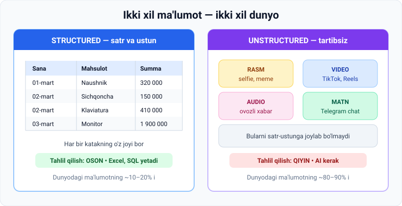
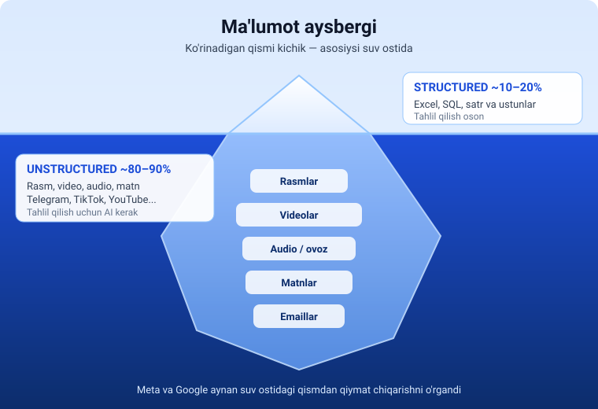

# 1-dars. Strukturalangan va strukturalanmagan ma'lumot

## 🎬 Boshlashdan oldin: bir daqiqalik o'ylash

Telefoningizni qo'lingizga oling va o'ylab ko'ring:

> **Bugun siz qancha ma'lumot yaratdingiz?**

Ehtimol: 3 ta selfie, 12 ta Telegram xabari, 40 daqiqa TikTok ko'rish tarixi, 1 ta ovozli xabar, qadam sanagich yozuvlari, GPS marshruti...

**Endi savol:** shu ma'lumotlarning qanchasini Excel jadvaliga joylay olasiz?

Qadamlar soni — ha. Selfie — yo'q. **Ana shu farq bugungi darsning butun mavzusi.**

---

## Kirish

Kursning ushbu qismida **ma'lumot (data)** muhokama qilinadi — bu **AI modelini yaratish uchun zarur bo'lgan asosiy ingredient**.

> 🍲 **Analogiya:** AI model — bu taom. Algoritm — retsept. **Ma'lumot esa — mahsulotlar.** Retsept qanchalik zo'r bo'lmasin, buzilgan mahsulotdan mazali taom chiqmaydi.

Ma'lumotning **ikkita asosiy turi** mavjud:

- **Structured data** — strukturalangan
- **Unstructured data** — strukturalanmagan



---

## 1. Structured data (strukturalangan ma'lumot)

Nomidan ko'rinib turibdiki, bu ma'lumot **satrlar va ustunlarga (rows and columns)** tartiblangan.

**Ma'ruzadagi misol:** shu oydagi savdo tranzaksiyalari sonini ko'rmoqchi bo'lsam, satr va ustunlardan iborat **Excel jadvali** yarataman va ma'lumotni unga joylashtiraman → bu **strukturalangan ma'lumot**.

### Asosiy belgisi

> Har bir qiymatning **oldindan belgilangan o'z joyi (predefined field)** bor. Siz `Summa` ustunida son, `Sana` ustunida sana bo'lishini **kafolatlangan holda bilasiz**.

### Yana qayerda uchraydi?

| Joy | Misol |
|---|---|
| 🏦 **Bank** | Karta tranzaksiyalari: sana, summa, do'kon nomi |
| 🎓 **Universitet** | Talabalar reytingi: ism, guruh, fan, ball |
| 📱 **Fitness ilova** | Kunlik qadamlar: sana, qadam soni, kaloriya |
| 🛒 **Onlayn do'kon** | Buyurtmalar: ID, mahsulot, narx, status |
| 🎮 **O'yin** | Leaderboard: o'yinchi, ball, o'rin |

**Texnologiyalari:** Excel, Google Sheets, SQL (PostgreSQL, MySQL), CSV fayllar.

---

## 2. Unstructured data (strukturalanmagan ma'lumot)

Bunga quyidagilar kiradi:

| Turi | Kundalik misol |
|---|---|
| 📝 **Matn fayllar** | Telegram yozishmalari, insholar, yangiliklar |
| 🖼 **Rasmlar** | Instagram postlari, memlar, skrinshotlar |
| 🎥 **Videolar** | TikTok, YouTube Shorts, Reels |
| 🎙 **Audio fayllar** | Ovozli xabarlar, podkastlar, qo'shiqlar |

**Xususiyati:** aniq belgilangan strukturaga ega emas va **satr-ustun ko'rinishida tartiblab bo'lmaydi**.

> 🤔 **O'zingizni sinang:** "Bu selfiening 3-ustuni nima?" — degan savol **ma'nosiz**. Aynan shuning uchun u strukturalanmagan.

---

## 3. 🔑 Eng muhim raqam

> # 80–90%
> **Dunyodagi barcha ma'lumotning shuncha qismi — strukturalanmagan.**

Ya'ni ma'lumotlarning aksariyati oddiy **satr-ustun oldindan belgilangan maydon strukturasiga** ega emas.



> 🧊 **Aysberg analogiyasi:** suv ustidagi kichik oq uchi — Excel jadvallari. Suv ostidagi ulkan massa — rasmlar, videolar, ovozlar, yozishmalar. **Titanik aynan suv ostidagi qismga urilgan edi.**

---

## 4. Qiymat qarashining o'zgarishi

| Davr | Qarash | Sabab |
|---|---|---|
| **Ilgari** | **Strukturalangan** ma'lumot qimmatliroq | Uni **tahlil qilish osonroq** edi — SQL so'rovi yozasiz, tayyor |
| **Bugun** | **Strukturalanmagan** ham juda qimmatli | AI yutuqlari uni **qimmatli insight'larga aylantirish** yo'lini topdi |

Bu sohada **Meta** va **Google** kabi kompaniyalar yetakchilik qilmoqda.

### 💡 Nega bu yoshlar uchun muhim?

Chunki **eng qimmat AI mahsulotlar aynan strukturalanmagan ma'lumot ustida qurilgan**:

| Mahsulot | Qanday unstructured ma'lumot? |
|---|---|
| **ChatGPT** | Internetdagi milliardlab **matn** sahifalari |
| **TikTok tavsiya lentasi** | Sizning **video** ko'rish xatti-harakatingiz |
| **Shazam** | **Audio** izlar |
| **Google Photos qidiruvi** | Sizning **rasmlaringiz** ("plyaj" deb qidirsangiz topadi) |
| **Telefon Face ID** | Yuzingizning **rasm** ma'lumoti |
| **YouTube avtomatik subtitr** | **Audio → matn** |

---

## 5. Biznes uchun imkoniyatlar

Strukturalanmagan ma'lumotni tahlil qilish biznes uchun **ulkan imkoniyatlar** ochmoqda:

- Kompaniyalarda **milliardlab fotosuratlar**, video yozuvlar, matnli xabarlar va elektron pochta xatlari bor.
- **Birinchi marta** ular bu ma'lumotdan **misli ko'rilmagan (unprecedented) insight'lar** olish uchun foydalana oladilar.

### Amaliy misol — bitta do'kon, ikki xil savol

```
❓ STRUCTURED savol:
   "Shu oyda nechta naushnik sotdik?"
   → SQL so'rov → 5 soniyada javob (bu 20 yildan beri mumkin edi)

❓ UNSTRUCTURED savol:
   "Mijozlar sharhlarida eng ko'p nimadan shikoyat qilishadi?"
   "Do'kondagi kameralarda odamlar qaysi javonda ko'proq to'xtaydi?"
   → Bularga javob berish uchun AI kerak (bu faqat yaqinda mumkin bo'ldi)
```

---

## 6. ⚡ Amaliy topshiriq

### 🟢 Oson daraja — 5 daqiqa

Quyidagilarni **S** (structured) yoki **U** (unstructured) deb belgilang:

| № | Ma'lumot | S / U ? |
|---|---|---|
| 1 | Sinfdagi baholar jurnali | |
| 2 | Ustozning ovozli tushuntirishi | |
| 3 | Bank kartangizdagi tranzaksiyalar ro'yxati | |
| 4 | Do'stingiz yuborgan mem | |
| 5 | Ob-havo stansiyasining harorat yozuvlari | |
| 6 | YouTube video ostidagi izohlar | |
| 7 | Telefondagi kontaktlar ro'yxati | |
| 8 | Sevimli qo'shig'ingiz `.mp3` fayli | |

<details>
<summary>✅ Javoblarni ko'rish</summary>

1. **S** — ism, fan, ball ustunlari bor
2. **U** — audio
3. **S** — sana, summa, do'kon ustunlari
4. **U** — rasm
5. **S** — vaqt va harorat ustunlari
6. **U** — erkin matn
7. **S** — ism, telefon raqami ustunlari
8. **U** — audio

</details>

### 🟡 O'rta daraja — 15 daqiqa

Telefoningizni oching va **fayl menejeri**ga kiring. Sanang:

1. Nechta **rasm** bor? _____
2. Nechta **video** bor? _____
3. Nechta **audio** bor? _____
4. Nechta **jadval / hujjat** (`.xlsx`, `.csv`) bor? _____

**Foizni hisoblang:** `(1+2+3) / jami × 100 = ___%`

> Aksariyat odamlarda bu raqam **95% dan yuqori** chiqadi — ya'ni siz shaxsan darsdagi 80–90% statistikasini tasdiqlaysiz.

### 🔴 Qiyin daraja — mini-loyiha

Bitta g'oya o'ylab toping: **strukturalanmagan ma'lumotdan foyda chiqaradigan ilova**.

Shablon:
```
Kimlar uchun:  ____________________
Qanday unstructured ma'lumot:  ____________________
AI nima qiladi:  ____________________
Natijada foydalanuvchi nima yutadi:  ____________________
```

*Namuna: Talabalar uchun · ma'ruzalarning audio yozuvi · AI uni matnga aylantirib, qisqacha konspekt tuzadi · talaba 2 soatlik ma'ruzani 5 daqiqada takrorlaydi.*

---

## 7. 🧠 O'zini tekshirish savollari

1. Strukturalangan ma'lumotning ta'rifi nima? Bitta jumlada ayting.
2. Nima uchun rasmni satr-ustunga joylab bo'lmaydi?
3. Dunyodagi ma'lumotning necha foizi strukturalanmagan?
4. Ilgari nima uchun strukturalangan ma'lumot qimmatliroq hisoblangan?
5. Bugun vaziyat nega o'zgardi? Qaysi kompaniyalar bu sohada yetakchi?

<details>
<summary>✅ Javoblar</summary>

1. Satrlar va ustunlarga tartiblangan, har bir qiymatning oldindan belgilangan maydoni bor ma'lumot.
2. Chunki rasmning "ustuni" yoki "maydoni" degan tabiiy tushunchasi yo'q — u piksellar to'plami, uni oldindan belgilangan sxemaga joylab bo'lmaydi.
3. **80–90%**.
4. Chunki uni **tahlil qilish osonroq** edi.
5. AI **strukturalanmagan ma'lumotni qimmatli insight'ga aylantirish** yo'lini topdi. Yetakchilar: **Meta** va **Google**.

</details>

---

## 8. Keyingi savol

> AI olimlari bunchalik katta hajmdagi strukturalanmagan ma'lumotni **qanday qilib tushunarli holga keltirishdi?**

Rasm ham, video ham, ovoz ham — kompyuter uchun oxir-oqibat **bitta narsaga** aylanadi. Nimaga?

➡️ Javob keyingi darsda: **[02 — Ma'lumotni qanday to'playmiz](02-How-we-collect-data.md)**

---

## 📌 Xulosa jadvali

| Xususiyat | Structured | Unstructured |
|---|---|---|
| **Tuzilishi** | Satr va ustunlar | Aniq struktura yo'q |
| **Misollar** | Excel, SQL, CSV | Matn, rasm, video, audio |
| **Dunyodagi ulushi** | ~10–20% | **~80–90%** |
| **Tahlil qilish** | Oson (SQL yetadi) | Murakkab (**AI kerak**) |
| **Ilgarigi qiymati** | Yuqori | Past |
| **Bugungi qiymati** | Yuqori | **Juda yuqori** |
| **Kim yetakchi** | Klassik BI vositalari | **Meta, Google** |

---

## 🔖 Atamalar

| Atama | Inglizcha | Izoh |
|---|---|---|
| Strukturalangan ma'lumot | *structured data* | Satr-ustunga tartiblangan |
| Strukturalanmagan ma'lumot | *unstructured data* | Belgilangan strukturasiz |
| Oldindan belgilangan maydon | *predefined field* | Ustunning qat'iy ma'nosi |
| Insight | *insight* | Ma'lumotdan chiqarilgan qimmatli xulosa |

---

⬅️ [Modul boshiga](README.md) · ➡️ [Keyingi dars: Ma'lumotni qanday to'playmiz](02-How-we-collect-data.md)
