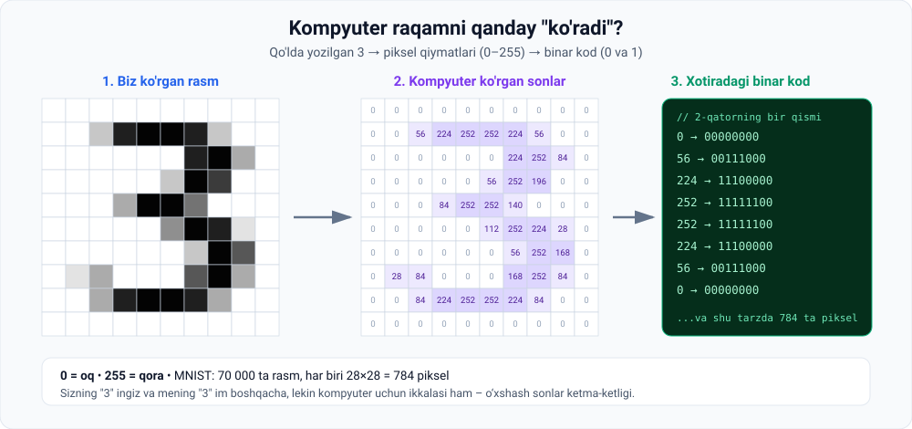
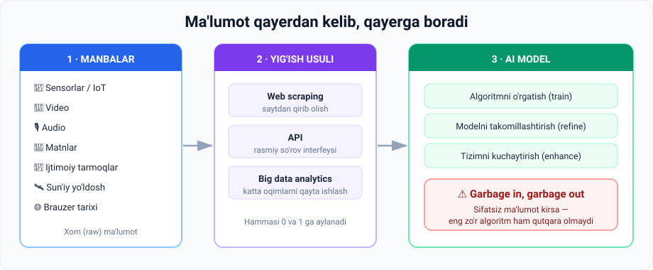

# 2-dars. Ma'lumotni qanday to'playmiz

## 🎬 Boshlashdan oldin: g'alati savol

Qog'ozga **3** raqamini yozing. Endi yoningizdagi odamdan ham shuni yozishni so'rang.

Ikkalasi **bir xilmi?** Albatta yo'q — birining dumaloq, birining o'tkir.

> **Shunda ham ikkalangiz ham "bu uchlik" deb aytasiz.**
>
> Qanday qilib? Miyangiz **turlicha ko'rinishlardan bir xil ma'no** chiqara oldi. Aynan shu narsani mashinaga o'rgatish — machine learning ning eng birinchi mashqi.

---

## 1. MNIST — machine learning ning "Hello World" i

**MNIST database** — machine learning ni o'rganmoqchi bo'lgan talabalar uchun **"hello world"** misoli.

> 💡 Dasturlashda birinchi dastur "Hello World" bo'lgani kabi, machine learning da birinchi loyiha — **MNIST**. Dunyodagi deyarli har bir AI mutaxassis undan boshlagan.

**Dataset tarkibi:**

| Parametr | Qiymat |
|---|---|
| Tasvirlar soni | **70 000** |
| Har birining o'lchami | **28 × 28 piksel** |
| Rangi | **Grayscale** (kul rang) |
| Mazmuni | Qo'lda yozilgan `0`–`9` raqamlari |
| Bitta rasmdagi piksellar | 28 × 28 = **784** |

> ℹ️ *Transkriptda "70,028 by 28 pixel" deb eshitiladi — bu aslida "70 000 ta 28×28 pikselli tasvir" degani.*

### Mashqning maqsadi

Machine learning algoritmini shunday o'rgatish kerakki, u tasvirdagi **raqamni tanib olsin** — garchi ular **hech qachon bir xil bo'lmasa ham**, chunki har kimning **qo'l yozuvi har xil**.

> Siz **3** raqamini yozasiz, men **3** raqamini yozaman — natijalar **o'xshash, lekin biroz farqli** bo'ladi.

**Asosiy savol:** kompyuter **3, 6 yoki 9** tasvirlarini qanday farqlaydi?

---

## 2. Javob: hammasi 0 va 1 ga bo'linadi

Javob **kompyuter fanlari va elektrotexnika asoslariga** borib taqaladi:

> ### 🔑 **Barcha ma'lumotni nol va birlarga ajratish mumkin.**



### 2.1. Piksel qiymatlari

Bu tasvirlardagi **har bir piksel** `0` dan `255` gacha qiymatga ega bo'lib, uning **kul rang tusini** tavsiflaydi:

```
  0  ██  →  oq       (white)
 64  ██  →  och kul rang
128  ██  →  o'rta kul rang
192  ██  →  to'q kul rang
255  ██  →  qora      (black)
```

> ❓ **Nega aynan 255?** Chunki `0`–`255` = **256 ta qiymat** = **2⁸** = aynan **1 bayt** (8 bit). Kompyuter uchun eng qulay o'lcham.

### 2.2. Binar shakl

Kompyuterlarda **barcha axborot**, shu jumladan bu piksel qiymatlari ham, **nol va birlar kombinatsiyasi** yordamida **binar (ikkilik) shaklda** saqlanadi.

```
   0   →  00000000
  56   →  00111000
 224   →  11100000
 252   →  11111100
 255   →  11111111
```

MNIST yoki istalgan raqamli tasvirdagi piksel qiymatlari **binar formatga** aylantiriladi — shunda kompyuter ularni **saqlay va qayta ishlay** oladi.

### 2.3. Natija

Biz **3 raqamining turli xil rasmlarini** ko'ramiz, lekin kompyuter uchun ular — **o'xshash raqamli ketma-ketliklarga ega rasmlar**.

MNIST masalasini machine learning bilan yechish uchun kompyuter shu **raqamli ketma-ketliklarni aniqlash va farqlashga** o'rgatiladi → natijada u **0 dan 9 gacha** raqamlarni taniy oladi.

---

## 3. 💻 Amaliyot: buni o'z ko'zingiz bilan ko'ring

> Bu kodni hozir tushunmasangiz ham zarari yo'q — **Python moduli**da hammasi tushuntiriladi. Hozir maqsad — **rasm haqiqatan sonlar ekanini o'z ko'zingiz bilan ko'rish**.

### Variant A — hech narsa o'rnatmasdan (tavsiya etiladi)

Faqat **toza Python** kerak. Faylni `piksel.py` deb saqlang va ishga tushiring.

```python
# 10x10 grayscale "rasm": qo'lda yozilgan 3 raqami
rasm = [
    [  0,   0,   0,   0,   0,   0,   0,   0,   0, 0],
    [  0,   0,  56, 224, 252, 252, 224,  56,   0, 0],
    [  0,   0,   0,   0,   0,   0, 224, 252,  84, 0],
    [  0,   0,   0,   0,   0,  56, 252, 196,   0, 0],
    [  0,   0,   0,  84, 252, 252, 140,   0,   0, 0],
    [  0,   0,   0,   0,   0, 112, 252, 224,  28, 0],
    [  0,   0,   0,   0,   0,   0,  56, 252, 168, 0],
    [  0,  28,  84,   0,   0,   0, 168, 252,  84, 0],
    [  0,   0,  84, 224, 252, 252, 224,  84,   0, 0],
    [  0,   0,   0,   0,   0,   0,   0,   0,   0, 0],
]

print("--- 1. ODAM KO'RGAN SHAKL ---")
for qator in rasm:
    print("".join("##" if p > 150 else (".." if p > 40 else "  ") for p in qator))

print("\n--- 2. KOMPYUTER KO'RGAN SONLAR ---")
for qator in rasm:
    print(" ".join(f"{p:3d}" for p in qator))

print("\n--- 3. XOTIRADAGI BINAR KOD (2-qator) ---")
for p in rasm[1]:
    print(f"{p:3d}  ->  {p:08b}")

jami = sum(len(q) for q in rasm)
oq = sum(1 for q in rasm for p in q if p == 0)
print(f"\nJami piksel: {jami} | Oq (0): {oq} | Bo'yalgan: {jami-oq}")
```

### Haqiqiy natija

```
--- 1. ODAM KO'RGAN SHAKL ---

    ..########..
            ####..
          ..####
      ..####..
          ..####
            ..####
    ..      ####..
    ..########..


--- 2. KOMPYUTER KO'RGAN SONLAR ---
  0   0   0   0   0   0   0   0   0   0
  0   0  56 224 252 252 224  56   0   0
  0   0   0   0   0   0 224 252  84   0
  0   0   0   0   0  56 252 196   0   0
  0   0   0  84 252 252 140   0   0   0
  0   0   0   0   0 112 252 224  28   0
  0   0   0   0   0   0  56 252 168   0
  0  28  84   0   0   0 168 252  84   0
  0   0  84 224 252 252 224  84   0   0
  0   0   0   0   0   0   0   0   0   0

--- 3. XOTIRADAGI BINAR KOD (2-qator) ---
  0  ->  00000000
  0  ->  00000000
 56  ->  00111000
224  ->  11100000
252  ->  11111100
252  ->  11111100
224  ->  11100000
 56  ->  00111000
  0  ->  00000000
  0  ->  00000000

Jami piksel: 100 | Oq (0): 66 | Bo'yalgan: 34
```

> 🤯 **Mana shu — butun AI ning poydevori.** Rasm — bu shunchaki sonlar jadvali. Sonlar bilan esa matematika ishlay oladi.
>
> **Diqqat qiling:** 1-blokdagi shakl va 2-blokdagi sonlar — **bir xil narsa**. Faqat biri odam ko'zi uchun, ikkinchisi kompyuter uchun.

### Variant B — haqiqiy dataset bilan

Agar kutubxona o'rnatishga tayyor bo'lsangiz:

```bash
pip install scikit-learn
```

```python
from sklearn.datasets import load_digits

digits = load_digits()          # 8x8 piksel, qiymatlar 0-16
rasm  = digits.images[3].astype(int)
belgi = digits.target[3]

print("Bu raqam:", belgi)
print("Rasm o'lchami:", rasm.shape)

for qator in rasm:
    print("".join("##" if p > 8 else (".." if p > 3 else "  ") for p in qator))
```

Bu 1797 ta **haqiqiy** qo'lyozma raqamni yuklaydi — `[3]` o'rniga istalgan indeksni qo'yib ko'ring.

---

## 4. Nima uchun bu misol fundamental?

> U **atrofimizdagi dunyodan olingan turli xil axborotni kompyuter o'qiy oladigan ma'lumotga** qanday aylantirishimizni ko'rsatadi.

### Boshqa ma'lumot turlari uchun ham xuddi shunday

| Ma'lumot turi | Kompyuter uchun tasviri | Hisob-kitob |
|---|---|---|
| 🖼 **Rasm** | Yuzlab/minglab piksel → har biri son → binar | 1 ta Full HD rasm ≈ **2 mln piksel** |
| 🎥 **Video** | **Minglab rasm**, har biri yuzlab/minglab pikseldan iborat | 1 daqiqa 30fps video ≈ **1800 ta rasm** |
| 🎙 **Tovush** | Nol va birlar ketma-ketligi | 1 soniya CD sifat ≈ **44 100 ta o'lchov** |
| 📝 **Yozma nutq** | Nol va birlar ketma-ketligi | 1 ta harf ≈ 1–4 bayt |

> 📺 **Shuning uchun ham** 10 daqiqalik 4K video gigabaytlab joy egallaydi — u ichida millionlab sonlarni saqlaydi.

Aynan shu tarzda kompyuterlar **o'rganish uchun zarur strukturani** oladi. Ular bu axborotdan:

1. **Naqshlarni (patterns) topish**
2. **O'xshashliklarni o'rganish**
3. Pirovardida **turli vazifalarni bajarishni o'rganish**

uchun foydalanadilar.

---

## 5. Inson miyasi bilan taqqoslash

Biz inson miyasining naqadar ajoyib ekanini har doim ham qadrlamaymiz:

- Biz atrofimizdagi dunyoni **ko'ramiz** va **bir vaqtning o'zida juda ko'p axborot** to'playmiz.
- Ongimiz **son-sanoqsiz tafsilotlarni** qayta ishlaydi — **ongsiz ravishda** sezgilarimiz orqali ko'rgan, eshitgan va ta'mini bilgan narsalarimizni o'zlashtiradi.
- Bu **murakkab tizim** bizga dunyoni tushunish va unga javob berish, atrofimizdagi hamma narsa bilan **mazmunli muloqot qilish** imkonini beradi.

> 🧠 **Taqqoslash uchun:** ko'chada ketayotganda miyangiz bir vaqtning o'zida yuzlarni tanib, mashinalar tezligini baholab, oyoq ostiga qarab, telefondagi musiqani eshitib turadi — **hech qanday "yuklash" indikatorisiz**. AI hali bunga yetgani yo'q.

**AI tadqiqotchilari mashinalarga ham shunday qobiliyatlarni berishga intiladilar.**

---

## 6. Ma'lumot qayerdan va qanday to'planadi



### 6.1. Manbalar (sources)

| Manba | Kundalik misol |
|---|---|
| 📡 **Sensorlar** | Telefondagi akselerometr, avtomobil kamerasi |
| 🎥 **Video** | YouTube, kuzatuv kameralari |
| 🎙 **Audio** | Ovozli xabarlar, call-markaz yozuvlari |
| 📝 **Matnlar** | Yangiliklar, kitoblar, forumlar |
| 📱 **Ijtimoiy tarmoqlar** | Postlar, izohlar, layklar |
| 🛰 **Sun'iy yo'ldosh tasvirlari** | Google Maps, ob-havo prognozi |
| 🌐 **Internetda kezish naqshlari** | Qaysi saytga kirdingiz, qancha turdingiz |

### 6.2. To'plash usullari (methods)

| Usul | Nima qiladi | Yoshlarga tushunarli misol |
|---|---|---|
| **Web scraping** | Sayt sahifasidan ma'lumotni avtomatik "qirib" olish | Robot barcha e'lonlar narxini yig'ib chiqadi |
| **API** | Xizmatning **rasmiy** so'rov interfeysi orqali olish | Ob-havo ilovasi meteo-xizmatdan haroratni so'raydi |
| **Big data analytics** | Ulkan oqimlarni qayta ishlash texnologiyalari | Millionlab tranzaksiyani real vaqtda tahlil qilish |

> ⚖️ **Muhim etik nuqta:** web scraping har doim ham ruxsat etilgan emas. Ko'p saytlarda `robots.txt` fayli va foydalanish shartlari bor. **Shaxsiy ma'lumotlarni ruxsatsiz yig'ish — qonun buzilishi.** Bu haqda kursning **AI Ethics** modulida batafsil gaplashiladi.

### 6.3. Bu nima uchun kerak?

Ma'lumot boyligi tadqiqotchilarga quyidagi imkonlarni beradi:

1. Algoritmlarni **o'rgatish** (train)
2. Machine learning modellarini **takomillashtirish** (refine)
3. AI tizimlarini dunyoni yaxshiroq tushunish va u bilan muloqot qilish uchun **kuchaytirish** (enhance)

---

## 7. 🔑 Oltin qoida

> # Garbage in, garbage out
> ### *Axlat kirsa — axlat chiqadi*

Data scientist lar buni, ayniqsa **AI modellarini qurishda**, tez-tez takrorlaydilar:

> **Yuqori sifatli ma'lumot kiritilishi — a'lo model natijasini kafolatlaydi.**

### Nima uchun bu shunchalik muhim?

```
❌  Yomon ma'lumot  +  Zo'r algoritm   =  Yomon model
✅  Zo'r ma'lumot   +  Oddiy algoritm  =  Yaxshi model
```

**Real hayotdagi misollar:**

- Agar modelni faqat **yorug'da olingan** it rasmlari bilan o'rgatsangiz — u **qorong'uda** itni tanimaydi.
- Agar modelni faqat **bir hududdagi** odamlar yuzi bilan o'rgatsangiz — u boshqalarni yomon taniydi. *(Bu real muammo — buni **algorithmic bias** deyishadi, AI Ethics modulida ko'riladi.)*
- Agar datasetda **noto'g'ri belgilangan** rasmlar bo'lsa — model shu xatoni **o'rganib oladi**.

---

## 8. ⚡ Amaliy topshiriqlar

### 🟢 Oson — 5 daqiqa

Quyidagilar kompyuterda **necha bayt** joy egallaydi (taxminan)?

| Obyekt | Hisoblang |
|---|---|
| 1 ta MNIST rasmi (28×28, har piksel 1 bayt) | ____ bayt |
| Butun MNIST dataseti (70 000 ta rasm) | ____ MB |

<details>
<summary>✅ Javob</summary>

- 28 × 28 = **784 bayt** ≈ 0,77 KB
- 784 × 70 000 = 54 880 000 bayt ≈ **52 MB**

Ya'ni butun "hello world" dataseti bitta qo'shiqdan ham kichik!

</details>

### 🟡 O'rta — 15 daqiqa

**Variant A** kodini ishga tushiring va:

1. `p > 150` shartidagi `150` sonini `60` va `240` ga o'zgartiring. Shakl qanday o'zgardi?
2. Nima uchun bu chegara (**threshold**) muhim ekanini bir jumlada yozing.
3. `rasm` ro'yxatidagi sonlarni o'zgartirib, **o'z raqamingizni** chizing — masalan `7` yoki `1`.
4. *(ixtiyoriy)* **Variant B** ni o'rnatib, `digits.images[3]` o'rniga `[0]`, `[10]`, `[42]` ni sinab ko'ring.

### 🔴 Qiyin — mini-tadqiqot

**"Garbage in, garbage out" ni isbotlang.**

Bir varaqqa 10 ta `3` raqamini yozing, lekin 3 tasini **atayin chala** yozing (yarmi o'chib ketgan). Endi do'stingizdan bu 10 tani ko'rib, qaysi biri `3` ekanini aytishni so'rang.

**Savol:** agar odam ham chala yozuvlarda adashsa — model qanday adashishi mumkin? Xulosangizni 3 jumlada yozing.

---

## 9. 🧠 O'zini tekshirish savollari

1. MNIST datasetida nechta rasm bor va har birining o'lchami qanday?
2. Piksel qiymati `0` nimani, `255` nimani bildiradi?
3. Nima uchun kompyuter uchun sizning "3" ingiz va mening "3" im o'xshash?
4. Videoni kompyuter qanday "ko'radi"?
5. Web scraping va API o'rtasidagi farq nima?
6. "Garbage in, garbage out" nimani anglatadi? O'z misolingizni keltiring.

<details>
<summary>✅ Javoblar</summary>

1. **70 000** ta rasm, har biri **28×28 piksel** grayscale.
2. `0` = **oq**, `255` = **qora**.
3. Chunki ikkalasi ham **o'xshash raqamli ketma-ketliklarga** aylanadi — model aynan shu ketma-ketliklarni farqlashga o'rgatiladi.
4. Video — bu **minglab rasm**, har biri yuzlab/minglab pikseldan iborat, har bir piksel esa binar shakldagi son.
5. **Web scraping** — sayt sahifasidan ma'lumotni o'zi qirib oladi (ruxsat masalasi bor). **API** — xizmatning o'zi taqdim etgan **rasmiy** so'rov interfeysi.
6. Sifatsiz kiruvchi ma'lumot → sifatsiz model natijasi. Eng zo'r algoritm ham buzuq ma'lumotni tuzata olmaydi.

</details>

---

## 📌 Xulosa

```
Dunyodagi har qanday axborot
        ↓
   sonlar ketma-ketligi  (rasm uchun: 0–255)
        ↓
   binar kod  (0 va 1)
        ↓
   kompyuter saqlaydi va qayta ishlaydi
        ↓
   model naqshlarni topadi va o'rganadi
```

**Va bularning barchasi ustida bitta shart turadi:** ⚠️ *Garbage in, garbage out.*

---

## 🔖 Atamalar

| Atama | Inglizcha | Izoh |
|---|---|---|
| MNIST | *MNIST* | 70 000 ta 28×28 qo'lyozma raqam dataseti |
| Piksel | *pixel* | Rasmning eng kichik nuqtasi, `0`–`255` qiymat |
| Grayscale | *grayscale* | Kul rang shkalasi (rangsiz) |
| Binar shakl | *binary form* | 0 va 1 lar ketma-ketligi |
| Naqsh | *pattern* | Ma'lumotdagi takrorlanuvchi qonuniyat |
| Web scraping | *web scraping* | Saytdan ma'lumot yig'ish usuli |
| API | *API* | Dasturiy so'rov interfeysi |
| Bias | *bias* | Modelning bir tomonlama xatosi |

---

⬅️ [Oldingi: Strukturalangan va strukturalanmagan](01-Structured-vs-unstructured-data.md) · ➡️ [Keyingi: Belgilangan va belgilanmagan ma'lumot](03-Labelled-and-unlabelled-data.md)
