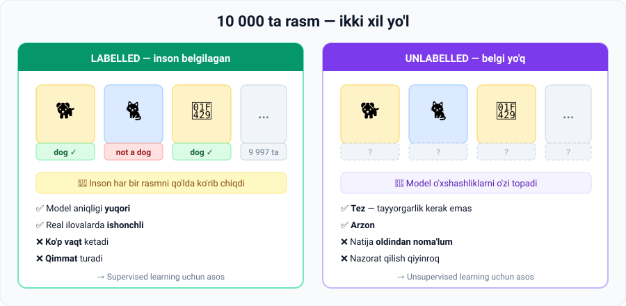
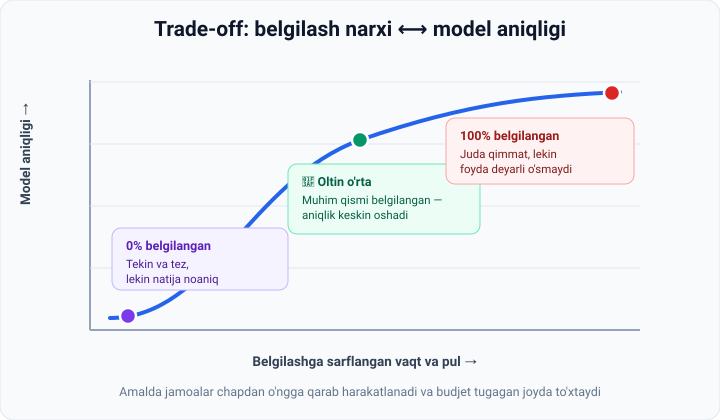

# 3-dars. Belgilangan (labelled) va belgilanmagan (unlabelled) ma'lumot

## 🎬 Boshlashdan oldin: siz allaqachon buni qilgansiz

Instagram'da rasmga **teg** qo'yganmisiz? YouTube'da videoga **👍 / 👎** bosganmisiz? Spam xatni **"Spam"** deb belgilaganmisiz?

> **Tabriklaymiz — siz ma'lumotni belgilagansiz (labelling).**
>
> Va o'sha kompaniyalar aynan shu belgilaringiz asosida o'z AI modellarini o'rgatishgan. Sizning bitta 👎 tugmangiz — kimningdir modelining bitta o'quv namunasi.

---

## Kirish

AI modellashtirish uchun ma'lumotni **to'plash va tayyorlashning ikkita asosiy usuli** mavjud:

1. **Labelled data** — belgilangan ma'lumot
2. **Unlabelled data** — belgilanmagan ma'lumot



---

## 1. Labelled data (belgilangan ma'lumot)

### 1.1. Misol — itlar dataseti

Tasavvur qiling, sizda **10 000 ta fotosuratdan** iborat dataset bor — unda turli hayvonlar, jumladan **itlar** tasvirlangan.

**Modellashtirish boshlanishidan oldin** kimdir **har bir fotosuratni sinchkovlik bilan ko'rib chiqadi** va ularni quyidagicha tasniflaydi:

```
"dog"  (it)   yoki   "not a dog"  (it emas)
```

> Bu jarayon **labelled (belgilangan) datasetni** yaratadi.

Bu tushuncha **faqat rasmlar uchun emas** — **matn, audio, video** va boshqa ma'lumot turlari bilan ishlashda ham qo'llaniladi.

> ⏱ **Hisoblab ko'ring:** 1 ta rasmni ko'rib, tugma bosishga **3 soniya** ketsa, 10 000 ta rasm = **8 soatdan ko'proq uzluksiz ish**. Bir kishining butun ish kuni. Va bu — atigi 10 000 ta.
>
> ChatGPT o'rgatilgan dataset esa **milliardlab** elementdan iborat. Endi tushunarli bo'ldimi, nega bu shunchalik qimmat?

### 1.2. Misol — YouTube izohlari

Endi **YouTube izohlari** to'plamini tasavvur qiling. Izohlarni quyidagicha tasniflashimiz mumkin:

| Belgi | Misol izoh |
|---|---|
| 😊 **positive** | "Zo'r dars bo'ldi, rahmat!" |
| 😐 **neutral** | "3-daqiqada nima dedingiz?" |
| 😠 **negative** | "Hech narsa tushunmadim, vaqt behuda ketdi" |

**Maqsad:** platformadagi yangi izohlarni toifalarga ajratadigan va **zararlilarini belgilab qo'yadigan (flag)** modelni o'rgatish.

⚠️ **Muammo:** qo'lda belgilash (manual labeling) **shubhasiz ko'p vaqt talab qiladi va qimmatga tushadi**.

> 🌍 **Real fakt:** ChatGPT kabi modellar uchun zararli kontentni belgilash bo'yicha maxsus **ishchi jamoalar** mavjud — bu alohida global industriya. Ba'zi tadqiqotchilar bu ishning **psixologik og'irligi** haqida ham yozadilar.

---

## 2. Nega bunchalik mashaqqatga arziydi?

**Afzalligi:**

> Natijada biz AI modelini **yuqori sifatli ma'lumot** bilan o'rgata olamiz — bu esa uning **aniqligini (accuracy) sezilarli darajada oshiradi**.

**Odatda belgilangan ma'lumotda o'rgatilgan modellar:**

- ✅ **ishonchliroq** (more reliable)
- ✅ **real dunyo ilovalarida yaxshi ishlaydi**

### ⚖️ Aniq trade-off (kelishuv)

```
Belgilashga sarflangan vaqt va resurslar   ⟷   Model unumdorligi
```



> 📈 **Grafikni o'qish:** boshida har bir belgilangan namuna aniqlikni **keskin** oshiradi. Lekin ma'lum nuqtadan keyin egri chiziq **yassilashadi** — 100 000-rasmni belgilash 100-rasmni belgilashchalik foyda bermaydi. Buni **diminishing returns** (kamayib boruvchi foyda) deyishadi.
>
> Shuning uchun real jamoalar **"oltin o'rta"** ni topishga harakat qiladi.

---

## 3. Unlabelled data (belgilanmagan ma'lumot)

**Ikkinchi variant** — belgilanmagan ma'lumot bilan ishlash.

Bugungi machine learning yutuqlari bizga **strukturalanmagan ma'lumot** bilan ishlash imkonini beradi:

- rasmlar (images)
- video
- matn (text)
- **belgilanmagan audio**

### Bu amalda nimani anglatadi?

10 000 ta fotosuratdan iborat datasetni **har bir rasmni ko'rib chiqmasdan turib** modelga beramiz.

> Bu holatda biz **AI modelining o'zi mustaqil o'rganishiga** qo'yib beramiz.

### Model belgi bo'lmasa nima qiladi?

U **o'xshashliklarni** topadi va rasmlarni guruhlarga ajratadi:

```
Guruh 1: 🐕 🐩 🦮   ← "bular bir-biriga o'xshaydi"
Guruh 2: 🐈 🐈‍⬛      ← "bular ham o'zaro o'xshash, lekin 1-guruhdan farqli"
Guruh 3: 🐦 🦜      ← "bu uchinchi xil"
```

⚠️ **Muhim nuans:** model **"bu it"** deb ayta olmaydi — chunki unga hech kim "it" so'zini o'rgatmagan. U faqat **"bular bir xil turdagi narsalar"** deya oladi. Nom qo'yish — baribir odamning ishi.

*O'rganish jarayoni kursning keyingi qismlarida batafsil tushuntiriladi.*

---

## 4. 💻 Amaliyot: farqni kod orqali his qiling

Hech narsa o'rnatmasdan ishlaydi.

```python
# ---- LABELLED DATASET ----
# Har bir element (matn, belgi) juftligi
labelled = [
    ("Zo'r dars bo'ldi, rahmat!",            "positive"),
    ("Hech narsa tushunmadim",               "negative"),
    ("3-daqiqada nima dedingiz?",            "neutral"),
    ("Juda foydali, davom eting",            "positive"),
    ("Ovoz sifati juda yomon",               "negative"),
    ("Yomon emas, aksincha juda yaxshi!",    "positive"),   # ⚠️ tuzoq
]

# ---- UNLABELLED DATASET ----
# Faqat matn, belgi yo'q
unlabelled = [matn for matn, _ in labelled]

print("=== LABELLED ===")
for matn, belgi in labelled:
    print(f"  [{belgi:>8}]  {matn}")

print("\n=== UNLABELLED ===")
for matn in unlabelled:
    print(f"  [       ?]  {matn}")

# Labelled bilan nima qila olamiz — sanash, statistika, o'rgatish
from collections import Counter
statistika = Counter(belgi for _, belgi in labelled)
print("\nLabelled dataset statistikasi:", dict(statistika))

# Unlabelled bilan buni qila olmaymiz — belgi yo'q!
print("Unlabelled dataset statistikasi: ??? (belgilar mavjud emas)")

# ---- ODDIY QOIDAGA ASOSLANGAN 'MODEL' ----
salbiy_sozlar = ["yomon", "tushunmadim", "behuda", "zerikarli"]

def bashorat(matn):
    return "negative" if any(s in matn.lower() for s in salbiy_sozlar) else "boshqa"

print("\n=== MODELNI LABELLED DATA BILAN TEKSHIRISH ===")
togri = 0
for matn, haqiqiy in labelled:
    natija = bashorat(matn)
    ok = (natija == "negative") == (haqiqiy == "negative")
    togri += ok
    print(f"  {'✓' if ok else '✗'}  bashorat={natija:<8} haqiqiy={haqiqiy:<8} | {matn}")

print(f"\nAniqlik: {togri}/{len(labelled)} = {togri/len(labelled)*100:.0f}%")
```

### Natija

```
Aniqlik: 5/6 = 83%
```

Bitta izohda model **xato qildi**:

```
✗  bashorat=negative  haqiqiy=positive  | Yomon emas, aksincha juda yaxshi!
```

> 🎯 **Mana shu — butun darsning eng muhim daqiqasi.**
>
> Model `"yomon"` so'zini ko'rdi va darrov `negative` dedi. Lekin jumla aslida **maqtov**. Odam buni bir qarashda tushunadi, oddiy qoida esa — yo'q.
>
> Aynan shuning uchun **haqiqiy AI modellari qoidalar bilan emas, minglab belgilangan misollar bilan o'rgatiladi** — kontekstni faqat shunday o'rganish mumkin.

### 🔑 Kodning asosiy saboqi

Oxirgi blokka yana bir bor diqqat qiling:

> **Modelning aniqligini o'lchash uchun bizga "to'g'ri javob" kerak.**
> To'g'ri javob esa faqat **labelled** datasetda bor.
>
> Ya'ni: **belgilangan ma'lumotsiz siz modelingiz yaxshimi yoki yomonmi — bilib ham bo'lmaydi.**
>
> Agar biz `unlabelled` ro'yxat bilan ishlaganimizda, model o'sha xatoni qilardi — **lekin biz buni hech qachon sezmasdik.**

---

## 5. Hozircha nimani bilish kerak

> ✅ **Labelled va unlabelled datasetlar o'rtasidagi farqni ajrata olish.**

---

## 6. ⚡ Amaliy topshiriqlar

### 🟢 Oson — 5 daqiqa

Har bir vazifa uchun **qaysi turdagi ma'lumot** kerakligini ayting:

| № | Vazifa | Labelled / Unlabelled ? |
|---|---|---|
| 1 | Emaildagi spamni aniqlash | |
| 2 | 1 mln mijozni o'xshash guruhlarga ajratish | |
| 3 | Rentgen suratida kasallikni aniqlash | |
| 4 | Yangiliklar oqimida takrorlanuvchi mavzularni topish | |
| 5 | Talaba imtihondan o'tadimi yoki yo'qmi — bashorat qilish | |

<details>
<summary>✅ Javoblar</summary>

1. **Labelled** — "spam"/"spam emas" belgilari kerak
2. **Unlabelled** — model o'zi guruhlarni topadi (clustering)
3. **Labelled** — shifokor "kasal"/"sog'lom" deb belgilashi shart
4. **Unlabelled** — mavzular oldindan noma'lum
5. **Labelled** — o'tgan yillardagi "o'tdi"/"o'tmadi" natijalari kerak

</details>

### 🟡 O'rta — 20 daqiqa · **Siz ham labeller bo'ling**

1. YouTube'dan istalgan videoni oching.
2. **20 ta izohni** ko'chirib oling.
3. Har birini `positive` / `neutral` / `negative` deb belgilang.
4. **Vaqtni o'lchang** — necha daqiqa ketdi?
5. **Hisoblang:** shu tezlikda **10 000 ta** izohni belgilashga necha soat ketardi?

**Muhokama savoli:** 3–4 ta izohda ikkilanib qoldingizmi? Bu **labelling ning eng katta muammosi** — turli odamlar bir xil narsani turlicha belgilaydi. Buni **inter-annotator disagreement** deyishadi.

### 🔴 Qiyin — mini-loyiha

Yuqoridagi Python kodini oling va uni kengaytiring:

1. `labelled` ro'yxatiga **o'zingiz to'plagan 20 ta izohni** qo'shing.
2. `salbiy_sozlar` ro'yxatini kengaytiring va aniqlikni oshiring.
3. Aniqlikni **80% dan yuqori** qilishga harakat qiling.
4. Yozing: qaysi izohlarda model xato qildi va **nima uchun**?

> 💡 Bu — haqiqiy machine learning ishining kichraytirilgan nusxasi. Faqat real modelda qoidalarni siz emas, **model o'zi ma'lumotdan topadi**.

---

## 7. 🧠 O'zini tekshirish savollari

1. Labelled dataset qanday yaratiladi?
2. YouTube izohlari misolida qanday 3 ta belgi ishlatildi?
3. Belgilangan ma'lumotning asosiy afzalligi nima?
4. Trade-off nimadan iborat? Bir jumlada ayting.
5. Unlabelled ma'lumot bilan ishlaganda model nima qiladi?
6. Nima uchun modelning aniqligini o'lchash uchun labelled data kerak?

<details>
<summary>✅ Javoblar</summary>

1. Kimdir **har bir elementni qo'lda ko'rib chiqib**, unga toifa (belgi) beradi.
2. **positive**, **negative**, **neutral**.
3. Model **yuqori sifatli ma'lumot** bilan o'rgatiladi → **aniqligi sezilarli oshadi**, real ilovalarda **ishonchli** ishlaydi.
4. **Belgilashga sarflangan vaqt va resurslar** ⟷ **model unumdorligi**.
5. Model **mustaqil o'rganadi** — ma'lumotdagi o'xshashliklarni topib, guruhlarga ajratadi (lekin guruhga nom qo'ya olmaydi).
6. Chunki "to'g'ri javob" bilan solishtirmasdan turib, bashorat to'g'rimi yoki yo'qmi — aniqlab bo'lmaydi.

</details>

---

## 📌 Solishtirma jadval

| Mezon | Labelled data | Unlabelled data |
|---|---|---|
| **Tayyorlash** | Har bir element **qo'lda** tasniflanadi | Tasniflanmaydi |
| **Vaqt va narx** | ❌ **Ko'p vaqt, qimmat** | ✅ Tez, arzon |
| **Model aniqligi** | ✅ **Yuqori** | ⚠️ Modelning o'zi o'rganishiga bog'liq |
| **Ishonchlilik** | ✅ **Real ilovalarda yaxshi ishlaydi** | ⚠️ O'zgaruvchan |
| **Aniqlikni o'lchash** | ✅ Mumkin | ❌ Qiyin |
| **Misol** | 10 000 rasm → "dog" / "not a dog" | 10 000 rasm → belgi yo'q |
| **Boshqa misol** | Izohlar → positive / negative / neutral | Izohlar → model o'zi guruhlaydi |
| **Bog'liq yondashuv** | *Supervised learning* | *Unsupervised learning* |

---

## 🔖 Atamalar

| Atama | Inglizcha | Izoh |
|---|---|---|
| Belgilangan ma'lumot | *labelled data* | Har bir elementga toifa berilgan |
| Belgilanmagan ma'lumot | *unlabelled data* | Toifa berilmagan |
| Belgilash | *labelling / annotation* | Toifa qo'yish jarayoni |
| Aniqlik | *accuracy* | Modelning to'g'ri bashoratlari ulushi |
| Trade-off | *trade-off* | Ikki foyda o'rtasidagi majburiy kelishuv |
| Bayroqcha qo'yish | *flag* | Shubhali kontentni belgilab qo'yish |
| Kamayib boruvchi foyda | *diminishing returns* | Har bir qo'shimcha harakatdan foyda kamayishi |

---

⬅️ [Oldingi: Ma'lumotni qanday to'playmiz](02-How-we-collect-data.md) · ➡️ [Keyingi: Metadata](04-Metadata-Data-that-describes-data.md)
