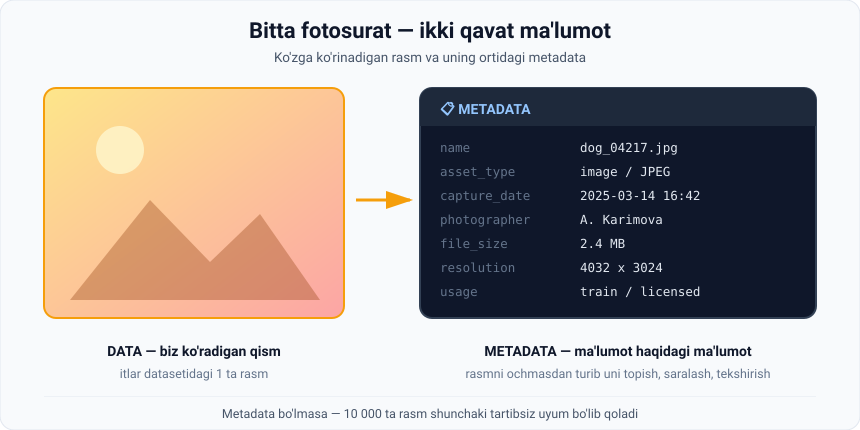
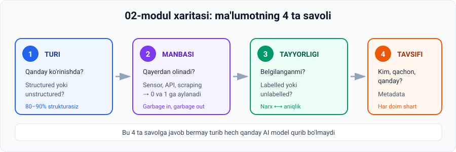

# 4-dars. Metadata — ma'lumotni tavsiflovchi ma'lumot

## 🎬 Boshlashdan oldin: telefoningizdagi maxfiy ma'lumot

Galereyangizni oching, istalgan rasmni tanlang va **"Ma'lumot" / "Details" / "ⓘ"** tugmasini bosing.

Ko'rasizmi?

```
📅 14-mart 2025, 16:42
📷 iPhone 14 Pro · f/1.8 · ISO 64
📐 4032 × 3024 · 2.4 MB
📍 41.3111° N, 69.2797° E     ← ⚠️ bu sizning joylashuvingiz!
```

> **Siz bu ma'lumotni yozmadingiz. Telefon uni o'zi qo'shdi.**
>
> Va agar shu rasmni internetga tashlasangiz — bu ma'lumot ham u bilan birga ketishi mumkin. **Bugungi dars aynan shu haqda.**

---

## 1. AI nima uchun aynan so'nggi yillarda rivojlandi?

**Asosiy sabab — hayotimizning jadal raqamlashuvi (rapid digitalization).**

Quyidagilarning o'sishi **ma'lumot generatsiyasining eksponensial ortishiga** olib keldi:

| Manba | Kundalik ta'siri |
|---|---|
| 🛒 **Onlayn do'konlar** | Har bir bosish, qidiruv, savat yozib olinadi |
| 📱 **Mobil telefonlar** | Cho'ntagingizdagi 24/7 ma'lumot generatori |
| 📷 **Kameralar** | Kuniga milliardlab rasm |
| 💬 **Ijtimoiy tarmoqlar** | Postlar, izohlar, layklar, ko'rishlar |
| 📡 **Sensorlar** | Qadam, yurak urishi, harorat, tezlik |
| 🌐 **IoT qurilmalari** | Aqlli soat, aqlli chiroq, aqlli mashina |

> 📊 **Miqyosni his qiling:** insoniyat tarixidagi ma'lumotning katta qismi **so'nggi bir necha yilda** yaratilgan. Har daqiqada YouTube'ga yuzlab soatlik video yuklanadi.

---

## 2. Ma'lumot faqat ko'paymadi — sifati ham oshdi

> Bugun bizda **nafaqat ko'proq ma'lumot**, balki **sezilarli darajada yuqori sifatli ma'lumot** ham bor.

**Ma'ruzadagi yaqqol misol:**

```
Bir necha yil oldingi eski telefoningizda olingan fotosurat
                        VS
Bugungi smartfoningizda olingan fotosurat
```

Farq keskin. Aynan shu **yuqori sifatli ma'lumot to'lqini** AI rivojiga **kuchli turtki** berdi.

### 💡 Nega sifat AI uchun shunchalik muhim?

Eslang, 2-darsda ko'rgan edik: rasm — bu **sonlar jadvali**.

```
Eski telefon:     640 × 480   =   307 200 piksel  →  kam ma'lumot
Bugungi telefon: 4032 × 3024  = 12 192 768 piksel  →  40 barobar ko'p
```

> Model qanchalik ko'p va aniq son ko'rsa, **naqshlarni** shunchalik yaxshi topadi. Xira rasmda it va mushukni ajratish — hatto odam uchun ham qiyin.

---

## 3. Muammo

> Odamlar **doimiy o'sib borayotgan raqamli ma'lumot okeanini** qanday tanib oladi va uni qanday anglaydi?

Chunki bu ma'lumotning katta qismi:

- **strukturalanmagan** (unstructured) — *1-darsni eslang: 80–90%*
- **belgilash uchun juda ham hajmli** (too voluminous to label) — *3-darsni eslang: 10 000 rasm = 8 soat ish*

> 🗄 **Tasavvur qiling:** sizga 10 000 ta rasm solingan papka berildi. Nomlari: `IMG_0001.jpg`, `IMG_0002.jpg`... Vazifa: **"2024-yil yozida olingan rasmlarni toping."**
>
> Har bir rasmni ochib ko'rasizmi? **Yo'q.** Sizga boshqa narsa kerak.

---

## 4. Yechim: Metadata

> ## **Metadata — bu boshqa ma'lumotni tavsiflovchi ma'lumot.**
> *(Metadata is data that describes other data.)*

**Har bir dataset uni o'z ichiga olishi kerak.**



### Metadata nimalarni jamlaydi?

Metadata quyidagi kabi **asosiy tafsilotlarni** umumlashtiradi:

| Maydon | Inglizcha | Izoh |
|---|---|---|
| **Aktiv turi** | *asset type* | Rasm, video, matn, audio... |
| **Muallif** | *author* | Kim yaratgan |
| **Yaratilgan sana** | *creation date* | Qachon |
| **Foydalanish** | *usage* | Qayerda ishlatilishi mumkin, litsenziya |
| **Fayl hajmi** | *file size* | Necha MB |
| **...va boshqalar** | | Format, o'lcham, versiya |

---

## 5. Amaliy misol — itlar dataseti

Oldingi darsdagi **dogs dataset** misolida **har bir fotosurat** o'z metadatasiga ega:

```
name           :  dog_04217.jpg
asset_type     :  image / JPEG
capture_date   :  2025-03-14  16:42
photographer   :  A. Karimova
file_size      :  2.4 MB
resolution     :  4032 x 3024
usage          :  train / licensed
```

### Bu nimani beradi?

Endi yuqoridagi "10 000 ta rasm" muammosi **bir qatorda** yechiladi:

```python
yozgi_rasmlar = [r for r in dataset if "2024-06" <= r["capture_date"][:7] <= "2024-08"]
```

**Rasmlarni ochish shart emas.** Metadata yetadi.

---

## 6. 💻 Amaliyot: metadata bilan ishlash

Hech narsa o'rnatmasdan ishlaydi.

```python
# 5 ta rasmning metadatasi (haqiqiy rasm fayllari kerak emas)
dataset = [
    {"name": "dog_0001.jpg", "date": "2024-07-12", "size_mb": 2.4,
     "res": (4032, 3024), "author": "A. Karimova", "label": "dog"},
    {"name": "dog_0002.jpg", "date": "2023-11-03", "size_mb": 0.4,
     "res": (640, 480),   "author": "B. Toshev",   "label": "dog"},
    {"name": "cat_0003.jpg", "date": "2024-08-21", "size_mb": 3.1,
     "res": (4032, 3024), "author": "A. Karimova", "label": "not a dog"},
    {"name": "dog_0004.jpg", "date": "2024-06-30", "size_mb": 1.9,
     "res": (2048, 1536), "author": "D. Yusupov",  "label": "dog"},
    {"name": "cat_0005.jpg", "date": "2022-01-15", "size_mb": 0.2,
     "res": (320, 240),   "author": "B. Toshev",   "label": "not a dog"},
]

# 1) 2024-yil yozida olingan rasmlar — fayllarni ochmasdan!
yoz = [r for r in dataset if "2024-06" <= r["date"][:7] <= "2024-08"]
print("2024 yozidagi rasmlar:", [r["name"] for r in yoz])

# 2) Sifatsiz (past o'lchamli) rasmlarni saralab tashlash
CHEGARA = 1_000_000          # 1 megapiksel
sifatli = [r for r in dataset if r["res"][0] * r["res"][1] >= CHEGARA]
past    = [r for r in dataset if r["res"][0] * r["res"][1] <  CHEGARA]
print("Sifatli:", [r["name"] for r in sifatli])
print("Past sifat (tashlanadi):", [r["name"] for r in past])

# 3) Datasetning umumiy hisoboti
from collections import Counter
print("\n--- DATASET HISOBOTI ---")
print("Jami fayllar :", len(dataset))
print("Umumiy hajm  :", round(sum(r['size_mb'] for r in dataset), 1), "MB")
print("Belgilar     :", dict(Counter(r['label'] for r in dataset)))
print("Mualliflar   :", dict(Counter(r['author'] for r in dataset)))
print("Sana oralig'i:", min(r['date'] for r in dataset), "—",
                        max(r['date'] for r in dataset))

# 4) Muvozanat tekshiruvi — model uchun juda muhim
sanoq = Counter(r["label"] for r in dataset)
kam, kop = min(sanoq.values()), max(sanoq.values())
print("\nMuvozanat:", "OK" if kam / kop >= 0.5 else "⚠️ NOMUVOZANAT — model bir tomonga og'adi")
```

### Natija

```
2024 yozidagi rasmlar: ['dog_0001.jpg', 'cat_0003.jpg', 'dog_0004.jpg']
Sifatli: ['dog_0001.jpg', 'cat_0003.jpg', 'dog_0004.jpg']
Past sifat (tashlanadi): ['dog_0002.jpg', 'cat_0005.jpg']

--- DATASET HISOBOTI ---
Jami fayllar : 5
Umumiy hajm  : 8.0 MB
Belgilar     : {'dog': 3, 'not a dog': 2}
Mualliflar   : {'A. Karimova': 2, 'B. Toshev': 2, 'D. Yusupov': 1}
Sana oralig'i: 2022-01-15 — 2024-08-21

Muvozanat: OK
```

> 🔍 **Diqqat qiling:** biz **birorta ham rasmni ochmadik**. Butun tahlil faqat metadata ustida bajarildi — bu esa **minglab marta tezroq**.

---

## 7. 🔒 Metadata va shaxsiy xavfsizlik

Bu — ma'ruzada yo'q, lekin **har bir yosh bilishi kerak** bo'lgan mavzu.

### EXIF nima?

Telefon rasmga olganda unga avtomatik **EXIF metadata** yozadi:

| Maydon | Nima yozilishi mumkin |
|---|---|
| `DateTime` | Aniq sana va vaqt |
| `Make` / `Model` | Telefon markasi va modeli |
| `GPSLatitude` / `GPSLongitude` | **Aniq geografik koordinata** |
| `Software` | Qaysi ilovada tahrirlangan |

### ⚠️ Xavf

> Agar siz uydan turib olingan rasmni ochiq internetga tashlasangiz va EXIF o'chirilmagan bo'lsa — **uyingizning koordinatasi rasm bilan birga ketadi.**

**Nima qilish kerak:**

1. ✅ Telefon sozlamalarida **kamera uchun joylashuv (Location)** ni o'chiring — agar kerak bo'lmasa.
2. ✅ Rasmni yuklashdan oldin **metadata ni tozalang**:
   - Windows: fayl → o'ng tugma → *Properties* → *Details* → *Remove Properties and Personal Information*
3. ✅ Ko'p ijtimoiy tarmoqlar (Instagram, Telegram) EXIF ni **avtomatik o'chiradi** — lekin **hamma platforma emas**.

> 💬 **Muhokama uchun:** metadata — bir vaqtning o'zida **eng foydali** va **eng xavfli** narsa. U datasetni boshqarishga yordam beradi, lekin odam haqida u o'zi bilganidan ko'proq ma'lumot berib qo'yishi mumkin. Bu haqda kursning **AI Ethics** modulida batafsil gaplashiladi.

---

## 8. 🔑 Asosiy qoida

> Siz **strukturalangan yoki strukturalanmagan**, **belgilangan yoki belgilanmagan** ma'lumot bilan ishlaysizmi — farqi yo'q:
>
> ## **Metadata ni kiritish shart**
>
> — ayniqsa **katta datasetlar** va **murakkab tizimlar**da.

---

## 9. ⚡ Amaliy topshiriqlar

### 🟢 Oson — 5 daqiqa

Quyidagilardan qaysi biri **data**, qaysi biri **metadata**?

| № | Element | Data / Metadata ? |
|---|---|---|
| 1 | Rasmdagi itning o'zi | |
| 2 | Rasm hajmi: 2.4 MB | |
| 3 | Qo'shiqning ovozi | |
| 4 | Qo'shiq ijrochisi va albom nomi | |
| 5 | Videodagi tasvir | |
| 6 | Video davomiyligi: 10:24 | |
| 7 | Kitobning matni | |
| 8 | Kitob muallifi va nashr yili | |

<details>
<summary>✅ Javoblar</summary>

**Data:** 1, 3, 5, 7 · **Metadata:** 2, 4, 6, 8

**Qoida:** agar u **mazmunning o'zi** bo'lsa — data. Agar u **mazmun haqida** bo'lsa — metadata.

</details>

### 🟡 O'rta — 15 daqiqa · **O'z telefoningizni tekshiring**

1. Galereyadan **3 ta rasm** tanlang.
2. Har biri uchun quyidagi jadvalni to'ldiring:

| Rasm | Sana | Hajm | O'lcham | Qurilma | GPS bormi? |
|---|---|---|---|---|---|
| 1 | | | | | |
| 2 | | | | | |
| 3 | | | | | |

3. **Savol:** GPS bor rasmlar topildimi? Agar ha — bu rasmlarni kimdir ko'rsa, u sizning nimangizni bilib oladi?

### 🔴 Qiyin — mini-loyiha · **O'z datasetingizni tuzing**

1. Telefoningizdan **10 ta rasm** tanlang.
2. Ular uchun **metadata jadvalini** tuzing (Excel yoki Python ro'yxati):

```python
mening_dataset = [
    {"name": "...", "date": "...", "size_mb": ..., "res": (..., ...),
     "label": "..."},     # label: masalan "ovqat" / "manzara" / "odam"
]
```

3. Yuqoridagi **6-bo'limdagi kodni** o'z datasetingizga qo'llang.
4. Hisobot chiqaring: qaysi belgi ko'p? Dataset **muvozanatlimi**?

> 🎓 Bu — haqiqiy data scientist ish kunining birinchi soati. Har qanday loyiha aynan shu bilan boshlanadi.

---

## 10. 🧠 O'zini tekshirish savollari

1. AI ning so'nggi yillardagi rivojining asosiy sababi nima?
2. Metadata ning ta'rifini ayting.
3. Metadata qanday maydonlarni o'z ichiga oladi? Kamida 4 tasini sanang.
4. Nima uchun metadata katta datasetlarda shunchalik muhim?
5. Rasmni ochmasdan turib, u qachon olinganini qanday bilamiz?
6. EXIF metadata qanday xavf tug'dirishi mumkin?

<details>
<summary>✅ Javoblar</summary>

1. **Hayotimizning jadal raqamlashuvi** — onlayn do'konlar, telefonlar, kameralar, ijtimoiy tarmoqlar, sensorlar va IoT qurilmalarining o'sishi ma'lumot generatsiyasini eksponensial oshirdi.
2. **Boshqa ma'lumotni tavsiflovchi ma'lumot.**
3. Asset type, author, creation date, usage, file size (va format, o'lcham, versiya).
4. Chunki ma'lumot **strukturalanmagan** va **belgilash uchun juda hajmli** — metadata uni **ochmasdan turib** topish, saralash va boshqarish imkonini beradi.
5. Metadatadagi **capture date / creation date** maydonidan.
6. Unda **GPS koordinatalari**, qurilma modeli va aniq vaqt bo'lishi mumkin — rasm bilan birga tarqalsa, shaxsiy joylashuvni oshkor qiladi.

</details>

---

## 📌 Modul bo'yicha bog'lanish

Ushbu 4 ta dars bir butunlikni tashkil qiladi:



```
Ma'lumot turi        →  Structured / Unstructured        (1-dars)
Ma'lumot manbasi     →  0 va 1 lar, sensorlar, scraping  (2-dars)
Ma'lumot tayyorligi  →  Labelled / Unlabelled            (3-dars)
Ma'lumot tavsifi     →  Metadata                         (4-dars)
```

> **Bu 4 ta savolga javob bermay turib hech qanday AI model qurib bo'lmaydi.**

---

## 🔖 Atamalar

| Atama | Inglizcha | Izoh |
|---|---|---|
| Metadata | *metadata* | Ma'lumot haqidagi ma'lumot |
| Raqamlashuv | *digitalization* | Hayotning raqamli shaklga o'tishi |
| IoT | *Internet of Things* | Internetga ulangan qurilmalar |
| Aktiv turi | *asset type* | Fayl qanday turdagi kontent |
| EXIF | *EXIF* | Rasm fayliga kamera yozadigan metadata standarti |
| Muvozanat | *class balance* | Datasetdagi toifalar nisbati |
| Eksponensial o'sish | *exponential growth* | Tobora tezlashib boruvchi o'sish |

---

⬅️ [Oldingi: Belgilangan va belgilanmagan ma'lumot](03-Labelled-and-unlabelled-data.md) · 🏠 [Modul boshiga](README.md)

➡️ **Keyingi qadam:** **Quiz 2** (`5.2 Quiz 2.html`), so'ngra **03-modul: Key AI techniques**
