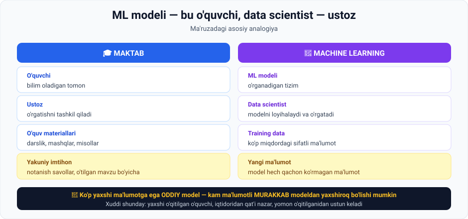
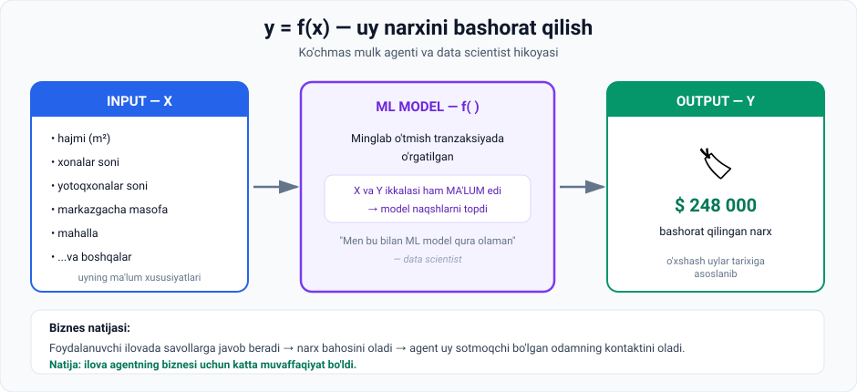

# 1-dars. Machine Learning

> **Modul:** 03. Intro to AI — Key AI techniques · **Manba:** `1. Machine learning.vtt`
> ⏱ **O'qish vaqti:** ~15 daqiqa · 🎯 **Daraja:** boshlang'ich · 💻 **Python amaliyoti bor**

---

## 🎬 Boshlashdan oldin

Bir savol: **siz velosiped haydashni qanday o'rgandingiz?**

Kimdir sizga fizika formulasini bermadi. Siz shunchaki **o'tirdingiz, yiqildingiz, yana o'tirdingiz** — va bir kuni ketdi.

> **Machine learning ham xuddi shunday ishlaydi.** Modelga qoida yozib berilmaydi — u **sinov va xato orqali** o'zi topadi.
>
> Bu darsda buni ikki xil yo'l bilan ko'ramiz: **analogiya** orqali va **haqiqiy biznes misoli** orqali.

---

## 📍 Bu dars qayerda turibdi

Hozirgacha o'rganganlarimiz:

```
01-modul  ✅  AI asoslari, tarixi, weak vs strong AI
02-modul  ✅  Ma'lumot — yuqori sifatli, mo'l-ko'l ma'lumot AI ning kalit ingredienti
03-modul  ⬅️  Machine learning — AI ning so'nggi muvaffaqiyatida hal qiluvchi kichik soha
```

---

## 1. ML ning asosiy g'oyasi

> **ML g'oyasi hayratlanarli, chunki u bitta narsaga borib taqaladi:**
> ### **sinov va xato (trial and error) jarayoni orqali o'rgana va yaxshilana oladigan tizim loyihalash.**

---

## 2. 🎓 O'quvchi va ustoz analogiyasi



Ma'ruza ML modelini qurishni **ustoz o'qitayotgan o'quvchiga** qiyoslaydi:

| Maktabda | Machine learning da |
|---|---|
| **O'quvchi** | **ML modeli** |
| **Ustoz** | **Data scientist** |

### Ustozning roli

> Ustozning vazifasi — o'quvchiga **masalalarni yechishni o'rganishga yordam berish**.
>
> Buni yaxshi bajarish uchun ustoz o'quvchiga **ko'p mos o'quv materiali** berishi kerak — machine learning dunyosida bu **ko'p miqdordagi yaxshi ma'lumot** degani.

### O'rganish jarayoni

| Bosqich | O'quvchi | ML algoritmi |
|---|---|---|
| 1 | Materiallarni **diqqat bilan o'rganadi va o'zlashtiradi** | Berilgan **training data**dagi **naqshlarni** tanishni o'rganadi |
| 2 | **Yakuniy imtihon**ga tayyorlanadi | Yangi masalani yechishga tayyorlanadi |
| 3 | Imtihonda **notanish savollar** bo'ladi (lekin o'tilgan mavzudan) | **Hech qachon ko'rmagan ma'lumot** bilan ishlaydi |

> 🎯 **Butun ML ning maqsadi shu jumlada:**
> **modelga u hech qachon ko'rmagan ma'lumot bilan aniq bir masalani yechishni o'rgatish.**

### 🔑 Uchta muhim xulosa

**1. Ma'lumot sifati > modelning murakkabligi**

> Yetarli tayyorgarliksiz o'quvchi, **tabiiy iqtidoridan qat'i nazar**, yaxshi o'qitilganidan yomonroq natija ko'rsatadi.
>
> **ML da ham xuddi shunday:** ko'p yaxshi ma'lumotga ega **oddiy model**, kam ma'lumotli **murakkab modeldan** yaxshiroq ishlashi mumkin.

> 💡 Bu — 02-moduldagi **"Garbage in, garbage out"** ning davomi. Endi tushunarli: ma'lumot shunchaki "kerak" emas — u **modelning o'zidan ham muhimroq**.

**2. Doimiy takomillashuv**

> Yangi o'qitish usullarini qo'llash va uslubni o'quvchiga moslashtirish natijani sezilarli yaxshilaydi.
>
> **ML da:** modellar **yangi ma'lumot turlari** va **yangilangan algoritmlar** bilan uchrashganda bashorat va tahlilni yaxshilaydi.

Bu **uzluksiz o'rganish va moslashuv** jarayoni turli qiyinchiliklarni uddalay oladigan va rivojlana oladigan **mustahkam (robust) AI tizimlarini** yaratish uchun hal qiluvchi ahamiyatga ega.

**3. Har bir modelning o'z sohasi bor**

> Ba'zi o'quvchilar turli sohalarda masala yechishda ustun bo'lgani kabi, **ayrim ML modellari aniq sohalar uchun ko'proq mos keladi**.
>
> **Data scientist buni tushunishi va berilgan vaziyatda mos ML modelini tanlay olishi kerak.**

---

## 3. 🏘 Amaliy misol: ko'chmas mulk ilovasi

Ma'ruza mavhum analogiyadan **real biznes hikoyasiga** o'tadi.

### Vazifa

**Ko'chmas mulk agenti** mobil ilova ishlab chiqmoqchi — u potensial mijozlarga **uyining taxminiy sotuv narxini** aytib beradi.

Foydalanuvchilar ilovadagi **maqsadli savollarga javob berib**, shu bahoni oladilar.

**Biznes maqsadi:** bu agentning biznesini sezilarli oshirishi mumkin, chunki u **mulkini sotmoqchi bo'lgan odamlarning kontakt ma'lumotlarini** to'plash imkonini beradi.

### Data scientist bilan suhbat

Agent data scientist bilan bog'landi va loyiha **amalga oshirilishi mumkinmi** deb so'radi.

> **Data scientist ning birinchi savoli:** *"O'tmish tranzaksiyalarning yetarlicha katta ro'yxati bormi?"*

Xayriyatki, agentning kompaniyasida **so'nggi bir necha yildagi minglab tranzaksiya** bazasi bor edi.

### Ma'lumot qanday ekan?

Data scientist ma'lumotning **yaxshi tashkil qilinganini** ko'rib mamnun bo'ldi:

| Maydon |
|---|
| Uy narxlari |
| Hajmi |
| Xonalar soni |
| Yotoqxonalar soni |
| Shahar markazidan masofa |
| Mahallalar |
| ...va boshqa qiziqarli jihatlar |

> **"Men bu bilan ML model qura olaman"** — dedi data scientist.

---

## 4. 📐 y = f(x) — model qanday tushuntirildi

Data scientist mijozga modelni shunday soddalashtirdi:

> *"Siz klassik funksiya yozuvi bilan tanishsiz — **y — bu x ning funksiyasi**, to'g'rimi?"*



### Mantiq

```
Training data:  minglab o'tmish tranzaksiya
                → X ham, Y ham MA'LUM
                        ↓
                algoritm naqshlarni topadi
                        ↓
Ishlatish:      mijoz uyining xususiyatlarini kiritadi  →  X
                        ↓
                model narxni bashorat qiladi            →  Y
```

### Ma'ruzadan aniq iqtibos

> Bizda **X va Y ikkalasi ham ma'lum** bo'lgan ko'plab o'tmish tranzaksiyalar bor.
>
> Biz ML algoritmini **tarixiy ma'lumot** bilan o'rgatishimiz kerak — u **naqshlarni kashf qilsin** va o'tmish tranzaksiyalar hamda uyning ma'lum xususiyatlariga asoslanib **uyning kelajakdagi narxini (Y) bashorat qilishning eng yaxshi yo'lini** o'rgansin.

### Natija

> 🎉 **Spoyler:** ilova ko'chmas mulk agentining biznesi uchun **katta muvaffaqiyat** bo'ldi.

---

## 5. 💻 Amaliyot: modelni o'z qo'lingiz bilan quring

Hech narsa o'rnatmasdan ishlaydi. Bu — **haqiqiy machine learning**, faqat eng sodda ko'rinishda.

```python
# ===== TRAINING DATA: o'tmish tranzaksiyalar (X va Y ikkalasi ham ma'lum) =====
tranzaksiyalar = [
    (45,  62_000), (60,  81_000), (75,  99_000),
    (90, 121_000), (110, 142_000), (130, 171_000),
]

# ===== MODELNI "O'RGATISH" =====
# Algoritm ma'lumotdagi naqshni topadi: narx = a * hajm + b
n = len(tranzaksiyalar)
ort_x = sum(x for x, _ in tranzaksiyalar) / n
ort_y = sum(y for _, y in tranzaksiyalar) / n
sur = sum((x - ort_x) * (y - ort_y) for x, y in tranzaksiyalar)
mah = sum((x - ort_x) ** 2 for x, _ in tranzaksiyalar)
a = sur / mah
b = ort_y - a * ort_x

print("=== 1. TRAINING DATA (X va Y ikkalasi ham ma'lum) ===")
for x, y in tranzaksiyalar:
    print(f"   {x:5.0f} m2  ->  {y:>9,} $")

print(f"\n=== 2. MODEL TOPGAN NAQSH ===")
print(f"   narx = {a:,.0f} * hajm + {b:,.0f}")
print(f"   ya'ni har 1 m2 taxminan {a:,.0f} $ qo'shadi")

print(f"\n=== 3. BASHORAT (model ko'rmagan uylar) ===")
for yangi in (50, 85, 120, 200):
    print(f"   {yangi:5.0f} m2  ->  {a*yangi+b:>9,.0f} $")

print(f"\n=== 4. MODEL QANCHALIK ANIQ? ===")
jami = 0
for x, y in tranzaksiyalar:
    bash = a * x + b
    xato = abs(bash - y) / y * 100
    jami += xato
    print(f"   {x:5.0f} m2 | haqiqiy {y:>9,} | bashorat {bash:>9,.0f} | xato {xato:5.1f}%")
print(f"\n   O'rtacha xato: {jami/n:.1f}%")
```

### Haqiqiy natija

```
=== 2. MODEL TOPGAN NAQSH ===
   narx = 1,271 * hajm + 4,632
   ya'ni har 1 m2 taxminan 1,271 $ qo'shadi

=== 3. BASHORAT (model ko'rmagan uylar) ===
      50 m2  ->     68,182 $
      85 m2  ->    112,667 $
     120 m2  ->    157,152 $
     200 m2  ->    258,832 $

=== 4. MODEL QANCHALIK ANIQ? ===
      45 m2 | haqiqiy    62,000 | bashorat    61,827 | xato   0.3%
      ...
   O'rtacha xato: 0.9%
```

### 🔑 Nima bo'ldi?

1. **Hech kim modelga narxni aytmadi.** U 6 ta misolni ko'rdi va **naqshni o'zi topdi**: `1 m² ≈ 1 271 $`.
2. Endi u **hech qachon ko'rmagan** 50, 85, 120, 200 m² uylar uchun narx aytadi.
3. O'rtacha xato **0.9%** — chunki ma'lumot toza va naqsh aniq.

> ⚠️ **200 m² bashoratiga diqqat qiling.** Training data'da eng katta uy — 130 m². Model 200 m² haqida **hech narsa bilmaydi** — u shunchaki naqshni davom ettirdi. Bu **extrapolyatsiya** deb ataladi va u **xavfli**. Real hayotda katta uylar narxi boshqa qonuniyatga bo'ysunishi mumkin.

---

## 6. ⚡ Amaliy topshiriqlar

### 🟢 Oson — 10 daqiqa · **Ustoz–o'quvchi jadvalini to'ldiring**

| Maktabda | ML da nima? |
|---|---|
| O'quvchi | |
| Ustoz | |
| Darslik va mashqlar | |
| Yakuniy imtihon | |
| Yomon o'qitilgan lekin iqtidorli o'quvchi | |
| Ko'p mashq qilgan o'rtacha o'quvchi | |

<details>
<summary>✅ Javoblar</summary>

| Maktabda | ML da |
|---|---|
| O'quvchi | **ML modeli** |
| Ustoz | **Data scientist** |
| Darslik va mashqlar | **Training data** |
| Yakuniy imtihon | **Ko'rilmagan yangi ma'lumot** |
| Yomon o'qitilgan iqtidorli | **Kam ma'lumotli murakkab model** |
| Ko'p mashq qilgan o'rtacha | **Ko'p yaxshi ma'lumotli oddiy model** — va u **yutadi** |

</details>

### 🟡 O'rta — 20 daqiqa · **Kodni buzing va tuzating**

Yuqoridagi skriptni ishga tushiring, so'ng:

1. `tranzaksiyalar` ro'yxatiga **atayin xato** qo'shing: `(70, 900_000)`. Qayta ishga tushiring.
   - O'rtacha xato qanday o'zgardi?
   - `a` koeffitsienti-chi?
   - **Xulosa:** bitta buzuq yozuv butun modelga qanchalik ta'sir qildi?
2. Endi ro'yxatdan **3 ta yozuvni o'chirib**, faqat 3 tasini qoldiring. Aniqlik qanday o'zgardi?
3. Bir jumlada yozing: **ma'lumot miqdori** va **ma'lumot sifati** — qaysi biri muhimroq?

### 🔴 Qiyin — mini-loyiha · **O'z modelingizni quring**

O'zingizga tanish sohadan **6–10 ta ma'lumot** to'plang:

| Variant | X (input) | Y (output) |
|---|---|---|
| A | Kunlik o'qish daqiqasi | Test balli |
| B | Telefon batareyasi yoshi (oy) | Zaryad ushlash vaqti |
| C | Mashina yoshi (yil) | Bozor narxi |
| D | Instagram post soati | Layklar soni |

```python
mening_datam = [
    (___, ___),
    (___, ___),
    # kamida 6 ta
]
```

Skriptni shu ma'lumot bilan ishga tushiring va javob bering:
- O'rtacha xato necha foiz?
- Model topgan naqsh mantiqan **to'g'rimi**?
- Agar xato katta bo'lsa — **nima uchun**? (Ehtimol, bitta X yetarli emas?)

> 💡 **Ilgak:** ko'chmas mulk misolida **bitta emas, ko'p xususiyat** bor edi — hajmi, xonalar, masofa, mahalla. Real modellar ham shunday.

---

## 7. 🧠 O'zini tekshirish savollari

1. ML ning asosiy g'oyasi bitta jumlada nima?
2. Analogiyada o'quvchi va ustoz kim?
3. Yakuniy imtihon ML da nimaga to'g'ri keladi?
4. "Oddiy model murakkab modeldan yaxshiroq bo'lishi mumkin" — qachon va nega?
5. Data scientist ning **birinchi** savoli nima bo'ldi va nega aynan shu?
6. `y = f(x)` da X va Y nimani anglatadi (uy misolida)?
7. Training data'da nima uchun **X ham, Y ham** ma'lum bo'lishi kerak edi?

<details>
<summary>✅ Javoblar</summary>

1. **Sinov va xato jarayoni orqali o'rgana va yaxshilana oladigan tizim loyihalash.**
2. O'quvchi — **ML modeli**, ustoz — **data scientist**.
3. Model **hech qachon ko'rmagan yangi ma'lumot** bilan ishlashiga.
4. Agar unda **ko'p yaxshi ma'lumot** bo'lsa, murakkab lekin **kam ma'lumotli** modeldan ustun keladi.
5. *"Yetarlicha katta o'tmish tranzaksiyalar ro'yxati bormi?"* — chunki **ma'lumotsiz model qurib bo'lmaydi**, algoritm tanlash keyingi masala.
6. **X** — uyning ma'lum xususiyatlari (hajm, xonalar, masofa...), **Y** — bashorat qilinadigan narx.
7. Chunki model **naqshni topishi** kerak — ya'ni "shunday X larda Y shunday bo'lgan" degan bog'liqlikni. Y bo'lmasa, o'rganadigan narsa yo'q.

</details>

---

## 📌 Xulosa

```
Ko'p yaxshi ma'lumot  (X va Y ma'lum)
        ↓
   ALGORITM naqshlarni topadi
        ↓
   MODEL  =  f( )
        ↓
Yangi X kiritiladi  →  Model Y ni bashorat qiladi
        ↓
   hech qachon ko'rmagan ma'lumot bilan ishlaydi
```

> **Bitta jumlada:** ML — bu qoidalarni **yozish** emas, ularni ma'lumotdan **topib olish**.

---

## 🔖 Atamalar

| Atama | Inglizcha | Izoh |
|---|---|---|
| Sinov va xato | *trial and error* | ML ning asosiy o'rganish mexanizmi |
| Training data | *training data* | Modelni o'rgatish uchun ma'lumot |
| Naqsh | *pattern* | Ma'lumotdagi takrorlanuvchi qonuniyat |
| Mustahkam tizim | *robust system* | Turli qiyinchiliklarni uddalaydigan |
| Xususiyat | *feature* | Model foydalanadigan input belgisi (hajm, xonalar) |
| Bashorat | *prediction* | Modelning chiqishi (Y) |
| Extrapolyatsiya | *extrapolation* | Training data chegarasidan tashqarida bashorat |

---

🏠 [Modul boshiga](README.md) · ➡️ [Keyingi: Supervised, Unsupervised va Reinforcement learning](02-Supervised-Unsupervised-Reinforcement.md)
