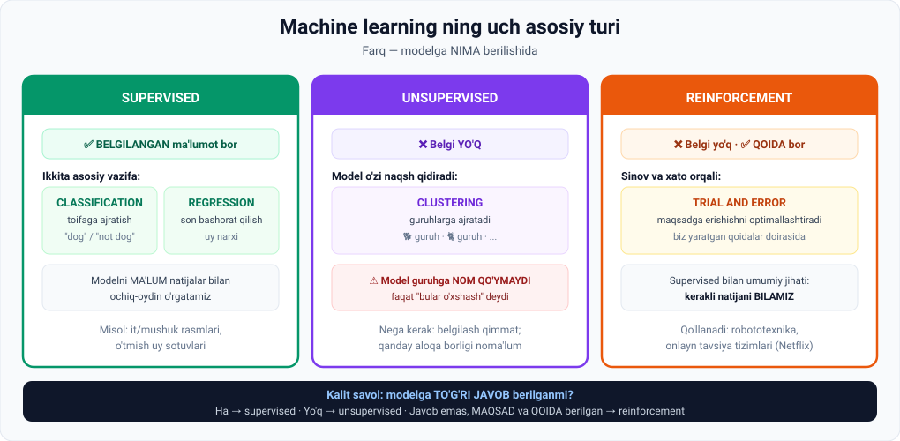
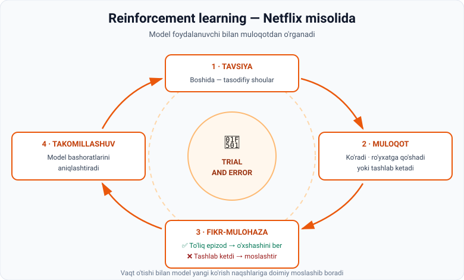

# 2-dars. Supervised, Unsupervised va Reinforcement learning

## 🎬 Boshlashdan oldin

Uch xil o'qituvchini tasavvur qiling:

| | Uslub |
|---|---|
| 👨‍🏫 **Birinchisi** | Har bir masalaning **javobini ko'rsatadi**: "Bu — it. Bu — mushuk. Endi o'zing ayt." |
| 🤷 **Ikkinchisi** | Bir uyum rasm beradi: **"O'xshashlariga ajratib chiq."** Javobni aytmaydi. |
| 🎮 **Uchinchisi** | Javob bermaydi, lekin **"issiq–sovuq"** o'ynaydi: "Yaqinlashding! Endi uzoqlashding." |

> **Uchalasi ham o'qituvchi.** Lekin uchta butunlay boshqa usul.
>
> Machine learning da ham xuddi shunday uch usul bor. Bu dars aynan shu haqda.

---

## ⚠️ Ma'ruzachidan tinchlantiruvchi so'z

> *"Agar bu juda mavhum va murakkab tuyulsa, iltimos, xavotir olmang. Biz bu AI texnikalarining **intuitsiyasi** haqida gaplashamiz, tafsilotlarga chuqur kirmasdan."*

---

## 1. Uchta tur — bir qarashda



### 🔑 Kalit savol

Farqni eslab qolishning eng oson yo'li — **bitta savol berish**:

```
Modelga TO'G'RI JAVOB berilganmi?

  ✅ Ha                     → SUPERVISED
  ❌ Yo'q                   → UNSUPERVISED
  🎯 Javob emas, MAQSAD     → REINFORCEMENT
     va QOIDA berilgan
```

---

## 2. Supervised learning

> **Supervised learning belgilangan (labelled) ma'lumot bilan ishlaganda a'lo natija beradi.**

*(02-moduldagi labelled data'ni eslang — endi u qayerda ishlatilishini ko'rasiz.)*

### 2.1. Classification — toifaga ajratish

**Ma'ruzadagi misol:**

Training dataset rasmda **it bor-yo'qligini** ko'rsatadi. Aynan shu tarzda algoritm yangi rasmlarni **"dog"** yoki **"not dog"** deb tasniflashni o'rganadi.

```
Ta'lim bosqichi:
   🐕 → "dog"        🐈 → "not a dog"
   🐩 → "dog"        🐦 → "not a dog"
        ↓
   model nimaga qarash kerakligini BILADI
        ↓
Ishlatish:
   yangi rasm 🦮  →  model: "dog"
```

> Model **o'qitish davomida berilgan fikr-mulohaza (feedback)** asosida yangi rasmda it bor-yo'qligini aniqlaydi.

> **Bu — classification masalasi**, supervised ML bilan yechiladi.

### 2.2. Regression — natijani bashorat qilish

> **Supervised learning ning ikkinchi asosiy qo'llanishi — natijani bashorat qilish.**

Oldingi darsdagi ko'chmas mulk ilovasini eslang:

> O'tmish uy sotuvlari dataseti **ma'lum narxlarni** ham, **uylarning xususiyatlarini** ham o'z ichiga olgan edi. Biz shunchaki uy xususiyatlarini ajratib ko'rsatmadik — **narx ham ma'lum edi**.

> **Bu ham supervised learning**, lekin **bashorat** uchun — bu **regression masalasi** deb ataladi.

### 2.3. Ikkalasining farqi

| | Classification | Regression |
|---|---|---|
| **Chiqish** | **Toifa** (kategoriya) | **Son** |
| **Misol** | "dog" / "not a dog" | 248 000 $ |
| **Savol** | *Bu nima?* | *Bu qancha?* |
| **Yana misollar** | Spam/spam emas, kasal/sog'lom | Harorat, savdo hajmi, ball |

### 📌 Supervised ta'rifi

> **Sodda qilib aytganda: supervised learning da biz modelni MA'LUM natijalar bilan ochiq-oydin o'rgatamiz — uning o'rganishiga yo'l ko'rsatamiz.**

---

## 3. Unsupervised learning

> **Unsupervised learning da biz ma'lumotni belgilarsiz qayta ishlaymiz.**

### Ma'ruzadagi misol

```
10 000 ta hayvon rasmi
   yarmi — itlar
   qolgani — turli hayvonlar

Modelga BERILADIGAN belgi yoki ishora:  YO'Q
```

**Model nima qiladi:**

1. Barcha rasmlarni **ko'rib chiqadi** (*scan through*)
2. **Naqshlarni qidiradi**
3. Pirovardida **aniq guruhlarni ajrata oladi** va ularni alohida-alohida belgilaydi

```
Guruh A: 🐕 🐩 🦮      Guruh B: 🐈 🐈‍⬛      Guruh C: 🐦 🦜
```

### ⚠️ Eng muhim cheklov

> **ML modeli bu tasvirlarning MAZMUNINI aytmaydi.**
>
> U faqat ular **o'xshash xususiyatlarga ega** ekanini ko'rsatadi va ularni **guruhlaydi**.

> 🏷 Ya'ni model **"bu itlar"** demaydi. U **"bu 4 971 ta rasm bir-biriga o'xshaydi"** deydi. Guruhga **nom qo'yish** — baribir odamning ishi.

### Nima uchun unsupervised kerak?

Ma'ruza ikkita sabab keltiradi:

| № | Sabab |
|---|---|
| **1** | **Ma'lumotni belgilash qimmat** va har doim ham amaliy emas |
| **2** | Ba'zan biz **ma'lumotda qanday aloqalarni qidirish kerakligini bilmaymiz** — shuning uchun algoritm bu qiziqarli aloqalarni **avval o'zi topgani** mantiqiy |

> 💡 **Ikkinchi sabab ayniqsa kuchli.** Supervised da siz **nimani qidirayotganingizni bilishingiz shart**. Unsupervised da esa model **siz o'ylab ham ko'rmagan** guruhni topib berishi mumkin.

### Biznes misollari

| Kim | Nima topadi |
|---|---|
| **Supermarket tarmog'i** | Turli xatti-harakatga ega **maqsadli mijozlar klasterlari** |
| **Ko'chmas mulk agenti** | **Qaysi turdagi mulklar eng ko'p sotilishini** aniqlash |

---

## 4. Reinforcement learning

> **Yana bir muhim ML turi — reinforcement learning.** U **belgilangan ma'lumotsiz** ishlaydi va **mashina belgilangan maqsadga qanday erishishni o'zi topadigan** aniq stsenariylarda qo'llanadi.

### Supervised bilan umumiy jihati

> Reinforcement learning supervised ML bilan bitta narsani baham ko'radi: **kerakli natijani tushunish**.
>
> Biz aslida kompyuterni **maqsadga erishishni optimallashtirishga** yo'naltiramiz.

### Farqi

> **Lekin supervised learning dan farqli o'laroq, biz modelga belgilangan ma'lumot bermaymiz.**
>
> **Buning o'rniga biz QOIDALAR yaratamiz.**
>
> ML modeli biz yaratgan qoidalarning **aniq parametrlari doirasida sinov va xato orqali** o'rganadi.

### Qayerda ishlatiladi

> Reinforcement learning **robototexnika** va **onlayn tavsiya tizimlari**da gullab-yashnaydi.

---

## 5. 🎬 Netflix misoli — batafsil



Ma'ruza Netflix'ni misol qilib keltiradi:

> An'anaviy usullar **belgilangan ma'lumotga** tayanadi — ular foydalanuvchi qaysi shouni yoqtirishi mumkinligini ko'rsatadi.
>
> **Reinforcement learning** esa boshqacha tizimdan foydalanadi: model **muloqot orqali foydalanuvchi fikr-mulohazasidan** o'rganadi.

### Jarayon

| Qadam | Nima bo'ladi |
|---|---|
| **1** | Boshida Netflix **tasodifiy shou tavsiyalari** berishi mumkin |
| **2** | Foydalanuvchi bu takliflar bilan **muloqot qiladi**: ko'radi, ro'yxatiga qo'shadi yoki tashlab ketadi |
| **3** | Tizim **fikr-mulohaza to'playdi** |
| **4** | Model bashoratlarini **aniqlashtiradi** |

### Signallar

```
✅ IJOBIY muloqot
   (to'liq epizodni ko'rish)
   → modelga signal: "kelajakda O'XSHASH kontent tavsiya qil"

❌ SALBIY javob
   (shouni tashlab ketish)
   → modelga signal: "tavsiyalarni MOSLASHTIRISH kerak"
```

> **Vaqt o'tishi bilan model bashoratlarini individual foydalanuvchi afzalliklariga yaxshiroq moslashtiradi** — yangi ko'rish naqshlari va xatti-harakatlariga **doimiy moslashib boradi**.

> 🔁 **Nima uchun bu qiziq:** bu yerda **"to'g'ri javob" umuman yo'q.** Sizning didingiz — sizniki. Model uni faqat **sizning reaksiyangizdan** bilib oladi. Va u har hafta o'zgarishi mumkin.

---

## 6. 💻 Amaliyot: reinforcement learning ni o'z ko'zingiz bilan ko'ring

Hech narsa o'rnatmasdan ishlaydi. Bu — Netflix mantiqi, kichraytirilgan holda.

```python
import random
random.seed(42)          # natija takrorlanadigan bo'lishi uchun

# Foydalanuvchining HAQIQIY didi. Model buni BILMAYDI!
JANRLAR = {
    "Komediya":   0.20,
    "Detektiv":   0.75,
    "Hujjatli":   0.35,
    "Melodrama":  0.10,
}

statistika = {j: {"taklif": 0, "yoqdi": 0} for j in JANRLAR}

def baho(janr):
    """Model shu janr haqida hozircha nima 'o'ylaydi'."""
    s = statistika[janr]
    if s["taklif"] == 0:
        return 1.0          # sinalmagan janr - optimistik baho
    return s["yoqdi"] / s["taklif"]

print("=== REINFORCEMENT LEARNING: Netflix simulyatsiyasi ===")
print("Model foydalanuvchi didini BILMAYDI. Faqat sinov va xato orqali o'rganadi.\n")

for qadam in range(1, 201):
    # QOIDA: 10% hollarda tasodifiy sinab ko'r, qolganida eng yaxshisini ber
    if random.random() < 0.1:
        janr = random.choice(list(JANRLAR))       # tadqiqot (exploration)
    else:
        janr = max(JANRLAR, key=baho)             # foydalanish (exploitation)

    statistika[janr]["taklif"] += 1

    # Foydalanuvchi reaksiyasi = FIKR-MULOHAZA
    if random.random() < JANRLAR[janr]:
        statistika[janr]["yoqdi"] += 1

    if qadam in (10, 50, 200):
        print(f"--- {qadam}-taklifdan keyin ---")
        for j in JANRLAR:
            s = statistika[j]
            print(f"   {j:<11} taklif={s['taklif']:>3}  yoqdi={s['yoqdi']:>3}  baho={baho(j)*100:5.1f}%")
        print(f"   -> Model hozir {max(JANRLAR, key=baho)} ni afzal ko'ryapti\n")

print("=== HAQIQAT (model buni hech qachon ko'rmagan) ===")
for j, p in JANRLAR.items():
    print(f"   {j:<11} haqiqiy yoqish ehtimoli = {p*100:.0f}%")

gp = max(JANRLAR, key=lambda j: statistika[j]["taklif"])
print(f"\nModel eng ko'p taklif qilgan janr: {gp}")
print(f"Haqiqiy eng yaxshi janr:           {max(JANRLAR, key=JANRLAR.get)}")
```

### Haqiqiy natija

```
--- 10-taklifdan keyin ---
   Komediya    taklif=  2  yoqdi=  1  baho= 50.0%
   Detektiv    taklif=  8  yoqdi=  7  baho= 87.5%
   Hujjatli    taklif=  0  yoqdi=  0  baho=100.0%
   Melodrama   taklif=  0  yoqdi=  0  baho=100.0%
   -> Model hozir Hujjatli ni afzal ko'ryapti

--- 50-taklifdan keyin ---
   Detektiv    taklif= 44  yoqdi= 32  baho= 72.7%
   -> Model hozir Detektiv ni afzal ko'ryapti

--- 200-taklifdan keyin ---
   Komediya    taklif=  7  yoqdi=  2  baho= 28.6%
   Detektiv    taklif=179  yoqdi=134  baho= 74.9%
   Hujjatli    taklif=  8  yoqdi=  1  baho= 12.5%
   Melodrama   taklif=  6  yoqdi=  1  baho= 16.7%

=== HAQIQAT ===
   Detektiv    haqiqiy yoqish ehtimoli = 75%

Model eng ko'p taklif qilgan janr: Detektiv
Haqiqiy eng yaxshi janr:           Detektiv
```

### 🔑 Uchta muhim kuzatuv

**1. Model 74.9% ni topdi — haqiqiy qiymat 75%.**
Unga hech kim aytmadi. U buni **200 marta sinab** o'zi aniqladi.

**2. 10-qadamda model hali adashgan edi** ("Hujjatli"ni afzal ko'rgan). Bu **normal** — ma'lumot yetarli emas edi. Netflix ham birinchi kuni sizni yaxshi bilmaydi.

**3. `exploration` vs `exploitation` — reinforcement learning ning yuragi.**

```
10%  → tasodifiy sinab ko'rish     (exploration — tadqiqot)
90%  → eng yaxshisini berish       (exploitation — foydalanish)
```

> ⚖️ Agar model **doim** eng yaxshisini bersa — u **yangi yaxshi janrni hech qachon topmaydi**.
> Agar **doim** tasodifiy bersa — foydalanuvchi ketib qoladi.
>
> Bu muvozanat — **exploration/exploitation dilemmasi**. Va bu faqat AI muammosi emas: yangi kafega borasizmi yoki sinalgan taomni buyurtma qilasizmi — bu ham xuddi shu dilemma.

---

## 7. ⚡ Amaliy topshiriqlar

### 🟢 Oson — 7 daqiqa · **Qaysi tur?**

| № | Vazifa | S / U / R ? |
|---|---|---|
| 1 | Emaildagi spamni aniqlash | |
| 2 | Robotni yurishga o'rgatish | |
| 3 | Ertangi valyuta kursini bashorat qilish | |
| 4 | Mijozlarni o'xshash guruhlarga bo'lish | |
| 5 | Rentgen suratida shishni aniqlash | |
| 6 | O'yin botini g'alaba qozonishga o'rgatish | |
| 7 | Yangiliklarda takrorlanuvchi mavzularni topish | |
| 8 | Uy narxini bashorat qilish | |

<details>
<summary>✅ Javoblar</summary>

1. **Supervised** — classification ("spam" / "spam emas" belgilari bor)
2. **Reinforcement** — qoida va maqsad bor, belgilangan ma'lumot yo'q
3. **Supervised** — regression (o'tmish kurslar ma'lum)
4. **Unsupervised** — clustering
5. **Supervised** — classification (shifokor belgilagan)
6. **Reinforcement** — g'alaba = mukofot, mag'lubiyat = jarima
7. **Unsupervised** — mavzular oldindan noma'lum
8. **Supervised** — regression

**Naqsh:** 1, 3, 5, 8 — to'g'ri javob **bor**. 4, 7 — **yo'q**. 2, 6 — javob emas, **maqsad** bor.

</details>

### 🟡 O'rta — 20 daqiqa · **Exploration darajasini o'zgartiring**

Kodda `if random.random() < 0.1` qatoridagi **0.1** — bu **exploration darajasi**.

Uni o'zgartirib, natijani jadvalga yozing:

| Exploration | Detektiv necha marta taklif qilindi? | Model to'g'ri janrni topdimi? |
|---|---|---|
| `0.0` (hech qachon sinamaydi) | | |
| `0.1` (asl) | 179 | ✅ Ha |
| `0.5` | | |
| `1.0` (doim tasodifiy) | | |

**Savollar:**
1. `0.0` da nima bo'ldi? Nega?
2. `1.0` da model umuman **o'rganadimi**?
3. Nima uchun aynan **kichik** exploration eng yaxshi ishlaydi?

> 💡 `random.seed(42)` ni o'chirib ham sinab ko'ring — natija har safar boshqacha bo'ladi. Bu — real hayotdagidek.

### 🔴 Qiyin — mini-loyiha · **O'z tavsiya tizimingiz**

`JANRLAR` lug'atini o'zingizga moslang:

```python
JANRLAR = {
    "Sport":      0.??,
    "Texnologiya":0.??,
    "Musiqa":     0.??,
    "Ovqat":      0.??,
    "Sayohat":    0.??,
}
```

1. **Rostini yozing** — o'zingiz haqingizda.
2. Simulyatsiyani ishga tushiring.
3. Model **necha qadamdan keyin** sizning didingizni to'g'ri topdi?
4. Ikkita janrga **juda yaqin** qiymat bering (masalan 0.55 va 0.60). Model ularni ajrata oladimi? **Necha qadam kerak bo'ldi?**

**Xulosa savoli:** nima uchun TikTok sizni **bir necha kunda** juda yaxshi biladi, lekin **birinchi 10 daqiqada** yomon tavsiya beradi?

---

## 8. 🧠 O'zini tekshirish savollari

1. Uchta asosiy ML turi qaysilar?
2. Supervised learning qanday ma'lumot bilan a'lo ishlaydi?
3. Classification va regression farqi nima? Har biriga misol keltiring.
4. Unsupervised learning da model rasm mazmunini aytadimi? Nima deydi?
5. Unsupervised learning nima uchun kerak? Ikkita sababni ayting.
6. Reinforcement learning supervised bilan nimani baham ko'radi?
7. Reinforcement learning supervised dan nimasi bilan farq qiladi?
8. Netflix misolida ijobiy va salbiy signallar nima?
9. Reinforcement learning qaysi sohalarda gullab-yashnaydi?

<details>
<summary>✅ Javoblar</summary>

1. **Supervised**, **unsupervised**, **reinforcement** learning.
2. **Belgilangan (labelled)** ma'lumot bilan.
3. **Classification** — toifaga ajratish ("dog"/"not dog"). **Regression** — son bashorat qilish (uy narxi).
4. **Yo'q.** U faqat ular **o'xshash xususiyatlarga ega** ekanini ko'rsatadi va **guruhlaydi**.
5. (a) **Belgilash qimmat** va har doim amaliy emas; (b) ba'zan biz **qanday aloqalarni qidirishni bilmaymiz** — algoritm ularni avval o'zi topgani mantiqiy.
6. **Kerakli natijani tushunish** — biz kompyuterni maqsadga erishishni optimallashtirishga yo'naltiramiz.
7. Belgilangan ma'lumot **bermaymiz** — buning o'rniga **qoidalar yaratamiz**; model shu qoidalar doirasida **sinov va xato** orqali o'rganadi.
8. **Ijobiy:** to'liq epizodni ko'rish → o'xshash kontent taklif qil. **Salbiy:** shouni tashlab ketish → tavsiyalarni moslashtir.
9. **Robototexnika** va **onlayn tavsiya tizimlari**.

</details>

---

## 📌 Solishtirma jadval

| Mezon | Supervised | Unsupervised | Reinforcement |
|---|---|---|---|
| **Belgilangan ma'lumot** | ✅ Bor | ❌ Yo'q | ❌ Yo'q |
| **Kerakli natija ma'lummi** | ✅ Ha | ❌ Yo'q | ✅ **Ha** (maqsad sifatida) |
| **Nima beriladi** | X va **Y** | Faqat X | **Qoidalar** va maqsad |
| **Asosiy vazifalar** | Classification, regression | Clustering | Optimallashtirish |
| **Model chiqishi** | Toifa yoki son | Guruhlar (nomsiz) | Harakatlar strategiyasi |
| **Misol** | It/mushuk, uy narxi | Mijoz klasterlari | Netflix, robot |
| **Cheklovi** | Belgilash qimmat | Guruhga nom qo'ymaydi | Ko'p sinov kerak |

---

## 🔖 Atamalar

| Atama | Inglizcha | Izoh |
|---|---|---|
| Nazoratli o'rganish | *supervised learning* | Belgilangan ma'lumot bilan |
| Nazoratsiz o'rganish | *unsupervised learning* | Belgisiz ma'lumot bilan |
| Mustahkamlovchi o'rganish | *reinforcement learning* | Qoida va fikr-mulohaza bilan |
| Klassifikatsiya | *classification* | Toifaga ajratish |
| Regressiya | *regression* | Son bashorat qilish |
| Klasterlash | *clustering* | O'xshashlarni guruhlash |
| Fikr-mulohaza | *feedback* | Modelga beriladigan signal |
| Tadqiqot | *exploration* | Yangi variantni sinab ko'rish |
| Foydalanish | *exploitation* | Ma'lum eng yaxshisini tanlash |

---

⬅️ [Oldingi: Machine Learning](01-Machine-learning.md) · ➡️ [Keyingi: Deep Learning](03-Deep-learning.md)
