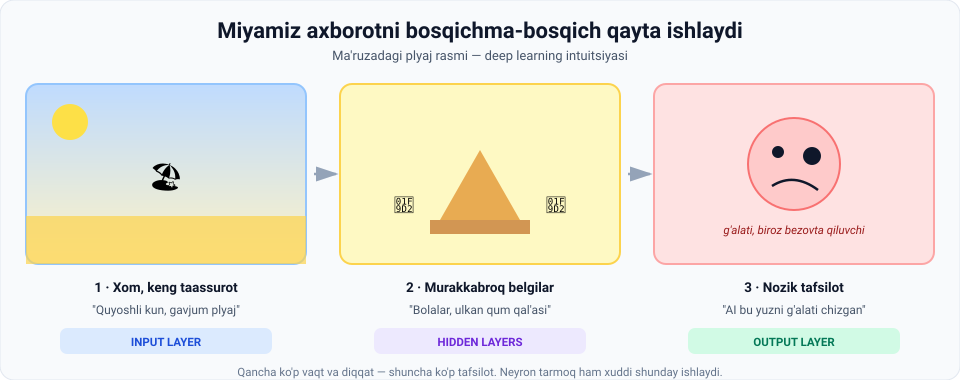
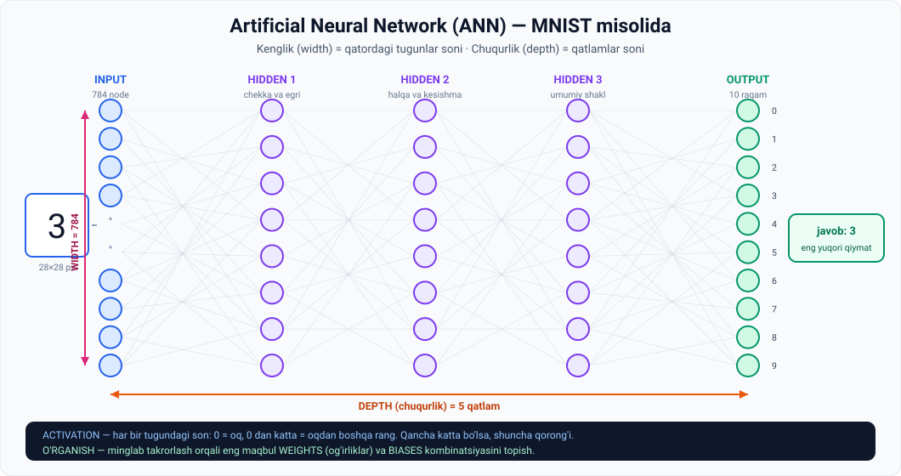
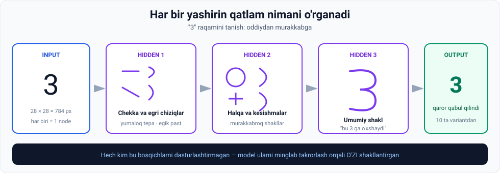

# 3-dars. Deep Learning

## 🎬 Boshlashdan oldin

Do'stingizning telefonidagi rasmga qarang. Bir soniyada bilasiz: **"Bu Toshkentda olingan."**

Qanday? Siz **hisoblamadingiz**. Siz shunchaki **ko'rdingiz**.

Lekin aslida miyangiz bir necha bosqichni bosib o'tdi:
```
ranglar va chiziqlar → binolar → o'ziga xos me'morchilik → "Toshkent"
```

> **Deep learning aynan shu bosqichlarni mashinada takrorlashga urinadi.** Va bu dars sizga uni ichidan ko'rsatadi.

---

## 1. Ma'ruzachining tajribasi: plyaj rasmi

Ma'ruza **AI tomonidan yaratilgan rasm**ni ko'rsatish bilan boshlanadi va so'raydi: **"Nima ko'ryapsiz?"**



### Uch bosqichli ko'rish

| Bosqich | Nima ko'rindi |
|---|---|
| **1 · Birinchi qarashda** | *"Quyoshli kun va gavjum plyaj"* |
| **2 · Diqqat bilan qaraganda** | *"Markazda ulkan qum qal'asi atrofida qumda o'ynayotgan bolalar"* |
| **3 · Har bir odamga alohida qaraganda** | *"AI bu odamning yuzini g'alati chizgan — g'alati va biroz bezovta qiluvchi ko'rinish"* |

### Xulosa

> **Miyamiz axborotni turli fazalarda va turli chuqurlikda qayta ishlaydi.**
>
> Dastlab rasmni ko'rish **xom, keng taassurot** beradi — bu sahnaning **konteksti** haqida tasavvur yaratadi.
>
> **Tafsilotlarga qancha ko'p vaqt va e'tibor bersak, shuncha ko'p ma'lumot va nozikliklarni** qayta ishlay va kuzata olamiz.

> **Deep learning kontekstida neyron tarmoq axborotni xuddi shunday qayta ishlaydi.**

---

## 2. Neyron tarmoqning qatlamlari

> *"Iltimos, qo'rqmang. Bir soniyada hammasi tushunarli bo'ladi."* — ma'ruzachi

### Qatlamlar analogiya orqali

| Qatlam | Plyaj misolida |
|---|---|
| **Birinchi qatlam** | **Input** — quyoshli, gavjum plyaj kunini kuzatish |
| **Oraliq qatlamlar** | Murakkabroq belgilar: **shakllar yoki aniq obyektlar** — masalan, o'rtadagi ulkan qum qal'asi |
| **Chuqurroq qatlamlar** | Quyi darajadagi belgilarni **yuqori darajadagi belgilarga sintez qiladi** |

> **Neyron tarmoqning har bir oraliq qatlami oldingi qatlamlar aniqlagan asosiy belgilar haqida yanada batafsil tushuncha quradi.**
>
> Ya'ni **egallanadigan tafsilot darajasi bosqichma-bosqich ortadi**.

Aynan shu tarzda AI yaratgan **g'alati yuzni** payqash mumkin bo'ladi.

> 😅 **Ma'ruzachining halol e'tirofi:** *"Rostini aytsam, ongsiz ravishda rasmning shunday bo'lishini xohlagandirman — chunki AI sifatli namuna yaratdimi, deb qiziqqandim. Va oxir-oqibat miyam shu kichik tafsilotga qaratildi."*

### Bir jumlada

> **Deep learning — bu mashinalarga input axborotni bosqichma-bosqich qayta ishlash orqali o'rganish imkonini beruvchi murakkab jarayon.**

---

## 3. 🔬 Texnik tafsilotlar: ANN

Bu neyron tarmoqni **artificial neural network** yoki **ANN** deb ataymiz.

> **Uni biologik neyron tarmoqlar ilhomlantirgan, lekin ular ancha boshqacha ishlaydi.**

⚠️ Bu muhim ogohlantirish: ANN — **miyaning nusxasi emas**, faqat **undan ilhomlangan** model.



### Qatlamlar tuzilishi

| Qatlam | Inglizcha | Vazifasi |
|---|---|---|
| **Kirish qatlami** | *input layer* | Sezgilarimiz kabi — **xom ma'lumotni** uzatadi |
| **Oraliq / yashirin qatlamlar** | *hidden layers* | Input axborotni **qayta ishlaydi** |
| **Chiqish qatlami** | *output layer* | **Yakuniy natijani** generatsiya qiladi |

### Yashirin qatlamlar haqida

> Neyron tarmoqlarda **bitta yoki bir nechta** yashirin qatlam bo'lishi mumkin. **Qatlamlarni ko'paytirish murakkablikni oshiradi.**
>
> Tarmoqqa ko'proq qatlam qo'shish uning **o'rganish sig'imini** oshiradi — ammo salbiy tomoni shundaki, samarali o'rganishni ta'minlash uchun buni **ehtiyotkorlik bilan boshqarish** kerak.

> ⚖️ Ya'ni: **ko'proq qatlam ≠ har doim yaxshiroq**. Bu — muhandislik qarori, sehr emas.

### Neyronlar (nodes)

> **ANN ning har bir qatlami neyronlar yoki tugunlardan (nodes) tashkil topgan** — ular olingan axborotni **qayta ishlash va o'zgartirish** uchun javobgar.

---

## 4. 🔢 MNIST misolida — raqamlar bilan

*(MNIST'ni 02-moduldan eslang: 70 000 ta 28×28 qo'lyozma raqam.)*

Modelni qo'lyozma raqamlarni tanishga o'rgatish **minglab oldindan belgilangan (pre-labelled) namuna** berishni talab qiladi.

> 📌 **Diqqat:** "pre-labelled" — bu **supervised learning**. Oldingi darsni eslang.

### O'qitish qanday kechadi?

| Qadam | Nima bo'ladi |
|---|---|
| **1** | ANN ning **input layer**i qo'lyozma raqam tasvirini qabul qiladi |
| **2** | Tasvirning **har bir pikseli input node** vazifasini bajaradi |
| **3** | MNIST'da tasvirlar **28 × 28** piksel → input layer'da odatda **784 ta input node** bo'ladi |
| **4** | 784 ta input node neyron tarmoq ichida **vektor** sifatida saqlanadi va input layer'ni tashkil qiladi |

### Activation — eng muhim tushuncha

> **784 ta input node ning har biri o'zining yorqin yoki qorong'iligiga qarab bir sonni saqlaydi.**
>
> Bu yerda **nol oqni** anglatadi, **noldan katta har qanday qiymat** esa oqdan boshqa rangni bildiradi.
>
> ### **Bu sonni ACTIVATION deb ataymiz.**
>
> **Son qancha katta bo'lsa, berilgan node ichidagi mazmun shuncha qorong'i.**

> 🔗 **Bog'lanish:** 02-moduldagi `0–255` piksel qiymatlari — aynan shu. Endi ular **neyronning aktivatsiyasi** deb ataladi.

### Width va Depth

```
784 ta input node   →  tarmoqning KENGLIGI  (width)
qatlamlar soni      →  tarmoqning CHUQURLIGI (depth)
```

**Ma'ruzadagi misol tarmoq:**

```
input layer  +  3 ta hidden layer  +  output layer  =  DEPTH 5
```

### Ulanishlar

> **Tugunlar orasida juda ko'p ulanish bor, chunki har bir qatlamning tugunlari keyingi qatlamning HAR BIR tuguniga bog'langan.**
>
> Bu keng ulanishlar tarmog'i input ma'lumotdan o'rganish uchun **muhim** — ular **matematik o'zgartirishlar** vazifasini bajaradi.

### Weights va Biases

> **Bu o'zgartirishlar `weights` (og'irliklar) va nochiziqli amallar aralashmasi orqali sodir bo'ladi** — barcha tugunlar bo'ylab **optimal og'irliklar kombinatsiyasi** o'rganishni ta'minlaydi.
>
> Bu usul input'ni turli qatlamlar orqali tarjima qiladi va natija generatsiya qilishdan oldin axborotni **tozalab boradi**.

### 🔑 O'rganish nima?

> ## **O'rganish — aniq bir masalani yechish uchun OPTIMAL `weights` va `biases` ni aniqlaydigan tizim loyihalash.**
> ### **Bu eng yaxshi kombinatsiyani topish uchun MINGLAB TAKRORLASHNI talab qiladi.**

> 💡 **Mana shu — "AI o'rganadi" iborasining aniq ma'nosi.** Sehr yo'q. Model **sonlarni (weights) minglab marta sozlaydi**, toki natija to'g'ri chiqmaguncha.

---

## 5. 🎯 Nima uchun bir necha qatlam kerak?

Ma'ruza aynan shu savolni beradi: *"Nega bir necha qatlam kerak? Har bir qatlamda qanday o'zgartirishlarni kutamiz?"*

### Javob — miya qanday ishlashidan

> Rasmni ko'rganimizda miyamiz **u nimalardan tashkil topganini** bog'laydi.
>
> Masalan, **3 raqami ikkita elementdan iborat: yumaloq tepa va egik past qism.**



### Qatlamma-qatlam

| Qatlam | Nimani o'rganadi |
|---|---|
| **1-yashirin qatlam** | Input ma'lumotdan **shu belgilarni** (chekka va egri chiziqlar) tanishni o'rganadi |
| **2-yashirin qatlam** | Oldingi qatlam natijasi ustiga quriladi: chekka va egriliklardan **halqa va kesishmalar** kabi murakkabroq shakllarni ajratadi |
| **3-yashirin qatlam** | **3 raqamini ifodalovchi umumiy shakl va konfiguratsiyani** tanishni o'rgangan |
| **Output layer** | Oxirgi yashirin qatlamdan qayta ishlangan ma'lumotni oladi va **raqam 3 mi yoki yo'qmi** — hal qiladi |

> **Aynan shunday neyron tarmoq oddiy ko'rinadigan vazifani — raqamni tanishni — bajarishni o'rganadi.**

> ⚠️ **Ma'ruzachining halolligi:** *"Ostidagi jarayon esa biz to'liq tasvirlamagan murakkab matematik manipulyatsiyalarni o'z ichiga oladi."*

---

## 6. 💻 Amaliyot: neyronni o'z qo'lingiz bilan ishlating

Hech narsa o'rnatmasdan ishlaydi. **784 ta emas, 9 ta piksel** — lekin mantiq **aynan bir xil**.

```python
# 3x3 "rasm": 0 = oq, 255 = qora
GORIZONTAL = [[0,0,0],[255,255,255],[0,0,0]]
VERTIKAL   = [[0,255,0],[0,255,0],[0,255,0]]

def activation(rasm):
    """Piksel qiymatini 0..1 oralig'iga keltiramiz - bu ACTIVATION."""
    return [p/255 for qator in rasm for p in qator]

# Qo'lda tanlangan WEIGHTS (og'irliklar).
# Haqiqiy tarmoqda ular o'rganish jarayonida topiladi.
W_GORIZONTAL = [-1,-1,-1,  +1,+1,+1,  -1,-1,-1]
W_VERTIKAL   = [-1,+1,-1,  -1,+1,-1,  -1,+1,-1]
BIAS = -1.0

def neuron(acts, weights, bias):
    s = sum(a*w for a, w in zip(acts, weights)) + bias
    return s, max(0.0, s)          # ReLU: manfiy bo'lsa 0

def korsat(nom, rasm):
    print(f"\n{'='*46}\n  {nom}\n{'='*46}")
    print("  Odam ko'radi:          Kompyuter ko'radi:")
    for qator in rasm:
        chap = "".join("##" if p > 128 else ".." for p in qator)
        ong  = " ".join(f"{p:3d}" for p in qator)
        print(f"     {chap}                {ong}")

    acts = activation(rasm)
    print(f"\n  ACTIVATION (0..1): {[round(a,1) for a in acts]}")

    for nomi, w in (("gorizontal-detektor", W_GORIZONTAL),
                    ("vertikal-detektor",   W_VERTIKAL)):
        s, out = neuron(acts, w, BIAS)
        bar = "#" * int(out*10)
        print(f"  {nomi:<22} yig'indi={s:+5.1f}  chiqish={out:4.1f}  {bar}")

    ga, _ = neuron(acts, W_GORIZONTAL, BIAS)
    ve, _ = neuron(acts, W_VERTIKAL,   BIAS)
    qaror = "GORIZONTAL chiziq" if ga > ve else "VERTIKAL chiziq"
    print(f"\n  >>> OUTPUT LAYER qarori: {qaror}")

korsat("1-rasm", GORIZONTAL)
korsat("2-rasm", VERTIKAL)
```

### Haqiqiy natija

```
==============================================
  1-rasm
==============================================
  Odam ko'radi:          Kompyuter ko'radi:
     ......                  0   0   0
     ######                255 255 255
     ......                  0   0   0

  ACTIVATION (0..1): [0.0, 0.0, 0.0, 1.0, 1.0, 1.0, 0.0, 0.0, 0.0]
  gorizontal-detektor    yig'indi= +2.0  chiqish= 2.0  ####################
  vertikal-detektor      yig'indi= -2.0  chiqish= 0.0

  >>> OUTPUT LAYER qarori: GORIZONTAL chiziq

==============================================
  2-rasm
==============================================
  Odam ko'radi:          Kompyuter ko'radi:
     ..##..                  0 255   0
     ..##..                  0 255   0
     ..##..                  0 255   0

  ACTIVATION (0..1): [0.0, 1.0, 0.0, 0.0, 1.0, 0.0, 0.0, 1.0, 0.0]
  gorizontal-detektor    yig'indi= -2.0  chiqish= 0.0
  vertikal-detektor      yig'indi= +2.0  chiqish= 2.0  ####################

  >>> OUTPUT LAYER qarori: VERTIKAL chiziq
```

### 🔑 Nima sodir bo'ldi?

**1. `W_GORIZONTAL` ga qarang:**

```
-1 -1 -1        Ma'nosi: "o'rta qator YORUG' bo'lsin,
+1 +1 +1                  yuqori va past qatorlar QORONG'I bo'lmasin"
-1 -1 -1
```

Bu — **gorizontal chiziq detektori**. Va u aynan **1-yashirin qatlam** o'rganadigan narsa.

**2. Weights = modelning butun "bilimi".**
Bu misolda ularni **biz qo'lda yozdik**. Haqiqiy tarmoqda model ularni **minglab takrorlash orqali o'zi topadi**. Boshqa hech qanday farq yo'q.

**3. `BIAS` — bu chegara.**
`-1.0` degani: "yig'indi 1 dan katta bo'lmasa, umuman javob berma". Bu shovqinni filtrlaydi.

**4. Butun deep learning shu amalning millionlab marta takrorlanishidir.**
784 input, 3 qatlam, har birida yuzlab neyron — lekin **har bir neyron aynan shu ishni** qiladi: `ko'paytir → qo'sh → chegaradan o'tkaz`.

---

## 7. 🏆 Nima uchun deep learning inqilobiy?

Ma'ruzaning yakuniy xulosasi:

> **Mohiyatan, ANN qatlamlari — o'zining chuqurligi va kengligi orqali — inson kognitiv jarayonlarining ayrim jihatlarini aks ettiruvchi, ammo undan ko'ra tuzilmali bo'lgan mustahkam naqsh tanish va ma'lumot talqin qilish tizimini yaratadi.**
>
> ### **Katta, yuqori o'lchamli datasetlarni tahlil qilish va murakkab naqshlarni yuqori aniqlik bilan tanish qobiliyati deep learning'ni AI dagi inqilobiy vositaga aylantiradi.**
>
> ### **Aynan shu bugungi hayratlanarli AI yutuqlarini mumkin qilgan narsa.**

---

## 8. ⚡ Amaliy topshiriqlar

### 🟢 Oson — 7 daqiqa · **Terminlarni joyiga qo'ying**

| Ta'rif | Atama |
|---|---|
| 1. Xom ma'lumotni qabul qiladigan qatlam | |
| 2. Tugundagi son — u qanchalik qorong'i | |
| 3. Qatorlardagi tugunlar soni | |
| 4. Qatlamlar soni | |
| 5. Ulanishlardagi sozlanuvchi sonlar | |
| 6. Yakuniy natijani beruvchi qatlam | |
| 7. Oraliq qayta ishlash qatlamlari | |

<details>
<summary>✅ Javoblar</summary>

1. **Input layer** · 2. **Activation** · 3. **Width** (kenglik) · 4. **Depth** (chuqurlik) · 5. **Weights** (og'irliklar) · 6. **Output layer** · 7. **Hidden layers**

</details>

### 🟡 O'rta — 20 daqiqa · **Weights bilan o'ynang**

Yuqoridagi kodni ishga tushiring, so'ng:

1. **Yangi detektor qo'shing** — diagonal chiziq uchun:
   ```python
   W_DIAGONAL = [+1,-1,-1,  -1,+1,-1,  -1,-1,+1]
   ```
   Va uchinchi rasm yarating: `DIAGONAL = [[255,0,0],[0,255,0],[0,0,255]]`

2. `BIAS` ni `-1.0` dan `-2.5` ga o'zgartiring. Nima bo'ldi? **Nega?**

3. `GORIZONTAL` rasmining bitta pikselini buzing:
   ```python
   GORIZONTAL = [[0,0,0],[255,128,255],[0,0,0]]   # o'rtasi kulrang
   ```
   Model baribir to'g'ri javob berdimi? **Bu nimani ko'rsatadi?**

### 🔴 Qiyin — mini-loyiha · **O'z detektoringizni loyihalang**

3×3 katakda **"X" shakli** ni tanuvchi detektor yozing.

```python
X_SHAKL = [[255,0,255],[0,255,0],[255,0,255]]
W_X = [__,__,__,  __,__,__,  __,__,__]     # o'zingiz to'ldiring
```

**Shartlar:**
- `X_SHAKL` uchun chiqish **eng yuqori** bo'lsin
- `GORIZONTAL` va `VERTIKAL` uchun chiqish **0** bo'lsin

Ishlagach, javob bering:
1. Weights ni topish **oson bo'ldimi**?
2. Endi tasavvur qiling: **784 ta weight**, va **3 ta qatlam**. Buni qo'lda topish mumkinmi?
3. **Xulosa:** nima uchun modelning o'zi weights ni topishi (o'rganish) shunchalik muhim?

---

## 9. 🧠 O'zini tekshirish savollari

1. Plyaj rasmi misolida miya axborotni necha bosqichda qayta ishladi?
2. ANN nima va u biologik tarmoqdan qanday farq qiladi?
3. ANN ning uchta qatlam turini ayting.
4. MNIST'da input layer'da nechta node bor va nima uchun?
5. **Activation** nima? `0` nimani anglatadi?
6. **Width** va **depth** nima? Ma'ruzadagi tarmoqning depth'i qancha?
7. Tugunlar qanday bog'langan?
8. Ta'rif bo'yicha **o'rganish** nima?
9. 1-, 2- va 3-yashirin qatlamlar mos ravishda nimani o'rganadi?
10. Nima uchun deep learning inqilobiy hisoblanadi?

<details>
<summary>✅ Javoblar</summary>

1. **Uch:** (a) quyoshli gavjum plyaj; (b) bolalar va qum qal'asi; (c) g'alati chizilgan yuz.
2. **Artificial Neural Network.** Biologik tarmoqlar uni **ilhomlantirgan**, lekin ular **ancha boshqacha ishlaydi**.
3. **Input layer**, **hidden layer(s)**, **output layer**.
4. **784 ta** — chunki tasvir **28 × 28** piksel va **har bir piksel bitta input node**.
5. Tugundagi **son** — mazmun qanchalik yorug' yoki qorong'i ekanini bildiradi. **`0` = oq**; noldan katta qiymat — oqdan boshqa rang. Son qancha katta — shuncha qorong'i.
6. **Width** — qatordagi tugunlar soni (784). **Depth** — qatlamlar soni. Ma'ruzadagi tarmoq: input + 3 hidden + output = **5**.
7. **Har bir qatlamning tugunlari keyingi qatlamning har bir tuguniga** bog'langan.
8. Aniq bir masalani yechish uchun **optimal weights va biases ni aniqlaydigan tizim loyihalash** — bu **minglab takrorlash** talab qiladi.
9. 1: **chekka va egri chiziqlar**; 2: **halqa va kesishmalar**; 3: **umumiy shakl va konfiguratsiya**.
10. **Katta, yuqori o'lchamli datasetlarni tahlil qilish** va **murakkab naqshlarni yuqori aniqlik bilan tanish** qobiliyati tufayli.

</details>

---

## 📌 Xulosa

```
Rasm (784 piksel)
        ↓  har biri = ACTIVATION (0 = oq, katta = qorong'i)
   INPUT LAYER
        ↓  weights × activation + bias
  HIDDEN 1  →  chekka va egri chiziqlar
        ↓
  HIDDEN 2  →  halqa va kesishmalar
        ↓
  HIDDEN 3  →  umumiy shakl
        ↓
  OUTPUT LAYER  →  "bu 3"

O'RGANISH = minglab takrorlash orqali eng yaxshi weights va biases ni topish
```

> **Bitta jumlada:** deep learning — bu **oddiy amalni** (ko'paytir, qo'sh, chegaradan o'tkaz) **millionlab marta** bajarish orqali murakkab naqshlarni tanish.

---

## 🔖 Atamalar

| Atama | Inglizcha | Izoh |
|---|---|---|
| Sun'iy neyron tarmoq | *ANN* | Miyadan ilhomlangan hisoblash modeli |
| Kirish qatlami | *input layer* | Xom ma'lumotni qabul qiladi |
| Yashirin qatlam | *hidden layer* | Oraliq qayta ishlash |
| Chiqish qatlami | *output layer* | Yakuniy natija |
| Neyron / tugun | *neuron / node* | Axborotni qayta ishlovchi birlik |
| Aktivatsiya | *activation* | Tugundagi son (yorug'lik darajasi) |
| Kenglik | *width* | Qatordagi tugunlar soni |
| Chuqurlik | *depth* | Qatlamlar soni |
| Og'irliklar | *weights* | Ulanishlardagi sozlanuvchi sonlar |
| Siljish | *bias* | Neyronning chegara qiymati |
| Nochiziqli amal | *non-linear operation* | Aktivatsiya funksiyasi (masalan ReLU) |
| Yuqori o'lchamli | *high-dimensional* | Juda ko'p belgiga ega ma'lumot |
| Naqsh tanish | *pattern recognition* | Ma'lumotda qonuniyat topish |

---

⬅️ [Oldingi: Uchta ML turi](02-Supervised-Unsupervised-Reinforcement.md) · 🏠 [Modul boshiga](README.md)

➡️ **Keyingi qadam:** **Quiz 3** (`4.3 Quiz 3.html`), so'ngra **04-modul: Important AI branches**
