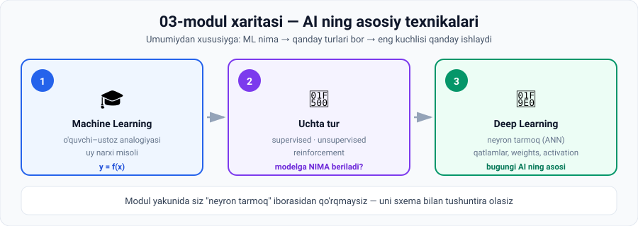

# 03-Modul · AI ning asosiy texnikalari

## 🧠 Bir jumlada

> **01-modul aytdi: AI o'rganadi. 02-modul aytdi: buning uchun ma'lumot kerak.**
> **03-modul javob beradi: aynan QANDAY o'rganadi.**

Modul yakunida siz "neyron tarmoq" iborasidan qo'rqmaysiz — uni sxema chizib tushuntira olasiz.

---

## 🗺 Modul xaritasi



---

## 📚 Darslar

| № | Dars | Vaqt | Asosiy g'oya | Amaliyot |
|---|---|---|---|---|
| 1 | [Machine Learning](01-Machine-learning.md) | ~15 daq | O'quvchi–ustoz analogiyasi · uy narxi · `y = f(x)` | 💻 Regressiya modeli |
| 2 | [Supervised, Unsupervised, Reinforcement](02-Supervised-Unsupervised-Reinforcement.md) | ~15 daq | Kalit savol: **modelga to'g'ri javob berilganmi?** | 💻 Netflix simulyatsiyasi |
| 3 | [Deep Learning](03-Deep-learning.md) ⭐ | ~20 daq | ANN · activation · weights · qatlamlar | 💻 Neyron forward pass |

⭐ = modulning eng muhim darsi

---

## 🎯 Modul yakunida siz bilasiz

- [ ] ML ning asosiy g'oyasini bitta jumlada aytasiz (**sinov va xato**)
- [ ] O'quvchi–ustoz analogiyasini to'liq tushuntirasiz
- [ ] Nima uchun **ko'p ma'lumotli oddiy model** kam ma'lumotli murakkabdan ustunligini bilasiz
- [ ] `y = f(x)` da X va Y nima ekanini uy misolida aytasiz
- [ ] **Supervised / unsupervised / reinforcement** ni bitta savol bilan farqlaysiz
- [ ] **Classification** va **regression** farqini misol bilan aytasiz
- [ ] Unsupervised model nima uchun guruhga **nom qo'ymasligini** bilasiz
- [ ] Netflix reinforcement learning'ni qanday ishlatishini tushuntirasiz
- [ ] **ANN** ning uchta qatlam turini va ularning vazifasini aytasiz
- [ ] **Activation**, **weights**, **bias**, **width**, **depth** atamalarini bilasiz
- [ ] MNIST'da nega **784 ta input node** borligini aytasiz
- [ ] "O'rganish" ning aniq ta'rifini bilasiz (**optimal weights va biases topish**)
- [ ] 💻 Uchta Python skriptini o'zingiz ishga tushirgansiz

---

## 🖼 Modul grafikalari

| Fayl | Nima ko'rsatadi |
|---|---|
| [`00-module-map.svg`](assets/00-module-map.svg) | Modulning 3 ta darsi |
| [`01-student-teacher.svg`](assets/01-student-teacher.svg) | Maktab ⟷ ML analogiyasi jadvali |
| [`01-house-price.svg`](assets/01-house-price.svg) | `X → MODEL → Y` uy narxi misoli |
| [`02-three-types.svg`](assets/02-three-types.svg) | Uch turning to'liq solishtiruvi |
| [`02-netflix-loop.svg`](assets/02-netflix-loop.svg) | Reinforcement learning fikr-mulohaza sikli |
| [`03-beach-layers.svg`](assets/03-beach-layers.svg) | Plyaj rasmi — miya qatlamma-qatlam ko'radi |
| [`03-neural-network.svg`](assets/03-neural-network.svg) | To'liq ANN: 784 → 3 hidden → 10 output |
| [`03-digit-layers.svg`](assets/03-digit-layers.svg) | Har bir qatlam nimani o'rganadi |

---

## 💻 Python amaliyotlari

Uchala skript ham **hech qanday kutubxona o'rnatmasdan** ishlaydi.

| Dars | Skript nima qiladi | Nima o'rgatadi |
|---|---|---|
| 1 | 6 ta uy sotuvidan naqsh topadi va yangi narx bashorat qiladi | Model qoidani **o'zi topadi** |
| 2 | 200 ta tavsiya orqali foydalanuvchi didini aniqlaydi | Sinov va xato · exploration/exploitation |
| 3 | 3×3 rasmni neyron orqali o'tkazadi | Activation · weights · bias · qaror |

> 🏆 **Eng ta'sirli natija:** 2-darsdagi skript foydalanuvchining haqiqiy didini (**75%**) hech qachon ko'rmagan holda **74.9%** deb topadi — faqat 200 marta sinab.

---

## ⚡ Amaliy topshiriqlar xaritasi

| Dars | 🟢 Oson | 🟡 O'rta | 🔴 Qiyin |
|---|---|---|---|
| 1 | Ustoz–o'quvchi jadvali | Kodni buzing va tuzating | O'z modelingizni quring |
| 2 | Qaysi tur? (8 vazifa) | Exploration darajasini o'zgartiring | O'z tavsiya tizimingiz |
| 3 | Terminlarni joyiga qo'ying | Weights bilan o'ynang | "X" detektorini loyihalang |

---

## 🔗 Modullar orasidagi bog'liqlik

```
01-modul  ─  AI nima, ML ⊂ AI, DL ⊂ ML  (5-dars ta'riflari)
    ↓
02-modul  ─  Ma'lumot: structured/unstructured, labelled/unlabelled, piksel 0–255
    ↓
03-modul  ─  BU YERDA HAMMASI BIRLASHADI:      ← siz shu yerdasiz
    ↓          • labelled data  →  supervised learning
    ↓          • unlabelled data →  unsupervised learning
    ↓          • piksel 0–255    →  activation
    ↓          • MNIST 28×28     →  784 input node
    ↓
04-modul  ─  Important AI branches
```

> 💡 **Diqqat qiling:** 02-modulda o'rgangan **har bir tushuncha** shu modulda ishga tushdi. Bu tasodif emas — kurs ataylab shunday qurilgan.

---

## 📖 Umumiy atamalar lug'ati

| Atama | Inglizcha | Izoh |
|---|---|---|
| Sinov va xato | *trial and error* | ML ning asosiy mexanizmi |
| Training data | *training data* | Modelni o'rgatish uchun ma'lumot |
| Xususiyat | *feature* | Model foydalanadigan input belgisi |
| Bashorat | *prediction* | Modelning chiqishi |
| Extrapolyatsiya | *extrapolation* | Training data chegarasidan tashqarida bashorat |
| Nazoratli o'rganish | *supervised learning* | Belgilangan ma'lumot bilan |
| Nazoratsiz o'rganish | *unsupervised learning* | Belgisiz ma'lumot bilan |
| Mustahkamlovchi o'rganish | *reinforcement learning* | Qoida va fikr-mulohaza bilan |
| Klassifikatsiya | *classification* | Toifaga ajratish |
| Regressiya | *regression* | Son bashorat qilish |
| Klasterlash | *clustering* | O'xshashlarni guruhlash |
| Fikr-mulohaza | *feedback* | Modelga beriladigan signal |
| Tadqiqot | *exploration* | Yangi variantni sinash |
| Foydalanish | *exploitation* | Ma'lum eng yaxshisini tanlash |
| Sun'iy neyron tarmoq | *ANN* | Miyadan ilhomlangan model |
| Kirish qatlami | *input layer* | Xom ma'lumot |
| Yashirin qatlam | *hidden layer* | Oraliq qayta ishlash |
| Chiqish qatlami | *output layer* | Yakuniy natija |
| Neyron / tugun | *neuron / node* | Qayta ishlovchi birlik |
| Aktivatsiya | *activation* | Tugundagi son |
| Kenglik / Chuqurlik | *width / depth* | Tugunlar soni / qatlamlar soni |
| Og'irliklar | *weights* | Ulanishlardagi sozlanuvchi sonlar |
| Siljish | *bias* | Neyron chegarasi |
| Naqsh tanish | *pattern recognition* | Qonuniyat topish |

---

## ✅ Yakuniy test

Har bir darsdagi **"O'zini tekshirish savollari"** — jami **26 ta savol**.

**20 tasidan ko'prog'iga** javob bera olsangiz — **Quiz 3** ga tayyorsiz.

---

## ➡️ Keyingi qadam

1. **Quiz 3** ni yeching (`4.3 Quiz 3.html`)
2. **04-modul: Important AI branches** ga o'ting

