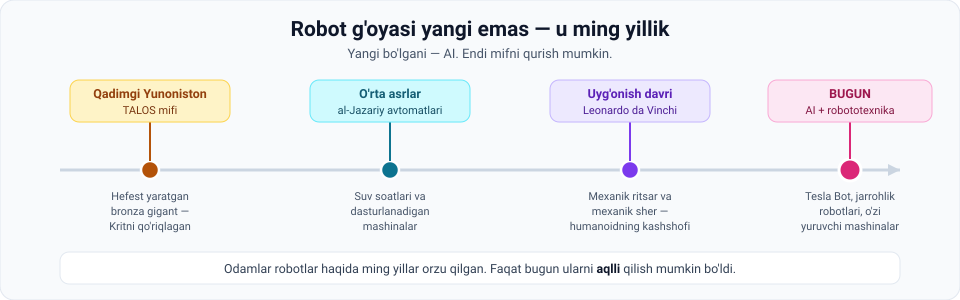
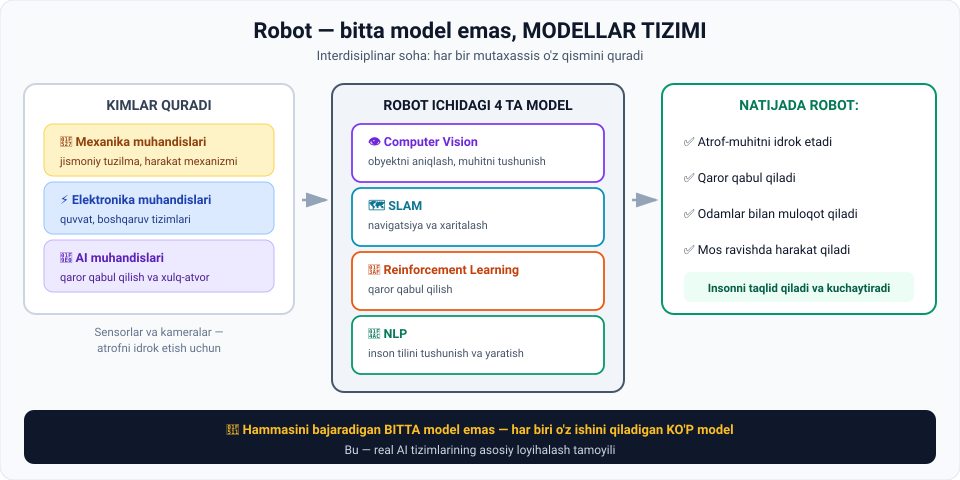

# 1-dars. Robototexnika (Robotics)

## 🎬 Boshlashdan oldin

Robot haqidagi birinchi hikoya **necha yoshda** deb o'ylaysiz?

50 yil? 100? **Ming yildan ortiq.**

Qadimgi yunonlar bronza gigant haqida hikoya qilishgan. Leonardo da Vinchi mexanik ritsar chizgan. Odamlar robot haqida **asrlar davomida** orzu qilishgan.

> **Unda bugun nima o'zgardi?**
>
> Javob bitta so'zda: **AI**. Tanani qurish har doim mumkin edi. Endi unga **miya** qo'yish mumkin bo'ldi.

---

## 1. Mexanik mavjudotlar tarixi

> **Mexanik mavjudotlar haqidagi ertaklar qadim zamonlarga borib taqaladi.**



### 1.1. Talos mifi — qadimgi Yunoniston

**Talos** — yunon ixtiro va temirchilik xudosi **Hefest** qurgan **ulkan bronza odam**. Uning vazifasi — **Krit orolini qo'riqlash**.

> Bu bronza siymo **kuniga uch marta** orolni patrul qilar va qirg'oqqa yaqinlashayotgan dushman kemalariga **toshlar otar** edi.

> 🛡 **Diqqat qiling:** bu — 3000 yil oldingi "avtonom xavfsizlik roboti" tavsifi. Patrul marshruti bor, tahdidni aniqlaydi, harakat qiladi.

### 1.2. O'rta asrlar — al-Jazariy

O'rta asr Yevropa va islom dunyosida **al-Jazariy avtomatlari** kabi qurilmalar — jumladan **suv soatlari** va **dasturlanadigan mashinalar** — dastlabki muhandislik mahoratini namoyish etdi.

> ⚙️ **"Dasturlanadigan"** so'ziga e'tibor bering. XII asrda. Kompyuterdan 800 yil oldin.

### 1.3. Uyg'onish davri — Leonardo da Vinchi

Italiya Uyg'onish davrining eng buyuk kashshoflaridan biri **Leonardo da Vinchi** quyidagilarning chizmalarini yaratdi:

- **Mexanik ritsar** — cheklangan harakatlarga qodir, **bugungi humanoid robotlarning kashshofi**
- **Mexanik sher**

### 1.4. Xulosa

> **Demak, robotlar va robototexnika sohasi g'oyasi yangi emas.** Odamlar ular bilan uzoq vaqtdan beri qiziqib kelishgan.
>
> Bu — oldingi avlodlar tasavvurini egallagan **haqiqiy pop-madaniyat fenomeni**.

### Bugun nima boshqacha?

> **Tez texnologik yutuqlar va asosan AI ning hayratlanarli o'sishi** biz ilgari faqat tasavvur qila oladigan va filmlarda tasvirlaydigan **aqlli mashinalarni yaratishni mumkin qilmoqda**.

---

## 2. Robototexnika ta'rifi

> **Robototexnika — bu robotlarni loyihalash, qurish, ishlatish va foydalanish bilan shug'ullanadigan texnologiya tarmog'i.**
>
> **Robotlar** — vazifalarni **avtomatik** yoki **insonga o'xshash qobiliyatlar** bilan bajara oladigan mashinalar.

---

## 3. 🔧 Interdisiplinar soha — kimlar qatnashadi



| Mutaxassis | Nima qiladi |
|---|---|
| 🔧 **Mexanika muhandislari** | Robotlarning **jismoniy tuzilmasini** qurish — loyihalash va qurish, jumladan **harakatlanish mexanizmlari** |
| ⚡ **Elektronika va elektr muhandislari** | Robotning **ishlashi va harakatlarini boshqarishi** ga imkon beruvchi tizimlarni loyihalash |
| 🧠 **AI ishlab chiquvchilari va muhandislari** | **Qaror qabul qilish va xulq-atvorni** boshqarish |

### Sensorlar

> Robotlar **turli sensorlar va kameralar** bilan jihozlangan — zarur ma'lumotni to'plash va **atrof-muhitni idrok etish** uchun.
>
> **Aynan shu yerda AI ishlab chiquvchilari va muhandislari ishga kirishadi.**

> **Bu chinakam interdisiplinar soha bir necha alohida yo'nalishda ixtisoslashgan ko'nikmalarni talab qiladi.**

---

## 4. 🔑 Eng muhim g'oya: ko'p model, bitta tizim

> Boshqa AI turlari kabi, robototexnika sohasi ham **inson qobiliyatlaridan ilhomlangan**. Robotlar insonning qobiliyatlarini **taqlid qilish va kuchaytirish** uchun loyihalanadi.

Buni amalga oshirish uchun tadqiqotchilar turli AI texnologiyalarini birlashtirgan **ko'p tarmoqli yondashuv**dan foydalanadilar.

> ### **Odatda biz hammasini bajaradigan BITTA model o'rniga, KO'P MODELLI tizimni ko'rib chiqishimiz kerak.**

### Avtonom robotning to'rtta moduli

| Model | Vazifasi |
|---|---|
| 👁 **Computer vision** | Obyektni aniqlash va muhitni tushunish |
| 🗺 **SLAM** *(Simultaneous Localization and Mapping)* | Navigatsiya va xaritalash |
| 🎯 **Reinforcement learning** | Qaror qabul qilish |
| 💬 **NLP model** | Inson tilini tushunish va yaratish |

> **Bu modellarning barchasini birlashtirish robotga imkon beradi:**
> **atrof-muhitni idrok etish · qaror qabul qilish · odamlar bilan muloqot qilish · mos ravishda harakat qilish.**

> 💡 **Nima uchun bu shunchalik muhim?** Bu — faqat robototexnika emas, **butun AI muhandisligining** asosiy tamoyili. Kurs oxirida quriladigan intervyu simulyatori ham xuddi shunday: bir necha model bir tizimda ishlaydi.

---

## 5. 🚀 Amaliy qo'llanish holatlari

### Tesla Bot

Elon Musk rahbarligida **Tesla** **Tesla Bot** ni quryapti — u **umumiy maqsadli robot-humanoid** deb ta'riflanadi.

> **Maqsad:** logistikada odamlarni **xavfli, takrorlanuvchi va zerikarli** vazifalardan xalos qiladigan robot yaratish.

Tesla bot nima qila oladi:
- Zavod va omborxona ishlari
- Qutilarni ko'chirish va taxlash
- Inventarni sanash va tekshirish
- Og'ir yuk ko'tarish

> **Va bu faqat Tesla emas.** Ko'plab kompaniyalar o'z avtonom robotlarini ishlab chiqmoqda va qimmatli tadqiqotlar bilan hissa qo'shmoqda.

### Tibbiy robotlar

> **Allaqachon ommaviy qabul bosqichida** bo'lgan hayratlanarli qo'llanish holati.
>
> Bu robotlar **nihoyatda aniq tibbiy aralashuvlar** va hatto **murakkab jarrohlik amaliyotlarini** bajara oladi — bu **hayotlarni saqlab qoladi**.

### Mainstream'ga aylanayotgan innovatsiyalar

| | |
|---|---|
| 🚗 O'zi yuruvchi mashinalar | 🌾 Hosil yig'uvchi robotlar |
| 🧹 Tozalash robotlari | 🚀 Kosmik robotlar |
| 🆘 Qidiruv-qutqaruv robotlari | 🛡 Xavfsizlik va kuzatuv robotlari |

> ### **Kelajak allaqachon shu yerda, va AI bu innovatsiyalarning barchasi oldingi safida.**

---

## 6. ⚡ Amaliy topshiriqlar

### 🟢 Oson — 7 daqiqa · **Qaysi modul ishlaydi?**

Robot quyidagi ishlarni qilyapti. Qaysi modul javobgar?

| № | Robot nima qilyapti | CV / SLAM / RL / NLP ? |
|---|---|---|
| 1 | "Salom, sizga qanday yordam beray?" deydi | |
| 2 | Oldindagi qutini payqaydi | |
| 3 | Omborning xaritasini tuzadi | |
| 4 | "Chapdan aylanib o'tsam tezroq" deb qaror qiladi | |
| 5 | Odam yuzini tanidi | |
| 6 | O'zining ombordagi joyini aniqlaydi | |
| 7 | Foydalanuvchi buyrug'ini tushunadi | |
| 8 | Ikki yo'ldan qaysi biri yaxshiroq — o'rganadi | |

<details>
<summary>✅ Javoblar</summary>

1. **NLP** · 2. **CV** · 3. **SLAM** · 4. **RL** · 5. **CV** · 6. **SLAM** · 7. **NLP** · 8. **RL**

**Naqsh:** *ko'rish* → CV · *qayerdaman* → SLAM · *nima qilay* → RL · *gapirish* → NLP

</details>

### 🟡 O'rta — 20 daqiqa · **O'z robotingizni loyihalang**

Bitta muammoni tanlang va robot loyihalang:

```
Muammo:                    ______________________________
Robot nima qiladi:         ______________________________

Kerak bo'ladigan modullar (kerakligini ✓ belgilang va NEGA yozing):
  [ ] Computer Vision  → nega: _______________________
  [ ] SLAM             → nega: _______________________
  [ ] Reinforcement L. → nega: _______________________
  [ ] NLP              → nega: _______________________

Qanday sensorlar kerak:    ______________________________
Eng katta texnik qiyinchilik: ___________________________
```

**G'oyalar:** paxta terimi · maktab koridorini tozalash · omborda inventar sanash · keksalarga dori eslatish · issiqxonada o'simlik kuzatish

> 💡 **Muhim savol:** har bir modul **rostdan kerakmi**? Ortiqcha modul — ortiqcha xarajat va nosozlik nuqtasi.

### 🔴 Qiyin — tadqiqot va muhokama · **Robot qaysi ishni olishi kerak?**

Tesla Bot maqsadi — odamlarni **xavfli, takrorlanuvchi va zerikarli** ishlardan xalos qilish.

```
1. O'z hududingizda shunday 5 ta kasbni sanang:
   a) ______________  b) ______________  c) ______________
   d) ______________  e) ______________

2. Ularning har biri uchun:
   • Robot bu ishni to'liq bajara oladimi?     ha / yo'q / qisman
   • Necha yil kerak bo'ladi?                  ______
   • Bu ishni qilayotgan odamlarga nima bo'ladi? ______

3. Sizning pozitsiyangiz (5 jumla):
   ________________________________________________
   ________________________________________________
```

> ⚖️ Bu — **AI Ethics** modulida (68–76-bo'limlar) chuqur ko'riladigan mavzu. Hozir shunchaki o'z fikringizni qayd eting.

---

## 7. 🧠 O'zini tekshirish savollari

1. Talos mifi nima haqida? Uni kim qurgan va vazifasi nima edi?
2. al-Jazariy qanday qurilmalar yaratgan?
3. Leonardo da Vinchi nimalarning chizmasini yaratgan?
4. Robototexnika ta'rifini ayting.
5. Robot qurishda qaysi **uchta** mutaxassislik ishtirok etadi?
6. Robotlar atrofni qanday idrok etadi?
7. Avtonom robotdagi **to'rtta model** qaysi va har biri nima qiladi?
8. Tesla Bot ning maqsadi nima?
9. Qaysi robot turi allaqachon ommaviy qabul bosqichida?

<details>
<summary>✅ Javoblar</summary>

1. **Hefest** (yunon ixtiro va temirchilik xudosi) qurgan **ulkan bronza odam**; vazifasi — **Kritni qo'riqlash**, kuniga uch marta patrul qilib, dushman kemalariga tosh otish.
2. **Suv soatlari** va **dasturlanadigan mashinalar** kabi avtomatlar.
3. **Mexanik ritsar** (cheklangan harakatlarga qodir, humanoidlarning kashshofi) va **mexanik sher**.
4. Robotlarni **loyihalash, qurish, ishlatish va foydalanish** bilan shug'ullanuvchi texnologiya tarmog'i.
5. **Mexanika**, **elektronika/elektr** va **AI** muhandislari.
6. **Sensorlar va kameralar** orqali.
7. **Computer vision** (obyekt va muhit), **SLAM** (navigatsiya va xaritalash), **Reinforcement learning** (qaror), **NLP** (til).
8. Logistikada odamlarni **xavfli, takrorlanuvchi va zerikarli** vazifalardan xalos qilish.
9. **Tibbiy robotlar** — aniq aralashuvlar va murakkab jarrohliklar.

</details>

---

## 📌 Xulosa

```
Ming yillik ORZU  (Talos → al-Jazariy → da Vinchi)
        +
Bugungi AI
        =
AQLLI MASHINA

Robot = mexanika + elektronika + AI
      = CV + SLAM + RL + NLP  (bitta model emas!)
```

---

## 🔖 Atamalar

| Atama | Inglizcha | Izoh |
|---|---|---|
| Robototexnika | *robotics* | Robotlarni loyihalash va ishlatish sohasi |
| Avtomat | *automaton* | Avtomatik harakatlanuvchi qadimiy mexanizm |
| Humanoid | *humanoid* | Insonga o'xshash robot |
| Interdisiplinar | *interdisciplinary* | Bir necha sohani birlashtiruvchi |
| SLAM | *Simultaneous Localization and Mapping* | Bir vaqtda joylashuvni aniqlash va xaritalash |
| Avtonom | *autonomous* | Mustaqil ishlaydigan |
| Ommaviy qabul | *mass adoption* | Keng tarqalgan foydalanish bosqichi |

---

🏠 [Modul boshiga](README.md) · ➡️ [Keyingi: Computer Vision](02-Computer-vision.md)
