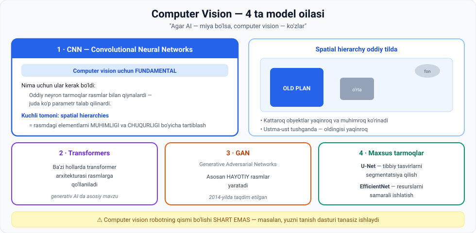

# 2-dars. Computer Vision

## 🎬 Boshlashdan oldin

Telefoningizni oling va kameraga qarang. **Face ID ochildi.**

Bu bir soniyada nima bo'ldi?

```
kamera → millionlab piksel → chekkalar → shakllar → yuz belgilari → "bu — egasi"
```

> Va bularning hammasi **~0.5 soniyada**, telefoningiz ichida, internetsiz.
>
> Bu dars — kompyuter **qanday ko'rishini** tushuntiradi.

---

## 1. Ta'rif

**IBM computer vision'ni shunday ta'riflaydi:**

> **Kompyuterlarni raqamli tasvirlar va videolardan MA'NOLI AXBOROT chiqarishga o'rgatish uchun machine learning va neyron tarmoqlardan foydalanadigan AI sohasi.**

### 🧠 Asosiy analogiya

> ## **Agar AI — miya vazifasini bajarsa, computer vision — KO'ZLAR.**

### Inson bilan taqqoslash

Odam sifatida biz atrof-muhitni **barcha nozikliklari bilan bemalol** tushunamiz:

- Harakatlanuvchi obyektlarni ajratamiz
- O'zgaruvchan shakllarni farqlaymiz
- Turli ranglarni ko'ramiz
- Ba'zan **eng kichik farq** va **eng nozik tafsilotlarni** payqaymiz

> **Computer vision — kompyuterlarga real dunyo axborotini tushunish imkonini beruvchi murakkab AI modellarini ishlab chiqish bo'yicha ulkan sa'y-harakat.**

---

## 2. Kompyuter nimani "iste'mol qiladi"

| Turi | Murakkabligi | Nima uchun |
|---|---|---|
| 🖼 **Tasvirlar** | **Oddiyroq** | Bitta lahzani **statik** holda qamrab oladi |
| 🎬 **Videolar** | **Murakkabroq** | **Uzluksiz tasvirlar ketma-ketligi** — masalan **30 kadr/soniya** |

> Video holatida kompyuter **har bir kadrni tahlil qilishi** va uning **kontekstini hamda uzluksizligini** tushunishi kerak.

> 📊 **Hisoblab ko'ring:** 1 daqiqalik 30 fps video = **1800 ta rasm**. Har biri Full HD bo'lsa — **3.6 milliard piksel**. Va buni **real vaqtda** qayta ishlash kerak.
>
> *(02-moduldagi "video — bu minglab rasm" jumlasini eslang. Endi u aniq raqamga aylandi.)*

---

## 3. To'rtta model oilasi



---

### 3.1. CNN — Convolutional Neural Networks

> **CNN lar computer vision uchun FUNDAMENTAL, chunki ular yuqori o'lchamli ma'lumot bilan ishlashda ajoyib.**

#### Nima uchun ular kerak bo'ldi?

> Dastlabki davrlarda AI tadqiqotchilari computer vision masalalari uchun **boshqa turdagi neyron tarmoqlardan** foydalanardilar.
>
> Ammo ular **yuqori o'lchamli ma'lumot — tasvirlar** bilan qiynalardi, chunki **juda katta miqdordagi parametr** talab qilinardi.

> 🔢 **Nega parametr ko'p?** 03-moduldagi ANN ni eslang: har bir tugun keyingi qatlamning **har bir** tuguniga bog'langan.
>
> ```
> MNIST (28×28 = 784 px)  →  1000 tugunli qatlam  =  784 000 ta weight
> Full HD (1920×1080 ≈ 2 mln px)  →  1000 tugun  =  2 MILLIARD weight
> ```
>
> Bu — hisoblab bo'lmaydigan miqdor. **CNN aynan shu muammoni yechadi.**

#### CNN ning kuchli tomoni: spatial hierarchies

> **CNN lar tasvirlardagi spatial hierarchies (fazoviy ierarxiyalar) ni qamrab olishda ajoyib.**

**Bu oddiy tilda nimani anglatadi?**

> **CNN lar tasvirdagi elementlarni ularning MUHIMLIGI va CHUQURLIGI bo'yicha tashkil qilishda ajoyib.**

Tasavvur qiling — rasmga qaraysiz:

| Plan | Tavsifi |
|---|---|
| **Old plan** *(foreground)* | Yaqin |
| **O'rta plan** *(middle ground)* | Oraliqda |
| **Fon** *(background)* | Uzoqda |

**Qoidalar, ma'ruzadan:**

- **Kattaroq obyektlar** ko'pincha **yaqinroq va muhimroq** ko'rinadi
- **Ustma-ust tushgan** narsalarda — **oldingisi yaqinroq** ko'rinadi
- **Markazda** yoki **yuqorida** joylashgan elementlar odatda **ko'proq diqqat tortadi**, bu ularning muhimligini oshiradi

#### Qatlamli tuzilma

> **CNN lar axborotni samarali qayta ishlashda samarali — bu ularning QATLAMLI TUZILMASI tufayli.**
>
> Bu tarmoqqa **dastlabki qatlamlarda** obyekt **chekkalari** kabi asosiy belgilarni o'rganish, va **chuqurroq qatlamlarda** bosqichma-bosqich **shakllar va obyektlar** kabi murakkab, yuqori darajadagi belgilarni qamrab olish imkonini beradi.

> 🔗 **Bu — 03-moduldagi aynan o'sha g'oya:** chekka → shakl → obyekt. Endi u nomga ega: **CNN**.

---

### 3.2. Transformers

> Keyingi — **Transformers**, generativ AI bo'yicha keyingi muhokamalarimizdagi **kalit mavzu**.
>
> Hozircha shuni aytishimiz mumkin: ba'zi hollarda AI tadqiqotchilari **computer vision maqsadida transformer arxitekturasini tasvirlarga qo'llaydilar**.

*(Transformer haqida to'liq — 05-modulda va LLM modulida.)*

---

### 3.3. GAN — Generative Adversarial Networks

> **GAN lar asosan HAYOTIY (life-like) tasvirlar yaratadi.**

*(Batafsil — shu modulning 4-darsida.)*

---

### 3.4. Maxsus tarmoqlar

| Model | Nimada kuchli |
|---|---|
| **U-Net** | **Tibbiy tasvir segmentatsiyasi** |
| **EfficientNet** | Neyron tarmoq o'lchamlarini samarali masshtablash va **hisoblash resurslarini optimal ishlatish** orqali unumdorlikni oshiradi |

---

## 4. 💻 Amaliyot: CNN ning yuragini o'z qo'lingiz bilan ishlating

Hech narsa o'rnatmasdan ishlaydi. Bu — **konvolyutsiya**, ya'ni CNN dagi "C" harfi.

```python
# 8x8 "rasm": chap yarmi qorong'i, o'ng yarmi yorug'
RASM = [
    [10, 10, 10, 10, 240, 240, 240, 240],
    [10, 10, 10, 10, 240, 240, 240, 240],
    [10, 10, 10, 10, 240, 240, 240, 240],
    [10, 10, 10, 10, 240, 240, 240, 240],
    [10, 10, 10, 10, 240, 240, 240, 240],
    [10, 10, 10, 10, 240, 240, 240, 240],
    [10, 10, 10, 10, 240, 240, 240, 240],
    [10, 10, 10, 10, 240, 240, 240, 240],
]

# Sobel kerneli - vertikal chekkalarni topadi
KERNEL_VERTIKAL = [[-1, 0, 1],
                   [-2, 0, 2],
                   [-1, 0, 1]]

def konvolyutsiya(rasm, kernel):
    """Kernelni rasm ustida sirg'antirib chiqamiz - CNN aynan shuni qiladi."""
    h, w = len(rasm), len(rasm[0])
    k = len(kernel)
    r = k // 2
    natija = []
    for y in range(r, h - r):
        qator = []
        for x in range(r, w - r):
            s = 0
            for ky in range(k):
                for kx in range(k):
                    s += rasm[y - r + ky][x - r + kx] * kernel[ky][kx]
            qator.append(s)
        natija.append(qator)
    return natija

def chiz(sarlavha, matritsa, chegara):
    print(f"\n{sarlavha}")
    for qator in matritsa:
        print("  " + "".join("##" if abs(p) > chegara else ".." for p in qator))

chiz("1. ASL RASM (chap - qorong'i, o'ng - yorug')", RASM, 128)

natija = konvolyutsiya(RASM, KERNEL_VERTIKAL)
chiz("2. KONVOLYUTSIYADAN KEYIN (## = chekka topildi)", natija, 100)

print("\n3. RAQAMLAR (natija matritsasi):")
for qator in natija:
    print("  " + " ".join(f"{p:5d}" for p in qator))
print("\n  Nol = tekis joy. Katta son = CHEKKA (edge).")
```

### Haqiqiy natija

```
1. ASL RASM (chap - qorong'i, o'ng - yorug')
  ........########
  ........########
  ........########
  ........########
  ........########
  ........########
  ........########
  ........########

2. KONVOLYUTSIYADAN KEYIN (## = chekka topildi)
  ....####....
  ....####....
  ....####....
  ....####....
  ....####....
  ....####....

3. RAQAMLAR (natija matritsasi):
      0     0   920   920     0     0
      0     0   920   920     0     0
      0     0   920   920     0     0
      0     0   920   920     0     0
      0     0   920   920     0     0
      0     0   920   920     0     0

  Nol = tekis joy. Katta son = CHEKKA (edge).
```

### 🔑 Nima sodir bo'ldi?

**1. Kernel — bu kichik oyna.**
`3×3` matritsa rasm ustida **sirg'anib** chiqadi va har bir joyda bitta son beradi.

**2. Natijaga qarang: model chekkani ANIQ topdi.**
Faqat qorong'i va yorug' chegarasida `920` chiqdi. Tekis joylarda — `0`.

**3. Nima uchun bu CNN ni tejaydi?**

```
Oddiy ANN:  har bir piksel → har bir tugun  =  MILLIARDLAB weight
CNN:        bitta 3×3 kernel butun rasm bo'ylab qayta ishlatiladi  =  9 ta weight
```

> 💰 **Mana shu — CNN ning butun sirri.** Bitta kernel **butun rasm bo'ylab qayta ishlatiladi**. Chekka rasmning chap burchagida ham, o'ng burchagida ham bir xil ko'rinadi — demak, uni topish uchun bir xil 9 ta son yetadi.

**4. CNN da bunday kernellar yuzlab bor** — va model ularni **o'zi o'rganadi**, biz yozib bermaymiz.

---

## 5. 🌍 Real dunyodagi qo'llanishlar

> **Computer vision juda ko'p qiziqarli real qo'llanishlarga ega:**

| Soha | Misol |
|---|---|
| 🚗 **O'zi yuruvchi mashinalar** | Yo'l belgilari, piyodalar, yo'lak chiziqlari |
| 🏥 **Tibbiy tasvirlash** | Rentgen, MRT tahlili |
| 🛡 **Xavfsizlik va kuzatuv** | Shubhali harakatni aniqlash |
| 🤖 **Robototexnika** | 1-darsni eslang — CV robotning "ko'zi" |

### ⚠️ Muhim eslatma

> **Computer vision nihoyatda foydali mahsulot bo'lishi uchun robototexnikaning qismi bo'lishi SHART EMAS.**
>
> Masalan, **yuzni tanish dasturi** — bu shunchaki dasturiy mahsulotga o'rnatilgan model, **robot tanasisiz**.

### Eng qiziqarli yo'nalish: VR

> Computer vision'dagi eng hayajonli yutuqlardan ba'zilari hozirda **virtual reallik** sohasida — u quyidagi tarmoqlarda inqilob qilmoqda:
>
> **ta'lim · o'yin-kulgi · masofaviy muloqot**

---

## 6. ⚡ Amaliy topshiriqlar

### 🟢 Oson — 7 daqiqa · **Spatial hierarchy ni sinang**

Istalgan fotosuratni oching (telefoningizdan) va aniqlang:

```
Old planda nima:      ______________________________
O'rta planda nima:    ______________________________
Fonda nima:           ______________________________

Sizning ko'zingiz BIRINCHI navbatda nimaga tushdi? ____________
NEGA aynan unga? (kattaligi / markazda / ustma-ust / rangi) ____________
```

**Savol:** siz bu qarorni **ongli ravishda** qabul qildingizmi? CNN ham xuddi shu qoidalarni **o'rganadi**.

### 🟡 O'rta — 25 daqiqa · **Kernellar bilan tajriba**

Yuqoridagi kodni ishga tushiring, so'ng:

1. **Gorizontal chekka detektori** qo'shing:
   ```python
   KERNEL_GORIZONTAL = [[-1, -2, -1],
                        [ 0,  0,  0],
                        [ 1,  2,  1]]
   ```
   Vertikal chegarali rasmda u nima ko'rsatadi? **Nega?**

2. Rasmni **gorizontal chegarali** qilib o'zgartiring (yuqori yarmi qorong'i, pastki yarmi yorug'). Ikkala kernelni sinang.

3. **Blur (xiralashtirish) kerneli**ni sinab ko'ring:
   ```python
   KERNEL_BLUR = [[1/9, 1/9, 1/9],
                  [1/9, 1/9, 1/9],
                  [1/9, 1/9, 1/9]]
   ```
   Natija nima uchun boshqacha?

4. Bir jumlada yozing: **kernel ichidagi sonlar** natijani qanday belgilaydi?

### 🔴 Qiyin — mini-loyiha · **O'z detektoringiz**

**Diagonal chiziq** detektorini yarating:

```python
RASM_DIAGONAL = [
    [240,  10,  10,  10,  10],
    [ 10, 240,  10,  10,  10],
    [ 10,  10, 240,  10,  10],
    [ 10,  10,  10, 240,  10],
    [ 10,  10,  10,  10, 240],
]
KERNEL_DIAGONAL = [[?, ?, ?],
                   [?, ?, ?],
                   [?, ?, ?]]
```

**Shart:** diagonal chiziqda natija **maksimal**, tekis joyda **nolga yaqin** bo'lsin.

Ishlagach javob bering:
1. Kernelni topish qancha urinish oldi?
2. Endi tasavvur qiling: CNN da **yuzlab** kernel bor va model ularni **o'zi topadi**. Bu nima uchun revolyutsion?

---

## 7. 🧠 O'zini tekshirish savollari

1. IBM computer vision'ni qanday ta'riflaydi?
2. Asosiy analogiyani ayting: AI — bu ..., computer vision — bu ...
3. Tasvir va video — qaysi biri murakkabroq va nima uchun?
4. To'rtta CV model oilasini sanang.
5. Nima uchun oddiy neyron tarmoqlar tasvirlar bilan qiynalgan?
6. **Spatial hierarchies** oddiy tilda nimani anglatadi?
7. Rasmda nima yaqinroq va muhimroq ko'rinishining 3 ta qoidasini ayting.
8. CNN ning qatlamli tuzilmasi nima beradi?
9. U-Net va EfficientNet nimada ixtisoslashgan?
10. Computer vision robotning qismi bo'lishi shartmi? Misol keltiring.

<details>
<summary>✅ Javoblar</summary>

1. Kompyuterlarni **raqamli tasvir va videolardan ma'noli axborot chiqarishga** o'rgatish uchun **ML va neyron tarmoqlardan** foydalanadigan AI sohasi.
2. AI — **miya**, computer vision — **ko'zlar**.
3. **Video** murakkabroq — u **uzluksiz tasvirlar ketma-ketligi** (masalan 30 fps); har bir kadrni tahlil qilish va **kontekst hamda uzluksizlikni** tushunish kerak.
4. **CNN**, **Transformers**, **GAN**, **maxsus tarmoqlar** (U-Net, EfficientNet).
5. Ular **yuqori o'lchamli ma'lumot — tasvirlar** bilan qiynalardi, chunki **juda katta miqdordagi parametr** talab qilinardi.
6. Tasvirdagi elementlarni **muhimligi va chuqurligi** bo'yicha tashkil qilish (old plan / o'rta plan / fon).
7. **Kattaroq** obyektlar yaqinroq; **ustma-ust** tushganda oldingisi yaqinroq; **markaz yoki yuqoridagi** elementlar ko'proq diqqat tortadi.
8. Dastlabki qatlamlarda **chekkalar** kabi asosiy belgilarni, chuqurroq qatlamlarda **shakl va obyektlar** kabi murakkab belgilarni o'rganish.
9. **U-Net** — tibbiy tasvir segmentatsiyasi; **EfficientNet** — tarmoq o'lchamlarini samarali masshtablash va resurslarni optimal ishlatish.
10. **Yo'q, shart emas.** Misol: **yuzni tanish dasturi** — robot tanasisiz, shunchaki dasturga o'rnatilgan model.

</details>

---

## 📌 Xulosa

```
Tasvir / video  (piksellar)
        ↓
   KERNEL sirg'anadi  (konvolyutsiya)
        ↓
Dastlabki qatlamlar  →  chekkalar
        ↓
Chuqur qatlamlar     →  shakllar va obyektlar
        ↓
   MA'NOLI AXBOROT

Spatial hierarchy: old plan · o'rta plan · fon
```

> **Bitta jumlada:** CNN bitta kichik oynani (kernel) butun rasm bo'ylab qayta ishlatib, milliardlab parametr o'rniga o'nlab parametr bilan ishlaydi.

---

## 🔖 Atamalar

| Atama | Inglizcha | Izoh |
|---|---|---|
| Computer vision | *computer vision* | Rasm va videodan ma'no chiqarish sohasi |
| CNN | *Convolutional Neural Network* | Konvolyutsion neyron tarmoq |
| Konvolyutsiya | *convolution* | Kernelni rasm ustida sirg'antirish amali |
| Kernel / Filtr | *kernel / filter* | Kichik og'irliklar matritsasi |
| Fazoviy ierarxiya | *spatial hierarchy* | Elementlarni muhimlik va chuqurlik bo'yicha tartiblash |
| Old plan / fon | *foreground / background* | Yaqin / uzoq qism |
| Yuqori o'lchamli | *high-dimensional* | Juda ko'p belgiga ega ma'lumot |
| Kadr | *frame* | Videodagi bitta tasvir |
| Segmentatsiya | *segmentation* | Tasvirni ma'noli qismlarga ajratish |
| GAN | *Generative Adversarial Network* | Hayotiy tasvirlar yaratuvchi model |

---

⬅️ [Oldingi: Robototexnika](01-Robotics.md) · ➡️ [Keyingi: An'anaviy ML](03-Traditional-ML.md)
