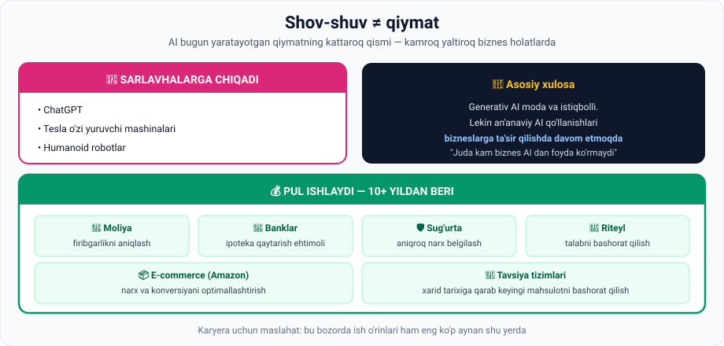

# 3-dars. An'anaviy Machine Learning

## 🎬 Boshlashdan oldin

Bir savol: **AI bugun eng ko'p pulni qayerda ishlab beryapti?**

Ko'pchilik javob beradi: ChatGPT, robotlar, o'zi yuruvchi mashinalar.

> **Noto'g'ri.**
>
> Bu dars — kursning eng qisqa, lekin **karyera uchun eng amaliy** darslaridan biri.

---

## 1. Asosiy g'oya

> **ChatGPT, Tesla ning o'zi yuruvchi mashinalari va robotlari kabi mahsulotlar SARLAVHALARGA chiqadi.**
>
> **Ammo shuni eslashimiz kerakki, bugun AI yaratayotgan qiymatning KATTAROQ QISMI kamroq yaltiroq biznes holatlari bilan bog'liq.**



---

## 2. Real biznes qo'llanishlari

Ma'ruza aniq misollarni sanaydi:

### 🏦 Moliya institutlari

Machine learning'dan foydalanadilar:

| Vazifa | Nima qiladi |
|---|---|
| **Firibgarlikni aniqlash** | Shubhali tranzaksiyani real vaqtda belgilash |
| **Ipoteka bashorati** | Mijozning qarzni **qaytarish ehtimolini** hisoblash |

> 💳 **Bu sizga ham tegishli:** kartangizdan g'ayrioddiy joyda pul yechilsa, bank darrov SMS yuboradi — bu **ML modeli** ishlagani.

### 🛡 Sug'urta kompaniyalari

> ML dan **hayot va nohayot sug'urta paketlari uchun aniqroq narx belgilash**da foydalanadilar.

### 🛒 Riteyl kompaniyalari

> Machine learning **talabni bashorat qilish** va **buyurtmalarni optimallashtirish** imkonini beradi.

> 📦 Natijada: do'konda kerakli mahsulot bor, ortiqchasi omborda chirimaydi. Bu — **to'g'ridan-to'g'ri pul**.

### 📦 E-commerce gigantlari

**Amazon** kabi kompaniyalar ML algoritmlari orqali:

- **Narx** va **konversiyani** optimallashtiradi
- **Oldingi xarid tarixiga** asoslanib, siz **keyingi qanday mahsulot sotib olishingizni** bashorat qiladi

> **Ro'yxat davom etaveradi.**

---

## 3. 🔑 Ikkita muhim xulosa

### Xulosa 1 — bu yangi emas

> **Bu va boshqa ko'plab qo'llanish holatlari O'N YILDAN ORTIQ vaqtdan beri mavjud.**

Ya'ni: ChatGPT paydo bo'lishidan **ancha oldin** AI allaqachon iqtisodiyotning ichida ishlab turgan edi.

### Xulosa 2 — bu deyarli hammaga tegishli

> ## **Juda kam biznes AI dan foyda ko'rmaydi.**

### Yakuniy jumla

> **Shuni eslashimiz kerakki, generativ AI moda va istiqbolli bo'lsa-da, men aytib o'tgan AN'ANAVIY AI qo'llanishlari bizneslarga ta'sir qilishda va sezilarli qiymat yetkazishda DAVOM ETMOQDA.**

---

## 4. 💼 Nima uchun bu karyera uchun muhim

Ma'ruzada bu aytilmagan, lekin xulosa aniq:

| | Generativ AI | An'anaviy ML |
|---|---|---|
| **Shov-shuv** | Juda yuqori | Past |
| **Raqobat** | Juda kuchli | O'rtacha |
| **Ish o'rinlari soni** | Kamroq | **Ko'proq** |
| **Kirish darajasi** | Yuqori | **Qulayroq** |
| **Biznes tayyorligi** | Ko'p kompaniya hali sinovda | **10+ yillik amaliyot** |

> 🎯 **Amaliy maslahat:** birinchi ishni topish uchun *"ChatGPT bilan chatbot qildim"* dan ko'ra *"bank tranzaksiyalarida firibgarlikni 87% aniqlik bilan topadigan model qurdim"* kuchliroq argument.
>
> Va ikkinchisi uchun kerak bo'ladigan hamma narsa — 03-modulda o'rgangan **supervised learning**.

---

## 5. ⚡ Amaliy topshiriqlar

### 🟢 Oson — 7 daqiqa · **Atrofingizdagi an'anaviy ML**

Bugun siz duch kelgan **5 ta** an'anaviy ML holatini toping:

| № | Qayerda | Qanday ML vazifa? (classification / regression / clustering) |
|---|---|---|
| 1 | | |
| 2 | | |
| 3 | | |
| 4 | | |
| 5 | | |

<details>
<summary>💡 Ilgak — qayerlarga qarash kerak</summary>

- Email papkasi (spam filtri) → **classification**
- Bank SMS (shubhali tranzaksiya) → **classification**
- Onlayn do'kon tavsiyasi → **classification / clustering**
- Navigator "10 daqiqada yetasiz" → **regression**
- Telefon klaviaturasi keyingi so'zni taklif qiladi → **classification**
- Ob-havo ilovasi harorat prognozi → **regression**
- Reklama sizga aynan shu mahsulotni ko'rsatadi → **classification**

</details>

### 🟡 O'rta — 25 daqiqa · **Biznes holatini loyihalang**

O'zbekistondagi bitta real biznesni tanlang (do'kon, taksi xizmati, kafe, klinika, o'quv markazi) va ML loyihasini yozing:

```
Biznes:                       ______________________________

1. Qanday MUAMMO bor?
   ______________________________________________

2. Qanday MA'LUMOT mavjud?  (02-modulni eslang!)
   • Turi (structured/unstructured): ______________
   • Belgilanganmi (labelled)?       ______________
   • Qancha bor?                     ______________

3. Qanday ML vazifa?
   [ ] Classification   [ ] Regression   [ ] Clustering

4. Model nimani bashorat qiladi?
   X (input) = ______________________________
   Y (output) = _____________________________

5. Biznes buni ishlatib QANCHA tejaydi yoki topadi?
   ______________________________________________
```

> 💡 5-savol — eng muhimi. Data scientist **model** emas, **qiymat** sotadi.

### 🔴 Qiyin — tadqiqot · **Ish bozorini o'rganing**

1. hh.uz, LinkedIn yoki boshqa saytga kiring.
2. **"Data Scientist"**, **"ML Engineer"**, **"Data Analyst"** bo'yicha e'lonlarni qidiring.
3. **10 ta e'lonni** ko'rib chiqing va sanang:

| Vazifa turi | Nechta e'londa uchradi |
|---|---|
| Bashorat / prognoz (regression) | |
| Klassifikatsiya (fraud, churn, spam) | |
| Tavsiya tizimi | |
| Computer vision | |
| **LLM / generativ AI** | |

**Xulosa savoli:** ma'ruzaning fikri tasdiqlandimi? Bozorda nima ko'proq talab qilinadi?

---

## 6. 🧠 O'zini tekshirish savollari

1. Qaysi AI mahsulotlari sarlavhalarga chiqadi?
2. Ma'ruzaning asosiy fikri nima?
3. Moliya institutlari ML dan qanday ikki maqsadda foydalanadi?
4. Sug'urta kompaniyalari uchun ML nima beradi?
5. Riteyl kompaniyalari ML bilan nima qiladi?
6. Amazon ML ni qanday ishlatadi?
7. Bu qo'llanish holatlari qancha vaqtdan beri mavjud?
8. Yakuniy xulosa nima?

<details>
<summary>✅ Javoblar</summary>

1. **ChatGPT**, **Tesla ning o'zi yuruvchi mashinalari** va **robotlari**.
2. AI bugun yaratayotgan qiymatning **kattaroq qismi** — **kamroq yaltiroq biznes holatlari** bilan bog'liq.
3. **Firibgarlik faoliyatini aniqlash** va mijozning **ipotekani qaytarish ehtimolini bashorat qilish**.
4. **Hayot va nohayot sug'urta paketlari uchun aniqroq narx belgilash**.
5. **Talabni bashorat qilish** va **buyurtmalarni optimallashtirish**.
6. **Narx va konversiyani optimallashtirish**; **oldingi xarid tarixi** asosida keyingi mahsulotni bashorat qilish.
7. **O'n yildan ortiq.**
8. Generativ AI moda va istiqbolli bo'lsa-da, **an'anaviy AI qo'llanishlari bizneslarga ta'sir qilishda va sezilarli qiymat yetkazishda davom etmoqda**. **Juda kam biznes AI dan foyda ko'rmaydi.**

</details>

---

## 📌 Xulosa

```
   SHOV-SHUV                        QIYMAT
   ─────────                        ──────
   ChatGPT                          firibgarlikni aniqlash
   o'zi yuruvchi mashinalar   VS    kredit skoring
   humanoid robotlar                talab prognozi
                                    narx optimizatsiyasi
                                    tavsiya tizimlari

   yangi, sinovda                   10+ yil, ishlab turibdi
```

> **Bitta jumlada:** eng shov-shuvli AI va eng ko'p pul ishlab beradigan AI — bu ikki xil narsa.

---

## 🔖 Atamalar

| Atama | Inglizcha | Izoh |
|---|---|---|
| An'anaviy ML | *traditional ML* | Klassik biznes ML qo'llanishlari |
| Firibgarlikni aniqlash | *fraud detection* | Shubhali tranzaksiyani topish |
| Kredit skoring | *credit scoring* | Qarz qaytarish ehtimolini baholash |
| Talab prognozi | *demand forecasting* | Kelajakdagi savdo hajmini bashorat qilish |
| Konversiya | *conversion* | Tashrif buyuruvchining xaridorga aylanishi |
| Qiymat yetkazish | *deliver value* | Biznesga real foyda keltirish |

---

⬅️ [Oldingi: Computer Vision](02-Computer-vision.md) · ➡️ [Keyingi: Generativ AI](04-Generative-AI.md)
