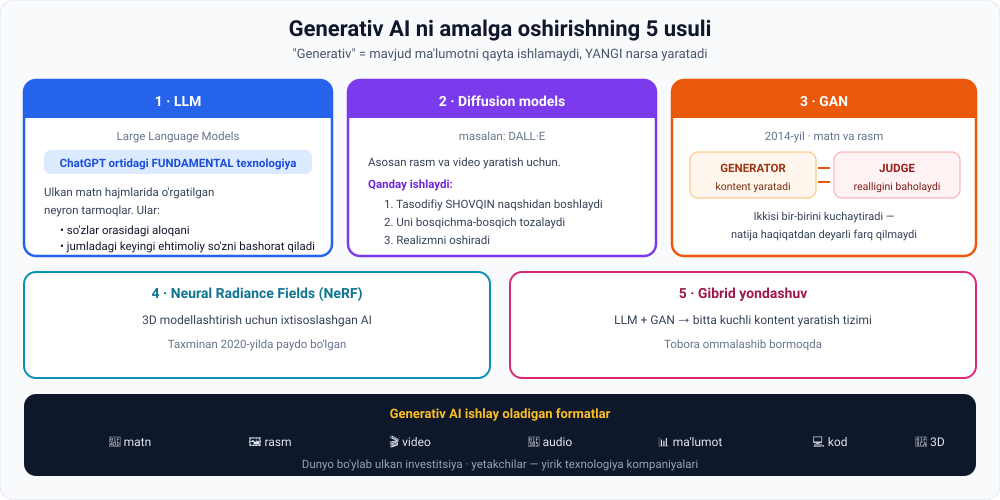

# 4-dars. Generativ AI

> **Modul:** 04. Intro to AI — Important AI branches · **Manba:** `4. Generative AI.vtt`
> ⏱ **O'qish vaqti:** ~16 daqiqa · 🎯 **Daraja:** boshlang'ich · 💻 **Python amaliyoti bor**

---

## 🎬 Boshlashdan oldin

ChatGPT'ga bir savol bering va javobni ko'chirib oling. Endi **aynan o'sha savolni** yangi chatda qayta bering.

**Javob boshqacha bo'ladi.**

> Bu — xato emas. Bu — **butun mavzuning mohiyati**.
>
> ChatGPT javobni **bazadan olmaydi**. U uni **har safar yangidan yaratadi**. Aynan shuning uchun u **generativ** deb ataladi.

---

## 1. "Generativ" so'zining ma'nosi

> **ChatGPT chiqarilishi bilanoq global fenomenga aylandi** va AI ning ilg'or kelajakdagi salohiyati haqida keng qiziqish uyg'otdi.
>
> **ChatGPT kabi ta'sirchan modellar ortidagi AI tarmog'i GENERATIV AI deb ataladi.**

### Nima uchun "generativ"?

> **Generativ — chunki u YANGI ma'lumot yoki kontent yarata oladi.**
>
> **"Generativ" so'zi tizimning mavjud ma'lumotni QAYTA ISHLASH emas, YANGI narsa YARATISH qobiliyatini ta'kidlaydi.**

### Ikkita misol

| Model | Nima qiladi |
|---|---|
| **ChatGPT** | Har bir suhbat **ochiq**. Katta matn ma'lumotida o'rgatilgan model **yangi va noyob real vaqt javoblarini** generatsiya qiladi |
| **DALL·E** *(OpenAI ning rasm yaratish modeli)* | Batafsil tavsif bersangiz, u sizning talablaringizga moslashtirilgan **noyob rasm** yaratadi |

> ### **Bu generativ AI ning asosiy qobiliyatini ko'rsatadi:**
> ### **o'quv ma'lumotidan o'rganilgan NAQSHLARDAN foydalanib YANGI kontent ishlab chiqarish.**

Bu — bu modellarning **umumiy xususiyati**.

---

## 2. Generativ AI ga erishishning 5 usuli



> **AI ishlab chiquvchilari generativ AI ga erishish uchun bir necha turli texnikadan foydalanishlari mumkin.**

---

### 2.1. LLM — Large Language Models

> **Large language models yoki LLM lar — ChatGPT ortidagi FUNDAMENTAL texnologiya.**

**Ta'rif:**

> **LLM lar — ulkan matn hajmlarida o'rgatilgan neyron tarmoqlar.** Ular quyidagilarni bashorat qilishni o'rganadilar:
> - **so'zlar orasidagi aloqalarni**
> - **jumladagi keyingi ehtimoliy so'zni**

> 📚 **Ma'ruzachi shuni ta'kidlaydi:** bu muhim texnologiyaning ishlashi va kelib chiqishini tushunish uchun **kursning keyingi ikkita bo'limi** unga batafsil kirish uchun ajratilgan.
>
> *(Ya'ni — 05-modul va LLM moduli.)*

---

### 2.2. Diffusion models

> **DALL·E kabi diffusion modellar — asosan rasm va video generatsiya qilish uchun ishlatiladigan ilg'or AI vositalari.**

**Qanday ishlaydi:**

```
1. Tasodifiy SHOVQIN naqshidan boshlanadi
        ↓
2. Uni bosqichma-bosqich batafsil rasmga aylantiradi
        ↓
3. So'ralgan shakllar va o'rganilgan naqshlarni
   ko'p bosqichda qo'llab, realizmni oshiradi
```

> 🌫 **Analogiya:** tuman ichidan asta-sekin chiqib kelayotgan rasm. Boshida — faqat shovqin. Har bir qadamda biroz aniqroq. 50 qadamdan keyin — tayyor surat.

---

### 2.3. GAN — Generative Adversarial Networks

> **2014-yilda taqdim etilgan GAN lar odatda matn va rasm generatsiya qilish uchun ishlatiladi.**

**Qanday ishlaydi:**

> **GAN lar IKKITA algoritmni taqqoslash orqali ishlaydi:**
>
> - **Biri kontent yaratadi** (generator)
> - **Ikkinchisi uning realligini baholaydi** (judge)
>
> **Bu o'zaro ta'sir orqali ikkala algoritm ham o'z qobiliyatlarini oshiradi** va kontentni **haqiqatdan deyarli farq qilmaydigan** darajaga yetkazadi.

> 🥊 **Analogiya:** qalbaki pul yasovchi va tergovchi. Tergovchi qalbakini tanigan sari, yasovchi yaxshiroq qilishga majbur. Yasovchi yaxshilangan sari, tergovchi o'tkirroq bo'ladi. Ikkalasi bir-birini **majburan** kuchaytiradi.

---

### 2.4. Neural Radiance Fields (NeRF)

> **Neural radiance — 3D modellashtirish uchun ixtisoslashgan AI**, taxminan **2020-yilda** paydo bo'lgan.

---

### 2.5. Gibrid yondashuv

> **Va nihoyat, tobora ommalashib borayotgan gibrid yondashuv LLM va GAN larni bitta kuchli kontent yaratish tizimiga birlashtiradi.**

---

## 3. 💻 Amaliyot: o'z generativ modelingizni yarating

Hech narsa o'rnatmasdan ishlaydi. Bu — **LLM ning eng sodda ajdodi**: keyingi so'zni bashorat qiluvchi model.

```python
import random
random.seed(7)

# ===== TRAINING DATA =====
MATN = """
sun'iy intellekt kelajakni o'zgartiradi
sun'iy intellekt ma'lumotdan o'rganadi
mashina ma'lumotdan o'rganadi
mashina kelajakni quradi
neyron tarmoq ma'lumotdan o'rganadi
neyron tarmoq naqshlarni topadi
model naqshlarni topadi
model kelajakni bashorat qiladi
"""

# ===== MODELNI "O'RGATISH" =====
# Har bir so'zdan keyin QANDAY so'zlar kelganini yodlab olamiz
sozlar = MATN.split()
model = {}
for i in range(len(sozlar) - 1):
    model.setdefault(sozlar[i], []).append(sozlar[i + 1])

print("=== 1. MODEL NIMANI O'RGANDI ===")
for soz in ["sun'iy", "ma'lumotdan", "kelajakni", "naqshlarni"]:
    if soz in model:
        print(f"  '{soz}' dan keyin -> {model[soz]}")

# ===== YANGI KONTENT GENERATSIYASI =====
print("\n=== 2. YANGI MATN GENERATSIYASI ===")
for n in range(1, 6):
    joriy = random.choice(list(model))
    natija = [joriy]
    for _ in range(5):
        if joriy not in model:
            break
        joriy = random.choice(model[joriy])      # keyingi so'zni tanlaymiz
        natija.append(joriy)
    print(f"  {n}. {' '.join(natija)}")

print("\n=== 3. EHTIMOLLAR ===")
from collections import Counter
soz = "ma'lumotdan"
c = Counter(model[soz])
for k, v in c.items():
    print(f"  '{soz}' -> '{k}' : {v}/{len(model[soz])} = {v/len(model[soz])*100:.0f}%")
```

### Haqiqiy natija

```
=== 1. MODEL NIMANI O'RGANDI ===
  'sun'iy' dan keyin -> ['intellekt', 'intellekt']
  'ma'lumotdan' dan keyin -> ["o'rganadi", "o'rganadi", "o'rganadi"]
  'kelajakni' dan keyin -> ["o'zgartiradi", 'quradi', 'bashorat']
  'naqshlarni' dan keyin -> ['topadi', 'topadi']

=== 2. YANGI MATN GENERATSIYASI ===
  1. o'rganadi mashina kelajakni bashorat qiladi
  2. intellekt kelajakni quradi neyron tarmoq ma'lumotdan
  3. intellekt ma'lumotdan o'rganadi mashina ma'lumotdan o'rganadi
  4. neyron tarmoq ma'lumotdan o'rganadi mashina ma'lumotdan
  5. naqshlarni topadi model naqshlarni topadi model

=== 3. EHTIMOLLAR ===
  'ma'lumotdan' -> 'o'rganadi' : 3/3 = 100%
```

### 🔑 To'rtta muhim kuzatuv

**1. `mashina kelajakni bashorat qiladi` — bu jumla training data'da YO'Q EDI.**

Tekshiring: matnda `mashina kelajakni quradi` va `model kelajakni bashorat qiladi` bor. Lekin `mashina kelajakni bashorat qiladi` — **model o'zi yaratgan yangi jumla**.

> 🎯 **Mana shu — "generativ" so'zining aniq ma'nosi.** Model bazadan javob **olmadi** — u naqshlardan foydalanib **yangi narsa yaratdi**.

**2. `'ma'lumotdan' → 'o'rganadi' : 100%`**

Model bu so'zdan keyin **doim** bir xil so'z kelishini o'rgandi. Bu — **so'zlar orasidagi aloqa**, ta'rifda aytilganidek.

**3. `'kelajakni'` dan keyin 3 xil variant bor** — shuning uchun natija **har safar boshqacha**.

> Aynan shu sababdan ChatGPT bir xil savolga turlicha javob beradi.

**4. Bu — LLM ning skeleti.**

```
Bizning model:  oldingi 1 ta so'zga qaraydi,  8 ta jumladan o'rgangan
GPT-4:          minglab so'zga qaraydi,        internetning katta qismidan o'rgangan
```

**Tamoyil bir xil: keyingi ehtimoliy so'zni bashorat qilish.** Farq — miqyosda.

---

## 4. 💰 Investitsiya va formatlar

> **Hozirda dunyo bo'ylab turli generativ AI tashabbuslariga ULKAN miqdorda investitsiya kiritilmoqda — yirik texnologiya kompaniyalari yetakchilik qilmoqda.**
>
> **Bu haqiqatan ham hamma e'tibor qaratayotgan kalit AI domeni ekanini his qilish mumkin. Va qanday qilib qaratmasin?**

### Generativ AI ishlay oladigan formatlar

| | | | |
|---|---|---|---|
| 📝 **matn** | 🖼 **rasm** | 🎬 **video** | 🎵 **audio** |
| 📊 **ma'lumot** | 💻 **kod** | 🎨 **dizayn** | 🧊 **3D** |

### Yakuniy jumla

> **Texnologiya takomillashgani sari, u korporativ dunyoga sezilarli ta'sir qiladi.**
>
> **Shuning uchun uning qanday ishlashini va bu ajoyib innovatsiyaning oldingi safida qanday bo'lishimiz mumkinligini tushunish JUDA FOYDALI bo'ladi.**

---

## 5. ⚡ Amaliy topshiriqlar

### 🟢 Oson — 7 daqiqa · **Qaysi texnika?**

| № | Vazifa | LLM / Diffusion / GAN / NeRF ? |
|---|---|---|
| 1 | Insho yozish | |
| 2 | Tavsif bo'yicha rasm yaratish | |
| 3 | Bino ichini 3D da qayta tiklash | |
| 4 | Mavjud bo'lmagan odam yuzini yaratish | |
| 5 | Python kodi yozish | |
| 6 | Matnli so'rovdan qisqa video | |
| 7 | Jumladagi keyingi so'zni bashorat qilish | |

<details>
<summary>✅ Javoblar</summary>

1. **LLM** · 2. **Diffusion** · 3. **NeRF** · 4. **GAN** (yoki diffusion) · 5. **LLM** · 6. **Diffusion** · 7. **LLM**

</details>

### 🟡 O'rta — 25 daqiqa · **O'z modelingizni o'rgating**

Yuqoridagi Python kodini oling va:

1. `MATN` o'rniga **o'z matningizni** qo'ying — kamida **15 ta jumla** (qo'shiq matni, maqollar, o'z yozganingiz).
2. Ishga tushiring. Model **qanday yangi jumlalar** yaratdi?
3. **Eng kulgili** va **eng mantiqli** natijani yozib qo'ying.
4. `random.seed(7)` ni **o'chirib** ko'ring — nima o'zgardi?
5. Modelni **ikki so'zga** qarab ishlaydigan qiling:
   ```python
   kalit = (sozlar[i], sozlar[i+1])
   model.setdefault(kalit, []).append(sozlar[i+2])
   ```
   **Natija sifati qanday o'zgardi? Nega?**

> 💡 **5-topshiriq juda muhim:** siz shu daqiqada **kontekst oynasi (context window)** tushunchasini kashf qilyapsiz. GPT-4 — bu **minglab so'zga** qaraydigan variant.

### 🔴 Qiyin — tadqiqot · **Generativ AI ni sinang va chegarasini toping**

Uchta generativ AI vositasini sinang (bepul versiyalar yetadi) va jadvalni to'ldiring:

| Vosita | Turi | Nima yaxshi chiqdi | Nima yomon chiqdi |
|---|---|---|---|
| ChatGPT | LLM | | |
| Rasm generatori | Diffusion | | |
| Kod yordamchisi | LLM | | |

**Har biri uchun:**
1. Bitta **ataylab qiyin** so'rov bering (masalan: "qo'lida 6 barmoqli odam chiz", "O'zbekistondagi 2026-yil hodisasini ayt").
2. Natija **noto'g'ri** bo'lsa — **nima uchun**? *(gallyutsinatsiya? o'quv ma'lumoti eskirgan? model bu turdagi vazifa uchun mo'ljallanmagan?)*

**Xulosa (5 jumla):** generativ AI ni **qachon ishonch bilan ishlatish mumkin**, qachon **tekshirish shart**?

---

## 6. 🧠 O'zini tekshirish savollari

1. "Generativ" so'zi nimani ta'kidlaydi?
2. ChatGPT va DALL·E misolida generativ AI nima qiladi?
3. Generativ AI ning asosiy qobiliyati nima?
4. Generativ AI ga erishishning **5 ta** texnikasini sanang.
5. LLM ta'rifini ayting. Ular nimani bashorat qilishni o'rganadi?
6. Diffusion model qanday ishlaydi? 3 qadamda.
7. GAN qachon taqdim etilgan va qanday ishlaydi?
8. NeRF nima uchun mo'ljallangan va qachon paydo bo'lgan?
9. Gibrid yondashuv nimani birlashtiradi?
10. Generativ AI qanday formatlar bilan ishlay oladi?

<details>
<summary>✅ Javoblar</summary>

1. Tizimning mavjud ma'lumotni **qayta ishlash** emas, **yangi narsa yaratish** qobiliyatini.
2. **ChatGPT** — yangi va noyob real vaqt javoblarini generatsiya qiladi. **DALL·E** — tavsif bo'yicha noyob rasm yaratadi.
3. **O'quv ma'lumotidan o'rganilgan naqshlardan foydalanib yangi kontent ishlab chiqarish.**
4. **LLM**, **diffusion models**, **GAN**, **NeRF**, **gibrid** yondashuv.
5. **Ulkan matn hajmlarida o'rgatilgan neyron tarmoqlar**; ular **so'zlar orasidagi aloqalarni** va **jumladagi keyingi ehtimoliy so'zni** bashorat qilishni o'rganadi.
6. (a) Tasodifiy **shovqin** naqshidan boshlaydi; (b) uni bosqichma-bosqich batafsil rasmga aylantiradi; (c) so'ralgan shakl va o'rganilgan naqshlarni qo'llab realizmni oshiradi.
7. **2014-yilda.** **Ikkita algoritm**: biri kontent yaratadi, ikkinchisi uning realligini baholaydi; o'zaro ta'sir orqali ikkalasi ham kuchayadi.
8. **3D modellashtirish** uchun; taxminan **2020-yilda**.
9. **LLM va GAN** larni bitta kuchli kontent yaratish tizimiga.
10. **Matn, rasm, video, audio, ma'lumot, kod, dizayn, 3D.**

</details>

---

## 📌 Xulosa

```
GENERATIV = mavjudini qayta ishlamaydi, YANGI narsa yaratadi

  LLM        →  matn        →  ChatGPT
  Diffusion  →  rasm/video  →  DALL·E      (shovqindan → rasmga)
  GAN        →  matn/rasm   →  2014        (generator ⚔ judge)
  NeRF       →  3D          →  ~2020
  Gibrid     →  LLM + GAN

Umumiy tamoyil: o'quv ma'lumotidagi NAQSHLARDAN yangi kontent
```

> **Bitta jumlada:** generativ model javobni eslab qolmaydi — u har safar **naqshlar asosida yangidan quradi**.

---

## 🔖 Atamalar

| Atama | Inglizcha | Izoh |
|---|---|---|
| Generativ AI | *generative AI* | Yangi kontent yaratuvchi AI tarmog'i |
| LLM | *Large Language Model* | Ulkan matnda o'rgatilgan neyron tarmoq |
| Diffusion model | *diffusion model* | Shovqindan rasm yaratuvchi model |
| Shovqin | *noise* | Tasodifiy boshlang'ich naqsh |
| GAN | *Generative Adversarial Network* | Generator + baholovchi juftligi |
| NeRF | *Neural Radiance Fields* | 3D modellashtirish AI si |
| Gibrid model | *hybrid model* | Bir necha texnikani birlashtirgan |
| Kontekst oynasi | *context window* | Model bir vaqtda ko'ra oladigan matn hajmi |
| Ochiq suhbat | *open-ended* | Oldindan belgilangan javoblarsiz |

---

⬅️ [Oldingi: An'anaviy ML](03-Traditional-ML.md) · 🏠 [Modul boshiga](README.md)

➡️ **Keyingi qadam:** **Quiz 4** (`5.4 Quiz 4.html`), so'ngra **05-modul: Generativ AI ni tushunish**
