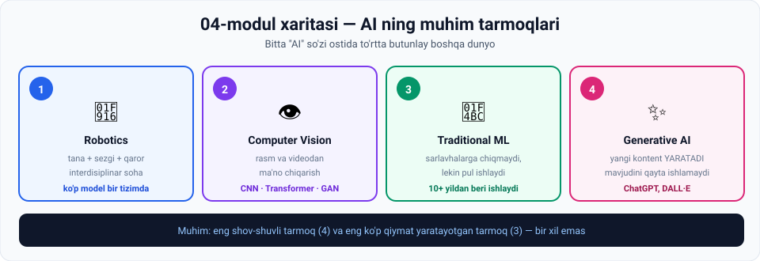

# 04-Modul · AI ning muhim tarmoqlari

> **Manba:** *The AI Engineer Course 2025: Complete AI Engineer Bootcamp* (365 Careers, Udemy)
> **Bo'lim:** `04. Intro to AI Module — Important AI branches`
> **Darslar:** 4 ta video + Quiz 4 · **O'qish vaqti:** ~56 daqiqa · **Amaliyot bilan:** ~3 soat

---

## 🌳 Bir jumlada

> **"AI" — bu bitta narsa emas. Bu — bir necha butunlay boshqa dunyoning umumiy nomi.**

Bu modul to'rttasini ko'rsatadi. Va eng muhim saboq quyidagicha:

> ⚠️ **Eng shov-shuvli tarmoq va eng ko'p qiymat yaratayotgan tarmoq — bir xil emas.**

---

## 🗺 Modul xaritasi



---

## 📚 Darslar

| № | Dars | Vaqt | Asosiy g'oya | Amaliyot |
|---|---|---|---|---|
| 1 | [Robototexnika](01-Robotics.md) | ~14 daq | Ming yillik orzu + AI · **ko'p model bir tizimda** | 3 ta topshiriq |
| 2 | [Computer Vision](02-Computer-vision.md) | ~16 daq | "AI — miya, CV — ko'zlar" · CNN va spatial hierarchy | 💻 Konvolyutsiya |
| 3 | [An'anaviy ML](03-Traditional-ML.md) | ~10 daq | Shov-shuv ≠ qiymat · **karyera uchun muhim** | 3 ta topshiriq |
| 4 | [Generativ AI](04-Generative-AI.md) ⭐ | ~16 daq | 5 ta texnika · LLM, diffusion, GAN, NeRF, gibrid | 💻 Matn generatori |

⭐ = 05-modulga to'g'ridan-to'g'ri ko'prik

---

## 🎯 Modul yakunida siz bilasiz

- [ ] Robot g'oyasining ming yillik tarixini aytasiz (Talos → al-Jazariy → da Vinchi)
- [ ] Robot qurishda **uchta mutaxassislik** ishtirok etishini bilasiz
- [ ] Robotdagi **to'rtta modul** (CV · SLAM · RL · NLP) va ularning vazifasini aytasiz
- [ ] Nima uchun **bitta model emas, ko'p model** kerakligini tushuntirasiz
- [ ] Computer vision ta'rifini va **"AI — miya, CV — ko'zlar"** analogiyasini bilasiz
- [ ] **CNN** nima uchun kerak bo'lganini (parametrlar muammosi) aytasiz
- [ ] **Spatial hierarchy** ni oddiy tilda tushuntirasiz
- [ ] To'rtta CV model oilasini sanaysiz
- [ ] An'anaviy ML ning **5+ biznes qo'llanishini** bilasiz
- [ ] **"Generativ"** so'zining aniq ma'nosini aytasiz
- [ ] Generativ AI ning **5 ta texnikasini** va har birining vazifasini bilasiz
- [ ] 💻 Konvolyutsiya va matn generatorini o'zingiz ishga tushirgansiz

---

## 🖼 Modul grafikalari

| Fayl | Nima ko'rsatadi |
|---|---|
| [`00-module-map.svg`](assets/00-module-map.svg) | To'rtta tarmoq bir qarashda |
| [`01-robotics-history.svg`](assets/01-robotics-history.svg) | Talos → al-Jazariy → da Vinchi → bugun |
| [`01-robotics-stack.svg`](assets/01-robotics-stack.svg) | Kimlar quradi + robot ichidagi 4 model |
| [`02-cv-models.svg`](assets/02-cv-models.svg) | CNN, Transformer, GAN, maxsus tarmoqlar |
| [`03-traditional-ml-value.svg`](assets/03-traditional-ml-value.svg) | Sarlavhalar ⟷ real biznes qiymati |
| [`04-genai-types.svg`](assets/04-genai-types.svg) | Generativ AI ning 5 usuli va 8 formati |

---

## 💻 Python amaliyotlari

Ikkala skript ham **hech qanday kutubxona o'rnatmasdan** ishlaydi.

| Dars | Skript nima qiladi | Nima o'rgatadi |
|---|---|---|
| 2 | 3×3 kernelni rasm ustida sirg'antirib chekka topadi | **Konvolyutsiya** — CNN dagi "C" harfi |
| 4 | So'zlar zanjiridan yangi jumlalar yaratadi | **Generativ** so'zining aniq ma'nosi |

> 🏆 **Eng ta'sirli natija:** 4-darsdagi skript `mashina kelajakni bashorat qiladi` jumlasini yaratadi — bu jumla **training data'da yo'q**. Model uni naqshlardan **o'zi qurdi**. Aynan shu — generativ AI.

---

## ⚡ Amaliy topshiriqlar xaritasi

| Dars | 🟢 Oson | 🟡 O'rta | 🔴 Qiyin |
|---|---|---|---|
| 1 | Qaysi modul ishlaydi? | O'z robotingizni loyihalang | Robot qaysi ishni olishi kerak? |
| 2 | Spatial hierarchy ni sinang | Kernellar bilan tajriba | O'z detektoringiz |
| 3 | Atrofingizdagi an'anaviy ML | Biznes holatini loyihalang | Ish bozorini o'rganing |
| 4 | Qaysi texnika? | O'z modelingizni o'rgating | GenAI chegarasini toping |

> 💼 **Karyera uchun eng foydali topshiriq:** 3-darsdagi 🔴 **"Ish bozorini o'rganing"**. U ma'ruzaning asosiy fikrini raqamlar bilan tasdiqlaydi yoki rad etadi.

---

## 🔗 Modullar orasidagi bog'liqlik

```
03-modul  ─  ML nima, uch turi, deep learning va ANN
    ↓
04-modul  ─  BU TEXNIKALAR QAYERDA ISHLATILADI      ← siz shu yerdasiz
    ↓          • RL → robotning qaror moduli
    ↓          • ANN qatlamlari → CNN qatlamlari
    ↓          • supervised → fraud detection, kredit skoring
    ↓          • "keyingi so'zni bashorat" → LLM
    ↓
05-modul  ─  Generativ AI ni CHUQUR tushunish (10 dars)
             NLP tarixi → LLM → Transformer → RAG
```

> 💡 **4-dars 05-modulga to'g'ridan-to'g'ri ko'prik.** Ma'ruzachining o'zi aytadi: *"kursning keyingi ikkita bo'limi LLM larga batafsil kirish uchun ajratilgan"*.

---

## 📖 Umumiy atamalar lug'ati

| Atama | Inglizcha | Izoh |
|---|---|---|
| Robototexnika | *robotics* | Robotlarni loyihalash va ishlatish sohasi |
| Humanoid | *humanoid* | Insonga o'xshash robot |
| Interdisiplinar | *interdisciplinary* | Bir necha sohani birlashtiruvchi |
| SLAM | *Simultaneous Localization and Mapping* | Joylashuvni aniqlash + xaritalash |
| Avtonom | *autonomous* | Mustaqil ishlaydigan |
| Computer vision | *computer vision* | Rasm va videodan ma'no chiqarish |
| CNN | *Convolutional Neural Network* | Konvolyutsion neyron tarmoq |
| Konvolyutsiya | *convolution* | Kernelni rasm ustida sirg'antirish |
| Kernel / Filtr | *kernel / filter* | Kichik og'irliklar matritsasi |
| Fazoviy ierarxiya | *spatial hierarchy* | Muhimlik va chuqurlik bo'yicha tartiblash |
| Kadr | *frame* | Videodagi bitta tasvir |
| Segmentatsiya | *segmentation* | Tasvirni ma'noli qismlarga ajratish |
| An'anaviy ML | *traditional ML* | Klassik biznes ML qo'llanishlari |
| Firibgarlikni aniqlash | *fraud detection* | Shubhali tranzaksiyani topish |
| Kredit skoring | *credit scoring* | Qarz qaytarish ehtimolini baholash |
| Talab prognozi | *demand forecasting* | Savdo hajmini bashorat qilish |
| Generativ AI | *generative AI* | Yangi kontent yaratuvchi AI |
| LLM | *Large Language Model* | Ulkan matnda o'rgatilgan neyron tarmoq |
| Diffusion model | *diffusion model* | Shovqindan rasm yaratuvchi model |
| GAN | *Generative Adversarial Network* | Generator + baholovchi juftligi |
| NeRF | *Neural Radiance Fields* | 3D modellashtirish AI si |
| Kontekst oynasi | *context window* | Model ko'ra oladigan matn hajmi |

---

## ✅ Yakuniy test

Har bir darsdagi **"O'zini tekshirish savollari"** — jami **37 ta savol**.

**29 tasidan ko'prog'iga** javob bera olsangiz — **Quiz 4** ga tayyorsiz.

---

## ➡️ Keyingi qadam

1. **Quiz 4** ni yeching (`5.4 Quiz 4.html`)
2. **05-modul: Generativ AI ni tushunish** ga o'ting

---

*📁 Manba: har bir dars mos `.vtt` transkriptdan tayyorlangan. Amaliy topshiriqlar, grafikalar va Python skriptlari — o'quvchilar uchun qo'shimcha material.*
