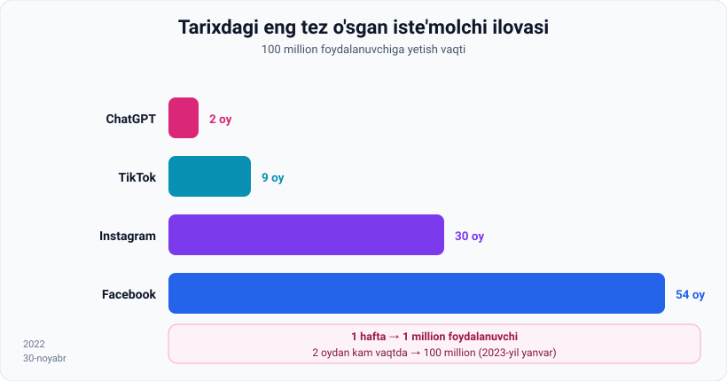

# 1-dars. Gen AI ning ko'tarilishi — ChatGPT bilan tanishuv

## 🎬 Boshlashdan oldin

**2022-yil 29-noyabr:** dunyoning katta qismi "AI" so'zini shunchaki ilmiy-fantastika deb bilardi.

**2022-yil 30-noyabr:** OpenAI ChatGPT'ni chiqardi.

**2023-yil yanvar:** 100 million odam undan foydalanardi.

> **Ikki oy.** Bu — texnologiya tarixidagi eng tez o'zgarishlardan biri. Va bu dars aynan o'sha ikki oy haqida.

---

## 1. Chiqarilish

> **2022-yil 30-noyabrda OpenAI ChatGPT 3.5 ni chiqardi** — bu **dialog uchun fine-tune qilingan** va **matn ishlab chiqarishga o'rgatilgan** model.

> **ChatGPT eng muvaffaqiyatli va ta'sirchan mahsulot chiqarilishlaridan biri bo'ldi — shu qadar sensatsion ediki, ba'zilar uni "qo'rqinchli darajada yaxshi" (scary good) deb atashdi.**

---

## 2. 📈 Portlovchi o'sish



### Raqamlar

| Vaqt | Foydalanuvchilar |
|---|---|
| **1 hafta** | **1 million** odam akkaunt yaratdi |
| **2 oydan kam** (yanvar) | **100 million** |

> ### **Bu ChatGPT'ni TARIXDAGI ENG TEZ O'SGAN iste'molchi ilovasiga aylantirdi.**

### Taqqoslash

> **TikTok'ga shuncha ro'yxatdan o'tishga yetish uchun 9 OY kerak bo'lgan edi.**

| Ilova | 100M ga yetish vaqti |
|---|---|
| **ChatGPT** | **~2 oy** |
| TikTok | 9 oy |
| Instagram | ~30 oy |
| Facebook | ~54 oy |

---

## 3. Nima uchun hamma bunchalik hayajonlandi?

Ma'ruza savolni beradi va **oddiy javob** beradi:

> ## **Javob to'g'ridan-to'g'ri: mahsulot ajoyib.**

### Nima uchun ajoyib?

> **Odamlar ChatGPT bilan muloqot qila boshlashi bilanoq, u ularning KUNDALIK ISHIDA yordam bera olishini angladilar.**

Har kim quyidagilarga qodir kuchli AI vositasidan foydalana oladi:

| | |
|---|---|
| 📄 | **Matnni umumlashtirish** |
| 🔬 | **Yuqori texnik savollarga javob generatsiya qilish** |
| 🛠 | **Har qanday texnik vazifada yordam berish** |

> **Talabami yoki ishlayotgan mutaxassismi — bu dastur sizga foyda keltirishi mumkin.**

> 💡 **Mana shu — sirning kaliti.** Oldingi AI mahsulotlari **bitta narsani** yaxshi qilardi (03-modul: **narrow AI**). ChatGPT esa **hamma uchun, hamma narsada** foydali bo'ldi. Uni ishlatish uchun **dasturchi bo'lish shart emas** edi.

---

## 4. Versiyalar orasidagi sakrash

> **ChatGPT 4.0 chiqarilishi generative pre-trained transformer modellarining turli versiyalari orasidagi ULKAN SAKRASHNI ko'rsatdi.**
>
> GPT 3.5 qiynalgan yoki **o'rtacha javoblar** bergan ba'zi vazifalar GPT 4.0 tomonidan **ta'sirchan tarzda** hal qilindi.
>
> **Kelajakdagi har bir keyingi versiya bilan ham shunday bo'lishi ehtimoldan holi emas.**

> 🔤 **Diqqat:** "generative pre-trained transformer" — bu **GPT** ning to'liq nomi.
> - **G**enerative — yaratadi *(04-modulni eslang)*
> - **P**re-trained — oldindan o'qitilgan
> - **T**ransformer — 2017-yilgi arxitektura *(01-modulni eslang)*

---

## 5. Bu bo'limda nima o'rganamiz

> **Gen AI bu yerda qolish uchun keldi (is here to stay).**
>
> Shuning uchun kursning ushbu qismida biz **ChatGPT ning yaratilishiga olib kelgan mexanizmlarni (nuts and bolts)** o'rganmoqchimiz:
>
> - **Hammasi qanday boshlangan**
> - **Qanday texnik tamoyillar large language model larni yaratishga olib kelgan**

---

## 6. ⚡ Amaliy topshiriqlar

### 🟢 Oson — 10 daqiqa · **O'zingizning "scary good" lahzangiz**

ChatGPT (yoki boshqa AI chat) bilan **3 ta vazifa** bajaring:

| № | Vazifa | Natija (1–5) | Odam qancha vaqtda qilardi? |
|---|---|---|---|
| 1 | 2 sahifalik matnni 5 jumlada umumlashtiring | | |
| 2 | O'zingiz bilmagan texnik savolni bering | | |
| 3 | Bir ishni bajarishda yordam so'rang (xat, reja, kod) | | |

**Savol:** qaysi vazifada natija sizni **hayratlantirdi**? Va qaysi birida **hafsalangiz pir bo'ldi**?

### 🟡 O'rta — 20 daqiqa · **O'sishni tahlil qiling**

```
1. ChatGPT 1 haftada 1 mln foydalanuvchiga yetdi.
   Kuniga o'rtacha nechta yangi foydalanuvchi?  ______

2. 2 oyda 100 mln. Kuniga o'rtacha nechta?  ______

3. Nima uchun o'sish TEZLASHDI, sekinlashmadi?
   ___________________________________________

4. TikTok 9 oy sarfladi. ChatGPT nimasi bilan ustun keldi?
   Kamida 3 ta sabab:
   a) _________________________________
   b) _________________________________
   c) _________________________________
```

<details>
<summary>💡 Ilgak</summary>

1. ~143 000/kun · 2. ~1.7 mln/kun
3. **Virusli tarqalish**: har bir foydalanuvchi natijani do'stlariga ko'rsatdi. Bundan tashqari — **ro'yxatdan o'tish bepul va oson** edi.
4. Mumkin sabablar: (a) **darhol foydali** — o'rganish shart emas; (b) **hech qanday raqib mahsulot yo'q** edi; (c) OAV va ijtimoiy tarmoqlarda **misli ko'rilmagan qamrov**; (d) **har bir kasb** uchun foydali.

</details>

### 🔴 Qiyin — muhokama · **"Har bir keyingi versiya" bashorati**

Ma'ruza aytadi: har bir keyingi GPT versiyasi oldingisidan **sezilarli ustun** bo'ladi.

```
1. Bu bashorat CHEKSIZ davom eta oladimi?  ha / yo'q
   Nega: ______________________________________

2. Qanday CHEKLOVLAR bo'lishi mumkin?
   • Ma'lumot:      ______________________
   • Energiya:      ______________________
   • Pul:           ______________________
   • Boshqa:        ______________________

3. Sizning bashoratingiz — 5 yildan keyin AI qayerda bo'ladi?
   ______________________________________________
```

> 💡 **Ilgak:** 05-modulning 4-darsida bilib olasiz — GPT-3 **175 milliard** parametrda, GPT-4 **1 trilliondan ortiq**da o'qitilgan. Bu o'sish qanchagacha davom etadi?

---

## 7. 🧠 O'zini tekshirish savollari

1. ChatGPT qachon chiqarilgan va u qanday model edi?
2. Uni qanday ibora bilan ta'rifladilar?
3. 1 haftada va 2 oyda nechta foydalanuvchi yig'ildi?
4. Bu ChatGPT'ni nimaga aylantirdi?
5. TikTok'ga xuddi shu raqamga yetish uchun qancha vaqt kerak bo'lgan?
6. Portlovchi o'sishning sababi nima?
7. ChatGPT qanday vazifalarda yordam bera oladi?
8. GPT 4.0 chiqarilishi nimani ko'rsatdi?

<details>
<summary>✅ Javoblar</summary>

1. **2022-yil 30-noyabr**, **ChatGPT 3.5** — **dialog uchun fine-tune qilingan** va **matn ishlab chiqarishga o'rgatilgan** model.
2. **"Scary good"** — qo'rqinchli darajada yaxshi.
3. **1 haftada 1 million**, **2 oydan kam vaqtda 100 million**.
4. **Tarixdagi eng tez o'sgan iste'molchi ilovasiga**.
5. **9 oy.**
6. **Mahsulot ajoyib** — odamlar u kundalik ishlarida yordam bera olishini darrov angladilar.
7. **Matnni umumlashtirish**, **yuqori texnik savollarga javob generatsiya qilish**, **har qanday texnik vazifada yordam**.
8. GPT versiyalari orasidagi **ulkan sakrashni** — GPT 3.5 qiynalgan vazifalar GPT 4.0 da ta'sirchan hal qilindi.

</details>

---

## 📌 Xulosa

```
2022-30-noyabr  →  ChatGPT 3.5 chiqdi
   1 hafta      →  1 000 000 foydalanuvchi
   2 oy         →  100 000 000 foydalanuvchi     (TikTok: 9 oy)

Sabab: mahsulot AJOYIB va DARHOL foydali
       + dasturchi bo'lish shart emas

GPT = Generative Pre-trained Transformer
```

---

## 🔖 Atamalar

| Atama | Inglizcha | Izoh |
|---|---|---|
| Fine-tune qilingan | *fine-tuned* | Aniq vazifaga moslashtirilgan |
| Dastlabki foydalanuvchilar | *first adopters* | Yangilikni birinchi sinaganlar |
| Iste'molchi ilovasi | *consumer application* | Keng ommaga mo'ljallangan ilova |
| GPT | *Generative Pre-trained Transformer* | OpenAI ning model oilasi |
| Mexanizmlar | *nuts and bolts* | Ichki ish tamoyillari |

---

🏠 [Modul boshiga](README.md) · ➡️ [Keyingi: Erta NLP yondashuvlari](02-Early-approaches-to-NLP.md)
