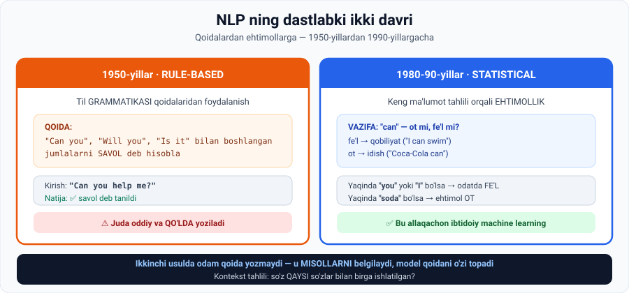

# 2-dars. NLP ga dastlabki yondashuvlar

## 🎬 Boshlashdan oldin

Ingliz tilidagi bir so'zga qarang: **`can`**

```
"I can swim"           →  can = fe'l   (qobiliyat)
"Give me a Coca-Cola can"  →  can = ot  (idish)
```

**Siz farqni bir zumda tushundingiz.** Qanday? Siz **atrofdagi so'zlarga** qaradingiz.

> Kompyuterga shu ishni o'rgatish uchun olimlarga **40 yil** kerak bo'ldi. Bu dars — o'sha 40 yil haqida.

---

## 1. NLP ta'rifi

> **Natural Language Processing — ko'pincha NLP deb ataladi — bu kompyuterlar inson tili ma'lumotini QANDAY TUSHUNISHI, TALQIN QILISHI va GENERATSIYA QILISHINI o'rganadigan kompyuter fanlari sohasi.**

> **NLP taxminan 1950-yillarda hayotga keldi.**

*(01-modulni eslang: 1950 — Turing, 1956 — Dartmouth. NLP AI bilan bir vaqtda tug'ilgan.)*



---

## 2. Birinchi davr: Rule-based systems (1950-yillar)

> **Dastlabki davrlarda birinchi NLP usullari QOIDAGA ASOSLANGAN tizimlarga qaratilgan edi** — ular matnni qayta ishlash uchun **til grammatikasi qoidalaridan** foydalanardi.

### Ma'ruzadagi misol

Bunday tizimni loyihalashda men shunday qoida o'rnatishim mumkin:

```
QOIDA:  "Can you", "Will you" yoki "Is it" bilan boshlangan
        jumlalarni SAVOL deb hisobla
```

**Sinov:**

```
Kirish:  "Can you help me?"
Natija:  ✅ savol deb tanildi
```

### ⚠️ Muammo

> **Bu qoida ancha ODDIY va QO'LDA yozilgan ko'rinadi, shunday emasmi?**

**Nima uchun bu ishlamaydi:**

| Muammo | Misol |
|---|---|
| Har bir holat uchun qoida yozish kerak | Ingliz tilida minglab konstruksiya bor |
| Istisnolar cheksiz | *"Can you believe it!"* — bu savol emas, hayrat |
| Yangi til = noldan boshlash | O'zbek tili uchun butunlay boshqa qoidalar |
| Jonli til o'zgaradi | Sleng, qisqartmalar, emoji |

> 🧱 **Analogiya:** har bir yomg'ir tomchisi uchun alohida chelak qo'yish. Ishlaydi — lekin faqat siz o'ylab topgan tomchilar uchun.

---

## 3. Ikkinchi davr: Statistical NLP (1980-90-yillar)

> **1980-yillar oxiri va ayniqsa 90-yillar boshida STATISTICAL NLP paydo bo'ldi** — bu qoidaga asoslangan tizimlardan **ehtimolliy yondashuvga** o'tishni belgiladi. U til ma'lumotini **keng ma'lumot tahlili** orqali talqin qiladi.

### Ma'ruzadagi vazifa: `can` — ot mi, fe'l mi?

> 90-yillarda statistikka jumladagi **`can`** so'zi **ot** yoki **fe'l** sifatida ishlatilganini aniqlaydigan dastur loyihalash topshirilishi mumkin edi.

**Nima uchun bu farq juda muhim:**

| Rol | Ma'nosi | Misol |
|---|---|---|
| **Fe'l** | Odamning biror ishni **qila olish qobiliyati** | *"I **can** swim"* |
| **Ot** | **Idish** — masalan Coca-Cola bankasi | *"a Coca-Cola **can**"* |

### Ish jarayoni — 90-yillar uslubida

```
1. TO'PLASH
   "can" so'zi bor KO'P jumla yig'aman

2. ANNOTATSIYA (belgilash)
   Har birida so'z OT mi, FE'L mi — qayd qilaman

3. KONTEKST TAHLILI
   "can" QAYSI so'zlar bilan birga ishlatilganini tahlil qilaman

4. NAQSH
   • yaqinda "you" yoki "I" bo'lsa   →  odatda FE'L
   • jumlada "soda" bo'lsa            →  katta ehtimol OT

5. MODEL
   Ilgari hisoblangan CHASTOTALAR asosida "can" ning
   berilgan jumlada fe'l yoki ot bo'lish EHTIMOLINI ko'rsatadi
```

### 🔑 Muhim kuzatuv

> **Ma'lumotdagi naqshlarni shu tarzda aniqlashga urinish IBTIDOIY MACHINE LEARNING ga o'xshaydi, shunday emasmi?**

> 💡 **Mana shu — darsning eng muhim jumlasi.** 90-yillarda statistiklar bilmagan holda **machine learning qilishardi**. Farq shundaki:
>
> | | Rule-based | Statistical |
> |---|---|---|
> | Kim qoida yozadi | **Odam** | **Model** ma'lumotdan topadi |
> | Odam nima qiladi | Qoidalarni o'ylab topadi | **Misollarni belgilaydi** |
> | Yangi holat | Yangi qoida kerak | Model **moslashadi** |
>
> Bu — 02-moduldagi **labelled data** va 03-moduldagi **supervised learning** ning tarixiy ildizi.

---

## 4. Keyingi dars

> Keyingi darsda **vector embeddings**, **machine learning** va **deep learning** bugun ko'rayotgan NLP imkoniyatlarini qanday ilgari surganini o'rganamiz.

---

## 5. ⚡ Amaliy topshiriqlar

### 🟢 Oson — 10 daqiqa · **O'zbek tilida qoida yozing**

Rule-based tizim quring: **savol jumlalarini aniqlash**.

```
QOIDA 1: ______ bilan tugagan jumla → savol
QOIDA 2: ______ so'zi bor jumla → savol
QOIDA 3: ______________________________
```

Endi bu qoidalarni **buzadigan** 3 ta jumla toping:

```
1. ______________________________  nega buzadi: __________
2. ______________________________  nega buzadi: __________
3. ______________________________  nega buzadi: __________
```

<details>
<summary>💡 Ilgak</summary>

**Qoidalar:** `?` bilan tugash · `-mi` qo'shimchasi · `nima`, `qanday`, `qachon`, `kim`, `qayer` so'zlari.

**Buzadigan misollar:**
- *"Qanday go'zal kun!"* — `qanday` bor, lekin savol emas
- *"Bormisan deb so'radi"* — `-mi` bor, lekin bu ko'chirma gap
- *"Kim bo'lsa ham kirsin"* — `kim` bor, savol emas
- *"Kelasanmi"* — savol, lekin `?` yo'q (SMS uslubi)

**Xulosa:** har bir qoida uchun istisno topish oson. Aynan shuning uchun rule-based yondashuv qiyinlashib ketdi.

</details>

### 🟡 O'rta — 20 daqiqa · **O'zbekcha omonim toping**

`can` kabi **ikki xil ma'noli** o'zbekcha so'z toping va statistik tahlil qiling.

**Namunalar:** `yoz` (fasl / yozmoq) · `ot` (hayvon / ism / otmoq) · `bor` (mavjud / bormoq) · `soch` (sochlar / sochmoq) · `tuz` (tuz / tuzmoq)

```
Tanlangan so'z: ______________

Ma'no A: ____________  Ma'no B: ____________

10 ta jumla yozing va belgilang:
 1. ________________________________  → A / B
 2. ________________________________  → A / B
 ... (10 tagacha)

KONTEKST TAHLILI:
A ma'nosi yonida qanday so'zlar uchraydi: ______________
B ma'nosi yonida qanday so'zlar uchraydi: ______________

QOIDA (siz topgan naqsh):
______________________________________________
```

> 🎓 **Tabriklaymiz:** siz hozirgina 1990-yillardagi NLP tadqiqotchisining ish kunini takrorladingiz.

### 🔴 Qiyin — muhokama · **Nima uchun qoidalar yetmadi?**

```
1. Ingliz tilida taxminan nechta grammatik qoida bor deb o'ylaysiz?
   ______

2. Har biri uchun o'rtacha nechta ISTISNO bor?
   ______

3. Jonli tilda yiliga qancha YANGI so'z paydo bo'ladi?
   ______

4. Bularni birlashtiring — nima uchun rule-based yondashuv
   MASSHTABLANMAYDI? (5 jumla)
   ______________________________________________
   ______________________________________________

5. Statistical yondashuv bu muammoni QANDAY yechdi?
   ______________________________________________
```

---

## 6. 🧠 O'zini tekshirish savollari

1. NLP ta'rifini ayting.
2. NLP qachon hayotga kelgan?
3. Birinchi NLP usullari nimaga asoslangan edi?
4. Ma'ruzadagi qoida misolini keltiring.
5. Bu yondashuvning kamchiligi nima edi?
6. Statistical NLP qachon paydo bo'ldi va u nimaga o'tishni belgiladi?
7. `can` misolida ot va fe'l ma'nolari nima?
8. 90-yillarda statistik qanday ishlagan bo'lardi? 5 qadamda.
9. Kontekst tahlilida qanday naqshlar topildi?
10. Ma'ruzachi bu yondashuvni nimaga qiyoslaydi?

<details>
<summary>✅ Javoblar</summary>

1. Kompyuterlar inson tili ma'lumotini **qanday tushunishi, talqin qilishi va generatsiya qilishini** o'rganadigan kompyuter fanlari sohasi.
2. Taxminan **1950-yillarda**.
3. **Rule-based (qoidaga asoslangan) tizimlar** — til **grammatikasi qoidalari**.
4. *"Can you", "Will you", "Is it" bilan boshlangan jumlalarni savol deb hisobla.*
5. U **juda oddiy va qo'lda** yoziladi — har bir holat uchun qoida kerak.
6. **1980-yillar oxiri, ayniqsa 90-yillar boshi.** Qoidaga asoslangan tizimlardan **ehtimolliy yondashuvga** o'tish.
7. **Fe'l** — qobiliyat ("I can swim"); **ot** — idish (Coca-Cola can).
8. (a) `can` bor jumlalarni to'plash; (b) har birini ot/fe'l deb **annotatsiya qilish**; (c) **kontekst tahlili**; (d) chastotalarni hisoblash; (e) **ehtimollik modelini** olish.
9. Yaqinda **"you"** yoki **"I"** bo'lsa → odatda **fe'l**; jumlada **"soda"** bo'lsa → katta ehtimol **ot**.
10. **Ibtidoiy machine learning**ka.

</details>

---

## 📌 Xulosa

```
1950-yillar  RULE-BASED       odam QOIDA yozadi
                              → istisnolar cheksiz, masshtablanmaydi
      ↓
1980-90      STATISTICAL      odam MISOL belgilaydi, model qoidani topadi
                              → ehtimollik, kontekst tahlili
                              → bu allaqachon ibtidoiy ML
      ↓
2000+        (keyingi dars)   vector embeddings + ML + deep learning
```

---

## 🔖 Atamalar

| Atama | Inglizcha | Izoh |
|---|---|---|
| NLP | *Natural Language Processing* | Tabiiy tilni qayta ishlash |
| Qoidaga asoslangan | *rule-based* | Qo'lda yozilgan qoidalar tizimi |
| Statistik NLP | *statistical NLP* | Ehtimollikka asoslangan yondashuv |
| Ehtimolliy | *probabilistic* | Ehtimollik bilan ishlaydigan |
| Annotatsiya | *annotation* | Ma'lumotni qo'lda belgilash |
| Kontekst tahlili | *context analysis* | So'z atrofidagi so'zlarni o'rganish |
| Chastota | *frequency* | Uchrash soni |
| Omonim | *homonym* | Bir xil yozilib, turli ma'noga ega so'z |

---

⬅️ [Oldingi: ChatGPT ning ko'tarilishi](01-The-rise-of-GenAI-ChatGPT.md) · ➡️ [Keyingi: Zamonaviy NLP yutuqlari](03-Recent-NLP-advancements.md)
