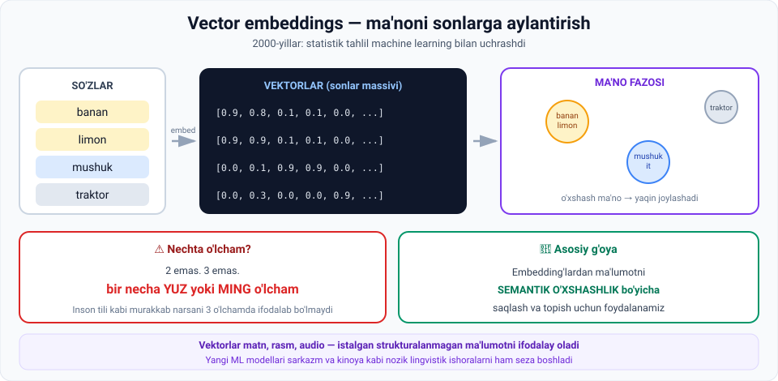

# 3-dars. Zamonaviy NLP yutuqlari

## 🎬 Boshlashdan oldin

Google'da **"iliq kiyim"** deb qidiring. Natijada **"palto"**, **"kurtka"**, **"sviter"** chiqadi — garchi bu so'zlar sizning so'rovingizda **umuman yo'q** bo'lsa ham.

Qanday? Google **so'zlarni emas, MA'NONI** qidirdi.

> Bu qanday mumkin? Javob — bu darsning mavzusi: **vector embeddings**.
>
> Va bu tushuncha butun kurs davomida qaytadi: LangChain, Pinecone, RAG — hammasi shunga tayanadi.

---

## 1. 2000-yillar: statistika ML bilan uchrashdi

> **2000-yillarda NLP sezilarli turtki oldi — statistik tahlil machine learning'ga yo'l topdi.**

### Kalit omil

> **NLP vector embeddings bu jarayonda ASOSIY YO'L OCHUVCHI (key facilitator) bo'ldi** — ular **so'zlar va jumlalarni raqamli massivlarga aylantirib**, matn ma'lumotidagi **ma'no va munosabatlarni** samarali qamrab oldi.

---

## 2. Vector embeddings



### Nima uchun vektorlar?

> **Vektorlarning ajoyib tomoni shundaki, ular murakkabroq axborot turlarini ifodalay oladi** — masalan **matn, rasm, audio** va boshqa **strukturalanmagan ma'lumot** turlarini.

*(02-modulni eslang: dunyodagi ma'lumotning 80–90% i strukturalanmagan. Mana ular bilan ishlash yo'li.)*

### Qanday ishlaydi

> **Masalan, jumladagi har bir so'z VEKTOR sifatida ifodalanishi va VECTOR EMBEDDING deb ataluvchi yuqori o'lchamli fazoda saqlanishi mumkin.**

---

## 3. ⚠️ Nechta o'lcham? — eng muhim nuqta

Ma'ruzachi buni **ikki marta** takrorlaydi, chunki bu juda muhim:

> **AI modellari bilan ishlaganda, vector embedding lar odatda BIR NECHA YUZDAN MINGLAB o'lchamgacha chuqur bo'ladi — 2 yoki 3 emas.**
>
> **Ular ikki o'lchamli emas. Uch o'lchamli emas — balki bir necha yuz yoki ming o'lchamli.**

### Nima uchun?

> **Tasavvur qilganingizdek, inson tili kabi murakkab narsaning ma'nosini 1, 2 yoki 3 o'lchamli vektorlar bilan qamrab bo'lmaydi.**
>
> **Buning o'rniga bizga YUZLAB, hatto MINGLAB o'lcham kerak.**

> 🧠 **Buni qanday tasavvur qilish kerak?** Hech qanday tarzda — **inson miyasi 4 o'lchamdan ortiqni tasavvur qila olmaydi.**
>
> Lekin **matematika** qila oladi. Va bu yetarli. Siz shunchaki bilib qo'ying: har bir so'z — bu **1536 ta son** (masalan, OpenAI embedding modelida).

---

## 4. 🔑 Asosiy g'oya

> ## **Kalit g'oya — embedding'lardan ma'lumotni SEMANTIK O'XSHASHLIK bo'yicha saqlash va topish uchun foydalanish.**

**Semantik o'xshashlik** = **ma'no jihatidan yaqinlik** (yozilishi jihatidan emas).

```
"palto"  va  "kurtka"     →  yozilishi FARQLI, ma'nosi YAQIN  ✅
"olma"   va  "olmos"      →  yozilishi YAQIN, ma'nosi FARQLI  ❌
```

> Embedding fazosida **"palto"** va **"kurtka"** yonma-yon turadi, **"olma"** va **"olmos"** esa uzoqda.

---

## 5. Yangi ML modellari

> **Bundan tashqari, kuchli yangi ML modellari paydo bo'ldi** — ular kompyuterlarga keng matn bazalarini **vector embedding sifatida** tahlil qilish imkonini berdi.

### Nima o'zgardi

> **Bu modellar SARKAZM yoki KINOYA kabi kayfiyatni ko'rsatuvchi NOZIK LINGVISTIK ISHORALARNI aniqlashni o'rgandi** — bu nozikliklar ilgari **oddiy statistik usullar uchun tutib bo'lmas** edi.

> 😏 **Nima uchun sarkazm qiyin?** *"Ajoyib, yana yomg'ir yog'yapti."* Har bir so'z ijobiy. Ma'no — salbiy. Buni tushunish uchun **kontekst** kerak, chastota emas.

---

## 6. Neyron tarmoqlar davri (2010-yillar)

> **2010-yillarda neyron tarmoqlarning paydo bo'lishi NLP vazifalarida inqilob qildi:**
>
> - **tarjima** (translation)
> - **nutqni tanish** (speech recognition)
> - **matn generatsiyasi** (text generation)

### Nima uchun?

> **Chunki neyron tarmoqlar o'zining CHUQUR, KO'P QATLAMLI tuzilmasi bilan an'anaviy machine learning usullari yeta olmaydigan MURAKKAB NAQSHLARNI aniqlashda ajoyib.**

*(03-modulni eslang: qatlamlar — chekka → shakl → obyekt. Matnda ham xuddi shunday: harf → so'z → jumla → ma'no.)*

---

## 7. ⭐ Transformer arxitekturasi

> **Eng so'nggi innovatsiyalardan biri — 2018-yilda taqdim etilgan Transformer arxitekturasi.**
>
> **U NLP sohasida INQILOB QILDI va LARGE LANGUAGE MODEL larning yaratilishiga olib keldi.**
>
> **Bu arxitektura GPT va Gemini kabi LLM larning rivojlanishini MUMKIN QILDI.**

> ℹ️ **Sana haqida eslatma:** ushbu darsda **2018** deyiladi. 01-modulning 4-darsida esa **2017** ko'rsatilgan — *"Attention is All You Need"* maqolasi **2017-yilda** e'lon qilingan. **2018** — arxitektura keng qo'llanila boshlagan va GPT-1 chiqqan yil. Ikkala sana ham to'g'ri, faqat turli voqealarga tegishli.

*(Transformer haqida to'liq — shu modulning 6-darsida.)*

---

## 8. 💻 Amaliyot: semantik o'xshashlikni o'z ko'zingiz bilan ko'ring

Hech narsa o'rnatmasdan ishlaydi. Bu — **butun vector search sohasining yuragi**.

```python
import math

OLCHAMLAR = ["meva", "sariq", "tirik", "uy_hayvoni", "mexanizm"]
EMBEDDINGS = {
    "banan":   [0.9, 0.8, 0.1, 0.1, 0.0],
    "olma":    [0.9, 0.2, 0.1, 0.1, 0.0],
    "limon":   [0.9, 0.9, 0.1, 0.1, 0.0],
    "mushuk":  [0.0, 0.1, 0.9, 0.9, 0.0],
    "it":      [0.0, 0.1, 0.9, 0.9, 0.0],
    "traktor": [0.0, 0.3, 0.0, 0.0, 0.9],
}

def kosinus(a, b):
    """Ikki vektor orasidagi burchak. 1.0 = bir xil yo'nalish."""
    skalyar = sum(x * y for x, y in zip(a, b))
    na = math.sqrt(sum(x * x for x in a))
    nb = math.sqrt(sum(y * y for y in b))
    return skalyar / (na * nb)

print("=== 1. HAR BIR SO'Z - SONLAR MASSIVI (vektor) ===")
sarlavha = "so_z".ljust(10) + "".join(o.rjust(12) for o in OLCHAMLAR)
print(sarlavha)
for soz, v in EMBEDDINGS.items():
    print(soz.ljust(10) + "".join(f"{x:>12.1f}" for x in v))

print("\n=== 2. SEMANTIK O'XSHASHLIK (kosinus: 1.0 = bir xil) ===")
juftlar = [("banan", "limon"), ("banan", "olma"), ("mushuk", "it"),
           ("banan", "mushuk"), ("banan", "traktor"), ("it", "traktor")]
for a, b in juftlar:
    s = kosinus(EMBEDDINGS[a], EMBEDDINGS[b])
    bar = "#" * int(s * 30)
    print(f"  {a:<9} <-> {b:<9}  {s:.3f}  {bar}")

print("\n=== 3. SEMANTIK QIDIRUV: 'banan' ga eng yaqin so'zlar ===")
soz = "banan"
natija = sorted(((kosinus(EMBEDDINGS[soz], v), k)
                 for k, v in EMBEDDINGS.items() if k != soz), reverse=True)
for s, k in natija:
    print(f"  {k:<10} {s:.3f}")
```

### Haqiqiy natija

```
=== 2. SEMANTIK O'XSHASHLIK (kosinus: 1.0 = bir xil) ===
  banan     <-> limon      0.998  #############################
  banan     <-> olma       0.875  ##########################
  mushuk    <-> it         1.000  ##############################
  banan     <-> mushuk     0.168  #####
  banan     <-> traktor    0.209  ######
  it        <-> traktor    0.025

=== 3. SEMANTIK QIDIRUV: 'banan' ga eng yaqin so'zlar ===
  limon      0.998
  olma       0.875
  traktor    0.209
  mushuk     0.168
  it         0.168
```

### 🔑 To'rtta kuzatuv

**1. `banan ↔ limon = 0.998`** — ikkalasi ham meva va sariq. Model bunga qaraydi, **harflarga emas**.

**2. `banan ↔ olma = 0.875`** — ikkalasi ham meva, lekin olma sariq emas. Shuning uchun biroz uzoqroq.

**3. `it ↔ traktor = 0.025`** — deyarli hech qanday umumiylik yo'q. **Ma'no fazosida uzoq burchaklar.**

**4. 3-blok — bu SEMANTIK QIDIRUV.** Va bu aynan:
- Google qidiruvi
- Spotify tavsiyasi
- Pinecone vector database *(kursning keyingi moduli)*
- ChatGPT ning RAG mexanizmi *(01-modulning demo darsini eslang!)*

> ⚠️ **Muhim farq:** bizda **5 ta** o'lcham va ularni **biz nomladik** (`meva`, `sariq`...). Haqiqiy modelda **1536 ta** o'lcham bor va ularning **hech qaysisining nomi yo'q** — model ularni o'zi shakllantirgan. Hech kim ularning nimani anglatishini aniq bilmaydi.

---

## 9. ⚡ Amaliy topshiriqlar

### 🟢 Oson — 10 daqiqa · **Vektorlar qo'shing**

Kodga **3 ta yangi so'z** qo'shing:

```python
"apelsin": [0.9, 0.?, 0.1, 0.1, 0.0],
"quyosh":  [0.0, 0.9, 0.0, 0.0, 0.0],
"velosiped": [?, ?, ?, ?, ?],
```

Savollar:
1. `apelsin` `banan` ga qanchalik yaqin chiqdi?
2. `quyosh` va `banan` — ikkalasi ham sariq. Kosinus qancha? Bu **to'g'rimi**?
3. Bu qanday **muammoni** ko'rsatadi?

<details>
<summary>💡 Javob ilgagi</summary>

`quyosh` va `banan` faqat "sariq" o'lchamda uchrashadi — kosinus ancha yuqori chiqishi mumkin. Lekin ular **umuman boshqa narsalar**.

**Muammo:** 5 ta o'lcham **yetarli emas**. Aynan shuning uchun haqiqiy modellarda **yuzlab yoki minglab** o'lcham bor.

</details>

### 🟡 O'rta — 25 daqiqa · **O'z semantik qidiruvingiz**

O'zbekcha so'zlar uchun **6 ta o'lchamli** embedding tizimi yarating:

```python
OLCHAMLAR = ["oziq-ovqat", "transport", "tirik", "elektronika", "kiyim", "sport"]

MENING_EMBEDDINGS = {
    "olma":      [?, ?, ?, ?, ?, ?],
    "avtobus":   [?, ?, ?, ?, ?, ?],
    "telefon":   [?, ?, ?, ?, ?, ?],
    "ko'ylak":   [?, ?, ?, ?, ?, ?],
    "futbol":    [?, ?, ?, ?, ?, ?],
    "non":       [?, ?, ?, ?, ?, ?],
    "noutbuk":   [?, ?, ?, ?, ?, ?],
    "poyabzal":  [?, ?, ?, ?, ?, ?],
}
```

**Sinovlar:**
1. `telefon` ga eng yaqin so'z nima chiqdi? Kutganingizdek bo'ldimi?
2. `ko'ylak` va `poyabzal` — qanchalik yaqin?
3. Natija **noto'g'ri** bo'lgan bitta juftlikni toping va **o'lcham qo'shib** tuzating.

### 🔴 Qiyin — mini-loyiha · **Sarkazm detektori**

Ma'ruza aytadi: yangi modellar **sarkazm va kinoyani** sezishni o'rgandi.

```
1. O'zbek tilida 10 ta SARKASTIK jumla yozing:
   1) _______________________________________
   2) _______________________________________
   ... (10 tagacha)

2. Har biri uchun aniqlang:
   • So'zlarning O'ZI ijobiymi yoki salbiy?  ______
   • MA'NO ijobiymi yoki salbiy?             ______

3. Faqat SO'ZLARGA qarab ishlaydigan model
   (chastota hisoblovchi) nechtasida adashadi?  ______

4. Sarkazmni tanish uchun modelga NIMA kerak?
   Kamida 3 ta narsa:
   a) _____________________  b) _____________________
   c) _____________________

5. 10 dan nechtasini ChatGPT to'g'ri tanidi?  ______
```

---

## 10. 🧠 O'zini tekshirish savollari

1. 2000-yillarda NLP ga nima turtki berdi?
2. Vector embeddings nima qiladi?
3. Vektorlar qanday ma'lumot turlarini ifodalay oladi?
4. Vector embedding'lar nechta o'lchamli bo'ladi? Nima uchun 2–3 yetmaydi?
5. Kalit g'oya nima?
6. Yangi ML modellari qanday nozikliklarni aniqlashni o'rgandi?
7. 2010-yillarda nima bo'ldi va u qaysi NLP vazifalarida inqilob qildi?
8. Neyron tarmoqlar nima uchun murakkab naqshlarni yaxshi topadi?
9. Transformer arxitekturasi nimaga olib keldi?

<details>
<summary>✅ Javoblar</summary>

1. **Statistik tahlil machine learning'ga yo'l topdi.**
2. **So'z va jumlalarni raqamli massivlarga aylantiradi**, matndagi **ma'no va munosabatlarni** qamrab oladi.
3. **Matn, rasm, audio** va boshqa **strukturalanmagan** ma'lumot turlarini.
4. **Bir necha yuzdan minglab** o'lchamgacha. Chunki **inson tili kabi murakkab narsaning ma'nosini** 1–3 o'lchamda qamrab bo'lmaydi.
5. **Embedding'lardan ma'lumotni semantik o'xshashlik bo'yicha saqlash va topish** uchun foydalanish.
6. **Sarkazm va kinoya** kabi kayfiyatni ko'rsatuvchi **nozik lingvistik ishoralarni** — ilgari oddiy statistik usullar uchun tutib bo'lmas edi.
7. **Neyron tarmoqlar** paydo bo'ldi; **tarjima**, **nutqni tanish** va **matn generatsiyasi**da inqilob qildi.
8. Ularning **chuqur, ko'p qatlamli tuzilmasi** an'anaviy ML yeta olmaydigan murakkab naqshlarni aniqlashda ajoyib.
9. **NLP da inqilob** qildi va **LLM** larning yaratilishiga olib keldi — GPT va Gemini ni mumkin qildi.

</details>

---

## 📌 Xulosa

```
So'z / jumla
     ↓  embedding
[0.9, 0.8, 0.1, ...]   ← yuzlab yoki minglab o'lcham
     ↓
Ma'no fazosi: o'xshash ma'no → yaqin joylashadi
     ↓
SEMANTIK O'XSHASHLIK bo'yicha saqlash va topish

2000  statistika + ML     →  embeddings
2010  neyron tarmoqlar    →  tarjima, nutq, generatsiya
2017/18  Transformer      →  LLM
```

---

## 🔖 Atamalar

| Atama | Inglizcha | Izoh |
|---|---|---|
| Vector embedding | *vector embedding* | So'zning yuqori o'lchamli vektor ko'rinishi |
| Yuqori o'lchamli fazo | *high-dimensional space* | Yuzlab/minglab o'lchamli matematik fazo |
| Semantik o'xshashlik | *semantic similarity* | Ma'no jihatidan yaqinlik |
| Kosinus o'xshashligi | *cosine similarity* | Ikki vektor orasidagi burchak o'lchovi |
| Lingvistik ishora | *linguistic cue* | Ma'noni ko'rsatuvchi til belgisi |
| Sarkazm / kinoya | *sarcasm / irony* | So'z va ma'no qarama-qarshiligi |
| Semantik qidiruv | *semantic search* | Ma'no bo'yicha qidirish |

---

⬅️ [Oldingi: Erta NLP yondashuvlari](02-Early-approaches-to-NLP.md) · ➡️ [Keyingi: Language Model dan LLM ga](04-From-LM-to-LLM.md)
