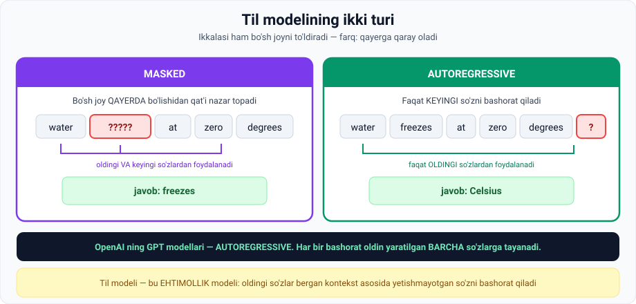

# 4-dars. Language Model dan Large Language Model (LLM) ga

## 🎬 Boshlashdan oldin: bolalik o'yini

Ma'ruzachi bu darsni **bolalikdagi o'yin** bilan boshlaydi. Va bu — butun LLM texnologiyasining eng yaxshi tushuntirishi.

### O'yin qoidalari

> Bolaligimda do'stlarim bilan **jamoaviy so'z assotsiatsiyasi** o'yinini o'ynashni yaxshi ko'rardim.
>
> - **4 o'yinchi**, ikki jamoaga bo'linadi
> - Bir o'yinchi **raqibga maxfiy so'zni pichirlaydi**
> - Raqib **bog'liq bitta so'zni ovoz chiqarib aytadi** — o'z sherigi asl so'zni topishi uchun
> - Sherikning **bitta urinishi** bor
> - Noto'g'ri bo'lsa — keyingi jamoa maxfiy so'zni **bitta so'z bilan** tasvirlaydi
> - **Birinchi bo'lib asl so'zni topgan yutadi**

---

## 1. O'yin mantiqi

### Misol 1: `banan`

```
Men eshitdim:  "banan"
Men aytaman:   "sariq"
```

**Muammo:** *"sariq"* ko'p narsa bilan bog'lanadi:

| taksilar | kungaboqarlar | limonlar | oltin |
|---|---|---|---|

> **Sherigim "sariq" so'zidan "banan" ni topish ehtimoli bor, lekin bu ENG EHTIMOLIY natija emas.**

**Yaxshiroq variant:**

```
Men aytaman:  "po'st" (peel)
```

> **`Peel` so'zi `banan` bilan `yellow` ga qaraganda KO'PROQ bog'lanadi.**
>
> **Sariq narsalar ko'p, lekin `peel` tez-tez `banan` bilan bog'lanadi.**

> Ehtimol, `peel` dan ham yaxshiroq assotsiatsiyalar bordir, to'g'rimi?

### 🔑 O'yin strategiyasi

> **Bu o'yinda yaxshi bo'lish uchun siz sherigingizning TO'G'RI TOPISH EHTIMOLINI MAKSIMALLASHTIRADIGAN so'zni o'ylab topishingiz kerak.**

### Misol 2: `greypfrut` — kontekstning kuchi

Ba'zi so'zlar juda murakkab — ularni tushunish uchun **bir necha urinish** kerak, bu **ko'proq kontekst** beradi.

```
1-urinish:  "sitrus"   →  sherigimda muvaffaqiyat ehtimoli PAST
2-urinish:  "achchiq"  →  endi u ANIQ topadi
```

**Muqobil variant:**

```
"sitrus"  +  "pushti"  →  ham yuqori muvaffaqiyat ehtimoli
```

> ## **KONTEKST HAL QILUVCHI AHAMIYATGA EGA.**

---

## 2. Nima uchun bu hikoya?

> **Bu — til modellari qanday ishlashining ajoyib analogiyasi.**

### Til modelining ta'rifi

> ## **Til modeli asosan BO'SH JOYNI TO'LDIRADIGAN OPTIMAL SO'ZNI bashorat qiladi.**

**Misol:**

```
Foydalanuvchi yozadi:  "To be or not to be, that is the ___"
Model javob beradi:    "question"
```

> **So'z assotsiatsiyasi o'yinidagi kabi, model bo'sh joyni KEYINGI ENG EHTIMOLIY so'z bilan to'ldiradi.**

### Rasmiy ta'rif

> **Til modellari EHTIMOLLIY (probabilistic)** — ular **oldingi so'zlar bergan kontekst asosida** jumladagi **yetishmayotgan so'zni bashorat qila oladi.**

---

## 3. Ikki turdagi til modeli



### 3.1. Masked language models

> **Masked til modellari yetishmayotgan so'zni jumladagi JOYIDAN QAT'I NAZAR topa oladi.**

**Misol:**

```
"Water ______ at zero degrees Celsius"
```

> Bu holatda model bo'sh joydan **oldingi VA keyingi** ma'lumotdan foydalanib, yetishmayotgan so'zni to'ldiradi: **`freezes`**.

### 3.2. Autoregressive models

> **Autoregressive modellar KEYINGI so'zni bashorat qiladi.** Ular **oldingi so'zlar kontekstidan** foydalanadi va nima kelishi kerakligini topadi.

**Misol:**

```
"Water freezes at zero degrees ______"
```

> Autoregressive model keyingi so'z **`Celsius`** ekanini bashorat qila oladi.

### 🔑 Muhim fakt

> **OpenAI ning GPT modellari — AUTOREGRESSIVE.**
>
> Ular **har bir bashoratni oldin generatsiya qilingan BARCHA so'zlarga shartlash (conditioning)** orqali ishlaydi.

> 💬 **Shuning uchun ChatGPT javobni so'zma-so'z yozadi.** U butun javobni oldindan bilmaydi — har bir so'zdan keyin **"endi nima kelishi kerak?"** deb qaytadan hisoblaydi.

---

## 4. Model buni qanday qila oladi?

> **Bu KATTA HAJMDAGI MA'LUMOTDAN STATISTIK O'RGANISHGA borib taqaladi.**

### Jarayon

| Qadam | Nima bo'ladi |
|---|---|
| 1 | Model **qayta ishlagan kirish matnidagi NAQSHLAR va TUZILMALARNI** tahlil qiladi va ulardan o'rganadi |
| 2 | **Turli lingvistik uslub va qo'llanishlarni** o'z ichiga olgan **katta datasetlarni hazm qiladi** |
| 3 | Bu unga **turli kontekstlarda ehtimoliy so'z ketma-ketliklarini** tanish va bashorat qilish imkonini beradi |
| 4 | Vaqt o'tishi bilan model **so'z assotsiatsiyalari va bog'liqliklarining EHTIMOLLIY XARITASINI** quradi |
| 5 | Bu uning **murakkabroq promptlarga izchil va kontekstga mos javoblar** generatsiya qilish qobiliyatini oshiradi |

---

## 5. ✨ Nima uchun "generativ"?

> **Til modellarining chiqishlari OCHIQ (open-ended)** — ya'ni ular **o'quv ma'lumotidan o'rganish orqali qurilgan LUG'ATDAN** foydalanib **CHEKSIZ SONDAGI mumkin bo'lgan natijalarni** generatsiya qila oladi.
>
> ### **`Generate` so'zi kalit — shundan GENERATIVE AI nomi kelib chiqqan.**

---

## 6. Bir tildan ko'p tilga

> **Dastlab AI ishlab chiquvchilari BITTA tilga moslashtirilgan modellar yaratishga qaratilgan edi**, lekin **zamonaviy modellar bir necha tilni qayta ishlash va tushunishga qodir**.

---

## 7. 📏 "Large" nima degani?

> **Odatda biz til modellari haqida gaplashamiz, garchi ko'pincha diqqat KATTALARIGA qaratilgan bo'lsa ham.**
>
> Ikkisi orasidagi farq — **HAJM**. Lekin qanday hajm til modelini "large" deb hisoblashga imkon beradi?

### ⚠️ Rasmiy ta'rif yo'q

> **LLM atamasining RASMIY TA'RIFI YO'Q va u ancha ERKIN ishlatilishi mumkin.**

### Nima uchun?

> **"Large language model" atamasi ularning KATTA MIQDORDAGI MA'LUMOTDA o'qitilganini aks ettiradi**, va bu **ma'lumot hajmi vaqt o'tishi bilan ortib boradi**.
>
> ### **Shuning uchun bugun "large" deb hisoblangan narsa bir necha yildan keyin bunday bo'lmaydi.**

### Raqamlar

| Model | Parametrlar |
|---|---|
| **GPT-3** | **175 milliard** |
| **GPT-4** | **1 trilliondan ortiq** |
| **GPT-5** | Ehtimol, bundan ham ko'proq |

> **Ishonishlaricha, LLM lar uchun o'quv ma'lumoti qanchalik boy bo'lsa, ular shunchalik AQLLI va KO'P QIRRALI bo'ladi.**

> 🔢 **1 trillion parametr qancha?** Agar har bir parametrni 1 soniyada sanasangiz, **31 700 yil** kerak bo'ladi.

---

## 8. ⚡ Amaliy topshiriqlar

### 🟢 Oson — 15 daqiqa · **So'z assotsiatsiyasi o'yinini o'ynang**

Do'stingiz bilan ma'ruzadagi o'yinni o'ynang. **5 ta so'z** uchun:

| № | Maxfiy so'z | Aytgan ishorangiz | Topdimi? | Yaxshiroq ishora bo'larmidi? |
|---|---|---|---|---|
| 1 | | | | |
| 2 | | | | |
| 3 | | | | |
| 4 | | | | |
| 5 | | | | |

**Xulosa savoli:** siz ishorani tanlashda **nimani hisoblab chiqdingiz**? Bu til modelining ishiga o'xshaydimi?

### 🟡 O'rta — 20 daqiqa · **Masked vs Autoregressive**

Har bir bo'sh joy uchun aniqlang — **qaysi model kerak**?

| № | Jumla | Masked / Autoregressive ? |
|---|---|---|
| 1 | `"Toshkent — O'zbekiston ___"` | |
| 2 | `"___ 1991-yilda mustaqillikka erishdi"` | |
| 3 | `"Men bugun ___ ga bordim va kitob oldim"` | |
| 4 | Telefon klaviaturasi keyingi so'zni taklif qiladi | |
| 5 | ChatGPT javob yozmoqda | |
| 6 | `"Suv ___ darajada muzlaydi"` | |

<details>
<summary>✅ Javoblar</summary>

1. **Autoregressive** — bo'sh joy oxirida, faqat oldingi so'zlar bor
2. **Masked** — bo'sh joy **boshida**, faqat keyingi so'zlardan foydalanish kerak
3. **Masked** — o'rtada; "kitob oldim" ishorasi **keyin** keladi (do'kon/kutubxona)
4. **Autoregressive** — faqat yozganingizga qaraydi
5. **Autoregressive** — GPT shunday ishlaydi
6. **Masked** — "muzlaydi" ishorasi bo'sh joydan **keyin**

</details>

**Qo'shimcha:** 3-jumlada faqat **oldingi** so'zlarga qarasak (`"Men bugun ___"`) — javob nima bo'lardi? Kontekst nega muhim?

### 🔴 Qiyin — tadqiqot · **"Large" chegarasi qayerda?**

```
1. Jadval to'ldiring (internetdan qidiring):

   Model         Yil    Parametrlar    "Large" mi edi?
   GPT-1        ____    ____________   ____
   GPT-2        ____    ____________   ____
   GPT-3        2020    175 mlrd       ha
   GPT-4        ____    1+ trln        ____

2. GPT-1 bugun "large" hisoblanadimi?  ha / yo'q
   Nega: ______________________________________

3. Ma'ruza aytadi: "bugun large bo'lgan narsa 5 yildan keyin
   bunday bo'lmaydi". Bu qanday MUAMMOLARNI keltirib chiqaradi?
   • Terminologiya uchun:  ______________________
   • Solishtirish uchun:   ______________________
   • Bozor uchun:          ______________________

4. Sizningcha, "ko'proq parametr = aqlliroq" formulasi
   CHEKSIZ ishlaydimi?  (5 jumla)
   ______________________________________________
```

> 💡 **Ilgak:** so'nggi yillarda **kichikroq, lekin yaxshi o'qitilgan** modellar ba'zi vazifalarda kattalaridan ustun kelmoqda. Bu 03-moduldagi *"ko'p yaxshi ma'lumotli oddiy model murakkabdan ustun"* g'oyasini eslatadimi?

---

## 9. 🧠 O'zini tekshirish savollari

1. So'z assotsiatsiyasi o'yinida yaxshi bo'lish uchun nima qilish kerak?
2. Nima uchun `peel` `yellow` dan yaxshiroq ishora?
3. `greypfrut` misolida kontekst qanday yordam berdi?
4. Til modelining asosiy vazifasi nima?
5. `"To be or not to be, that is the ___"` — model nima javob beradi?
6. Til modellari nima uchun "ehtimolliy" deb ataladi?
7. Masked va autoregressive modellar farqi nima? Har biriga misol.
8. GPT modellari qaysi turga kiradi va qanday ishlaydi?
9. Model keyingi so'zni bashorat qilish qobiliyatini qayerdan oladi?
10. Nima uchun "generative" deyiladi?
11. LLM ning rasmiy ta'rifi bormi? "Large" nimani aks ettiradi?
12. GPT-3 va GPT-4 nechta parametrda o'qitilgan?

<details>
<summary>✅ Javoblar</summary>

1. Sherigingizning **to'g'ri topish ehtimolini maksimallashtiradigan** so'zni o'ylab topish.
2. `Peel` `banan` bilan **ko'proq bog'lanadi**; sariq narsalar ko'p, lekin `peel` tez-tez `banan` bilan bog'lanadi.
3. Ikki urinish (`sitrus` → `achchiq`) **ko'proq kontekst** berdi va aniq javobni ta'minladi.
4. **Bo'sh joyni to'ldiradigan optimal so'zni bashorat qilish.**
5. **`question`**
6. Ular **oldingi so'zlar bergan kontekst asosida** yetishmayotgan so'zni **ehtimollik bilan** bashorat qiladi.
7. **Masked** — bo'sh joy **qayerda bo'lishidan qat'i nazar** topadi (`"Water ___ at zero degrees Celsius"` → `freezes`). **Autoregressive** — faqat **keyingi** so'zni bashorat qiladi (`"...zero degrees ___"` → `Celsius`).
8. **Autoregressive.** Har bir bashoratni **oldin generatsiya qilingan barcha so'zlarga shartlash** orqali.
9. **Katta hajmdagi ma'lumotdan statistik o'rganish** — matndagi naqsh va tuzilmalarni tahlil qilib, **ehtimolliy xarita** quradi.
10. Chiqishlar **ochiq (open-ended)** — model **cheksiz sondagi** mumkin bo'lgan natijalarni **generatsiya qila** oladi.
11. **Yo'q, rasmiy ta'rifi yo'q.** "Large" ularning **katta miqdordagi ma'lumotda o'qitilganini** aks ettiradi.
12. GPT-3 — **175 milliard**; GPT-4 — **1 trilliondan ortiq**.

</details>

---

## 📌 Xulosa

```
So'z assotsiatsiyasi o'yini  =  til modeli

  "banan" → "sariq"?  ehtimol past
          → "po'st"?  ehtimol yuqori     ← MODEL SHUNI TANLAYDI

Til modeli = bo'sh joyni to'ldiruvchi EHTIMOLLIK modeli

  MASKED           bo'sh joy qayerda bo'lsa ham    (oldin + keyin)
  AUTOREGRESSIVE   faqat keyingi so'z              (faqat oldin)  ← GPT

"Large" = ko'p ma'lumotda o'qitilgan
        = rasmiy ta'rifi YO'Q
        = GPT-3: 175 mlrd  →  GPT-4: 1+ trln parametr
```

---

## 🔖 Atamalar

| Atama | Inglizcha | Izoh |
|---|---|---|
| Til modeli | *language model* | Keyingi so'zni bashorat qiluvchi model |
| Ehtimolliy | *probabilistic* | Ehtimollik bilan ishlaydigan |
| Masked model | *masked LM* | Ikki tomondan kontekst oladi |
| Autoregressive model | *autoregressive LM* | Faqat oldingi so'zlarga qaraydi |
| Shartlash | *conditioning* | Bashoratni oldingi natijalarga bog'lash |
| Ochiq chiqish | *open-ended output* | Cheksiz variantli natija |
| Parametr | *parameter* | Modelning sozlanuvchi soni (weight) |
| Ehtimolliy xarita | *probabilistic map* | So'z assotsiatsiyalari tarmog'i |

---

⬅️ [Oldingi: Zamonaviy NLP yutuqlari](03-Recent-NLP-advancements.md) · ➡️ [Keyingi: LLM o'qitish samaradorligi](05-Efficiency-of-LLM-training.md)
