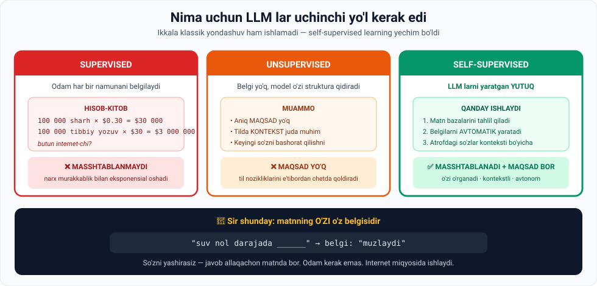

# 5-dars. LLM o'qitish samaradorligi — Supervised vs Semi-supervised

> **Modul:** 05. Intro to AI — Understanding Generative AI · **Manba:** `5. The efficiency of LLM training. Supervised vs Semi-supervised learning.vtt`
> ⏱ **O'qish vaqti:** ~15 daqiqa · 🎯 **Daraja:** o'rta · 💻 **Python amaliyoti bor**

---

## 🎬 Boshlashdan oldin: bitta hisob

Odamlar aytadi: **"ChatGPT deyarli butun internetni o'qigan."**

Endi hisoblang: agar har bir sahifani odam o'qib, belgilashi kerak bo'lsa —

```
1 000 000 000 sahifa  ×  $0.30  =  $300 000 000
```

**300 million dollar.** Va bu — eng arzon variant.

> **Demak, LLM lar boshqacha ishlaydi.** Bu dars — qanday, degan savolga javob.

---

## 1. Supervised learning — muammo

*(03-modulni eslang: supervised = belgilangan ma'lumot.)*

> **Supervised machine learning'da biz kompyuterga BELGILANGAN ma'lumot beramiz.**

### Ma'ruzadagi misol

```
Vazifa:  ijobiy va salbiy mijoz sharhlarini ajratish
Dataset: 100 000 ta mijoz sharhi
Ish:     har birini QO'LDA "positive" yoki "negative" deb belgilash
```

> Kompyuter keyin bu belgilardan foydalanib, **yangi, ko'rilmagan sharhlarni** ijobiy yoki salbiy deb toifalashni o'rganadi.

### ⚠️ Kamchilik

> **Bu yondashuvning kamchiligi — ma'lumotni belgilash QIMMAT.**

---

## 2. 💰 Narx hisobi — ma'ruzadan



### Oddiy sharh

```
1 ta sharhni toifalash        =  $0.30
100 000 ta sharh              =  $30 000
```

### Murakkabroq ma'lumot

> **Sharhni toifalash ancha ODDIY. Maqolalar, romanlar yoki TIBBIY YOZUVLARNI saralash qanchalik qimmatroq bo'lishini tasavvur qila olasizmi?**
>
> **U $0.30 emas, ehtimol $30 yoki undan ko'proq turadi.**

```
100 000 ta tibbiy yozuv  ×  $30  =  $3 000 000 dan ortiq
```

### 🔑 Xulosa

> **Demak, supervised learning MASSHTABLILIK jihatidan sezilarli cheklovlarga ega —**
> **narx modelga beriladigan ma'lumotning MURAKKABLIGI bilan EKSPONENSIAL oshadi.**

---

## 3. Internet miqyosida

> **Odamlar ko'pincha ChatGPT deyarli butun internetni o'qigan deb aytishadi.**
>
> **Butun vebni o'qish va toifalash uchun qancha MEHNAT kerak bo'lishini tasavvur qila olasizmi?**

Va yana bir muammo:

> **Agar bu ish atigi bir necha kishi tomonidan qilinsa, toifalashlar qanchalik BIAS (bir tomonlama) bo'lardi?**

> ⚖️ **Bu juda muhim nuqta.** Faqat narx emas — **sifat** ham muammo. 100 kishi butun internetni belgilasa, natijada **o'sha 100 kishining qarashlari** modelga singib qoladi.
>
> *(Bu haqda AI Ethics modulida batafsil gaplashiladi.)*

> **Shuning uchun large language model lar biroz BOSHQACHA yondashuvga muhtoj.**

---

## 4. Unsupervised learning — bu ham ishlamaydi

> **Ikkinchi aniq variant — unsupervised learning.**
>
> Bu ML turi **belgilarsiz** ishlaydi, ma'lumotning **asosiy tuzilmasini** to'g'ridan-to'g'ri unumdorlik fikri-mulohazasisiz aniqlashga intiladi.

### Muammolar

| № | Muammo |
|---|---|
| **1** | **Aniq maqsad yo'q.** Aniq maqsadsiz model insonni tushunish yoki inson tilini generatsiya qilishga yordam beradigan tuzilmalarni o'rganishi **qiyin** |
| **2** | **Til — kontekst juda muhim bo'lgan ifoda shakli.** Bitta jumladagi so'zlar kontekst yaratadi, va **har bir paragraf oldingisini kuchaytiradi** |
| **3** | Unsupervised learning **oldingi kontekstdan keyingi so'zni bashorat qilishga ustuvorlik bermaydi** — bu **muhim til nozikliklarini e'tibordan chetda qoldirishi** mumkin |

---

## 5. ⭐ Yechim: Self-supervised learning

> **Shuning uchun bizga MUVOZANATLI yondashuv kerak.**
>
> **Masshtablanadigan, o'zi o'rganadigan, kontekstli bashorat qiladigan va AVTONOM tarzda BELGILARNI O'ZI YARATADIGAN ML tizimi.**

> ## **Self-supervised learning yondashuvi — LLM larni yaratishga olib kelgan YUTUQ.**

### Qanday ishlaydi

> **U matn bazalarini tahlil qiladi, AVTOMATIK ravishda belgilarni yaratadi va atrofdagi so'zlarning kontekstli ishoralari asosida keyingi kontentni bashorat qiladi.**

### 🔑 Sirning kaliti

> **Matnning O'ZI o'z belgisidir.**

```
Xom matn:   "suv nol darajada muzlaydi"
                              ↓
Model o'zi yaratadi:
   Kirish:  "suv nol darajada ______"
   Belgi:   "muzlaydi"              ← javob ALLAQACHON matnda bor!
```

**Hech qanday odam kerak emas.** Va bu **butun internet miqyosida** ishlaydi.

### Natija

> **Bu GIBRID yondashuv ChatGPT kabi modellarni yaratishga imkon berdi va ularning tilni TABIIY va XABARDOR tarzda tushunish hamda generatsiya qilish qobiliyatini yaxshiladi.**

---

## 6. 📊 Uchtasining solishtiruvi

| Mezon | Supervised | Unsupervised | **Self-supervised** |
|---|---|---|---|
| **Belgilar** | Odam yaratadi | Yo'q | **Model o'zi yaratadi** |
| **Narx** | ❌ Juda qimmat | ✅ Arzon | ✅ **Arzon** |
| **Masshtablilik** | ❌ Yo'q | ✅ Ha | ✅ **Ha** |
| **Aniq maqsad** | ✅ Bor | ❌ Yo'q | ✅ **Bor** |
| **Kontekst** | ✅ Hisobga oladi | ⚠️ Ustuvor emas | ✅ **Markazda** |
| **Bias xavfi** | ❌ Yuqori (kam odam) | — | ⚠️ Ma'lumotdan keladi |
| **LLM uchun** | ❌ | ❌ | ✅ **Aynan shu** |

---

## 7. 💻 Amaliyot 1: narxni o'z ko'zingiz bilan ko'ring

```python
TURLAR = [
    ("Mijoz sharhi",      0.30, "1-2 jumla"),
    ("Yangilik maqolasi", 5.00, "1-2 sahifa"),
    ("Tibbiy yozuv",     30.00, "mutaxassis kerak"),
    ("Roman",           150.00, "300+ sahifa"),
]
HAJM = 100_000

print("SUPERVISED LEARNING: {:,} ta namunani belgilash narxi\n".format(HAJM))
print("Ma'lumot turi".ljust(20) + "1 dona".rjust(10) + "Jami".rjust(16) + "   Izoh")
print("-" * 72)
for nom, narx, izoh in TURLAR:
    jami = narx * HAJM
    print(nom.ljust(20) + f"{narx:>9.2f}$" + f"{jami:>15,.0f}$" + f"   {izoh}")

print("\n--- Internet miqyosida ---")
SAHIFA = 1_000_000_000
print(f"1 milliard sahifani 0.30$ dan belgilash: {0.30*SAHIFA:,.0f}$")

print("\nXulosa: supervised learning MASSHTABLANMAYDI.")
print("Shuning uchun LLM lar SELF-SUPERVISED yondashuvdan foydalanadi.")
```

### Haqiqiy natija

```
SUPERVISED LEARNING: 100,000 ta namunani belgilash narxi

Ma'lumot turi           1 dona            Jami   Izoh
------------------------------------------------------------------------
Mijoz sharhi             0.30$         30,000$   1-2 jumla
Yangilik maqolasi        5.00$        500,000$   1-2 sahifa
Tibbiy yozuv            30.00$      3,000,000$   mutaxassis kerak
Roman                  150.00$     15,000,000$   300+ sahifa

--- Internet miqyosida ---
1 milliard sahifani 0.30$ dan belgilash: 300,000,000$
```

---

## 8. 💻 Amaliyot 2: self-supervised belgilarni o'zi yaratadi

```python
MATN = "suv nol darajada muzlaydi va yuz darajada qaynaydi"
sozlar = MATN.split()

print("XOM MATN (hech kim belgilamagan):")
print(f"  {MATN}\n")
print("MODEL O'ZI YARATGAN O'QUV NAMUNALARI:\n")

for i in range(1, len(sozlar)):
    kirish = " ".join(sozlar[:i])
    belgi = sozlar[i]
    print(f"  kirish: {kirish + ' ___':<48} belgi: {belgi}")

print(f"\nBitta jumladan {len(sozlar)-1} ta o'quv namunasi olindi.")
print("Hech qanday odam ishtirok etmadi. Narxi: 0$")
```

### Haqiqiy natija

```
XOM MATN (hech kim belgilamagan):
  suv nol darajada muzlaydi va yuz darajada qaynaydi

MODEL O'ZI YARATGAN O'QUV NAMUNALARI:

  kirish: suv ___                                          belgi: nol
  kirish: suv nol ___                                      belgi: darajada
  kirish: suv nol darajada ___                             belgi: muzlaydi
  kirish: suv nol darajada muzlaydi ___                    belgi: va
  kirish: suv nol darajada muzlaydi va ___                 belgi: yuz
  kirish: suv nol darajada muzlaydi va yuz ___             belgi: darajada
  kirish: suv nol darajada muzlaydi va yuz darajada ___    belgi: qaynaydi

Bitta jumladan 7 ta o'quv namunasi olindi.
Hech qanday odam ishtirok etmadi. Narxi: 0$
```

### 🔑 Mana shu — butun sirning kaliti

**Bitta 8 so'zli jumladan 7 ta bepul o'quv namunasi.**

Endi hisoblang:

```
1 ta kitob ≈ 100 000 so'z   →  ~100 000 ta o'quv namunasi
1 000 000 ta kitob          →  100 MILLIARD o'quv namunasi
Narxi                       →  0$
```

> 🎯 **Aynan shuning uchun ChatGPT butun internetni "o'qiy" oldi.** Belgilash bepul, chunki **belgi matnning ichida allaqachon bor**.

---

## 9. ⚡ Amaliy topshiriqlar

### 🟢 Oson — 10 daqiqa · **O'z narxingizni hisoblang**

Sizga model qurish topshirildi. Hisoblang:

```
Vazifa: O'zbek tilidagi yangiliklarni 5 toifaga ajratish
        (siyosat / sport / iqtisod / madaniyat / texnologiya)

1. 1 ta maqolani o'qib, toifalashga qancha vaqt ketadi?  ___ daqiqa
2. Soatiga to'lov (O'zbekistonda):                       ___ so'm
3. 1 ta maqolaning narxi:                                ___ so'm
4. 50 000 ta maqola uchun jami:                          ___ so'm
5. Bu qancha AQSh dollari?                               ___ $

6. Bu byudjet sizda bormi?  ha / yo'q
7. Agar yo'q bo'lsa — nima qilasiz?  ______________________
```

### 🟡 O'rta — 20 daqiqa · **Self-supervised namunalarni yarating**

Yuqoridagi 2-skriptni oling va:

1. `MATN` o'rniga **o'z paragrafingizni** qo'ying (kamida 50 so'z).
2. Nechta o'quv namunasi hosil bo'ldi? ______
3. Kodni o'zgartiring — **masked** uslubda ishlasin:
   ```python
   for i in range(len(sozlar)):
       nusxa = sozlar.copy()
       belgi = nusxa[i]
       nusxa[i] = "___"
       print(f"  kirish: {' '.join(nusxa):<60} belgi: {belgi}")
   ```
4. Ikkala uslubda **nechtadan** namuna chiqdi? Farqi nima?
5. Qaysi biri **GPT** ishlatadigan uslub? *(4-darsni eslang)*

### 🔴 Qiyin — muhokama · **Bias muammosi**

Ma'ruza savol beradi: *"Agar toifalash atigi bir necha kishi tomonidan qilinsa, u qanchalik bias bo'lardi?"*

```
1. Tasavvur qiling: 50 kishi butun internetni "foydali / zararli"
   deb belgilaydi. Ular kim bo'lishi mumkin?
   • Yoshi:        ______
   • Mamlakati:    ______
   • Tili:         ______
   • Ma'lumoti:    ______

2. Bu qanday KO'R NUQTALAR yaratadi?
   a) _______________________________________
   b) _______________________________________
   c) _______________________________________

3. Self-supervised bu muammoni YECHDIMI?  ha / yo'q / qisman
   Tushuntiring: ____________________________________

4. Agar model butun internetdan o'rgansa — internetning O'ZIDAGI
   bias-lar nima bo'ladi?
   ______________________________________________
```

> ⚠️ **Muhim:** self-supervised **belgilash bias**ini yechdi, lekin **ma'lumot bias**ini yechmadi. Agar internetda biror qarash ustunlik qilsa — model uni o'zlashtiradi. Bu bugungi eng jiddiy muammolardan biri.

---

## 10. 🧠 O'zini tekshirish savollari

1. Supervised learning'da kompyuterga nima beriladi?
2. Ma'ruzadagi mijoz sharhlari misolini tushuntiring.
3. 1 ta sharh $0.30 bo'lsa, 100 000 tasi qancha?
4. Tibbiy yozuvlar uchun narx qancha bo'lishi mumkin?
5. Supervised learning ning asosiy cheklovi nima?
6. Belgilashni kam kishi qilsa, qanday muammo yuzaga keladi?
7. Unsupervised learning nima uchun LLM uchun mos emas? 3 sabab.
8. Nima uchun til uchun kontekst juda muhim?
9. Self-supervised learning nima qiladi? 3 qadamda.
10. Bu yondashuv nimaga imkon berdi?

<details>
<summary>✅ Javoblar</summary>

1. **Belgilangan (labelled) ma'lumot.**
2. 100 000 ta sharhni **qo'lda** "positive"/"negative" deb belgilash → kompyuter shu belgilardan **yangi, ko'rilmagan** sharhlarni toifalashni o'rganadi.
3. **$30 000.**
4. **$30 yoki undan ko'proq** — jami **$3 000 000 dan ortiq**.
5. **Masshtablilik** — narx ma'lumot **murakkabligi bilan eksponensial** oshadi.
6. **Bias** — toifalashlar bir tomonlama bo'ladi.
7. (a) **Aniq maqsad yo'q**; (b) tilda **kontekst juda muhim**, u esa buni hisobga olmaydi; (c) **keyingi so'zni bashorat qilishga ustuvorlik bermaydi** → til nozikliklarini o'tkazib yuboradi.
8. Bitta jumladagi so'zlar **kontekst yaratadi**, va **har bir paragraf oldingisini kuchaytiradi**.
9. (a) Matn bazalarini **tahlil qiladi**; (b) **avtomatik ravishda belgilarni yaratadi**; (c) **atrofdagi so'zlarning kontekstli ishoralari** asosida keyingi kontentni bashorat qiladi.
10. **ChatGPT kabi modellarni yaratishga** va ularning tilni **tabiiy va xabardor** tarzda tushunish hamda generatsiya qilish qobiliyatini yaxshilashga.

</details>

---

## 📌 Xulosa

```
SUPERVISED       belgilar QIMMAT      $3 mln / 100k tibbiy yozuv
                 masshtablanmaydi     ❌

UNSUPERVISED     belgilar YO'Q        maqsad yo'q, kontekst yo'q
                 ❌

SELF-SUPERVISED  model belgini O'ZI yaratadi
                 "suv nol darajada ___"  →  belgi: "muzlaydi"
                 narxi: 0$   ·   masshtablanadi   ·   maqsad bor
                 ✅  LLM larni yaratgan YUTUQ
```

---

## 🔖 Atamalar

| Atama | Inglizcha | Izoh |
|---|---|---|
| Self-supervised learning | *self-supervised learning* | Model belgilarni o'zi yaratadi |
| Masshtablilik | *scalability* | Hajm oshganda ishlay olish |
| Eksponensial o'sish | *exponential increase* | Tobora tezlashib boruvchi o'sish |
| Bias | *bias* | Bir tomonlamalik, qiyshiqlik |
| Kontekstli ishora | *contextual cue* | Atrofdagi so'zlar bergan belgi |
| Gibrid yondashuv | *hybrid approach* | Ikki usulning birlashmasi |
| Xabardor | *aware* | Kontekstni hisobga oluvchi |

---

⬅️ [Oldingi: LM dan LLM ga](04-From-LM-to-LLM.md) · ➡️ [Keyingi: N-gram dan Transformer gacha](06-From-Ngrams-to-Transformers.md)
