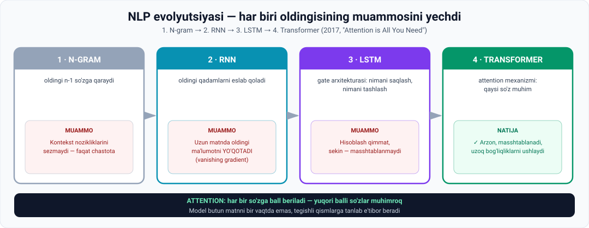

# 6-dars. N-gram dan RNN va Transformer gacha — NLP evolyutsiyasi

> **Modul:** 05. Intro to AI — Understanding Generative AI · **Manba:** `6. From N-Grams to RNNs to Transformers The Evolution of NLP.vtt`
> ⏱ **O'qish vaqti:** ~18 daqiqa · 🎯 **Daraja:** o'rta · 💻 **Python amaliyoti bor** · ⭐ **Modulning eng texnik darsi**

---

## 🎬 Boshlashdan oldin

Bu dars — **detektiv hikoya**.

To'rtta texnologiya. Har biri oldingisining **muammosini yechadi** va **yangisini yaratadi**. Oxirgisi — bugungi barcha AI ning poydevori.

> **Har bir bosqichda o'zingizga bitta savol bering:** *"Bu nimani yecha olmadi?"*
>
> Javob har doim keyingi texnologiyani tug'diradi.

---

## 1. Bu darsning maqsadi

> Ilgari biz til modellarining **ajoyib evolyutsiyasini** — statistik modellashtirish va oddiy vazifalardan **ilg'or neyron tarmoqlar va LLM larga** qadar — muhokama qildik.
>
> Bu darsda men til modellashtirish dunyosini **ko'proq o'rganmoqchiman**, manzaraga **texnik tafsilot** qo'shib.
>
> Biz **4 ta asosiy texnikani** va **har biri oldingi muammolarni qanday yechganini** tasvirlaymiz.



---

## 2. 1️⃣ N-grams

> **Birinchi texnika — N-grams — til modellashtirishning FUNDAMENTAL QURILISH BLOKI.**

### G'oya

> **N-gram ortidagi g'oya ancha oddiy: biz so'zning ehtimolini OLDINGI n−1 TA so'zga asoslanib baholay olamiz.**

### Unigram (n = 1)

```
n = 1  →  n − 1 = 0  →  KONTEKST YO'Q
```

> **Demak, bashorat hech qanday kontekstga asoslanmaydi.**

**Ma'ruzadagi misol:**

```
Jumla:  "My favorite sport is ______"
```

> **N-gram modeli `basketball` ni bashorat qilish uchun `my favorite sport is` dagi HECH BIR SO'ZDAN foydalanmaydi.**
>
> Buning o'rniga u **butun matnni ko'rib chiqadi** va **eng ko'p uchraydigan so'zni** qidiradi — eng yuqori chastotali so'z bo'sh joyni to'ldirish uchun **eng yaxshi tanlov** deb faraz qilib.

> **Shuning uchun unigram modeli `the` yoki `and` kabi keng tarqalgan so'zlarni bashorat qilishi mumkin** — jumladagi oldingi so'zlarga **umuman mos kelmasa ham**.

### Bigram (n = 2)

> `basketball` bashorati **faqat oldingi BITTA so'zga** bog'liq.

```
"My favorite sport is"  →  biz "is" ga e'tibor beramiz
                        →  training data'da "is" dan keyin kelgan
                           barcha so'zlarning chastotasini tahlil qilamiz
```

### Trigram (n = 3)

> Model training data'dagi **`sport is`** holatlarini tahlil qiladi va **eng ko'p uchraydigan keyingi so'zni** bashorat qiladi.

### ⚠️ N-gram ning muammosi

> **Ideallikdan uzoq, shunday emasmi?**
>
> **Model KONTEKST va oldingi ma'lumot nozikliklarini o'tkazib yuboradi.** U shunchaki **training data'dagi paydo bo'lish CHASTOTALARIGA** asoslanib bashoratlarni optimallashtirishga intiladi.

---

## 3. 💻 Amaliyot: N-gram larni solishtiring

Hech narsa o'rnatmasdan ishlaydi. Ma'ruzaning misolini **o'z ko'zingiz bilan** ko'rasiz.

```python
from collections import Counter

MATN = """
mening sevimli sportim basketbol
mening sevimli sportim futbol
uning sevimli sportim basketbol
sevimli sportim basketbol edi
men va do'stim basketbol o'ynaymiz
bu sportim emas lekin men uni yaxshi ko'raman
sport va sportim haqida ko'p gapiramiz
"""
sozlar = MATN.split()
JUMLA = ["mening", "sevimli", "sportim"]

print("Vazifa: 'mening sevimli sportim ___' - bo'sh joyni to'ldiring")
print("To'g'ri javob (odam uchun): basketbol\n")

for n in (1, 2, 3):
    print(f"--- {n}-GRAM (oldingi {n-1} ta so'zga qaraydi) ---")
    if n == 1:
        c = Counter(sozlar)
        bashorat, soni = c.most_common(1)[0]
        print("  Kontekst: YO'Q (n-1 = 0)")
        print(f"  Eng ko'p uchraydigan so'z: '{bashorat}' ({soni} marta)")
    else:
        kontekst = tuple(JUMLA[-(n-1):])
        nomzodlar = []
        for i in range(len(sozlar) - (n-1)):
            if tuple(sozlar[i:i+n-1]) == kontekst:
                nomzodlar.append(sozlar[i+n-1])
        c = Counter(nomzodlar)
        print(f"  Kontekst: {' '.join(kontekst)!r}")
        bashorat, soni = c.most_common(1)[0]
        print(f"  Nomzodlar: {dict(c)}")
        print(f"  Bashorat: '{bashorat}' ({soni}/{len(nomzodlar)} = {soni/len(nomzodlar)*100:.0f}%)")
    belgi = "TO'G'RI" if bashorat == "basketbol" else "xato"
    print(f"  >>> {belgi}\n")
```

### Haqiqiy natija

```
--- 1-GRAM (oldingi 0 ta so'zga qaraydi) ---
  Kontekst: YO'Q (n-1 = 0)
  Eng ko'p uchraydigan so'z: 'sportim' (6 marta)
  >>> xato

--- 2-GRAM (oldingi 1 ta so'zga qaraydi) ---
  Kontekst: 'sportim'
  Nomzodlar: {'basketbol': 3, 'futbol': 1, 'emas': 1, 'haqida': 1}
  Bashorat: 'basketbol' (3/6 = 50%)
  >>> TO'G'RI

--- 3-GRAM (oldingi 2 ta so'zga qaraydi) ---
  Kontekst: 'sevimli sportim'
  Nomzodlar: {'basketbol': 3, 'futbol': 1}
  Bashorat: 'basketbol' (3/4 = 75%)
  >>> TO'G'RI
```

### 🔑 Uchta kuzatuv

**1. Unigram ADASHDI** — u `sportim` deb javob berdi, chunki bu **eng ko'p uchraydigan so'z**. Kontekst umuman hisobga olinmadi. **Aynan ma'ruzada aytilgani.**

**2. Bigram TO'G'RI topdi, lekin ishonch atigi 50%.**

**3. Trigram ham to'g'ri, ishonch 75% ga ko'tarildi.**

> 📈 **Naqsh aniq: ko'proq kontekst → ko'proq ishonch.** Unda nima uchun `n` ni cheksiz oshirmaymiz?
>
> **Chunki:** `n` oshgan sari, aynan o'sha ketma-ketlik training data'da **uchramay qoladi**. `n = 10` bo'lsa — deyarli har bir kombinatsiya noyob va model **hech qanday nomzod topa olmaydi**. Bu — **sparsity** muammosi.
>
> Aynan shu **RNN** ga yo'l ochdi.

---

## 4. 2️⃣ RNN — Recurrent Neural Networks

> **Neyron tarmoqlar shubhasiz ulkan sakrash.**
>
> **Recurrent neural networks yoki RNN lar — matn bilan eng yaxshi ishlaydigan neyron tarmoqlar.**

### Kuchli tomoni

> **RNN larning asosiy kuchi — neyron tarmoqdagi OLDINGI QADAMLARDAN AXBOROTNI SAQLAB QOLISH qobiliyati.**
>
> Jumladagi oldingi so'zlarni tahlil qilish RNN tarmog'iga **keyingi so'zni hal qilishda** yordam beradi.

> **Bu N-gram modellariga nisbatan sezilarli yutuq, chunki til bilan ishlashda ma'lumot nuqtalarining TARTIBI va KONTEKSTI hal qiluvchi ahamiyatga ega.**

### ⚠️ RNN ning muammosi

> **RNN lar bilan asosiy qiyinchilik — KATTA MATNLARNI qayta ishlashdagi qiyinchilik**, chunki ular **matn bo'laklari o'sib borgan sari OLDINGI AXBOROTNI YO'QOTA boshlaydi**.
>
> ### **Bu muammo VANISHING GRADIENT deb ataladi.**

> 🕳 **Oddiy tilda:** RNN romanning birinchi bobini o'qib, oxirgi bobga yetganda **bosh qahramonning ismini unutadi**.

---

## 5. 3️⃣ LSTM — Long Short-Term Memory

> **Buni yechish uchun AI olimlari LONG SHORT-TERM MEMORY yoki LSTM tarmoqlarini ishlab chiqdilar.**

### Yechim

> **LSTM lar an'anaviy RNN modellarini GATE ARXITEKTURASINI joriy qilish orqali yaxshiladi** — u **qaysi axborotni saqlash va qaysini tashlab yuborishni** tanlaydi.
>
> Bu tarmoqqa **muhim uzoq muddatli axborotni saqlash** va **ahamiyatsiz ma'lumotni unutish** imkonini beradi — bu LSTM larni **murakkab matn ma'lumoti** bilan bog'liq vazifalarda **sezilarli darajada yaxshiroq** qiladi.

> 🚪 **"Gate" — bu darvoza.** LSTM har bir yangi so'zda o'ziga savol beradi: *"Buni eslab qolaymi? Eskisini unutaymi?"*

### ⚠️ LSTM ning muammosi

> **LSTM larning asosiy kamchiligi — ularning YUQORI HISOBLASH NARXI va katta datasetlarda SEKIN o'qitish tezligi**, bu ularni **MASSHTABLANMAYDIGAN** qiladi.

---

## 6. 4️⃣ ⭐ Transformer — 2017

> **Lekin 2017-yilda "ATTENTION IS ALL YOU NEED" maqolasi TRANSFORMER tushunchasini va ATTENTION MEXANIZMINI taqdim etdi.**

### Attention mexanizmi nima?

> **Attention mexanizmi modelga kirish ketma-ketligidagi turli SO'ZLAR yoki SO'Z QISMLARI (TOKEN lar) ning AHAMIYATINI baholash imkonini beradi** — natija generatsiya qilish uchun.
>
> **Shuning uchun model KALIT SO'ZLARNI aniqlaydi va ularga KUCHLIROQ e'tibor qaratadi** — bu **hisoblash narxini pasaytiradi** va **masshtablilikni oshiradi**.

### Qanday ishlaydi

> **Transformer lar matnni butun matnni BIR VAQTDA qayta ishlash o'rniga, HAR BIR QADAMDA ketma-ketlikning TEGISHLI QISMLARIGA TANLAB e'tibor berish orqali qayta ishlaydi.**
>
> **Bunga kirish ketma-ketligidagi har bir so'zga ATTENTION SCORE (e'tibor bali) berish orqali erishiladi.**
>
> **Yuqori attention score ga ega so'zlar MUHIMROQ deb hisoblanadi** — bu Transformer larga **UZOQ MASOFALI BOG'LIQLIKLARNI (long-range dependencies)** boshqarish imkonini beradi.

### 📊 Misol bilan

```
Jumla:  "Kecha Toshkentda olgan telefonim juda tez ishlaydi"

Savol:  "ishlaydi" — nima ishlaydi?

RNN:      "Kecha... Toshkentda... olgan..."  → "telefonim" ni unutgan bo'lishi mumkin
TRANSFORMER:
          Kecha        attention: 0.02
          Toshkentda   attention: 0.03
          olgan        attention: 0.05
          telefonim    attention: 0.71   ← BU!
          juda         attention: 0.09
          tez          attention: 0.10
```

> **Model to'g'ridan-to'g'ri kerakli so'zga "qaraydi"** — masofadan qat'i nazar. Aynan shu — **uzoq masofali bog'liqlik**.

---

## 7. 📊 To'rtta texnikaning solishtiruvi

| | N-gram | RNN | LSTM | **Transformer** |
|---|---|---|---|---|
| **Kontekst** | n−1 so'z | Oldingi qadamlar | Tanlangan uzoq muddatli | **Butun ketma-ketlik** |
| **Tartibni hisobga oladimi** | ❌ Zaif | ✅ Ha | ✅ Ha | ✅ **Ha** |
| **Uzoq matn** | ❌ | ❌ Unutadi | ⚠️ Yaxshiroq | ✅ **A'lo** |
| **Tezlik** | ✅ Tez | ⚠️ O'rtacha | ❌ Sekin | ✅ **Tez** |
| **Masshtablilik** | ⚠️ | ⚠️ | ❌ **Yo'q** | ✅ **Ha** |
| **Asosiy muammosi** | Kontekstni sezmaydi | Vanishing gradient | Qimmat va sekin | — |
| **Yil** | — | — | — | **2017** |

---

## 8. Xulosa

> **Endi siz ChatGPT kabi LLM larning yaratilishini mumkin qilgan texnologiya qanday paydo bo'lganini bilasiz.**

---

## 9. ⚡ Amaliy topshiriqlar

### 🟢 Oson — 10 daqiqa · **N-gram ni sinang**

Yuqoridagi kodni ishga tushiring va:

1. `JUMLA` ni o'zgartiring: `["men", "va", "do'stim"]`. Har bir n uchun natija qanday?
2. `MATN` ga **`mening sevimli sportim tennis`** qatorini qo'shing. Trigram ishonchi qanday o'zgardi?
3. `n = 4` uchun kod qo'shing. Nima bo'ldi? **Nega?**

<details>
<summary>💡 Javob ilgagi (3-savol)</summary>

`n = 4` da kontekst `"mening sevimli sportim"` bo'ladi — bu ketma-ketlik matnda **faqat 2 marta** uchraydi. Ishonch oshadi, **lekin** namunalar soni juda kamayadi.

Bu — **sparsity** muammosi. `n` oshgan sari model "ishonchli, lekin deyarli hech qachon javob bermaydigan" holatga keladi.

</details>

### 🟡 O'rta — 25 daqiqa · **Attention ballarini o'zingiz bering**

Har bir jumla uchun **qaysi so'z eng muhim** ekanini aniqlang va ball bering (jami = 1.0):

```
1. "Kecha bozordan olgan olma juda shirin edi"
   Savol: nima shirin?
   Kecha ___ bozordan ___ olgan ___ olma ___ juda ___ shirin ___

2. "Ali Vali ga kitobni berdi, chunki U uni o'qimoqchi edi"
   Savol: "U" kim?  (Ali mi, Vali mi?)
   Ali ___ Vali ___ kitobni ___ berdi ___ chunki ___ uni ___ o'qimoqchi ___

3. "Toshkentda tug'ilgan, Samarqandda o'qigan va Buxoroda
    ishlaydigan bu odam uch shaharni ham yaxshi ko'radi"
   Savol: nechta shahar?
```

**Muhokama:** 2-jumla **odam uchun ham** noaniq. Bu qanday muammoni ko'rsatadi?

### 🔴 Qiyin — mini-loyiha · **Muammo–yechim zanjirini quring**

Har bir texnologiya oldingisining muammosini yechdi. Zanjirni to'ldiring:

```
N-GRAM
  Muammo:  ______________________________________
     ↓ yechim:
RNN
  Yechdi:  ______________________________________
  Yangi muammo: ________________________________
     ↓ yechim:
LSTM
  Yechdi:  ______________________________________
  Yangi muammo: ________________________________
     ↓ yechim:
TRANSFORMER
  Yechdi:  ______________________________________
  Yangi muammo: ________________________________  ← siz nima deb o'ylaysiz?
```

**Oxirgi savolga javob bering:** Transformer ning **bugungi muammolari** nima? Kamida 3 tasi.

<details>
<summary>💡 Ilgak — Transformer ning bugungi muammolari</summary>

- **Kontekst oynasi cheklangan** — model bir vaqtda faqat ma'lum hajmdagi matnni ko'ra oladi
- **Hisoblash narxi** — attention hisoblash matn uzunligi kvadratiga proporsional o'sadi
- **Energiya sarfi** — katta modellarni o'qitish juda ko'p elektr talab qiladi
- **Gallyutsinatsiya** — model ishonch bilan noto'g'ri javob berishi mumkin
- **Ma'lumot bias** — internetdagi qiyshiqliklar modelga o'tadi

</details>

---

## 10. 🧠 O'zini tekshirish savollari

1. N-gram g'oyasi nima?
2. Unigram (n=1) da kontekst bormi? U nimani bashorat qiladi?
3. Bigram va trigram farqi nima?
4. N-gram ning asosiy muammosi nima?
5. RNN ning asosiy kuchi nima?
6. RNN nima uchun N-gram dan ustun?
7. RNN ning muammosi nima deb ataladi?
8. LSTM qanday yechim taklif qildi?
9. LSTM ning kamchiligi nima?
10. Transformer qachon va qaysi maqolada taqdim etilgan?
11. Attention mexanizmi nima qiladi?
12. Attention score nima va u nimaga imkon beradi?

<details>
<summary>✅ Javoblar</summary>

1. So'zning ehtimolini **oldingi n−1 ta so'zga** asoslanib baholash.
2. **Yo'q** (n−1 = 0). U **eng ko'p uchraydigan so'zni** bashorat qiladi — masalan `the` yoki `and`.
3. **Bigram** — oldingi **1 ta** so'zga qaraydi; **trigram** — oldingi **2 ta** so'zga.
4. **Kontekst va oldingi ma'lumot nozikliklarini o'tkazib yuboradi** — faqat **chastotalarga** tayanadi.
5. **Neyron tarmoqdagi oldingi qadamlardan axborotni saqlab qolish.**
6. Chunki tilda **ma'lumot nuqtalarining tartibi va konteksti** hal qiluvchi ahamiyatga ega.
7. **Vanishing gradient** — matn o'sgan sari oldingi axborotni yo'qotadi.
8. **Gate arxitekturasi** — qaysi axborotni **saqlash**, qaysini **tashlab yuborishni** tanlaydi.
9. **Yuqori hisoblash narxi** va **sekin o'qitish tezligi** → **masshtablanmaydi**.
10. **2017-yil**, **"Attention is All You Need"** maqolasi.
11. Kirish ketma-ketligidagi **so'zlar yoki token larning ahamiyatini baholash** imkonini beradi.
12. Har bir so'zga beriladigan **e'tibor bali**; yuqori balli so'zlar muhimroq. Bu **uzoq masofali bog'liqliklarni** boshqarish imkonini beradi.

</details>

---

## 📌 Xulosa

```
1  N-GRAM       n-1 so'zga qaraydi
                ❌ kontekst nozikliklarini sezmaydi
       ↓
2  RNN          oldingi qadamlarni eslab qoladi
                ❌ vanishing gradient — uzun matnda unutadi
       ↓
3  LSTM         gate: nimani saqlash, nimani tashlash
                ❌ qimmat va sekin — masshtablanmaydi
       ↓
4  TRANSFORMER  attention: har bir so'zga BALL
   (2017)       ✅ arzon · masshtablanadi · uzoq bog'liqliklar
                → LLM lar mumkin bo'ldi
```

---

## 🔖 Atamalar

| Atama | Inglizcha | Izoh |
|---|---|---|
| N-gram | *n-gram* | n ta so'zdan iborat ketma-ketlik |
| Unigram / Bigram / Trigram | *unigram / bigram / trigram* | n = 1 / 2 / 3 |
| Chastota | *frequency* | Uchrash soni |
| RNN | *Recurrent Neural Network* | Ketma-ketlik bilan ishlovchi tarmoq |
| Vanishing gradient | *vanishing gradient* | Uzoq matnda axborot yo'qolishi |
| LSTM | *Long Short-Term Memory* | Gate li takomillashtirilgan RNN |
| Gate arxitekturasi | *gate architecture* | Nimani saqlash/tashlashni tanlash |
| Transformer | *Transformer* | 2017-yilgi arxitektura |
| Attention | *attention mechanism* | So'zlar ahamiyatini baholash |
| Attention score | *attention score* | So'zga berilgan e'tibor bali |
| Token | *token* | So'z yoki so'z qismi |
| Uzoq masofali bog'liqlik | *long-range dependency* | Uzoqdagi so'zlar orasidagi aloqa |
| Sparsity | *sparsity* | Ma'lumotda kombinatsiyalarning kamligi |

---

⬅️ [Oldingi: LLM o'qitish samaradorligi](05-Efficiency-of-LLM-training.md) · ➡️ [Keyingi: LLM qurish bosqichlari](07-Phases-in-building-LLMs.md)
