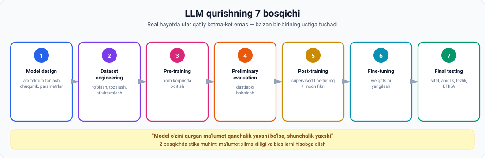

# 7-dars. LLM qurish bosqichlari

## 🎬 Boshlashdan oldin

ChatGPT'ga savol berasiz — 2 soniyada javob keladi.

Lekin o'sha modelni **yaratish** uchun necha oy va necha yuz million dollar ketgan?

> Bu dars — **parda ortidagi jarayon**. Va u sizga bir narsani ko'rsatadi: **kod yozish — eng oxirgi bosqich**.

---

## 1. Bosqichlar haqida eslatma

> Bu videoda biz large language model qurishning turli bosqichlarini muhokama qilamiz:
>
> **model design · dataset engineering · pre-training · preliminary evaluation · post-training · fine-tuning · final testing and evaluation**

> ⚠️ **Muhim:** **Bu bosqichlar real dunyo muhitida har doim ham QAT'IY KETMA-KET emas va ba'zan bir-birining ustiga tushishi mumkin.**
>
> Shunga qaramay, bu ko'rinishdan foydalanish LLM yaratish jarayonini **tasvirlash va tushuntirishni ancha osonlashtiradi.**



---

## 2. 1️⃣ Model design

> **Biz muhokama qilgan dastlabki bosqich — model design — AI strateglari va ishlab chiquvchilarining qaysi NEYRON TARMOQ ARXITEKTURASINI qo'llashni tanlashini o'z ichiga oladi.**

### Qanday tanlovlar qilinadi

| Tanlov | Variantlar |
|---|---|
| **Arxitektura** | Transformers, CNN, RNN va h.k. |
| **Modelning chuqurligi** | Neyron tarmoqdagi **qatlamlar soni** |
| **Umumiy parametrlar** | Model o'z ichiga oladigan **jami parametrlar soni** |

### Nima uchun bu muhim

> **Ushbu bosqichdagi arxitektura tanlovlari ISH HAJMINI va modelning NIMA QILA OLISHINI hamda NIMA QILA OLMASLIGINI belgilaydi.**

> 🏗 **Analogiya:** bino loyihasi. 5 qavatlik poydevorga 50 qavat qurib bo'lmaydi. Bu qaror **eng boshida** qabul qilinadi va keyin uni o'zgartirish deyarli imkonsiz.

---

## 3. 2️⃣ Dataset engineering

### Mashhur ibora

> **Ma'lumot bilan ishlaydiganlar orasida mashhur bir gap bor:**
>
> ## **"Model uni qurish uchun ishlatilgan MA'LUMOT qanchalik yaxshi bo'lsa, shunchalik yaxshi."**

*(02-moduldagi **"Garbage in, garbage out"** ni eslang. Xuddi shu g'oya.)*

### Bosqich nimalarni o'z ichiga oladi

> **Shubhasiz, dataset engineering bosqichi hal qiluvchi ahamiyatga ega** — u model uchun o'quv ma'lumotini:
>
> - **to'plash** (collection)
> - **tozalash** (cleansing)
> - **strukturalash** (structuring)

### Ma'lumot olishning ikki yo'li

> **AI model qurish uchun ma'lumot olishning IKKI ASOSIY yo'li bor:**

| Yo'l | Izoh |
|---|---|
| **1 · Web scraping** | Internetdan **ochiq mavjud** ma'lumotni qirib olish |
| **2 · Proprietary data** | **O'z mulki** bo'lgan ma'lumotdan foydalanish |

> **Lekin KAM kompaniyada faqat proprietary ma'lumot bilan LLM qurish uchun yetarli ma'lumot bor.**

### 💎 Strategik xulosa

> **Bernard Marr kabi ko'plab AI strateglari shunga rozi:**
>
> ## **ENG KO'P PROPRIETARY MA'LUMOTGA EGA kompaniyalar AI tizimlarini qurishda RAQOBAT USTUNLIGIGA ega bo'lishi ehtimoli katta.**

> 💡 **Bu nimani anglatadi?** Algoritm — hammaga ochiq. Hisoblash quvvati — pulga sotib olinadi. **Ma'lumot esa — nusxalab bo'lmaydi.**
>
> Shuning uchun bank, kasalxona yoki marketpleys — o'z ma'lumoti bilan **kuchli ustunlikka** ega.

### ⚖️ Etika

> **Dataset engineering bilan shug'ullanuvchi AI ishlab chiquvchilari uchun KALIT ETIK MASALALARNI hisobga olish MUHIM**, jumladan:
>
> - **ma'lumot xilma-xilligi** (data diversity)
> - **turli BIAS larni hisobga oladigan datasetlar qurish**

---

## 4. 3️⃣ Pre-training

> **Bu tayyorgarliklar tugagach, PRE-TRAINING bosqichi boshlanadi** — u modelni dataset engineering bosqichidan olingan **XOM MA'LUMOTNING KATTA KORPUSIDA** o'qitishni o'z ichiga oladi.

### Natija

> **Pre-training davomida biz modelning XOM VERSIYASINI olamiz.**

### ⚠️ Muammo

> **Lekin pre-training ma'lumotiga qarab, model NOMAQBUL CHIQISHLAR berishi mumkin.**
>
> **Masalan, agar biz uni internet forumlari ma'lumoti bilan o'qitsak, model HAQORATLI TIL va turli BIAS larni o'z ichiga olgan javoblar berishi mumkin.**

### Domen muammosi

> Bundan tashqari, biz **aniq bir soha uchun** ishlatiladigan model qurayotgan bo'lishimiz mumkin. Umumiy ma'lumotda o'qitilgan model **aniq bir sanoatda** ishlatilishi kerak bo'lganda, uning chiqishlarini **sohaning ixtisoslashgan talablariga** moslashtirishimiz kerak.

**Ma'ruzadagi misol:**

> Aytaylik, siz **mijozlarni qo'llab-quvvatlash chatboti** ustida ishlayapsiz. Bu holatda siz chatbotni **mijozga do'stona tarzda** javob berishga o'rgatishni xohlaysiz — bu mijoz **kutganlariga** va odam operator bilan gaplashgandagi **xizmat darajasiga** mos kelsin.

---

## 5. 4️⃣ Preliminary evaluation

> **Shunday qilib, AI ishlab chiquvchilari modelning DASTLABKI UNUMDORLIGINI baholaydilar va uning imkoniyatlari haqida tasavvur hosil qiladilar.**
>
> **Nimani yaxshilash kerakligini tushunganlaridan so'ng, ular bu masalalarni POST-TRAINING bosqichida hal qiladilar.**

---

## 6. 5️⃣ Post-training

> **Post-training IKKI QADAMDAN iborat:**

| Qadam | Nima qilinadi |
|---|---|
| **1** | AI ishlab chiquvchilari **yuqori sifatli ma'lumot** bilan **supervised fine-tuning** dan foydalanib, pre-trained modelni **yaxshilaydilar** |
| **2** | Ular modelni **INSON FIKR-MULOHAZASINI** — masalan **annotatsiyalarni** — qo'shish orqali **takomillashtiradilar** |

> 👤 **Diqqat: bu yerda ODAM qaytadi.** Self-supervised o'qitish ma'lumotni bepul qildi, lekin **modelni foydali va xavfsiz qilish** uchun baribir odam kerak.

---

## 7. 6️⃣ Fine-tuning

> **Model rivojlanishining keyingi bosqichi — FINE-TUNING — modelning WEIGHTS larini uning SIFATI va TEZLIGINI oshirish uchun yangilaydi.**

**Misol:**

> **Weights larni o'zgartirish orqali biz modelni KICHIKROQ va TEZROQ qila olamiz**, **aniq bir vazifa uchun ko'proq mos** va **umumiy unumdorlikda kamroq qobiliyatli**.

> ⚖️ **Bu — trade-off.** Modelni bir narsada zo'r qilsangiz, boshqasida zaiflashadi. Xuddi 03-moduldagi *narrow vs general* muvozanati.

---

## 8. 7️⃣ Final testing and evaluation

> **Nihoyat, oxirgi bosqichda biz modelni QAYTA sinaymiz va baholaymiz.**
>
> **Bu safar biz ancha QAT'IYROQmiz va o'zimizni OXIRGI FOYDALANUVCHI o'rniga qo'ymoqchimiz.**

### Nimalar baholanadi

| | |
|---|---|
| ✅ | Javob **sifati** |
| ✅ | **Aniqlik** |
| ✅ | **Tezlik** |
| ⭐ | **va eng muhimi — ETIK XULQ-ATVORI** |

> ⚖️ **"Crucially, its ethical behavior"** — ma'ruzachi buni ataylab ta'kidlaydi. Etika — qo'shimcha emas, **baholash mezoni**.

---

## 9. ⚡ Amaliy topshiriqlar

### 🟢 Oson — 10 daqiqa · **Bosqichni aniqlang**

| № | Faoliyat | Qaysi bosqich? |
|---|---|---|
| 1 | Transformer yoki RNN — qaysi biri? | |
| 2 | Vikipediya matnlarini yuklab olish va tozalash | |
| 3 | Modelni 500 milliard so'zda o'qitish | |
| 4 | Model haqoratli javob berdimi — tekshirish | |
| 5 | Modelni kichikroq va tezroq qilish | |
| 6 | Odam annotatorlar javoblarni baholaydi | |
| 7 | Qatlamlar sonini belgilash | |
| 8 | Oxirgi foydalanuvchi nuqtai nazaridan sinash | |

<details>
<summary>✅ Javoblar</summary>

1. **Model design** · 2. **Dataset engineering** · 3. **Pre-training** · 4. **Preliminary evaluation** · 5. **Fine-tuning** · 6. **Post-training** · 7. **Model design** · 8. **Final testing**

</details>

### 🟡 O'rta — 25 daqiqa · **O'z LLM loyihangizni rejalashtiring**

Farazan sizga **o'zbek tili uchun LLM** qurish topshirildi. Har bir bosqichni rejalashtiring:

```
1 · MODEL DESIGN
   Arxitektura:        ______________________
   Qatlamlar soni:     ______________________
   Parametrlar:        ______________________

2 · DATASET ENGINEERING
   Qanday manbalar?    ______________________
   Web scraping mi, proprietary mi?  ________
   ⚠️ Qanday BIAS xavfi bor?  _______________
   Ma'lumot xilma-xilligini qanday ta'minlaysiz?  ______

3 · PRE-TRAINING
   Qancha matn kerak?  ______________________
   Qanday NOMAQBUL chiqishlar bo'lishi mumkin?  ______

4 · PRELIMINARY EVALUATION
   Nimani tekshirasiz?  _____________________

5 · POST-TRAINING
   Kim inson fikri beradi?  _________________

6 · FINE-TUNING
   Qaysi vazifaga moslashtirasiz?  __________

7 · FINAL TESTING
   Etik mezonlaringiz:  _____________________
```

### 🔴 Qiyin — tadqiqot · **Proprietary data ustunligi**

Ma'ruza aytadi: **eng ko'p proprietary ma'lumotga ega kompaniyalar raqobat ustunligiga ega bo'ladi.**

```
1. O'zbekistondagi 5 ta tashkilotni sanang, ular ko'p
   PROPRIETARY ma'lumotga ega:
   a) __________________  qanday ma'lumot: ______________
   b) __________________  qanday ma'lumot: ______________
   c) __________________  qanday ma'lumot: ______________
   d) __________________  qanday ma'lumot: ______________
   e) __________________  qanday ma'lumot: ______________

2. Ularning har biri bu ma'lumotdan QANDAY AI mahsulot
   qura oladi?
   ______________________________________________

3. ⚖️ ETIK savol: bu ma'lumot ODAMLARNIKI. Kompaniya undan
   foydalanishi uchun nima kerak?
   ______________________________________________

4. Agar siz o'sha kompaniyaning AI muhandisi bo'lsangiz,
   qanday CHEGARALAR qo'yasiz?
   ______________________________________________
```

---

## 10. 🧠 O'zini tekshirish savollari

1. LLM qurishning yettita bosqichini sanang.
2. Bu bosqichlar qat'iy ketma-ketmi?
3. Model design bosqichida qanday qarorlar qabul qilinadi?
4. Bu qarorlar nimani belgilaydi?
5. Ma'lumot bilan ishlaydiganlar orasidagi mashhur gap nima?
6. Dataset engineering nimalarni o'z ichiga oladi?
7. Ma'lumot olishning ikki yo'li qaysi?
8. Bernard Marr kabi strateglar nimaga rozi?
9. Dataset engineering da qanday etik masalalar bor?
10. Pre-training natijasi nima? Qanday muammo bo'lishi mumkin?
11. Post-training ning ikki qadami qanday?
12. Fine-tuning nima qiladi? Misol keltiring.
13. Final testing da nimalar baholanadi?

<details>
<summary>✅ Javoblar</summary>

1. **Model design · dataset engineering · pre-training · preliminary evaluation · post-training · fine-tuning · final testing and evaluation.**
2. **Yo'q** — real muhitda ular har doim ham qat'iy ketma-ket emas va **bir-birining ustiga tushishi** mumkin.
3. **Neyron tarmoq arxitekturasi** (Transformer, CNN, RNN...), modelning **chuqurligi** (qatlamlar soni) va **umumiy parametrlar** soni.
4. **Ish hajmini** va modelning **nima qila olishi hamda qila olmasligini**.
5. **"Model uni qurish uchun ishlatilgan ma'lumot qanchalik yaxshi bo'lsa, shunchalik yaxshi."**
6. O'quv ma'lumotini **to'plash, tozalash va strukturalash**.
7. (a) Internetdan **ochiq ma'lumotni scraping** qilish; (b) **proprietary** (o'z mulki) ma'lumotdan foydalanish.
8. **Eng ko'p proprietary ma'lumotga ega kompaniyalar** AI tizimlarini qurishda **raqobat ustunligiga** ega bo'ladi.
9. **Ma'lumot xilma-xilligi** va **turli bias larni hisobga oladigan datasetlar** qurish.
10. Modelning **xom versiyasi**. Muammo: **nomaqbul chiqishlar** — masalan internet forumlari ma'lumotida o'qitilsa, **haqoratli til va bias lar**.
11. (a) **Yuqori sifatli ma'lumot bilan supervised fine-tuning**; (b) **inson fikr-mulohazasini** (annotatsiyalar) qo'shish.
12. Modelning **weights larini** sifat va tezlikni oshirish uchun **yangilaydi**. Misol: modelni **kichikroq va tezroq**, aniq vazifaga mos, lekin umumiy unumdorlikda kamroq qobiliyatli qilish.
13. Javob **sifati, aniqligi, tezligi** va **eng muhimi — etik xulq-atvori**.

</details>

---

## 📌 Xulosa

```
1  MODEL DESIGN            arxitektura, chuqurlik, parametrlar
                           → nima qila olishini BELGILAYDI
2  DATASET ENGINEERING     to'plash · tozalash · strukturalash
                           → "model ma'lumoti qanchalik yaxshi bo'lsa..."
                           ⚠️ etika: xilma-xillik va bias
3  PRE-TRAINING            xom korpusda o'qitish → XOM model
4  PRELIMINARY EVALUATION  nimani yaxshilash kerak?
5  POST-TRAINING           supervised FT + INSON fikri
6  FINE-TUNING             weights ni yangilash: sifat/tezlik
7  FINAL TESTING           sifat · aniqlik · tezlik · ⭐ ETIKA
```

---

## 🔖 Atamalar

| Atama | Inglizcha | Izoh |
|---|---|---|
| Model design | *model design* | Arxitektura tanlash bosqichi |
| Dataset engineering | *dataset engineering* | Ma'lumot tayyorlash bosqichi |
| Korpus | *corpus* | Katta matn to'plami |
| Pre-training | *pre-training* | Dastlabki keng o'qitish |
| Post-training | *post-training* | O'qitishdan keyingi takomillashtirish |
| Fine-tuning | *fine-tuning* | Weights ni aniq vazifaga moslash |
| Proprietary data | *proprietary data* | Kompaniyaning o'z mulki bo'lgan ma'lumot |
| Ma'lumot xilma-xilligi | *data diversity* | Manbalarning rang-barangligi |
| Annotatsiya | *annotation* | Inson tomonidan belgilash |
| Etik xulq-atvor | *ethical behavior* | Modelning axloqiy javob berishi |

---

⬅️ [Oldingi: N-gram dan Transformer gacha](06-From-Ngrams-to-Transformers.md) · ➡️ [Keyingi: Prompt engineering vs Fine-tuning vs RAG](08-Prompt-engineering-vs-Fine-tuning-vs-RAG.md)
