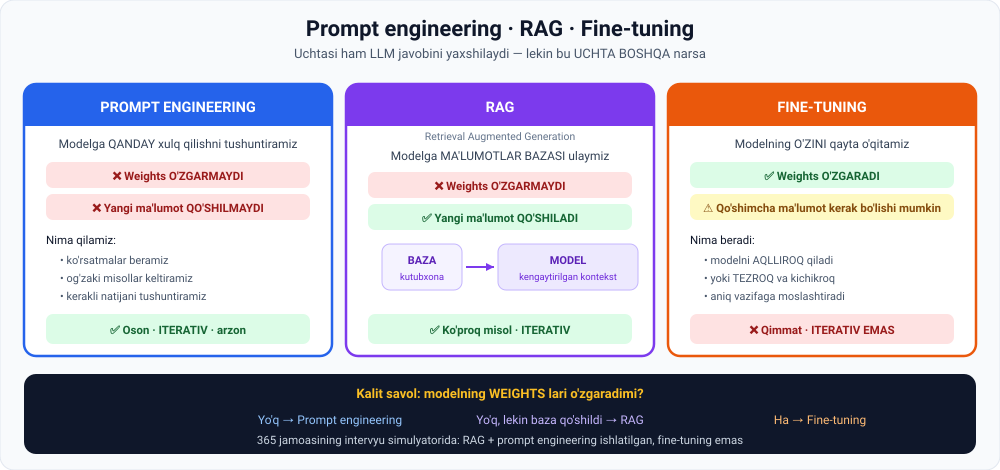

# 8-dars. Prompt engineering vs Fine-tuning vs RAG

> **Modul:** 05. Intro to AI — Understanding Generative AI · **Manba:** `8. Prompt engineering vs Fine-tuning vs RAG Techniques for AI optimization.vtt`
> ⏱ **O'qish vaqti:** ~16 daqiqa · 🎯 **Daraja:** o'rta · ⭐ **Amaliyot uchun eng muhim dars**

---

## 🎬 Boshlashdan oldin

Ish e'lonlarida bu uch ibora doim uchraydi:

> *"Prompt engineering tajribasi"* · *"RAG bilan ishlagan"* · *"Fine-tuning ko'nikmalari"*

Ko'p odam ularni **bir-birining o'rniga** ishlatadi. Bu — **xato**.

> **Bu dars sizga bir umrga farqni tushuntiradi. Va bitta savol yetadi:**
>
> ## **Modelning WEIGHTS lari o'zgaradimi?**

---

## 1. Muammo

> Bu darsda men **uchta muhim gen AI tushunchasini** umumlashtirmoqchiman.
>
> Bu atamalarni tushunarli misol bilan aniqlashtirish foydali, chunki **odamlar ko'pincha ularni bir-birining o'rniga ishlatadilar** — garchi ular **turli faoliyatlarni** tasvirlasa ham.

**Siz tez-tez eshitasiz:**

```
"Biz modelni fine-tune qilamiz"
"Biz modelning unumdorligini oshirish uchun prompt engineering ishlatamiz"
```

> **Odatda ular UCHTA ALOHIDA usuldan birini nazarda tutadi:**
> **prompt engineering · RAG · fine-tuning**

### Umumiy jihati

> **Uchala texnika ham LLM javobining ANIQLIGI va SAMARADORLIGINI aniq stsenariylarda oshiradi** — AI funksionalligining **turli jihatlariga** qaratilgan holda.



---

## 2. 1️⃣ Prompt engineering

> **Prompt engineering — bu biz modelga QANDAY XULQ QILISHNI yoki QANDAY KONTEKSTNI hisobga olishni tushuntirganimiz.**

### Nima o'zgarmaydi

> **Biz uning WEIGHTS laridan hech birini o'zgartirmaymiz va YANGI MA'LUMOT qo'shmaymiz.**

### Nima qilamiz

> **Biz KO'RSATMALARDAN foydalanamiz va biz olishni istagan natijani tushuntiruvchi OG'ZAKI MISOLLAR keltiramiz.**

### Afzalliklari

> **Buni qilish ancha OSON, va eng yaxshi tomoni shundaki, biz qoniqarli AI natijalariga erishish uchun promptlarimizni KO'P ITERATSIYA orqali doimiy takomillashtira olamiz.**

### 🔑 Muhim eslatma

> **Shuni ta'kidlash muhimki, MODEL O'ZGARMAYDI — u shunchaki bizning OG'ZAKI KO'RSATMALARIMIZGA moslashadi.**

> 💡 **Analogiya:** yangi xodimga vazifani tushuntirish. Siz uning **miyasini o'zgartirmaysiz** — siz **ko'rsatma berasiz**. Ko'rsatma qanchalik aniq bo'lsa, natija shunchalik yaxshi.

---

## 3. 2️⃣ RAG — Retrieval Augmented Generation

> **Retrieval Augmented Generation yoki RAG — modelning WEIGHTS larini O'ZGARTIRMAYDIGAN yana bir texnika.**

### Nima qilamiz

> **RAG bilan biz modelga MA'LUMOTLAR BAZASINI biriktiramiz** — u **kengaytirilgan kontekst uchun KUTUBXONA** sifatida ishlatilishi mumkin.

### Nima beradi

> **Bu usul modelning optimal ishlashni o'rganishi uchun qanday ishlatilishi mumkinligining SEZILARLI DARAJADA KO'PROQ MISOLINI taqdim etadi.**

> 📚 **Analogiya:** xodimga **ochiq kitobli imtihon** berish. Uning bilimi o'zgarmaydi, lekin endi qo'lida **ma'lumotnoma** bor.
>
> *(01-moduldagi 5 daqiqalik demo — bu aynan RAG edi! PDF → Chroma → retriever → prompt.)*

---

## 4. 3️⃣ Fine-tuning

> **RAG va prompt engineering samarali, lekin LLM ni AQLLIROQ yoki TEZROQ qilish uning WEIGHTS larini o'zgartirmasdan EHTIMOLDAN YIROQ.**
>
> **Bu murakkab vazifa allaqachon o'qitilgan model uchun QO'SHIMCHA O'QITISHNI talab qiladi.**
>
> ### **Bu jarayon FINE-TUNING deb ataladi.**

### Cheklovlari

| Cheklov | Izoh |
|---|---|
| **Qo'shimcha ma'lumot** | Ba'zan fine-tuning o'tkazish uchun **qo'shimcha ma'lumot talab qilinadi** |
| **Hisoblash narxi** | Fine-tuning **hisoblash jihatidan qimmat** bo'lishi mumkin |
| **Iterativ emas** | **Prompt engineering va RAG qo'shishdagi kabi iterativ jarayondan foydalana olmaymiz** |

---

## 5. 🎯 Real misol — 365 jamoasining intervyu simulyatori

Ma'ruzachi o'z jamoasining haqiqiy loyihasini tushuntiradi.

> **GPT taqdim etilganidan beri jamoamiz LLM dan foydalanadigan mahsulotlarni o'rganishga intilardi.**
>
> **Oxir-oqibat biz GPT dvigateliga asoslangan INTERVYU SIMULYATORINI ishlab chiqdik.**

*(Bu — 01-modulning 1-darsida e'lon qilingan yakuniy loyiha.)*

### ❌ Nima uchun fine-tuning ISHLATILMADI

**Sabab 1 — texnik:**

> Agar biz GPT modelini **qayta o'qitib**, unga **yangi weights** bersak — foydalanuvchilarga javoblarni tezroq berish uchun **yengilroq va tezroq** qilsak — bu **fine-tuning** bo'lardi.
>
> **Biz buni qila olmadik**, chunki OpenAI ning fine-tuning'i vosita qurilayotgan paytda **barcha ishlab chiquvchilar uchun ochiq bo'lmagan eksperimental dastur** edi.

**Sabab 2 — konseptual (muhimroq):**

> **Lekin u mavjud bo'lganda ham, bizning holatimizga TO'G'RI KELMASDI.**
>
> Chunki biz **yaxshi umumlashtira oladigan (generalize)** va **intervyu davomida o'zgaruvchan sharoitlarga moslasha oladigan** intervyu boti yaratmoqchi edik.

> 🧠 **Mana bu — eng qimmatli saboq.** Fine-tuning modelni **torroq va tezroq** qiladi. Lekin ularga **kengroq va moslashuvchan** model kerak edi. Ya'ni fine-tuning **noto'g'ri vosita** edi — hatto mavjud bo'lganda ham.

### ✅ Nima ishlatildi

**RAG:**

> **Biz modelni NAMUNA INTERVYU SAVOLLARI MA'LUMOTLAR BAZASINI integratsiya qilish orqali kuchaytirishni maqsad qildik** — bu foydalanuvchi tanlagan **intervyu turiga** qarab **moslashtirilgan so'rovlar uchun kontekst** beradi.
>
> **Bu RAG ni qo'shishga olib keldi** — ilova ishlab chiqilishi davomida **modelning unumdorligiga qarab bazaga bir necha marta tuzatish** kiritildi.

**Prompt engineering:**

> ## **Prompt engineering bosqichi ENG KO'P VAQT TALAB QILGAN bosqich bo'ldi.**

Modelga quyidagilarni tushuntirish kerak edi:

| | |
|---|---|
| 💻 | **Kod savollarini qanday ko'rsatish** |
| 📊 | **Turli intervyu bosqichlari uchun so'rov turlari** |
| ✅ | **Keyin talabalarni baholash** |
| 🗣 | **Muloqot ohangi** |
| 🔁 | **Javoblarga follow-up qilish** |
| ➕ | **va boshqa jihatlar** |

### 🔑 Yakuniy xulosa

> **Bu loyiha bizga PROMPT ENGINEERING ko'nikmalarining ortib borayotgan ahamiyatini va kutilganidek xulq qiladigan AI mahsulotini qurish uchun zarur bo'lgan KO'P MARTALIK OLDI-ORQALI ITERATSIYALARNI ko'rsatdi.**

---

## 6. 📊 Solishtirma jadval

| Mezon | Prompt Engineering | RAG | Fine-tuning |
|---|---|---|---|
| **Weights o'zgaradimi** | ❌ Yo'q | ❌ Yo'q | ✅ **Ha** |
| **Yangi ma'lumot qo'shiladimi** | ❌ Yo'q | ✅ **Ha** (baza) | ⚠️ Ba'zan kerak |
| **Narxi** | ✅ Arzon | ✅ O'rtacha | ❌ **Qimmat** |
| **Iterativ mi** | ✅ **Ha** | ✅ **Ha** | ❌ Yo'q |
| **Qiyinligi** | ✅ Oson | ⚠️ O'rtacha | ❌ Murakkab |
| **Modelni tezroq qiladimi** | ❌ | ❌ | ✅ **Ha** |
| **Modelni aqlliroq qiladimi** | ❌ | ❌ | ✅ **Ha** |
| **Yangi bilim beradimi** | ❌ | ✅ **Ha** | ⚠️ Qisman |

---

## 7. 🧭 Qaysi birini tanlash — qaror daraxti

```
Muammo nima?
│
├─ Model NOTO'G'RI FORMATDA yoki noto'g'ri ohangda javob beryapti
│     → PROMPT ENGINEERING
│       (arzon, tez, iterativ — DOIM shundan boshlang)
│
├─ Model biror narsani BILMAYDI
│  (sizning hujjatlaringiz, yangi ma'lumot, ichki qoidalar)
│     → RAG
│       (bazani ulang, weights ga tegmang)
│
└─ Model SEKIN yoki juda KATTA, yoki juda tor vazifada
   maksimal aniqlik kerak
      → FINE-TUNING
        (qimmat — faqat yuqoridagi ikkitasi yetmasa)
```

> 💡 **Amaliy qoida:** **prompt engineering → RAG → fine-tuning.** Har doim eng arzonidan boshlang. Ko'p loyihalarda **fine-tuning umuman kerak bo'lmaydi** — 365 jamoasining tajribasi buni tasdiqlaydi.

---

## 8. ⚡ Amaliy topshiriqlar

### 🟢 Oson — 10 daqiqa · **Qaysi texnika kerak?**

| № | Vaziyat | PE / RAG / FT ? |
|---|---|---|
| 1 | Bot javoblari juda uzun — qisqartirish kerak | |
| 2 | Bot kompaniyangizning ichki qoidalarini bilmaydi | |
| 3 | Bot 3 soniya o'rniga 0.5 soniyada javob bersin | |
| 4 | Bot rasmiy o'rniga do'stona ohangda gapirsin | |
| 5 | Bot 2026-yil mahsulot katalogini bilsin | |
| 6 | Bot faqat tibbiy atamalarda maksimal aniq bo'lsin | |
| 7 | Bot javobni har doim jadval ko'rinishida bersin | |
| 8 | Bot universitetingiz nizomiga javob bersin | |

<details>
<summary>✅ Javoblar</summary>

1. **PE** — format ko'rsatmasi
2. **RAG** — yangi bilim kerak
3. **FT** — tezlik faqat weights orqali
4. **PE** — ohang ko'rsatmasi
5. **RAG** — yangi ma'lumot
6. **FT** — tor sohada maksimal aniqlik
7. **PE** — format ko'rsatmasi
8. **RAG** — hujjat ulash

**Naqsh:** *format/ohang* → PE · *bilim/hujjat* → RAG · *tezlik/tor aniqlik* → FT

</details>

### 🟡 O'rta — 30 daqiqa · **Prompt engineering ni amalda sinang**

ChatGPT'ni oching va **bitta vazifani 4 marta** bajaring — promptni har safar yaxshilab:

```
VAZIFA: "AI haqida qisqacha yoz"

1-urinish (yomon prompt):
   "AI haqida yoz"
   Natija sifati (1-5): ___

2-urinish (rol qo'shing):
   "Sen 15 yoshli o'quvchilarga dars beruvchi ustozsan. AI haqida yoz."
   Natija sifati: ___

3-urinish (format qo'shing):
   "...Aynan 3 ta abzats. Har birida 1 ta real misol."
   Natija sifati: ___

4-urinish (misol qo'shing):
   "...Mana namuna uslub: 'Telefoningizni oching...'"
   Natija sifati: ___
```

**Xulosa:** natija **modelni o'zgartirmasdan** qanchalik yaxshilandi? Bu — prompt engineering.

### 🔴 Qiyin — mini-loyiha · **O'z AI mahsulotingizni loyihalang**

365 jamoasi kabi, o'z loyihangizni rejalashtiring:

```
MAHSULOT: ______________________________________
Kimlar uchun: __________________________________

1 · FINE-TUNING kerakmi?
   Model TEZROQ bo'lishi shartmi?     ha / yo'q
   Juda TOR sohada ishlaydimi?        ha / yo'q
   Byudjetingiz bormi?                ha / yo'q
   → Qaror: ______________  Sabab: ______________

2 · RAG kerakmi?
   Model qanday MA'LUMOTNI bilishi kerak?
   ______________________________________________
   Bu ma'lumot ochiq internetda bormi?  ha / yo'q
   → Qaror: ______________

3 · PROMPT ENGINEERING — nimalarni tushuntirasiz?
   • Rol:            ______________________
   • Ohang:          ______________________
   • Format:         ______________________
   • Cheklovlar:     ______________________
   • Nima QILMASLIK: ______________________

4 · Qaysi bosqich ENG KO'P vaqt oladi deb o'ylaysiz?
   ______________________________________________
```

> 💡 **Ilgak:** ma'ruzachining jamoasida **prompt engineering** eng ko'p vaqt olgan. Sizda ham shunday bo'lishi ehtimoli katta.

---

## 9. 🧠 O'zini tekshirish savollari

1. Uchta texnikani sanang. Ularning umumiy maqsadi nima?
2. Prompt engineering nima qiladi?
3. Prompt engineering da weights o'zgaradimi? Yangi ma'lumot qo'shiladimi?
4. Prompt engineering ning asosiy afzalligi nima?
5. RAG nimani anglatadi va u nima qiladi?
6. RAG da weights o'zgaradimi?
7. Fine-tuning nima va u qachon kerak?
8. Fine-tuning ning uchta cheklovi nima?
9. 365 jamoasi qanday mahsulot yaratdi?
10. Nima uchun ular fine-tuning ishlatmadi? **Ikkita** sabab.
11. Ular qanday texnikalarni ishlatishdi?
12. Qaysi bosqich eng ko'p vaqt oldi?

<details>
<summary>✅ Javoblar</summary>

1. **Prompt engineering, RAG, fine-tuning.** Uchalasi ham **LLM javobining aniqligi va samaradorligini** aniq stsenariylarda oshiradi.
2. Modelga **qanday xulq qilishni** yoki **qanday kontekstni hisobga olishni** tushuntiradi.
3. **Yo'q va yo'q.** Faqat **ko'rsatmalar** va **og'zaki misollar**.
4. **Oson** va **iterativ** — promptlarni ko'p marta takomillashtirish mumkin.
5. **Retrieval Augmented Generation.** Modelga **ma'lumotlar bazasini biriktiradi** — kengaytirilgan kontekst uchun **kutubxona**.
6. **Yo'q.**
7. Allaqachon o'qitilgan model uchun **qo'shimcha o'qitish** — u **weights larni o'zgartiradi**. Modelni **aqlliroq yoki tezroq** qilish kerak bo'lganda.
8. (a) **Qo'shimcha ma'lumot** talab qilishi mumkin; (b) **hisoblash jihatidan qimmat**; (c) **iterativ jarayondan** foydalanib bo'lmaydi.
9. **GPT dvigateliga asoslangan intervyu simulyatori.**
10. (a) OpenAI ning fine-tuning'i o'sha paytda **barcha ishlab chiquvchilar uchun ochiq bo'lmagan eksperimental dastur** edi; (b) **mavjud bo'lganda ham to'g'ri kelmasdi** — ularga **yaxshi umumlashtira oladigan va moslashuvchan** bot kerak edi.
11. **RAG** (namuna intervyu savollari bazasi) va **prompt engineering**.
12. **Prompt engineering.**

</details>

---

## 📌 Xulosa

```
Bitta savol hammasini hal qiladi:
        MODELNING WEIGHTS LARI O'ZGARADIMI?

  Yo'q, faqat ko'rsatma       →  PROMPT ENGINEERING   arzon · iterativ
  Yo'q, lekin baza ulandi     →  RAG                  yangi bilim
  Ha                          →  FINE-TUNING          qimmat · tez/aqlli

Tartib:  PE  →  RAG  →  FT      (arzonidan boshlang)

365 jamoasi tajribasi: RAG + PE yetdi. FT kerak bo'lmadi.
```

---

## 🔖 Atamalar

| Atama | Inglizcha | Izoh |
|---|---|---|
| Prompt engineering | *prompt engineering* | Modelga ko'rsatma berish san'ati |
| RAG | *Retrieval Augmented Generation* | Bazadan kontekst olib javob berish |
| Fine-tuning | *fine-tuning* | Weights ni qayta o'qitish |
| Weights | *weights* | Modelning sozlanuvchi parametrlari |
| Iteratsiya | *iteration* | Takroriy takomillashtirish |
| Umumlashtirish | *generalize* | Yangi holatlarga moslasha olish |
| Follow-up | *follow-up* | Javobga qo'shimcha savol berish |
| Hisoblash jihatidan qimmat | *computationally expensive* | Ko'p resurs talab qiluvchi |

---

⬅️ [Oldingi: LLM qurish bosqichlari](07-Phases-in-building-LLMs.md) · ➡️ [Keyingi: Foundation modellar](09-The-importance-of-foundation-models.md)
