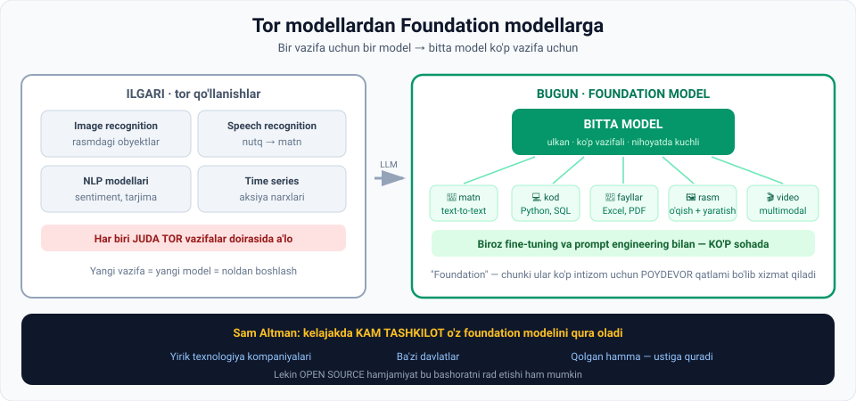

# 9-dars. Foundation modellarning ahamiyati

## 🎬 Boshlashdan oldin

10 yil oldin AI kompaniyasi qurmoqchi bo'lsangiz, sizga kerak edi:

```
Rasm tanish uchun     →  1-model,  o'z jamoasi, o'z ma'lumoti
Nutq tanish uchun     →  2-model,  o'z jamoasi, o'z ma'lumoti
Matn tahlili uchun    →  3-model,  o'z jamoasi, o'z ma'lumoti
Prognoz uchun         →  4-model,  o'z jamoasi, o'z ma'lumoti
```

Bugun — **bitta API kaliti**.

> Bu dars nima o'zgarganini va bu **kimga foyda, kimga zarar** ekanini tushuntiradi.

---

## 1. Ilgari: tor qo'llanishlar

> **Yaqin vaqtgacha kompaniyalar ishlab chiqqan machine learning modellari TOR QO'LLANISHLAR bilan cheklangan edi.**



| Model turi | Nima qilardi |
|---|---|
| **Image recognition** | Tasvirlar ichidagi **obyektlarni aniqlashda** a'lo bo'lish uchun o'qitilgan |
| **Speech recognition** | **Og'zaki nutqni yozma matnga** aylantirishga ixtisoslashgan |
| **NLP modellari** | **Tor til vazifalari** — masalan **sentiment analysis** yoki **tarjima** |
| **Time series** | **Aksiya narxlari**, bozor volatilligi va h.k. ni bashorat qilish |

> ### **Bu modellarning barchasi JUDA TOR vazifalar doirasida a'lo edi.**

*(01-modulning 6-darsini eslang: bu — **narrow AI**.)*

---

## 2. LLM lar keltirgan o'zgarish

> **Large language model larning joriy etilishi so'nggi bir necha yilda SEZILARLI O'TISHGA olib keldi.**

### Nima o'zgardi

> **LLM larning MURAKKAB va MUKAMMAL tuzilmasi, ULKAN MA'LUMOTDA o'qitilgani ularga UMUMIY MAQSADLI (general purpose) vazifalarda a'lo bo'lish imkonini beradi.**
>
> **LLM larning imkoniyatlari 1–2 turdagi vazifa yoki bitta domen bilan CHEKLANMAGAN.**
>
> **Buning o'rniga, biroz fine-tuning va prompt engineering bilan LLM lar KO'P SOHADA yaxshi ishlay oladi.**

*(8-darsni eslang — aynan o'sha ikki texnika.)*

---

## 3. Text-to-text dan multimodal ga

> **Dastlab LLM lar SOF TEXT-TO-TEXT modellar edi** — faqat matnli kirish va chiqish asosida javob generatsiya qilardi.

### Evolyutsiya

```
1. Faqat matn                     text → text
        ↓
2. Kod                            Python, SQL, JavaScript...
        ↓
3. Turli fayl turlari             Excel, PDF
        ↓
4. Rasm va videodagi ma'lumot     o'qish
        ↓
5. Kontent yaratish               matn, kod, rasm, video
```

> **Ko'pchilik bu texnologiya QANCHALIK TEZ rivojlanganidan hayratda qoldi.**

---

## 4. ⭐ Foundation models — to'g'ri atama

> **LLM lar shunchaki text-to-text ramkalardan MATN, KOD, RASM va VIDEO generatsiya qilishga evolyutsiyalangan nuqta ularning QAT'IY TIL MODELLARIDAN ko'proq mukammal MULTIMODAL TIZIMLARGA o'tishini belgiladi.**
>
> ### **AI hamjamiyati ularga murojaat qilish uchun ishlatadigan TO'G'RI ATAMA — FOUNDATION MODELS.**

### Nomning kelib chiqishi

> **Bu nom shu g'oyadan kelib chiqqan: bu modellar KO'P INTIZOM bo'ylab turli ilovalar uchun POYDEVOR QATLAMI (foundational layer) bo'lib xizmat qiladi.**

### Xususiyatlari

> **Foundation modellar:**
> - **ULKAN** (enormous)
> - **turli vazifalarni bajara oladi**
> - **nihoyatda kuchli** (immensely powerful)

> 🏛 **"Foundation" — poydevor.** Siz uy qurayotganda **beton quymaysiz** — tayyor poydevor ustiga quraciz. AI da ham shunday bo'ldi.

---

## 5. 🔮 Sam Altman ning bashorati

> **OpenAI ning Sam Altman fikricha, kelajakda KAM TASHKILOT o'z foundation modelini qura oladi.**

### Kim qura oladi

| Kim | Izoh |
|---|---|
| 🏢 **Yirik texnologiya kompaniyalari** | Bu bozorda **raqobat qilishni xohlaydi** |
| 🏛 **Ba'zi davlatlar** | **O'z foundation modelini yaratishni** istashi mumkin |

### Qolgan hamma nima qiladi

> **Boshqalarning hammasi yo o'zining ILOVAGA XOS ICHKI MODELLARINI quradi, yoki FOUNDATION MODELLAR USTIGA quradi.**

### ⚖️ Muhim qarshi fikr

> **Big Tech tomonidan yaratilgan modellar yoki OPEN SOURCE HAMJAMIYAT vaziyat talabiga javob berib, BIG TECH RAHBARLARINING NOHAQ ekanini isbotlashi mumkin.**

> 💡 **Bu jumla juda muhim.** Ma'ruzachi Sam Altman ning bashoratini **so'zsiz qabul qilmaydi**. Open source hamjamiyat (masalan, ochiq modellar) bu monopoliyani buzishi mumkin.
>
> **Bu — hali ochiq savol.** Va sizning kasbiy hayotingiz davomida javob topiladi.

---

## 6. 📊 Ilgari va bugun

| Mezon | Tor modellar (ilgari) | Foundation models (bugun) |
|---|---|---|
| **Vazifalar** | Bittasi | **Ko'p** |
| **Domen** | Bitta soha | **Ko'p soha** |
| **Yangi vazifa** | Yangi model + yangi ma'lumot | **Fine-tuning yoki prompt** |
| **Modallik** | Bitta (matn / rasm / ovoz) | **Multimodal** |
| **Kim qura oladi** | Ko'p kompaniya | **Kam tashkilot** |
| **Narxi** | O'rtacha | **Juda yuqori** |
| **Qolganlar nima qiladi** | O'zi quradi | **Ustiga quradi** |

---

## 7. ⚡ Amaliy topshiriqlar

### 🟢 Oson — 10 daqiqa · **Tor mi, foundation mi?**

| № | Tizim | Tor / Foundation ? |
|---|---|---|
| 1 | Telefondagi yuzni ochish | |
| 2 | ChatGPT | |
| 3 | Bank kartasidagi firibgarlik detektori | |
| 4 | Gemini | |
| 5 | Avtomobil raqamini o'qiydigan kamera | |
| 6 | Spotify tavsiyasi | |
| 7 | Claude | |
| 8 | Ob-havo prognozi modeli | |

<details>
<summary>✅ Javoblar</summary>

**Tor:** 1, 3, 5, 6, 8 — har biri **bitta vazifa**
**Foundation:** 2, 4, 7 — **ko'p vazifa, ko'p modallik**

**Diqqat:** tor modellar **yomon emas**! 04-modulning 3-darsini eslang — an'anaviy ML hali ham eng ko'p biznes qiymat yaratadi.

</details>

### 🟡 O'rta — 25 daqiqa · **Foundation model imkoniyatlarini sinang**

Bitta AI chat oching va **beshta turli modallikda** vazifa bering:

| № | Vazifa | Bajardimi? | Sifat (1–5) |
|---|---|---|---|
| 1 | 📝 Matn: she'r yozing | | |
| 2 | 💻 Kod: Python funksiyasi yozing | | |
| 3 | 📊 Tahlil: raqamlar ro'yxatini tahlil qiling | | |
| 4 | 🖼 Rasm: rasm yuklang va tavsiflashini so'rang | | |
| 5 | 📄 Fayl: PDF yuklang va umumlashtirishini so'rang | | |

**Xulosa savollari:**
1. **Bitta** model nechta turdagi vazifani bajardi?
2. 10 yil oldin bular uchun nechta alohida model kerak bo'lardi?
3. Bu **foundation model** ta'rifiga mos keladimi?

### 🔴 Qiyin — muhokama · **Altman haq mi?**

Ma'ruza Sam Altman ning bashoratini keltiradi, **lekin darrov shubha ham bildiradi**.

```
1. ALTMAN NING POZITSIYASI:
   Nima uchun kam tashkilot foundation model qura oladi?
   • Sabab 1: ______________________________
   • Sabab 2: ______________________________
   • Sabab 3: ______________________________

2. QARSHI POZITSIYA (open source):
   Open source hamjamiyat nima uchun buni buza olishi mumkin?
   • Sabab 1: ______________________________
   • Sabab 2: ______________________________
   • Sabab 3: ______________________________

3. TADQIQOT: bugungi ochiq modellarni qidiring.
   Nechta topdingiz?  ______
   Ular yopiq modellardan qanchalik orqada?  ______

4. SIZNING BASHORATINGIZ (5 jumla):
   ______________________________________________
   ______________________________________________

5. O'ZBEKISTON UCHUN:
   Mamlakatimiz o'z foundation modelini qurishi kerakmi?
   • Foydalari:  ______________________________
   • Xarajatlari: _____________________________
   • Alternativa: _____________________________
```

> 💡 **Nima uchun bu savol muhim:** agar hamma bir xil AI dan foydalansa, **madaniy va lingvistik xilma-xillik** nima bo'ladi? O'zbek tili modellarda yaxshi ifodalanganmi?

---

## 8. 🧠 O'zini tekshirish savollari

1. Yaqin vaqtgacha ML modellari qanday edi? 4 ta misol keltiring.
2. LLM lar nimani o'zgartirdi?
3. LLM lar nima uchun umumiy maqsadli vazifalarda a'lo?
4. LLM lar ko'p sohada ishlashi uchun nima kerak?
5. Dastlab LLM lar qanday model edi?
6. Ular qanday imkoniyatlarni qo'shdi?
7. Qaysi nuqta LLM larning multimodal tizimlarga o'tishini belgiladi?
8. To'g'ri atama qanday va bu nom qayerdan kelib chiqqan?
9. Foundation modellarning uchta xususiyatini ayting.
10. Sam Altman nimani bashorat qiladi? Kim qura oladi?
11. Qolganlar nima qiladi?
12. Ma'ruza qanday qarshi fikr bildiradi?

<details>
<summary>✅ Javoblar</summary>

1. **Tor qo'llanishlar** bilan cheklangan: **image recognition**, **speech recognition**, **NLP** (sentiment, tarjima), **time series** (aksiya narxlari).
2. **Sezilarli o'tish** — tor vazifalardan **umumiy maqsadli** vazifalarga.
3. Ularning **murakkab va mukammal tuzilmasi** hamda **ulkan ma'lumotda** o'qitilgani tufayli.
4. **Biroz fine-tuning va prompt engineering.**
5. **Sof text-to-text** modellar.
6. **Kod**, turli **fayl turlari** (Excel, PDF), **rasm va videodagi ma'lumotni o'qish**.
7. Ular **matn, kod, rasm va video generatsiya qila boshlagan** nuqta.
8. **Foundation models.** Nom shu g'oyadan: bu modellar **ko'p intizom bo'ylab ilovalar uchun poydevor qatlami** bo'lib xizmat qiladi.
9. **Ulkan**, **turli vazifalarni bajara oladi**, **nihoyatda kuchli**.
10. Kelajakda **kam tashkilot** o'z foundation modelini qura oladi. **Yirik texnologiya kompaniyalari** va **ba'zi davlatlar**.
11. Yo **ilovaga xos ichki modellarini** quradi, yo **foundation modellar ustiga** quradi.
12. **Open source hamjamiyat** vaziyat talabiga javob berib, **big tech rahbarlarining nohaq ekanini isbotlashi mumkin**.

</details>

---

## 📌 Xulosa

```
ILGARI                              BUGUN
──────                              ─────
image recognition  ┐
speech recognition ├─ har biri      BITTA FOUNDATION MODEL
NLP modellari      │  TOR vazifa    ├─ matn
time series        ┘                ├─ kod
                                    ├─ Excel, PDF
                                    ├─ rasm
                                    └─ video

"Foundation" = ko'p intizom uchun POYDEVOR qatlami

Sam Altman: kam tashkilot qura oladi
Ma'ruzachi: ...lekin open source uni nohaq chiqarishi mumkin
```

---

## 🔖 Atamalar

| Atama | Inglizcha | Izoh |
|---|---|---|
| Foundation model | *foundation model* | Ko'p ilova uchun poydevor bo'luvchi ulkan model |
| Tor qo'llanish | *narrow application* | Bitta vazifaga mo'ljallangan |
| Umumiy maqsadli | *general purpose* | Ko'p vazifani bajara oladigan |
| Multimodal | *multimodal* | Matn, rasm, ovoz bilan ishlaydigan |
| Text-to-text | *text-to-text* | Faqat matn kiritish/chiqarish |
| Sentiment analysis | *sentiment analysis* | Matndagi kayfiyatni aniqlash |
| Time series | *time series* | Vaqt bo'yicha ketma-ketlik ma'lumoti |
| Poydevor qatlami | *foundational layer* | Ustiga qurish mumkin bo'lgan asos |
| Open source | *open source* | Ochiq kodli |

---

⬅️ [Oldingi: Prompt engineering vs Fine-tuning vs RAG](08-Prompt-engineering-vs-Fine-tuning-vs-RAG.md) · ➡️ [Keyingi: Buy vs Make](10-Buy-vs-Make.md)
