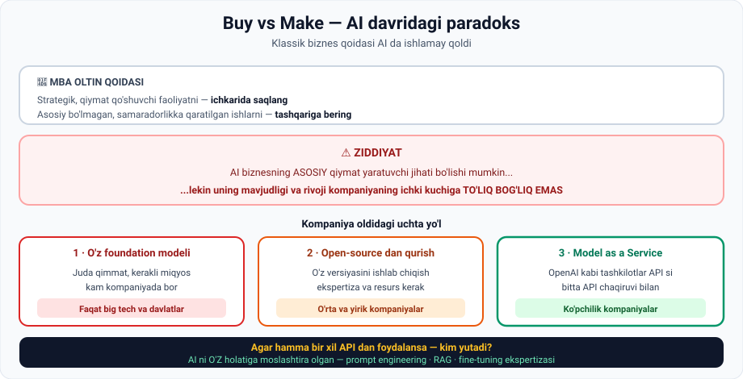

# 10-dars. Buy vs Make — Foundation modellar va shaxsiy modellar

## 🎬 Boshlashdan oldin

Savol: **agar hamma bir xil OpenAI API dan foydalansa, kim yutadi?**

Bu — modulning oxirgi va eng amaliy savoli. Va javob sizning karyerangizga bevosita tegishli.

---

## 1. Klassik dilemma

> **Biznes dunyosidagi abadiy dilemmalardan biri BUY VERSUS MAKE deb ataladi.**
>
> Bu qaror kompaniyaning aniq jarayonlarini **tashqariga berish** yoki **ichkarida saqlashni** belgilaydi.



### MBA oltin qoidasi

> **MBA bitiruvchilariga o'rgatiladigan OLTIN QOIDA:**
>
> ## **Kompaniya barcha STRATEGIK, QIYMAT QO'SHUVCHI faoliyatni ICHKARIDA saqlashga harakat qilishi kerak, chunki ular biznes uchun MUHIM.**
>
> **O'z navbatida, rahbariyat SAMARADORLIKKA qaratilgan ASOSIY BO'LMAGAN faoliyatni tashqariga delegatsiya qilishi mumkin.**

**Oddiy misol:**

```
Restoran:
  ✅ ICHKARIDA:  retseptlar, oshpazlik, xizmat sifati    ← qiymat SHU YERDA
  ➡️ TASHQARIDA: buxgalteriya, tozalash, saytni qurish   ← samaradorlik masalasi
```

---

## 2. ⚠️ Lekin AI da vaziyat noyob

> **Bularning barchasi ajoyib, LEKIN AI va large language model lar haqida gap ketganda vaziyat NOYOB.**

### Nima uchun?

> **Ilgari aytganimizdek, dunyoda kam kompaniya va tashkilot o'z foundation modelini qura oladi.**
>
> **Bu modellarni yaratish QIMMAT va kam biznes kerakli MIQYOSGA erisha oladi.**

*(9-darsni eslang — Sam Altman ning bashorati.)*

---

## 3. Kompaniyalar oldidagi tanlov

> **Ko'pchilik kompaniyalar KRITIK tanlovga duch keladi:**
>
> - yo **mavjud foundation model ustiga qurish**
> - yo **open source modeldan o'z versiyasini ishlab chiqish**

### Muammo

> **Ko'p hollarda firmalarda maxsus model o'qitish uchun EKSPERTIZA va RESURSLAR yetishmaydi**, shunga qaramay ular **AI ni biznesining ASOSIY QIYMAT QO'SHUVCHISI** deb tan oladilar.
>
> **Natijada bu bizneslar OpenAI kabi tashkilotlarga tayanishga majbur** — ular **MODEL AS A SERVICE** kelishuvi orqali GPT kabi foundation modellarga kirish imkonini beradi.

---

## 4. 🤯 Ziddiyat

Ma'ruzachi to'g'ridan-to'g'ri so'raydi: **"Ziddiyatni ko'ryapsizmi?"**

> ## **AI biznesning ASOSIY QIYMAT YARATUVCHI jihati bo'lishi mumkin,**
> ## **LEKIN AI ning mavjudligi va rivojlanishi kompaniyaning ICHKI SA'Y-HARAKATLARIGA TO'LIQ BOG'LIQ EMAS.**

Bu — **MBA oltin qoidasining to'g'ridan-to'g'ri buzilishi**:

```
Qoida:    strategik narsani ICHKARIDA saqla
Vaziyat:  strategik narsa (AI) — TASHQARIDA, va boshqa iloj yo'q
```

---

## 5. 🎯 Asosiy savol va javob

> **Unda oddiy bizneslar bir-biri bilan QANDAY raqobatlashadi?**
>
> **Agar HAMMA OpenAI API sidan foydalanib, BITTA API CHAQIRUVI bilan dunyodagi eng ilg'or AI modellarining ba'zilariga kirish imkonini olsa?**

### Javob

> ## **Bu stsenariyda AI ni ANIQ QO'LLANISH HOLATLARIGA MOSLASHTIRA OLISH qobiliyati HAQIQIY FARQLOVCHI OMIL bo'ladi.**

### Nima aynan farq qiladi

> ## **ICHKI AI MUHANDISLARINING PROMPT ENGINEERING, RAG va FINE-TUNING bo'yicha EKSPERTIZASI ko'plab bizneslarga raqobatchilardan USTUNLIK olishga yordam beradi.**

*(8-darsni eslang — aynan o'sha uchta texnika!)*

---

## 6. 💼 Karyera uchun xulosa

> ## **Natijada, MALAKALI AI MUHANDISLARIGA TALAB yaqin kelajakda KESKIN OSHISHI kutilmoqda.**
>
> **Bu qiziqarli o'zgarishlar davom etadigan sezilarli PARADIGMA SILJISHINI ko'rsatadi.**

> 🎓 **Nima uchun bu darsni tugatish siz uchun muhim:**
>
> Siz hozir **AI Engineer** kursini o'qiyapsiz. Bu dars sizga **nima uchun** shu kasb talab qilinishini aniq tushuntirdi:
>
> ```
> Model      →  hammada bir xil  (API)
> Ma'lumot   →  ba'zilarida ko'proq
> EKSPERTIZA →  ANA SHU — sizning qiymatingiz
> ```
>
> Kursning qolgan qismi — **LangChain, Vector DB, LLM Engineering** — aynan shu ekspertizani beradi.

---

## 7. 📊 Uchta yo'lning solishtiruvi

| Mezon | O'z foundation modeli | Open source dan qurish | Model as a Service |
|---|---|---|---|
| **Narxi** | ❌ Juda yuqori | ⚠️ O'rtacha | ✅ Past |
| **Ekspertiza** | ❌ Juda ko'p kerak | ⚠️ Ko'p kerak | ✅ O'rtacha |
| **Nazorat** | ✅ To'liq | ✅ Yuqori | ❌ Cheklangan |
| **Maxfiylik** | ✅ To'liq | ✅ Yuqori | ⚠️ Tashqi provayder |
| **Tezlik** | ❌ Yillar | ⚠️ Oylar | ✅ **Kunlar** |
| **Kim uchun** | Big tech, davlatlar | Yirik kompaniyalar | **Ko'pchilik** |

---

## 8. ⚡ Amaliy topshiriqlar

### 🟢 Oson — 10 daqiqa · **Buy yoki Make?**

Klassik qoida bo'yicha aniqlang — **ichkarida** yoki **tashqarida**?

| № | Faoliyat | Ichkarida / Tashqarida ? |
|---|---|---|
| 1 | Restoranning retseptlari | |
| 2 | Restoranning buxgalteriyasi | |
| 3 | Onlayn do'konning tavsiya algoritmi | |
| 4 | Onlayn do'konning yetkazib berish xizmati | |
| 5 | Bankning kredit skoring modeli | |
| 6 | Bankning ofis tozalash xizmati | |
| 7 | Startapning **LLM** i | |

<details>
<summary>✅ Javoblar</summary>

**Ichkarida:** 1, 3, 5 — **strategik, qiymat qo'shuvchi**
**Tashqarida:** 2, 4, 6 — **asosiy bo'lmagan, samaradorlik masalasi**

**7 — ANA SHU ZIDDIYAT.** LLM **strategik**, demak ichkarida bo'lishi kerak. Lekin startap uni **qura olmaydi**. Bu — darsning butun mavzusi.

</details>

### 🟡 O'rta — 25 daqiqa · **Raqobat strategiyasini toping**

Ikkita kompaniya **aynan bir xil** GPT API dan foydalanmoqda. Ikkalasi ham AI yordamchi quryapti.

```
KOMPANIYA A: ________________________
KOMPANIYA B: ________________________
(Ikkalasi ham bir sohadan tanlang)

A qanday USTUNLIK olishi mumkin?

1 · PROMPT ENGINEERING orqali:
   ______________________________________________

2 · RAG orqali (qanday BAZA ulaydi?):
   ______________________________________________

3 · FINE-TUNING orqali:
   ______________________________________________

4 · MA'LUMOT orqali (7-darsni eslang — proprietary data):
   ______________________________________________

5 · Qaysi biri eng KUCHLI ustunlik beradi va nega?
   ______________________________________________
```

<details>
<summary>💡 Ilgak (5-savol)</summary>

**Proprietary ma'lumot** — chunki uni **nusxalab bo'lmaydi**. Promptni ko'chirish oson, RAG arxitekturasini takrorlash mumkin. Lekin **10 yillik mijoz tarixini** raqobatchi qayerdan oladi?

</details>

### 🔴 Qiyin — mini-loyiha · **O'zingizni bozorga tayyorlang**

Ma'ruza aytadi: **malakali AI muhandislariga talab keskin oshadi.**

```
1 · O'ZINGIZNI BAHOLANG (hozirgi holat, 1-10):
   Prompt engineering:  ___
   RAG tushunchasi:     ___
   Fine-tuning:         ___
   Python:              ___
   Ma'lumot bilan ish:  ___

2 · KURS OXIRIDA qaysi darajaga chiqmoqchisiz?
   Prompt engineering:  ___    Qaysi modulda? ______
   RAG:                 ___    Qaysi modulda? ______
   Python:              ___    Qaysi modulda? ______

3 · PORTFOLIO REJASI
   Ish beruvchiga ko'rsatadigan 3 ta loyiha:
   a) __________________________________
      Qaysi texnika: PE / RAG / FT
   b) __________________________________
      Qaysi texnika: PE / RAG / FT
   c) __________________________________
      Qaysi texnika: PE / RAG / FT

4 · O'ZBEKISTON BOZORI (tadqiqot)
   • "AI" so'zi bor nechta ish e'loni topdingiz?  ___
   • Ularda eng ko'p qaysi ko'nikma talab qilinadi?  ______
   • Ma'ruzaning bashorati mahalliy bozorda ko'rinyaptimi?  ha / yo'q

5 · KEYINGI 3 OY UCHUN REJA
   Oy 1: _________________________________
   Oy 2: _________________________________
   Oy 3: _________________________________
```

---

## 9. 🧠 O'zini tekshirish savollari

1. "Buy versus make" dilemmasi nima?
2. MBA oltin qoidasi nima?
3. Nima uchun AI da vaziyat noyob?
4. Ko'pchilik kompaniyalar qanday tanlovga duch keladi?
5. Nima uchun ko'p firma o'z modelini o'qita olmaydi?
6. "Model as a service" nima?
7. Ma'ruzachi qanday ziddiyatni ko'rsatadi?
8. Agar hamma bir xil API dan foydalansa, haqiqiy farqlovchi omil nima?
9. Qanday ekspertiza ustunlik beradi?
10. Ma'ruzaning yakuniy bashorati nima?

<details>
<summary>✅ Javoblar</summary>

1. Kompaniya aniq jarayonlarni **tashqariga berish** yoki **ichkarida saqlash** haqidagi qaror.
2. **Strategik, qiymat qo'shuvchi** faoliyatni **ichkarida saqlash**; **asosiy bo'lmagan, samaradorlikka qaratilgan** faoliyatni **tashqariga delegatsiya qilish**.
3. Chunki **kam kompaniya o'z foundation modelini qura oladi** — bu **qimmat** va kam biznes **kerakli miqyosga** erisha oladi.
4. Yo **mavjud foundation model ustiga qurish**, yo **open source modeldan o'z versiyasini** ishlab chiqish.
5. Ularda **ekspertiza va resurslar yetishmaydi**.
6. OpenAI kabi tashkilotlar **GPT kabi foundation modellarga kirish** imkonini beradigan kelishuv.
7. **AI biznesning asosiy qiymat yaratuvchi jihati bo'lishi mumkin, lekin uning mavjudligi va rivoji kompaniyaning ichki sa'y-harakatlariga to'liq bog'liq emas.**
8. **AI ni aniq qo'llanish holatlariga moslashtira olish qobiliyati.**
9. Ichki AI muhandislarining **prompt engineering, RAG va fine-tuning** bo'yicha ekspertizasi.
10. **Malakali AI muhandislariga talab yaqin kelajakda keskin oshadi** — bu **sezilarli paradigma siljishini** ko'rsatadi.

</details>

---

## 📌 Xulosa

```
MBA QOIDASI:  strategik narsa → ICHKARIDA
AI VAZIYATI:  strategik narsa (AI) → TASHQARIDA, iloji yo'q
                    ↓
              ZIDDIYAT

Uchta yo'l:
  1. O'z foundation modeli    →  big tech, davlatlar
  2. Open source dan qurish   →  yirik kompaniyalar
  3. Model as a Service       →  ko'pchilik

Agar hamma bir xil API dan foydalansa — kim yutadi?
        ↓
  AI ni O'Z holatiga MOSLASHTIRA olgan
        ↓
  prompt engineering · RAG · fine-tuning EKSPERTIZASI
        ↓
  AI muhandislariga talab KESKIN OSHADI
```

---

## 🔖 Atamalar

| Atama | Inglizcha | Izoh |
|---|---|---|
| Buy vs Make | *buy vs make* | Sotib olish yoki o'zi qurish dilemmasi |
| Autsorsing | *outsourcing* | Tashqariga berish |
| Strategik faoliyat | *strategic activity* | Biznes uchun hal qiluvchi ish |
| Qiymat qo'shuvchi | *value adding* | Biznesga foyda keltiruvchi |
| Model as a Service | *model as a service* | Modelga API orqali kirish xizmati |
| Farqlovchi omil | *differentiating factor* | Raqobatda ajratib turuvchi jihat |
| Paradigma siljishi | *paradigm shift* | Asosiy qarashning tubdan o'zgarishi |
| Miqyos | *scale* | Hajm darajasi |

---

⬅️ [Oldingi: Foundation modellar](09-The-importance-of-foundation-models.md) · 🏠 [Modul boshiga](README.md)

➡️ **Keyingi qadam:** **06-modul: Generativ AI dagi amaliy qiyinchiliklar**
