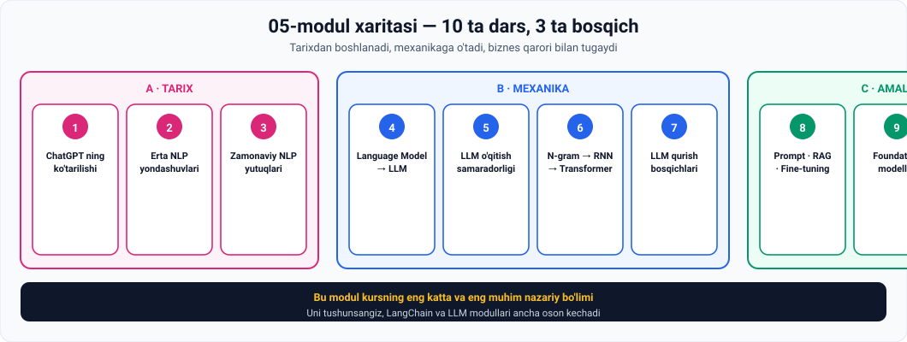

# 05-Modul · Generativ AI ni tushunish

> **Manba:** *The AI Engineer Course 2025: Complete AI Engineer Bootcamp* (365 Careers, Udemy)
> **Bo'lim:** `05. Intro to AI Module — Understanding Generative AI`
> **Darslar:** 10 ta video · **O'qish vaqti:** ~2.5 soat · **Amaliyot bilan:** ~8 soat

---

## 🧬 Bir jumlada

> **Bu modul ChatGPT ning "tug'ilish guvohnomasi".**
>
> 1950-yillardagi qoidalardan boshlab, bugungi foundation modellargacha — **har bir qadam nima uchun zarur bo'lganini** ko'rsatadi.

⚠️ **Bu — kursning eng katta va eng muhim nazariy bo'limi.** Uni tushunsangiz, LangChain va LLM modullari ancha oson kechadi.

---

## 🗺 Modul xaritasi



---

## 📚 Darslar

### 🔴 A bosqichi — TARIX

| № | Dars | Vaqt | Asosiy g'oya |
|---|---|---|---|
| 1 | [Gen AI ning ko'tarilishi — ChatGPT](01-The-rise-of-GenAI-ChatGPT.md) | ~8 daq | 2 oyda 100 mln foydalanuvchi · tarixdagi eng tez o'sish |
| 2 | [Erta NLP yondashuvlari](02-Early-approaches-to-NLP.md) | ~12 daq | Rule-based → statistical · "bu allaqachon ibtidoiy ML" |
| 3 | [Zamonaviy NLP yutuqlari](03-Recent-NLP-advancements.md) ⭐ | ~15 daq | **Vector embeddings** · semantik o'xshashlik 💻 |

### 🔵 B bosqichi — MEXANIKA

| № | Dars | Vaqt | Asosiy g'oya |
|---|---|---|---|
| 4 | [Language Model dan LLM ga](04-From-LM-to-LLM.md) ⭐ | ~18 daq | So'z assotsiatsiyasi o'yini · masked vs autoregressive |
| 5 | [LLM o'qitish samaradorligi](05-Efficiency-of-LLM-training.md) | ~15 daq | **Self-supervised** — LLM larni yaratgan yutuq 💻 |
| 6 | [N-gram dan Transformer gacha](06-From-Ngrams-to-Transformers.md) ⭐ | ~18 daq | 4 texnika · **attention mexanizmi** 💻 |
| 7 | [LLM qurish bosqichlari](07-Phases-in-building-LLMs.md) | ~15 daq | 7 bosqich · proprietary data ustunligi |

### 🟢 C bosqichi — AMALIYOT

| № | Dars | Vaqt | Asosiy g'oya |
|---|---|---|---|
| 8 | [Prompt engineering vs FT vs RAG](08-Prompt-engineering-vs-Fine-tuning-vs-RAG.md) ⭐ | ~16 daq | **Weights o'zgaradimi?** — bitta savol hammasini hal qiladi |
| 9 | [Foundation modellar](09-The-importance-of-foundation-models.md) | ~12 daq | Tor modellardan multimodal poydevorga |
| 10 | [Buy vs Make](10-Buy-vs-Make.md) 💼 | ~13 daq | **Nima uchun AI muhandisiga talab oshadi** |

⭐ = eng muhim · 💻 = Python amaliyoti · 💼 = karyera uchun

---

## 🎯 Modul yakunida siz bilasiz

**Tarix:**
- [ ] ChatGPT o'sish raqamlarini va sabablarini aytasiz
- [ ] Rule-based va statistical NLP farqini tushuntirasiz
- [ ] Nima uchun statistical NLP "ibtidoiy ML" ekanini bilasiz

**Embeddings:**
- [ ] **Vector embedding** nima ekanini tushuntirasiz
- [ ] Nima uchun **yuzlab/minglab o'lcham** kerakligini bilasiz
- [ ] **Semantik o'xshashlik** g'oyasini aytasiz

**Til modellari:**
- [ ] Til modeli aslida **nima qilishini** bir jumlada aytasiz
- [ ] **Masked** va **autoregressive** ni farqlaysiz va GPT qaysi turga kirishini bilasiz
- [ ] "Large" ning **rasmiy ta'rifi yo'qligini** bilasiz

**O'qitish:**
- [ ] Nima uchun supervised learning LLM uchun **masshtablanmasligini** hisoblab ko'rsatasiz
- [ ] **Self-supervised** yondashuv nima uchun yutuq ekanini tushuntirasiz

**Arxitektura:**
- [ ] **N-gram → RNN → LSTM → Transformer** zanjirini va har birining muammosini aytasiz
- [ ] **Attention mexanizmi** va **attention score** nima ekanini bilasiz
- [ ] **Vanishing gradient** nima ekanini tushuntirasiz

**Amaliyot:**
- [ ] LLM qurishning **7 bosqichini** sanaysiz
- [ ] **Prompt engineering · RAG · fine-tuning** ni bitta savol bilan farqlaysiz
- [ ] **Foundation model** nima va nima uchun shunday atalishini bilasiz
- [ ] **Nima uchun AI muhandisiga talab oshayotganini** tushuntirasiz
- [ ] 💻 To'rtta Python skriptini o'zingiz ishga tushirgansiz

---

## 🖼 Modul grafikalari

| Fayl | Nima ko'rsatadi |
|---|---|
| [`00-module-map.svg`](assets/00-module-map.svg) | 10 dars, 3 bosqich |
| [`01-chatgpt-growth.svg`](assets/01-chatgpt-growth.svg) | ChatGPT vs TikTok vs Instagram vs Facebook |
| [`02-nlp-eras.svg`](assets/02-nlp-eras.svg) | Rule-based ⟷ statistical NLP |
| [`03-embeddings.svg`](assets/03-embeddings.svg) | So'z → vektor → ma'no fazosi |
| [`04-masked-vs-autoregressive.svg`](assets/04-masked-vs-autoregressive.svg) | Ikki turdagi til modeli |
| [`05-self-supervised.svg`](assets/05-self-supervised.svg) | Supervised ❌ · unsupervised ❌ · self-supervised ✅ |
| [`06-nlp-evolution.svg`](assets/06-nlp-evolution.svg) | N-gram → RNN → LSTM → Transformer |
| [`07-llm-phases.svg`](assets/07-llm-phases.svg) | LLM qurishning 7 bosqichi |
| [`08-pe-rag-ft.svg`](assets/08-pe-rag-ft.svg) | Uchta texnikaning to'liq solishtiruvi |
| [`09-foundation-models.svg`](assets/09-foundation-models.svg) | Tor modellardan foundation modelga |
| [`10-buy-vs-make.svg`](assets/10-buy-vs-make.svg) | Uchta yo'l va raqobat javobi |

---

## 💻 Python amaliyotlari

Barchasi **hech qanday kutubxona o'rnatmasdan** ishlaydi.

| Dars | Skript nima qiladi | Nima o'rgatadi |
|---|---|---|
| 3 | So'zlar orasidagi kosinus o'xshashligini hisoblaydi | **Semantik qidiruv** — Google, Pinecone, RAG asosi |
| 5 | Belgilash narxini hisoblaydi | Supervised **masshtablanmaydi** |
| 5 | Bitta jumladan 7 ta bepul o'quv namunasi yaratadi | **Self-supervised** sirining kaliti |
| 6 | Unigram / bigram / trigram ni solishtiradi | Ko'proq **kontekst** → ko'proq ishonch |

> 🏆 **Eng ta'sirli natija:** 6-darsdagi skript unigram **`sportim`** deb adashishini, trigram esa **75% ishonch** bilan **`basketbol`** deb topishini ko'rsatadi — aynan ma'ruzada aytilgani.

---

## ⚡ Amaliy topshiriqlar xaritasi

| Dars | 🟢 Oson | 🟡 O'rta | 🔴 Qiyin |
|---|---|---|---|
| 1 | O'z "scary good" lahzangiz | O'sishni tahlil qiling | "Har bir versiya" bashorati |
| 2 | O'zbek tilida qoida yozing | O'zbekcha omonim toping | Nega qoidalar yetmadi? |
| 3 | Vektorlar qo'shing | O'z semantik qidiruvingiz | Sarkazm detektori |
| 4 | So'z assotsiatsiyasi o'yini | Masked vs autoregressive | "Large" chegarasi qayerda? |
| 5 | O'z narxingizni hisoblang | Self-supervised namunalar | Bias muammosi |
| 6 | N-gram ni sinang | Attention ballarini bering | Muammo–yechim zanjiri |
| 7 | Bosqichni aniqlang | O'z LLM loyihangiz | Proprietary data ustunligi |
| 8 | Qaysi texnika kerak? | Prompt engineering amalda | O'z AI mahsulotingiz |
| 9 | Tor mi, foundation mi? | Foundation imkoniyatlari | Altman haq mi? |
| 10 | Buy yoki Make? | Raqobat strategiyasi | O'zingizni bozorga tayyorlang |

> 💼 **Eng qimmatli topshiriq:** 10-darsdagi 🔴 **"O'zingizni bozorga tayyorlang"** — u butun kursni sizning karyerangizga bog'laydi.

---

## 🔗 Modullar orasidagi bog'liqlik

```
01-modul  ─  Transformer (2017), AGI, AI/ML/DL ta'riflari
02-modul  ─  Labelled vs unlabelled data, "garbage in garbage out"
03-modul  ─  Supervised/unsupervised, ANN, weights, activation
04-modul  ─  Generativ AI: LLM, diffusion, GAN
    ↓
05-modul  ─  HAMMASI BIRLASHADI:                    ← siz shu yerdasiz
    ↓          • labelled data qimmat  →  self-supervised
    ↓          • weights (03)          →  fine-tuning (08)
    ↓          • Transformer (01)      →  attention (06)
    ↓          • RAG demo (01-modul)   →  RAG nazariyasi (08)
    ↓          • narrow AI (01)        →  foundation models (09)
    ↓
LangChain moduli  ─  RAG ni AMALDA quramiz
Vector DB moduli  ─  embeddings ni AMALDA ishlatamiz
```

> 💡 **Diqqat qiling:** 01-modulning **birinchi darsidagi** 5 daqiqalik demo — bu **RAG** edi. O'shanda siz tushunmagan bo'lishingiz mumkin. Endi tushunasiz. **Kurs ataylab shunday qurilgan.**

---

## 📖 Umumiy atamalar lug'ati

| Atama | Inglizcha | Izoh |
|---|---|---|
| NLP | *Natural Language Processing* | Tabiiy tilni qayta ishlash |
| Rule-based | *rule-based* | Qo'lda yozilgan qoidalar tizimi |
| Statistik NLP | *statistical NLP* | Ehtimollikka asoslangan yondashuv |
| Annotatsiya | *annotation* | Ma'lumotni qo'lda belgilash |
| Vector embedding | *vector embedding* | So'zning yuqori o'lchamli vektori |
| Semantik o'xshashlik | *semantic similarity* | Ma'no jihatidan yaqinlik |
| Kosinus o'xshashligi | *cosine similarity* | Ikki vektor orasidagi burchak |
| Til modeli | *language model* | Keyingi so'zni bashorat qiluvchi model |
| Masked LM | *masked LM* | Ikki tomondan kontekst oladi |
| Autoregressive LM | *autoregressive LM* | Faqat oldingi so'zlarga qaraydi |
| Parametr | *parameter* | Modelning sozlanuvchi soni |
| Self-supervised | *self-supervised learning* | Model belgilarni o'zi yaratadi |
| Masshtablilik | *scalability* | Hajm oshganda ishlay olish |
| N-gram | *n-gram* | n ta so'zli ketma-ketlik |
| RNN | *Recurrent Neural Network* | Ketma-ketlik bilan ishlovchi tarmoq |
| Vanishing gradient | *vanishing gradient* | Uzoq matnda axborot yo'qolishi |
| LSTM | *Long Short-Term Memory* | Gate li takomillashtirilgan RNN |
| Transformer | *Transformer* | 2017-yilgi arxitektura |
| Attention | *attention mechanism* | So'zlar ahamiyatini baholash |
| Attention score | *attention score* | So'zga berilgan e'tibor bali |
| Token | *token* | So'z yoki so'z qismi |
| Uzoq masofali bog'liqlik | *long-range dependency* | Uzoqdagi so'zlar aloqasi |
| Korpus | *corpus* | Katta matn to'plami |
| Pre-training | *pre-training* | Dastlabki keng o'qitish |
| Post-training | *post-training* | Keyingi takomillashtirish |
| Fine-tuning | *fine-tuning* | Weights ni moslashtirish |
| Prompt engineering | *prompt engineering* | Modelga ko'rsatma berish |
| RAG | *Retrieval Augmented Generation* | Bazadan kontekst olish |
| Proprietary data | *proprietary data* | Kompaniyaning o'z ma'lumoti |
| Foundation model | *foundation model* | Ko'p ilova uchun poydevor model |
| Multimodal | *multimodal* | Matn, rasm, ovoz bilan ishlaydigan |
| Model as a Service | *model as a service* | API orqali modelga kirish |
| Paradigma siljishi | *paradigm shift* | Asosiy qarashning o'zgarishi |

---

## ✅ Yakuniy test

Har bir darsdagi **"O'zini tekshirish savollari"** — jami **106 ta savol**.

**85 tasidan ko'prog'iga** javob bera olsangiz — modulni o'zlashtirdingiz.

> 📌 **Maslahat:** bu modul katta. Uni **bir kunda** o'qishga urinmang. Kuniga **2–3 ta dars** — bir hafta ichida tugatasiz va hammasi esda qoladi.

---

## ➡️ Keyingi qadam

**06-modul: Generativ AI dagi amaliy qiyinchiliklar** ga o'ting

---

*📁 Manba: har bir dars mos `.vtt` transkriptdan tayyorlangan. Amaliy topshiriqlar, grafikalar va Python skriptlari — o'quvchilar uchun qo'shimcha material.*
