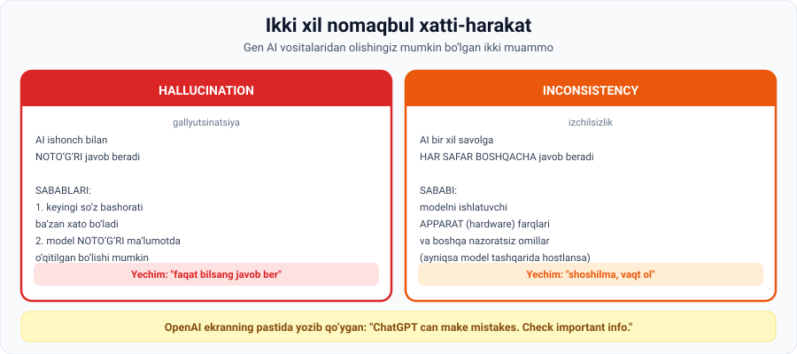

# 1-dars. Izchilsizlik va gallyutsinatsiya

## 🎬 Boshlashdan oldin

ChatGPT'dan **o'zingiz yaxshi biladigan** narsani so'rang — o'z tumaningiz tarixi, mahalliy qonun, yoki siz o'qigan kitob syujeti.

Diqqat bilan o'qing.

> Ehtimol, javobda **ishonch bilan aytilgan bitta noto'g'ri fakt** topasiz. Va agar siz mavzuni bilmaganingizda — **hech qachon sezmagan bo'lardingiz**.
>
> Bu dars aynan shu haqda.

---

## 1. Asosiy ogohlantirish

> **ChatGPT ajoyib, lekin ba'zan biz unga loyiq bo'lganidan ko'ra ko'proq ishonch beramiz.**
>
> **Agar AI chiqishini fakt tekshirmasak, katta xatolarga yo'l qo'yishimiz mumkin.**

### 🔑 Oltin qoida

> ## **O'z sohasining mutaxassisi AI BILAN ishlaydi va AI suhbat oynasi ICHIDA fikr yuritadi —**
> ## **har bir javobni ko'chirib-yopishtirish va o'ylamasdan ishonish o'rniga.**

> 💡 **Bu jumlani ikki marta o'qing.** Farq juda muhim:
>
> ```
> ❌ YOMON:  AI dan javob ol → ko'chir → topshir
> ✅ YAXSHI: AI dan javob ol → o'qi → shubhalan → tekshir → tuzat → ishlat
> ```
>
> Ikkinchi yo'l uchun siz **mavzuni bilishingiz** kerak. AI mutaxassisni almashtirmaydi — u **mutaxassisni tezlashtiradi**.

### OpenAI ning o'zi nima deydi

> **OpenAI ekranning pastida aniq yozib qo'ygan:**
>
> ## **"ChatGPT can make mistakes. Check important info."**
> *(ChatGPT xato qilishi mumkin. Muhim ma'lumotni tekshiring.)*

---

## 2. Ikki xil nomaqbul xatti-harakat



> **Gen AI vositalaridan ikki xil nomaqbul xatti-harakat olishingiz mumkin: HALLUCINATIONS va INCONSISTENCIES.**

---

## 3. Hallucination (gallyutsinatsiya)

> **Gallyutsinatsiya AI NOTO'G'RI chiqish bergani kuzatilganda sodir bo'ladi.**

### Nima uchun sodir bo'ladi? — Sabab 1

> **Endi gen AI qanday ishlashini tushunganingizdan so'ng, siz anglaysiz: modellar ko'pincha ketma-ketlikdagi KEYINGI SO'ZNI bashorat qiladi, aniqlikni oshirish uchun kontekstdan foydalanib.**
>
> **Bu modellarning qudrati va mukammalligiga qaramay, ularning bashoratlari ba'zan NOTO'G'RI bo'lishi mumkin.**

*(05-modulning 4-darsini eslang: til modeli — bu **ehtimollik** modeli. Ehtimollik esa **kafolat emas**.)*

### Nima uchun sodir bo'ladi? — Sabab 2

> **Gallyutsinatsiya yuzaga kelishining yana bir sababi — AI dastlabki paytdayoq FAKTIK NOTO'G'RI ma'lumotda o'qitilgan bo'lishi mumkin.**
>
> **Agar yolg'on ma'lumot bilan o'qitilsa, model katta ehtimol bilan noto'g'ri chiqishlar ishlab chiqaradi, to'g'rimi?**

> 🔗 **02-moduldagi "Garbage in, garbage out"** — mana uning eng aniq oqibati.

### ✅ Yechim

> **Gallyutsinatsiyalar bilan kurashishning qonuniy taktikasi — quyidagi ko'rsatmani berish:**
>
> ## **"Faqat javobni BILSANG, javob ber."**
> *("Provide an answer only if you know the answer.")*
>
> **Ba'zi hollarda bu turdagi prompt engineering foydali bo'lishi mumkin.**

---

## 4. Inconsistency (izchilsizlik)

> **Boshqa tomondan, izchilsizlik model BIR XIL SAVOLGA JUDA FARQLI javoblar berganda sodir bo'ladi.**

### Ma'ruzadagi kuzatuv

> **Ayniqsa ChatGPT birinchi chiqqanda, AI ba'zi sessiyalarda AQLLIROQ, boshqalarida esa AHMOQROQ bo'lgandek tuyulardi.**

### Sababi

> **Bu modelni ishlatuvchi APPARATDAGI (hardware) farqlar yoki boshqa NAZORAT QILIB BO'LMAYDIGAN omillar tufayli** — **ayniqsa model tashqarida hostlangan (externally hosted) bo'lganda.**

> ☁️ **Oddiy tilda:** siz ChatGPT'dan foydalanganda, so'rovingiz OpenAI serverlaridan biriga tushadi. Qaysi biriga — bilmaysiz. Serverlar bir xil emas. Yuklanish darajasi ham har xil.

### ⚠️ Yechim (isbotlanmagan)

> **Izchilsizlikni kamaytirishning bir ISBOTLANMAGAN usuli — AI ga "vaqt ol" deb ko'rsatma berish.**
>
> **Umid qilamizki, agar shunday qilsangiz, u javobni chiqarishga shoshilmaydi va tizim har bir prompt uchun ko'proq apparat resursi ajratishi mumkin.**

> 🧐 **Ma'ruzachi halol:** u buni **"unproven"** (isbotlanmagan) deb ataydi. Bu — nazariya, kafolat emas.

---

## 5. 📊 Solishtirma jadval

| Mezon | Hallucination | Inconsistency |
|---|---|---|
| **Nima bo'ladi** | AI **noto'g'ri** javob beradi | AI **har safar boshqacha** javob beradi |
| **Sabab 1** | Keyingi so'z bashorati xato | **Apparat farqlari** |
| **Sabab 2** | **Noto'g'ri ma'lumotda** o'qitilgan | Boshqa nazoratsiz omillar |
| **Qachon kuchayadi** | Kam ma'lum mavzularda | Model **tashqarida hostlanganda** |
| **Yechim** | "Faqat bilsang javob ber" | "Vaqt ol, shoshilma" |
| **Yechim ishonchli mi** | Ba'zan foydali | **Isbotlanmagan** |

---

## 6. 🔮 Kelajak

> **Har holda, gallyutsinatsiya va izchilsizliklarni ANIQLASH hamda ular bilan ishlash yo'llarini topish yaqin yillarda AI tadqiqotining ASOSIY MAVZULARIDAN biri bo'ladi**
>
> **va shubhasiz MILLIARDLAB DOLLARLIK bozorga aylanadi.**

> 💼 **Karyera uchun ilgak:** bu — hali yechilmagan muammo. Ya'ni bu sohada **ishlash joyi bor**.

---

## 7. ⚡ Amaliy topshiriqlar

### 🟢 Oson — 15 daqiqa · **Gallyutsinatsiyani o'zingiz toping**

ChatGPT'ga **o'zingiz yaxshi biladigan** 5 ta savol bering:

| № | Savol | Javobda xato bormi? | Qanday xato? |
|---|---|---|---|
| 1 | Tug'ilgan shahringiz tarixi | | |
| 2 | Sevimli kitobingiz syujeti | | |
| 3 | O'zbekistondagi mahalliy fakt | | |
| 4 | Siz ishlaydigan sohaning nozik detali | | |
| 5 | Kam ma'lum tarixiy voqea | | |

**Muhokama:**
1. Nechta javobda xato topdingiz? ______
2. Agar mavzuni **bilmaganingizda**, xatoni sezarmidingiz? ______
3. **Xulosa:** AI ni qaysi vazifalarda ishonch bilan ishlatish mumkin?

### 🟡 O'rta — 20 daqiqa · **Izchilsizlikni o'lchang**

1. Bitta **aniq savol** tanlang (masalan: *"Machine learning ning uchta turini sanab, har birini bir jumlada tushuntir"*).
2. Uni **5 ta yangi chat**da bering (har safar toza oyna).
3. Jadval to'ldiring:

| Urinish | Javob uzunligi | Format | Mazmun bir xilmi? |
|---|---|---|---|
| 1 | | | — |
| 2 | | | ha / yo'q |
| 3 | | | ha / yo'q |
| 4 | | | ha / yo'q |
| 5 | | | ha / yo'q |

4. Endi promptni o'zgartiring: **"Shoshilma, vaqt ol va diqqat bilan javob ber"** qo'shing. Yana 3 marta sinang.
5. **Farq sezildimi?**

> 💡 05-modulning 1-darsidagi `temperature = 0` ni eslang. API orqali ishlaganda izchillikni **sozlash mumkin**. Brauzer ChatGPT'da esa — yo'q.

### 🔴 Qiyin — mini-loyiha · **O'z fakt-tekshiruv protokolingiz**

Siz AI dan foydalanadigan jamoada ishlaysiz. **Protokol yozing:**

```
1 · AI CHIQISHINI QACHON TEKSHIRISH SHART?
   Har doim tekshiriladi:
   • ______________________________
   • ______________________________
   Tekshirmasa ham bo'ladi:
   • ______________________________

2 · QANDAY TEKSHIRAMIZ?
   Faktlar uchun:      ______________________
   Kod uchun:          ______________________
   Raqamlar uchun:     ______________________
   Iqtiboslar uchun:   ______________________

3 · PROMPT QOIDALARIMIZ (gallyutsinatsiyani kamaytirish uchun)
   • ______________________________
   • ______________________________
   • ______________________________

4 · MAS'ULIYAT
   Agar AI xato javob bersa va u mijozga yetsa — kim javobgar?
   ______________________________________________
```

> ⚖️ 4-savol — bu **AI Ethics** modulining markaziy savoli. 09-modulda unga qaytamiz.

---

## 8. 🧠 O'zini tekshirish savollari

1. Ma'ruzadagi "oltin qoida" nima?
2. OpenAI ekranning pastida nima yozgan?
3. Gen AI dan qanday ikki xil nomaqbul xatti-harakat olish mumkin?
4. Gallyutsinatsiya nima?
5. Gallyutsinatsiyaning ikkita sababini ayting.
6. Gallyutsinatsiyaga qarshi qanday taktika taklif qilinadi?
7. Izchilsizlik nima?
8. Izchilsizlikning sababi nima?
9. Izchilsizlikni kamaytirishning qanday usuli aytiladi va u ishonchlimi?
10. Ma'ruzachi bu muammolarning kelajagi haqida nima deydi?

<details>
<summary>✅ Javoblar</summary>

1. **O'z sohasining mutaxassisi AI bilan ishlaydi va AI suhbat oynasi ichida fikr yuritadi** — har bir javobni ko'chirib-yopishtirish va o'ylamasdan ishonish o'rniga.
2. **"ChatGPT can make mistakes. Check important info."**
3. **Hallucinations** va **inconsistencies**.
4. AI **noto'g'ri chiqish** bergani.
5. (a) Modellar **keyingi so'zni bashorat qiladi** va bashoratlar ba'zan noto'g'ri bo'ladi; (b) AI **faktik noto'g'ri ma'lumotda o'qitilgan** bo'lishi mumkin.
6. **"Faqat javobni bilsang, javob ber"** ko'rsatmasini berish — bu turdagi **prompt engineering**.
7. Model **bir xil savolga juda farqli javoblar** berishi.
8. Modelni ishlatuvchi **apparatdagi farqlar** yoki boshqa **nazorat qilib bo'lmaydigan omillar** — ayniqsa model **tashqarida hostlangan** bo'lsa.
9. AI ga **"vaqt ol"** deb ko'rsatma berish. Bu **isbotlanmagan** (unproven) usul.
10. Ularni aniqlash va ular bilan ishlash **yaqin yillarda AI tadqiqotining asosiy mavzularidan** biri bo'ladi va **milliardlab dollarlik bozorga** aylanadi.

</details>

---

## 📌 Xulosa

```
HALLUCINATION           INCONSISTENCY
noto'g'ri javob         har safar boshqa javob
   ↑                       ↑
keyingi so'z bashorati   apparat farqlari
noto'g'ri training data  tashqi hosting

Yechim: "faqat bilsang     Yechim: "vaqt ol"
        javob ber"                 (isbotlanmagan)

OLTIN QOIDA: mutaxassis AI BILAN ishlaydi,
             AI dan KO'CHIRMAYDI
```

---

## 🔖 Atamalar

| Atama | Inglizcha | Izoh |
|---|---|---|
| Gallyutsinatsiya | *hallucination* | AI ning noto'g'ri chiqishi |
| Izchilsizlik | *inconsistency* | Bir xil savolga turli javoblar |
| Fakt tekshirish | *fact-checking* | Ma'lumotning to'g'riligini tasdiqlash |
| Tashqarida hostlangan | *externally hosted* | Boshqa kompaniya serverida ishlaydigan |
| Nazoratsiz omil | *uncontrollable factor* | Foydalanuvchi ta'sir qila olmaydigan sabab |

---

🏠 [Modul boshiga](README.md) · ➡️ [Keyingi: Budjet va API narxlari](02-Budgeting-and-API-costs.md)
