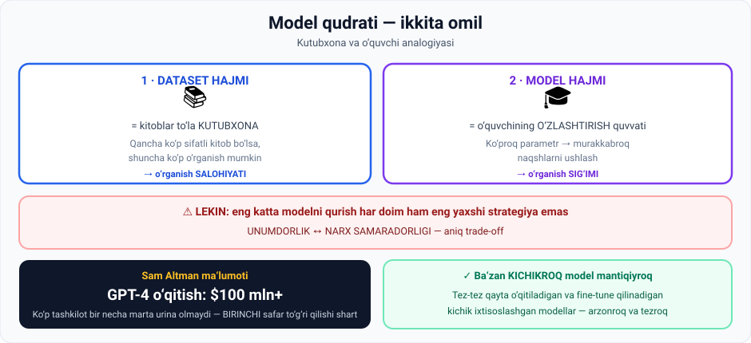

# 2-dars. Budjetlashtirish va API narxlari

## 🎬 Boshlashdan oldin

Bir savol: **GPT-4 ni o'qitish qancha turgan?**

Taxmin qiling. Ming dollar? Million?

> **$100 milliondan ortiq.** Sam Altman shaxsan aytgan.
>
> Va eng muhimi: ko'p tashkilot **bir necha marta urina olmaydi**. Birinchi safar to'g'ri qilishi shart.

---

## 1. Modelning qudratini belgilaydigan ikki omil

> **AI modeli qanchalik qudratli ekanini belgilovchi ikkita asosiy omil — DATASET va MODEL HAJMI.**



| Omil | Nima beradi |
|---|---|
| **Kattaroq, yuqori sifatli dataset** | Modelning **o'rganish salohiyatini** sezilarli oshiradi |
| **Model hajmi** | Uning **o'rganish sig'imini** belgilaydi |

---

## 2. 📚 Kutubxona va o'quvchi analogiyasi

> **Katta datasetni KITOBLAR TO'LA KUTUBXONA deb tasavvur qiling.**
>
> Boshqa hamma narsa teng bo'lganda, **kutubxonada qancha ko'p sifatli kitob bo'lsa, shuncha ko'p o'rgana olamiz.**

> **Bu analogiyada MODEL HAJMINI o'quvchining O'RGANISH QUVVATIGA qiyoslash mumkin.**
>
> **Ko'proq ma'lumotni eslab qola va o'zlashtira oladigan o'quvchilar bu keng kutubxonadan foydalana oladi.**

### Amaliy ma'no

> **Xuddi shunday, KO'PROQ PARAMETRGA ega kattaroq AI modeli datasetdan o'rgangan ma'lumot asosida MURAKKABROQ NAQSHLARNI ushlay oladi va MURAKKABROQ QARORLAR qabul qila oladi.**

> **Demak, umuman olganda, AI ning dataseti va model hajmi qancha katta bo'lsa, uning unumdorligi shuncha yuqori bo'lishi kutiladi.**

> 🔗 **03-modulning 1-darsini eslang:** o'quvchi–ustoz analogiyasi. Bu — uning davomi. O'shanda **ma'lumot sifati** haqida gapirgandik. Endi **ma'lumot + model hajmi + PUL**.

---

## 3. ⚠️ Lekin: trade-off

> **Ammo ENG KATTA modelni qurish har doim ham eng yaxshi strategiya emas, chunki u aniq trade-off ni o'z ichiga oladi:**
>
> ## **UNUMDORLIK  ⟷  NARX SAMARADORLIGI**

### Nima qimmat?

> - **Katta, yuqori sifatli datasetlarni sotib olish** qimmat
> - **Ancha katta modelni o'qitish uchun hisoblash quvvatini o'rnatish va sotib olish** — undan ham qimmatroq

---

## 4. 💰 Budjetlashtirish — asosiy ko'nikma

> ## **Shuning uchun budjetlashtirish HAL QILUVCHI MAVZU va AI ishlab chiquvchilari egallashi kerak bo'lgan FUNDAMENTAL KO'NIKMA.**

### ❌ Noto'g'ri yo'l

> **AI modelingizni qurishni boshlab, keyin uning qanchalik katta bo'lishini va o'qitish jarayonida qancha turishini aniqlab bo'lmaydi.**

### ✅ To'g'ri yo'l

> **Buning o'rniga, mavjud budjetni OLDINDAN ko'rib chiqish va uning qaysi qismi MA'LUMOT SOTIB OLISHGA, qaysi qismi HISOBLASH QUVVATIGA ajratilishini hal qilish ancha yaxshi.**

```
BUDJET: $______
   ↓
   ├─ Ma'lumot sotib olish:    ___%
   └─ Hisoblash quvvati:       ___%
   ↓
Shu doirada eng yaxshi modelni loyihalash
```

---

## 5. 💸 Real raqamlar

> **Bu jihat ancha nozik. Sam Altman intervyuda oshkor qildi:**
>
> ## **GPT-4 ni o'qitish OpenAI ga $100 MILLIONDAN ORTIQ turgan.**

### Oqibati

> **Ko'p tashkilot AI modellarini o'qitishga BIR NECHA MARTA urinishga qodir emas va BIRINCHI URINISHDA muvaffaqiyat qozonishi shart.**

> 😰 **Buni his qiling:** siz $100 million sarflaysiz, o'qitish oylar davom etadi, va oxirida model **yomon chiqadi**. Qayta urinish uchun yana $100 million kerak.
>
> Aynan shuning uchun **7 bosqichning birinchisi — model design** *(05-modulning 7-darsi)*. Xatolar u yerda tuzatiladi, o'qitish paytida emas.

### Asosiy tenglama

> **AI qanchalik yaxshi ishlashi va qancha turishi o'rtasida to'g'ri muvozanatni topish — AI ishlab chiqishning KALITI.**
>
> **Kattaroq AI modellari o'qitish VA ISHLATISH davomida ko'proq hisoblash quvvatini talab qiladi, bu esa qimmatga tushishi mumkin.**

> 💡 **"va ishlatish" — bu ko'pincha unutiladi.** Model bir marta o'qitiladi, lekin **millionlab marta ishlatiladi**. Har bir so'rov pul turadi.

---

## 6. ✅ Qachon kichikroq model mantiqiyroq

> **Katta model yaratish tashkilotning MAQSADLARI va RESURSLARIGA mos keladigan SEZILARLI SAMARADORLIK O'SISHIGA asoslanishi kerak.**

> **Ba'zi hollarda tez-tez qayta o'qitiladigan va fine-tune qilinadigan KICHIKROQ modellar qurish MANTIQIYROQ.**
>
> **Kichikroq, ixtisoslashgan modellarni o'qitish — cheklangan qo'llanishlar uchun katta modelni o'qitishga ulkan resurs sarflashdan KO'RA ARZONROQ va TEZROQ.**

---

## 7. 💻 Amaliyot: o'z budjetingizni hisoblang

Hech narsa o'rnatmasdan ishlaydi.

```python
# ===== BUDJET TAQSIMOTI =====
BUDJET = 1_000_000          # dollar

SENARIYLAR = [
    ("Ma'lumotga ko'p",   0.70, 0.30),
    ("Muvozanatli",       0.50, 0.50),
    ("Quvvatga ko'p",     0.30, 0.70),
]

# Taxminiy narxlar
NARX_1M_TOKEN = 2.0          # $ - sifatli ma'lumot sotib olish
NARX_1_GPU_SOAT = 3.0        # $ - hisoblash quvvati

print(f"BUDJET: ${BUDJET:,}\n")
print("Senariy".ljust(20) + "Ma'lumot".rjust(14) + "Quvvat".rjust(14)
      + "Tokenlar".rjust(16) + "GPU-soat".rjust(12))
print("-" * 76)
for nom, d_ulush, c_ulush in SENARIYLAR:
    d = BUDJET * d_ulush
    c = BUDJET * c_ulush
    tokenlar = d / NARX_1M_TOKEN * 1_000_000
    gpu = c / NARX_1_GPU_SOAT
    print(nom.ljust(20) + f"${d:>12,.0f}" + f"${c:>12,.0f}"
          + f"{tokenlar/1e9:>14.1f}B" + f"{gpu:>11,.0f}")

# ===== ISHLATISH NARXI (inference) =====
print("\n\n=== O'QITISH BIR MARTA, ISHLATISH MILLIONLAB MARTA ===\n")
MODELLAR = [
    ("Katta model",   0.030, 0.060),      # $ / 1000 token (kirish, chiqish)
    ("O'rta model",   0.003, 0.012),
    ("Kichik model",  0.0002, 0.0008),
]
SOROV_SONI = 1_000_000
KIRISH_TOKEN = 500
CHIQISH_TOKEN = 300

print("Model".ljust(16) + "1 so'rov".rjust(12) + f"{SOROV_SONI:,} so'rov".rjust(20))
print("-" * 50)
for nom, k_narx, ch_narx in MODELLAR:
    bitta = (KIRISH_TOKEN/1000)*k_narx + (CHIQISH_TOKEN/1000)*ch_narx
    jami = bitta * SOROV_SONI
    print(nom.ljust(16) + f"${bitta:>11.5f}" + f"${jami:>19,.0f}")

print("\nXulosa: 1 mln so'rovda katta va kichik model orasidagi farq -")
k = (KIRISH_TOKEN/1000)*0.030 + (CHIQISH_TOKEN/1000)*0.060
s = (KIRISH_TOKEN/1000)*0.0002 + (CHIQISH_TOKEN/1000)*0.0008
print(f"  ${(k-s)*SOROV_SONI:,.0f}  ({k/s:.0f} barobar)")
```

### Haqiqiy natija

```
BUDJET: $1,000,000

Senariy                   Ma'lumot        Quvvat        Tokenlar    GPU-soat
----------------------------------------------------------------------------
Ma'lumotga ko'p     $     700,000$     300,000         350.0B    100,000
Muvozanatli         $     500,000$     500,000         250.0B    166,667
Quvvatga ko'p       $     300,000$     700,000         150.0B    233,333


=== O'QITISH BIR MARTA, ISHLATISH MILLIONLAB MARTA ===

Model               1 so'rov    1,000,000 so'rov
--------------------------------------------------
Katta model     $    0.03300$             33,000
O'rta model     $    0.00510$              5,100
Kichik model    $    0.00034$                340

Xulosa: 1 mln so'rovda katta va kichik model orasidagi farq -
  $32,660  (97 barobar)
```

### 🔑 Uchta kuzatuv

**1. Budjet taqsimoti — bu qaror, tasodif emas.** Ma'lumotga ko'proq bersangiz, quvvat kamayadi. Trade-off har yerda.

**2. Ishlatish narxi (inference) o'qitishdan muhimroq bo'lishi mumkin.** 1 million so'rov — bu **kichik** ilova. Mashhur ilovada kuniga millionlab so'rov bo'ladi.

**3. `97 barobar` farq.** Aynan shuning uchun ma'ruza aytadi: *"ba'zi hollarda kichikroq modellar qurish mantiqiyroq"*.

> ⚠️ **Eslatma:** koddagi narxlar — **o'quv maqsadidagi taxminiy** raqamlar. Real narxlar provayder saytida doim o'zgarib turadi.

---

## 8. ⚡ Amaliy topshiriqlar

### 🟢 Oson — 10 daqiqa · **Analogiyani to'ldiring**

| Maktabda | AI da |
|---|---|
| Kutubxonadagi kitoblar soni | |
| O'quvchining eslab qolish quvvati | |
| Kitob sotib olish narxi | |
| O'quvchini o'qitish vaqti | |
| Imtihonda yaxshi natija | |

<details>
<summary>✅ Javoblar</summary>

Dataset hajmi · Model hajmi (parametrlar) · Ma'lumot sotib olish narxi · Hisoblash quvvati narxi · Model unumdorligi

</details>

### 🟡 O'rta — 25 daqiqa · **O'z loyihangiz budjetini tuzing**

```
LOYIHA: ______________________________________

1 · Bu foundation model qurishmi yoki mavjudini ishlatishmi?
    (05-modulning 10-darsini eslang — Buy vs Make)
    → ______________________________

2 · AGAR MAVJUDINI ISHLATSANGIZ (API):
    Kuniga necha so'rov kutyapsiz?          ______
    Bitta so'rovda o'rtacha necha token?    ______
    Oyiga taxminiy narx:                    $______
    (yuqoridagi skriptni o'zgartirib hisoblang)

3 · BUDJETNI KAMAYTIRISH YO'LLARI:
    • Kichikroq model:        qancha tejaydi? ______
    • Promptni qisqartirish:  qancha tejaydi? ______
    • Javobni cheklash:       qancha tejaydi? ______
    • Keshlash (caching):     qancha tejaydi? ______

4 · QAROR: qaysi model va nega?
    ______________________________________________
```

> 💡 **Ilgak:** 01-modulning 1-darsidagi demo eslang — **200 token chunking**. O'shanda "narxni optimallashtirish" deyilgandi. Endi siz aniq **nechchi dollar** ekanini hisoblay olasiz.

### 🔴 Qiyin — tadqiqot · **Real narxlarni toping**

```
1. Uchta AI provayder saytiga kiring va narx sahifasini toping.

   Provayder      Model       $/1M kirish   $/1M chiqish
   ___________    ________    ___________   ____________
   ___________    ________    ___________   ____________
   ___________    ________    ___________   ____________

2. Eng arzon va eng qimmat orasidagi farq:  ____ barobar

3. Bir xil vazifa uchun eng arzon variant qaysi?
   ______________________________________________

4. NARX PASAYIB BORYAPTIMI?
   Bir yil oldingi narxlarni qidiring va solishtiring:
   ______________________________________________

5. Bu tendensiya AI biznesi uchun nimani anglatadi?
   ______________________________________________
```

---

## 9. 🧠 O'zini tekshirish savollari

1. Modelning qudratini belgilovchi ikkita omil qaysi?
2. Kutubxona nimaga, o'quvchining quvvati nimaga qiyoslanadi?
3. Ko'proq parametr modelga nima beradi?
4. Nima uchun eng katta modelni qurish har doim yaxshi strategiya emas?
5. Nima qimmat turadi? Ikkita narsani ayting.
6. AI ishlab chiquvchilari uchun qanday fundamental ko'nikma zarur?
7. Budjetlashtirishning to'g'ri va noto'g'ri yo'li qanday?
8. GPT-4 ni o'qitish qancha turgan? Kim aytgan?
9. Bu ko'p tashkilot uchun nimani anglatadi?
10. Qachon kichikroq model qurish mantiqiyroq?

<details>
<summary>✅ Javoblar</summary>

1. **Dataset** va **model hajmi**.
2. Kutubxona — **katta dataset**; o'quvchining quvvati — **model hajmi** (o'rganish sig'imi).
3. **Murakkabroq naqshlarni ushlash** va **murakkabroq qarorlar qabul qilish** imkonini.
4. Chunki u **unumdorlik ⟷ narx samaradorligi** trade-off ini o'z ichiga oladi.
5. **Katta, yuqori sifatli datasetlarni sotib olish** va **hisoblash quvvatini o'rnatish hamda sotib olish** (ikkinchisi undan ham qimmatroq).
6. **Budjetlashtirish.**
7. ❌ **Noto'g'ri:** qurishni boshlab, keyin hajm va narxni aniqlash. ✅ **To'g'ri:** budjetni **oldindan** ko'rib chiqish va uni **ma'lumot** hamda **hisoblash quvvati** o'rtasida taqsimlash.
8. **$100 milliondan ortiq.** **Sam Altman** intervyuda aytgan.
9. Ular **bir necha marta urina olmaydi** — **birinchi urinishda** muvaffaqiyat qozonishi shart.
10. Katta model **sezilarli samaradorlik o'sishi** bermasa; **cheklangan qo'llanishlar** uchun — kichik ixtisoslashgan modellar **arzonroq va tezroq**.

</details>

---

## 📌 Xulosa

```
DATASET hajmi  (kutubxona)   ┐
                             ├→  MODEL QUDRATI
MODEL hajmi    (o'quvchi)    ┘

        ⚠️ LEKIN
UNUMDORLIK  ⟷  NARX SAMARADORLIGI

BUDJET oldindan taqsimlanadi:
   ma'lumot sotib olish  +  hisoblash quvvati

GPT-4 o'qitish = $100 mln+   →   birinchi urinishda to'g'ri qilish shart

Ba'zan KICHIK, tez-tez fine-tune qilinadigan model — mantiqiyroq
```

---

## 🔖 Atamalar

| Atama | Inglizcha | Izoh |
|---|---|---|
| Dataset hajmi | *dataset size* | O'quv ma'lumoti miqdori |
| Model hajmi | *model size* | Parametrlar soni |
| O'rganish salohiyati | *learning potential* | Ma'lumotdan olish mumkin bo'lgani |
| O'rganish sig'imi | *learning capacity* | Model o'zlashtira oladigani |
| Hisoblash quvvati | *computing power* | GPU/TPU resurslari |
| Narx samaradorligi | *cost efficiency* | Sarflangan pulga nisbatan foyda |
| Inference | *inference* | Modelni ishlatish (o'qitish emas) |
| Ixtisoslashgan model | *specialized model* | Tor vazifaga mo'ljallangan |

---

⬅️ [Oldingi: Izchilsizlik va gallyutsinatsiya](01-Inconsistency-and-hallucination.md) · ➡️ [Keyingi: Latency](03-Latency.md)
