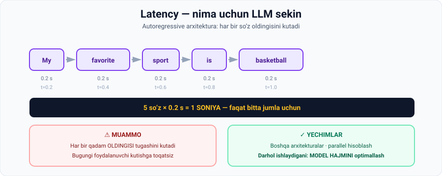

# 3-dars. Latency (kechikish)

## 🎬 Boshlashdan oldin

Sayt 3 soniyada ochilmasa nima qilasiz?

**Yopasiz.**

Endi tasavvur qiling: sizning AI ilovangiz javobni **10 soniyada** beradi. Foydalanuvchi qoladimi?

> Bu dars — **nima uchun LLM lar sekin** va bu bilan nima qilish mumkinligi haqida.

---

## 1. Muammo

> **Mijozga qaratilgan ilovalar qurishdagi bir asosiy masala — bugungi foydalanuvchilar SEKIN YUKLANISH vaqtiga TOQATSIZ.**

### Biznes uchun nima uchun bu jiddiyroq

> **Latency masalasi biznes mijozlari AI dan shaxsiy mahsuldorlikni oshirish yoki AI modeliga asoslangan mahsulot qurish uchun foydalanmoqchi bo'lganda YANADA KRITIK bo'ladi.**
>
> **Bunday stsenariylarda garov yuqoriroq, chunki kechikishlar foydalanuvchilarni asabiylashtiradi va BIZNES OPERATSIYALARI hamda DAROMADGA bevosita ta'sir qiladi.**

---

## 2. 🔑 Asosiy sabab: autoregressive arxitektura

> **Latency nuqtai nazaridan bugungi LLM larning eng katta muammosi — modellar AUTOREGRESSIVE ARXITEKTURADAN foydalanadi, unda GENERATSIYA QILINGAN HAR BIR SO'Z O'ZIDAN OLDINGI SO'ZLARGA BOG'LIQ.**
>
> **Bu KETMA-KET tabiat chiqishlar ishlab chiqilish TEZLIGINI CHEKLAYDI, chunki HAR BIR QADAM OLDINGISI tugashini KUTISHI kerak.**

*(05-modulning 4-darsini eslang: **GPT modellari autoregressive**. O'shanda bu **kuchli tomon** edi. Endi ko'ryapmiz — bu ayni paytda **cheklov** ham.)*



### Ma'ruzadagi hisob

> **Agar LLM `"my favorite sport is basketball"` jumlasidagi har bir so'zni KETMA-KET generatsiya qilsa, so'ziga 0.2 soniyadan hisoblaganda, jumlani tugatish 1 SONIYA oladi.**

```
My          →  0.2 s
favorite    →  0.4 s
sport       →  0.6 s
is          →  0.8 s
basketball  →  1.0 s
─────────────────────
5 so'z × 0.2 s = 1 SONIYA
```

> 😬 **Endi kattalashtiring:** 500 so'zli javob = **100 soniya** = **1.7 daqiqa**. Foydalanuvchi kutmaydi.

---

## 3. ✅ Yechimlar

> **Bu muammoni yechish uchun AI ishlab chiquvchilari TURLI ARXITEKTURA TURLARINI va PARALLEL HISOBLASHNI o'rganmoqdalar.**

### Darhol ishlaydigan strategiya

> ## **Samarali darhol amal qiladigan strategiya — MODEL HAJMINI OPTIMALLASHTIRISH.**
>
> **Kichikroq modellar ko'pincha o'zining kattaroq, murakkabroq hamkasblaridan TEZROQ.**

> 🔗 **Oldingi darsni eslang:** kichikroq model **arzonroq** ham, **tezroq** ham. Ikki muammo — bitta yechim.

---

## 4. 💻 Amaliyot: latency ni o'z ko'zingiz bilan ko'ring

Hech narsa o'rnatmasdan ishlaydi.

```python
JUMLA = "mening sevimli sportim basketbol va men uni har hafta o'ynayman"
sozlar = JUMLA.split()
TEZLIK = 0.2          # soniya / so'z

print("AUTOREGRESSIVE GENERATSIYA - so'zma-so'z\n")
vaqt = 0.0
for i, s in enumerate(sozlar, 1):
    vaqt += TEZLIK
    bar = "#" * i
    print(f"  t={vaqt:4.1f}s  {bar:<15} {' '.join(sozlar[:i])}")

print(f"\n  Jami: {len(sozlar)} so'z x {TEZLIK}s = {vaqt:.1f} soniya\n")

print("=== MODEL HAJMI LATENCY GA QANDAY TA'SIR QILADI ===\n")
MODELLAR = [
    ("Katta model (1T param)",   0.20),
    ("O'rta model (70B param)",  0.08),
    ("Kichik model (7B param)",  0.03),
]
UZUNLIK = [10, 100, 500]
print("Model".ljust(26) + "".join(f"{n:>5} so'z" for n in UZUNLIK))
print("-" * 60)
for nom, t in MODELLAR:
    qatorlar = "".join(f"{t*n:>9.1f}s" for n in UZUNLIK)
    print(nom.ljust(26) + qatorlar)

print("\n  500 so'zli javob:")
print(f"    katta model  -> {0.20*500:.0f} soniya ({0.20*500/60:.1f} daqiqa)")
print(f"    kichik model -> {0.03*500:.0f} soniya")
print(f"    farq: {0.20/0.03:.1f} barobar")
```

### Haqiqiy natija

```
AUTOREGRESSIVE GENERATSIYA - so'zma-so'z

  t= 0.2s  #               mening
  t= 0.4s  ##              mening sevimli
  t= 0.6s  ###             mening sevimli sportim
  t= 0.8s  ####            mening sevimli sportim basketbol
  t= 1.0s  #####           mening sevimli sportim basketbol va
  t= 1.2s  ######          mening sevimli sportim basketbol va men
  t= 1.4s  #######         mening sevimli sportim basketbol va men uni
  t= 1.6s  ########        mening sevimli sportim basketbol va men uni har
  t= 1.8s  #########       mening sevimli sportim basketbol va men uni har hafta
  t= 2.0s  ##########      mening sevimli sportim basketbol va men uni har hafta o'ynayman

  Jami: 10 so'z x 0.2s = 2.0 soniya

=== MODEL HAJMI LATENCY GA QANDAY TA'SIR QILADI ===

Model                        10 so'z  100 so'z  500 so'z
------------------------------------------------------------
Katta model (1T param)          2.0s     20.0s    100.0s
O'rta model (70B param)         0.8s      8.0s     40.0s
Kichik model (7B param)         0.3s      3.0s     15.0s

  500 so'zli javob:
    katta model  -> 100 soniya (1.7 daqiqa)
    kichik model -> 15 soniya
    farq: 6.7 barobar
```

### 🔑 Uchta kuzatuv

**1. Birinchi blokda siz ChatGPT ni ko'ryapsiz.** Aynan shunday — so'zma-so'z. Farq shundaki, u sizga **oraliq natijani ko'rsatadi** (streaming). Vaqt esa o'zgarmaydi.

**2. Jadval chiziqli o'sishni ko'rsatadi.** 500 so'z = 10 so'zdan **50 barobar sekin**. Bu — arxitekturaning tabiati.

**3. `6.7 barobar` farq.** Kichik model — **darhol amal qiladigan** yechim. Yangi arxitektura — bu tadqiqot, yillar oladi.

---

## 5. 💡 Amalda latency ni qanday kamaytirish mumkin

Ma'ruzada aytilmagan, lekin AI muhandisi bilishi kerak:

| Usul | Nima qiladi | Latency ga ta'siri |
|---|---|---|
| **Kichikroq model** | Har bir token tezroq | ⭐⭐⭐ **Eng katta** |
| **Streaming** | Javobni bo'lak-bo'lak ko'rsatish | Faktik emas, **his qilinadigan** |
| **Javob uzunligini cheklash** | `max_tokens` sozlash | ⭐⭐ To'g'ridan-to'g'ri |
| **Keshlash** | Takroriy savollarga tayyor javob | ⭐⭐⭐ Takrorlarda |
| **Promptni qisqartirish** | Kirish tokenlari kamayadi | ⭐ Kichik |
| **Parallel so'rovlar** | Bir vaqtda bir necha vazifa | ⭐⭐ Jamlangan vazifada |

> 🎨 **Streaming haqida:** 01-modulning 1-darsidagi demoda `stream()` ishlatilgandi. Endi tushunarli — bu **psixologik** yechim. Javob tezroq kelmaydi, lekin foydalanuvchi **birinchi so'zni darrov ko'radi** va kutish og'ir tuyulmaydi.

---

## 6. ⚡ Amaliy topshiriqlar

### 🟢 Oson — 10 daqiqa · **O'z latency ingizni o'lchang**

Sekundomer oling va ChatGPT'da o'lchang:

| № | Savol turi | Birinchi so'z (s) | To'liq javob (s) | Javob uzunligi |
|---|---|---|---|---|
| 1 | Qisqa fakt savoli | | | |
| 2 | 3 abzatsli tushuntirish | | | |
| 3 | 50 qatorli kod | | | |
| 4 | 1 sahifalik insho | | | |

**Savollar:**
1. **Birinchi so'z** va **to'liq javob** orasidagi farq qanday?
2. Javob uzunligi va vaqt orasida **chiziqli bog'liqlik** bormi?
3. Agar streaming bo'lmasa, 4-vazifada necha soniya **bo'sh ekranga** qarab turardingiz?

### 🟡 O'rta — 20 daqiqa · **Latency budjetini tuzing**

Siz mijozga qaratilgan ilova quryapsiz.

```
ILOVA: ______________________________________
Foydalanuvchi qancha kutishga tayyor?  ____ soniya

1 · O'lchang: joriy javob vaqti  ____ soniya
2 · Farq (kerakli - joriy):      ____ soniya

3 · QANDAY KAMAYTIRASIZ? (har biri qancha beradi?)
   [ ] Kichikroq model         → ____ s tejaydi
   [ ] max_tokens cheklash     → ____ s tejaydi
   [ ] Keshlash                → ____ s tejaydi
   [ ] Promptni qisqartirish   → ____ s tejaydi

4 · Har birining NARXI qanday? (sifat/aniqlik yo'qotish)
   ______________________________________________

5 · YAKUNIY QAROR:
   ______________________________________________
```

### 🔴 Qiyin — muhokama · **Autoregressive dan voz kechish mumkinmi?**

Ma'ruza aytadi: ishlab chiquvchilar **boshqa arxitekturalarni** va **parallel hisoblashni** o'rganmoqdalar.

```
1. Nima uchun autoregressive model PARALLEL ishlay olmaydi?
   ______________________________________________

2. Agar model butun jumlani BIR VAQTDA generatsiya qilsa —
   qanday muammo yuzaga keladi?
   ______________________________________________

3. 05-modulning 4-darsidagi MASKED modellarni eslang.
   Ular parallel ishlay oladimi?  ha / yo'q
   Nega ular GPT o'rniga ishlatilmaydi?
   ______________________________________________

4. Sizningcha, latency muammosi 5 yilda hal bo'ladimi?
   • Qanday yo'l bilan: __________________________
   • Qanday to'siq bor: __________________________
```

<details>
<summary>💡 1–2 savol uchun ilgak</summary>

Autoregressive modelda **3-so'zni bilish uchun 2-so'zni bilish shart**, chunki 3-so'z 2-so'zga **shartlangan** (conditioned). Ularni bir vaqtda hisoblab bo'lmaydi — bu **sabab-oqibat** zanjiri.

Agar butun jumla bir vaqtda yaratilsa, so'zlar bir-biriga **mos kelmasligi** mumkin: har biri boshqalarni ko'rmagan holda tanlanadi.

</details>

---

## 7. 🧠 O'zini tekshirish savollari

1. Mijozga qaratilgan ilovalardagi asosiy latency masalasi nima?
2. Nima uchun biznes mijozlari uchun bu yanada kritik?
3. LLM larning latency bo'yicha eng katta muammosi nima?
4. Autoregressive arxitekturada har bir so'z nimaga bog'liq?
5. Nima uchun bu tezlikni cheklaydi?
6. Ma'ruzadagi hisobni keltiring: 5 so'z, 0.2 s/so'z — jami qancha?
7. Ishlab chiquvchilar qanday yo'llarni o'rganmoqdalar?
8. Darhol amal qiladigan samarali strategiya nima?

<details>
<summary>✅ Javoblar</summary>

1. Bugungi foydalanuvchilar **sekin yuklanish vaqtiga toqatsiz**.
2. Chunki **garov yuqoriroq** — kechikishlar foydalanuvchilarni asabiylashtiradi va **biznes operatsiyalari hamda daromadga** bevosita ta'sir qiladi.
3. Modellar **autoregressive arxitekturadan** foydalanadi.
4. **O'zidan oldingi so'zlarga.**
5. Chunki **har bir qadam oldingisi tugashini kutishi** kerak — bu **ketma-ket** jarayon.
6. **1 soniya** (5 × 0.2).
7. **Turli arxitektura turlari** va **parallel hisoblash**.
8. **Model hajmini optimallashtirish** — kichikroq modellar ko'pincha tezroq.

</details>

---

## 📌 Xulosa

```
AUTOREGRESSIVE:  so'z₁ → so'z₂ → so'z₃ → ...
                  ↑ har biri oldingisini KUTADI

  5 so'z × 0.2 s  =  1 soniya
500 so'z × 0.2 s  =  100 soniya  ⚠️

Muammo:  foydalanuvchi kutmaydi → biznes daromadi zarar ko'radi

Yechimlar:
  tadqiqot  →  yangi arxitekturalar, parallel hisoblash
  DARHOL    →  MODEL HAJMINI optimallashtirish
```

---

## 🔖 Atamalar

| Atama | Inglizcha | Izoh |
|---|---|---|
| Latency | *latency* | Javob kutish vaqti |
| Autoregressive | *autoregressive* | Har bir so'z oldingilariga bog'liq |
| Ketma-ket | *sequential* | Birin-ketin bajariladigan |
| Parallel hisoblash | *parallel computing* | Bir vaqtda bir necha hisob |
| Mijozga qaratilgan | *customer-facing* | Oxirgi foydalanuvchi ishlatadigan |
| Streaming | *streaming* | Javobni bo'lak-bo'lak uzatish |
| Keshlash | *caching* | Tayyor natijani saqlab qo'yish |

---

⬅️ [Oldingi: Budjet va API narxlari](02-Budgeting-and-API-costs.md) · ➡️ [Keyingi: Ma'lumot tugashi](04-Running-out-of-data.md)
