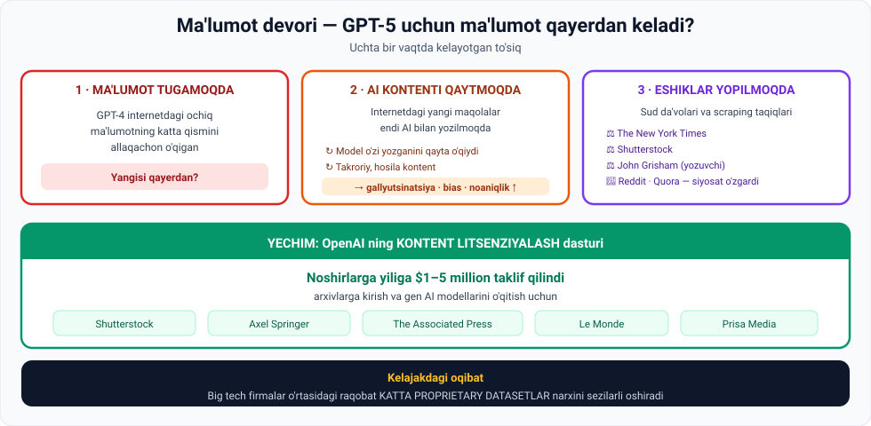

# 4-dars. Ma'lumot tugab qolishi

## 🎬 Boshlashdan oldin

GPT-3 → 175 milliard parametr.
GPT-4 → 1 trilliondan ortiq.
GPT-5 → yana ko'proq?

Tabiiy kutish. Lekin bitta savol bor:

> **Agar GPT-4 internetdagi ochiq ma'lumotning katta qismini ALLAQACHON o'qigan bo'lsa —**
> **GPT-5 uchun yangi ma'lumot QAYERDAN keladi?**

---

## 1. Muammo

> **Bunday diagrammalarni ko'rganda, LLM ning keyingi versiyasi oldingisidan sezilarli KATTAROQ bo'lishini kutish tabiiy.**
>
> **Lekin bitta jiddiy masala bu jarayonga to'sqinlik qilishi ehtimoli katta.**

> **Agar GPT-4 internetdagi ochiq mavjud ma'lumotning sezilarli qismini allaqachon o'qib, qayta ishlagan bo'lsa, GPT-5 uchun yangi ma'lumot qayerdan keladi?**

> ## **AI ishlab chiquvchilari MA'LUMOT TUGASHI xavfi ostida va model imkoniyatlari o'sishida POTENSIAL SEKINLASHUVGA duch kelmoqda.**



---

## 2. 🔄 Ikkinchi muammo: AI kontenti aylanib qaytmoqda

> **Bundan tashqari, endi ChatGPT ommalashganidan so'ng, internetga joylanadigan KO'P YANGI MAQOLA VA MATERIALLAR AI YORDAMIDA YOZILISHI xavfi katta.**

### Nima uchun bu xavfli

> **Bu kelajakdagi LLM lar uchun YANGI yoki NOZIK ma'lumot o'rganishni qiyinlashtiradi, chunki ular tez-tez TAKRORIY yoki HOSILA (derivative) kontentga duch keladi.**
>
> ## **Kelajakdagi modellar shunchaki OLDINGI MODELLAR YOZGANINI QAYTARADI —**
> ## **bu esa GALLYUTSINATSIYA, BIAS va NOANIQLIK xavflarini oshiradi.**

> 🔁 **Buni "model collapse" (model qulashi) deb ham atashadi.**
>
> **Analogiya:** fotosuratning nusxasidan nusxa oling, keyin undan yana nusxa. 20-nusxada asl rasm tanib bo'lmas holga keladi. Har bir nusxa **oldingi nusxaning xatolarini** ham ko'chiradi va **yangi xato qo'shadi**.

---

## 3. ⚖️ Uchinchi muammo: eshiklar yopilmoqda

> **Ma'lumot mavjudligiga yana bir to'siq — gen AI atrofidagi shov-shuvdan so'ng, dunyo bo'ylab BIR NECHA YIRIK TASHKILOT SUD DA'VOLARI qo'zg'atdi va o'z veb-saytlaridan MA'LUMOT SCRAPING QILISHNI TAQIQLADI.**

### Birinchi da'volar

| Kim | Kim |
|---|---|
| ⚖️ **The New York Times** | ⚖️ **Shutterstock** |
| ⚖️ **John Grisham** — eng ko'p sotilgan asarlar muallifi | |

### Siyosat o'zgarishlari

> **Reddit va Quora kabi platformalar esa o'z siyosatlarini o'zgartirib, OpenAI kabi AI ishlab chiquvchilari uchun platforma ma'lumotini scraping qilishni NOQONUNIY qildi.**

*(02-modulning 2-darsidagi ogohlantirishni eslang: "web scraping har doim ham ruxsat etilgan emas". Endi bu — milliardlik sud jarayonlari.)*

---

## 4. ✅ Yechim: kontent litsenziyalash

> **Bu masalani yumshatish uchun OpenAI KONTENT LITSENZIYALASH DASTURINI boshladi va dunyodagi eng katta proprietary datasetlarga egalik qiluvchi bir necha tashkilot bilan allaqachon shartnoma imzoladi.**

### Raqamlar

> ## **OpenAI noshirlarga arxivlarga kirish va gen AI modellarini o'qitish uchun yiliga $1 dan $5 MILLIONGACHA taklif qildi.**

### Imzolangan shartnomalar

| | | |
|---|---|---|
| **Shutterstock** | **Axel Springer** | **The Associated Press** |
| **Le Monde** | **Prisa Media** | |

---

## 5. 🔮 Kelajakdagi oqibat

> **Kelajakda LLM ishlab chiqayotgan big tech firmalar o'rtasidagi RAQOBAT KATTA PROPRIETARY DATASETLAR NARXINI sezilarli oshirishi ehtimoli katta.**

> 💎 **05-modulning 7-darsini eslang:** *"eng ko'p proprietary ma'lumotga ega kompaniyalar raqobat ustunligiga ega bo'ladi"*.
>
> Endi bu **bashorat emas — bozor**. Ma'lumot **aktivga** aylandi va uning narxi **oshib bormoqda**.

---

## 6. 📊 Uchta to'siq — jamlangan ko'rinish

| № | To'siq | Sabab | Oqibat |
|---|---|---|---|
| **1** | **Ma'lumot tugamoqda** | GPT-4 ochiq internetning katta qismini o'qigan | Model imkoniyatlari o'sishi **sekinlashadi** |
| **2** | **AI kontenti qaytmoqda** | Yangi maqolalar AI bilan yoziladi | **Gallyutsinatsiya, bias, noaniqlik ↑** |
| **3** | **Eshiklar yopilmoqda** | Sud da'volari, siyosat o'zgarishlari | Scraping **noqonuniy** bo'ldi |

**Yechim:** kontent litsenziyalash → **$1–5 mln/yil** noshirlarga

---

## 7. ⚡ Amaliy topshiriqlar

### 🟢 Oson — 10 daqiqa · **AI kontentini taniy olasizmi?**

Internetdan **6 ta maqola** toping (yangiliklar, blog, mahsulot tavsifi):

| № | Manba | AI yozganmi? | Qanday belgilardan bildingiz? |
|---|---|---|---|
| 1 | | ha / yo'q / bilmadim | |
| 2 | | | |
| 3 | | | |
| 4 | | | |
| 5 | | | |
| 6 | | | |

**Muhokama:**
1. Nechtasida **ishonch bilan** ayta oldingiz? ______
2. Agar **siz** ayta olmasangiz — **model** qanday ayta oladi?
3. Bu 2-muammoni (AI kontenti qaytishi) qanchalik jiddiy qiladi?

### 🟡 O'rta — 25 daqiqa · **Model qulashini modellashtiring**

Hech narsa o'rnatmasdan ishlaydi:

```python
import random
random.seed(1)

ASL = ["aniq", "to'g'ri", "batafsil", "tekshirilgan", "ishonchli"]
BUZUQ = ["taxminiy", "noaniq", "umumiy", "takroriy", "bo'sh"]

avlod = ASL[:]
print("=== MODEL QULASHI SIMULYATSIYASI ===\n")
print(f"0-avlod (odam yozgan):     {avlod}")
print(f"    Sifat: {sum(1 for x in avlod if x in ASL)}/5\n")

for n in range(1, 6):
    yangi = []
    for soz in avlod:
        # Har bir avlodda 25% ehtimol bilan sifat yo'qoladi
        if soz in ASL and random.random() < 0.25:
            yangi.append(random.choice(BUZUQ))
        else:
            yangi.append(soz)
    avlod = yangi
    sifat = sum(1 for x in avlod if x in ASL)
    bar = "#" * sifat + "." * (5 - sifat)
    print(f"{n}-avlod (AI o'qigan AI):   {avlod}")
    print(f"    Sifat: {sifat}/5  {bar}\n")

print("Xulosa: har bir avlod oldingisining xatolarini MEROS qilib oladi")
print("va yangilarini qo'shadi. Bu - MODEL COLLAPSE.")
```

**Haqiqiy natija:**

```
0-avlod (odam yozgan):     ['aniq', "to'g'ri", 'batafsil', 'tekshirilgan', 'ishonchli']
    Sifat: 5/5

1-avlod (AI o'qigan AI):   ['taxminiy', "to'g'ri", 'batafsil', 'tekshirilgan', 'ishonchli']
    Sifat: 4/5  ####.

2-avlod (AI o'qigan AI):   ['taxminiy', "to'g'ri", 'taxminiy', 'tekshirilgan', 'ishonchli']
    Sifat: 3/5  ###..

...

5-avlod (AI o'qigan AI):   ['taxminiy', 'umumiy', 'taxminiy', 'taxminiy', 'ishonchli']
    Sifat: 1/5  #....
```

> 📉 **5 avlodda 5/5 → 1/5.** Va hech kim ataylab yomon qilmadi — har bir avlod shunchaki **oldingisidan o'rgandi**.

**Savollar:**
1. 5-avlodda nechta asl so'z qoldi? ______
2. `0.25` ni `0.10` va `0.50` ga o'zgartiring. Farq qanday?
3. Bu simulyatsiya **soddalashtirilgan**. Real hayotda nima boshqacha bo'ladi?

### 🔴 Qiyin — muhokama · **Ma'lumot kimniki?**

```
1. THE NEW YORK TIMES POZITSIYASI:
   Nima uchun ular da'vo qo'zg'atdi?
   • Sabab 1: ______________________________
   • Sabab 2: ______________________________

2. OPENAI POZITSIYASI:
   Ular o'zini qanday himoya qiladi?
   • Argument 1: ___________________________
   • Argument 2: ___________________________

3. SIZ YOZGAN MATN:
   Siz blogda maqola yozdingiz. AI uni o'qib, o'rgandi.
   • Bu o'g'irlikmi?  ha / yo'q / bog'liq
   • Nega: _________________________________
   • Sizga to'lash kerakmi?  ha / yo'q

4. LITSENZIYALASH ADOLATLIMI?
   OpenAI yirik noshirlarga $1–5 mln to'laydi.
   • Kichik bloggerlarga-chi?  ______________
   • Bu qanday tengsizlik yaratadi?  ________

5. SIZNING YECHIMINGIZ (5 jumla):
   ______________________________________________
   ______________________________________________
```

> ⚖️ Bu savollar **AI Ethics** modulida (09-modul, 68–76-bo'limlar) chuqur ko'riladi. Hozir o'z pozitsiyangizni qayd eting va keyin solishtiring.

---

## 8. 🧠 O'zini tekshirish savollari

1. Nima uchun keyingi LLM versiyasi kattaroq bo'lishini kutish tabiiy?
2. Qanday asosiy masala bunga to'sqinlik qiladi?
3. AI ishlab chiquvchilari qanday xavf ostida?
4. Ikkinchi muammo nima?
5. Nima uchun AI yozgan kontent kelajakdagi modellar uchun xavfli?
6. Bu qanday xavflarni oshiradi?
7. Uchinchi to'siq nima? Kimlar da'vo qo'zg'atdi?
8. Qaysi platformalar siyosatini o'zgartirdi?
9. OpenAI qanday yechim topdi va qancha to'laydi?
10. Kimlar bilan shartnoma imzolandi?
11. Kelajakdagi oqibat nima?

<details>
<summary>✅ Javoblar</summary>

1. Chunki **har bir keyingi versiya oldingisidan sezilarli kattaroq** bo'lib kelgan.
2. **Ma'lumot tugab qolishi** — GPT-4 internetdagi ochiq ma'lumotning katta qismini allaqachon o'qigan.
3. **Ma'lumot tugashi** va model imkoniyatlari o'sishida **potensial sekinlashuv**.
4. Internetga joylanadigan **ko'p yangi maqola va materiallar AI yordamida yozilmoqda**.
5. Chunki modellar **takroriy yoki hosila kontentga** duch keladi va **oldingi modellar yozganini qaytaradi**.
6. **Gallyutsinatsiya, bias va noaniqlik.**
7. **Sud da'volari va scraping taqiqlari.** **The New York Times**, **Shutterstock**, yozuvchi **John Grisham**.
8. **Reddit** va **Quora**.
9. **Kontent litsenziyalash dasturi.** Noshirlarga yiliga **$1–5 million**.
10. **Shutterstock, Axel Springer, The Associated Press, Le Monde, Prisa Media.**
11. Big tech firmalar o'rtasidagi raqobat **katta proprietary datasetlar narxini sezilarli oshiradi**.

</details>

---

## 📌 Xulosa

```
GPT-5 uchun ma'lumot qayerdan?

  1. Ochiq internet — TUGAMOQDA
  2. Yangi kontent — AI YOZMOQDA  →  ↻ takror, bias, gallyutsinatsiya
  3. Eshiklar — YOPILMOQDA        →  NYT, Shutterstock, Grisham,
                                      Reddit, Quora

Yechim: KONTENT LITSENZIYALASH
        $1–5 mln/yil → Shutterstock, Axel Springer, AP,
                        Le Monde, Prisa Media

Oqibat: proprietary datasetlar narxi OSHADI
```

---

## 🔖 Atamalar

| Atama | Inglizcha | Izoh |
|---|---|---|
| Ma'lumot tugashi | *running out of data* | Yangi o'quv ma'lumoti yetishmasligi |
| Hosila kontent | *derivative content* | Boshqa manbadan olingan, yangilik yo'q |
| Model qulashi | *model collapse* | AI kontentida o'qitishdan sifat pasayishi |
| Scraping taqiqi | *scraping prohibition* | Ma'lumot yig'ishni man qilish |
| Sud da'vosi | *litigation* | Huquqiy jarayon |
| Kontent litsenziyalash | *content licensing* | Ma'lumotdan foydalanish uchun to'lov |
| Proprietary dataset | *proprietary dataset* | Egasi bo'lgan yopiq ma'lumot to'plami |

---

⬅️ [Oldingi: Latency](03-Latency.md) · 🏠 [Modul boshiga](README.md)

➡️ **Keyingi:** **07-modul: AI tech stack**
