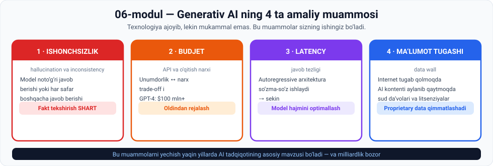

# 06-Modul · Generativ AI dagi amaliy qiyinchiliklar

## ⚠️ Bir jumlada

> **Oldingi 5 modul AI ning IMKONIYATLARINI ko'rsatdi. Bu modul uning CHEKLOVLARINI ko'rsatadi.**

Va aynan shu cheklovlar — **sizning kelajakdagi ishingiz**. Ular hali yechilmagan.

---

## 🗺 Modul xaritasi



---

## 📚 Darslar

| № | Dars | Asosiy g'oya | Amaliyot |
|---|---|---|---|
| 1 | [Izchilsizlik va gallyutsinatsiya](01-Inconsistency-and-hallucination.md) | AI noto'g'ri yoki har safar boshqacha javob beradi | 3 ta topshiriq |
| 2 | [Budjet va API narxlari](02-Budgeting-and-API-costs.md) | Unumdorlik ⟷ narx · GPT-4 = **$100 mln+** | 💻 Budjet kalkulyatori |
| 3 | [Latency](03-Latency.md) | Autoregressive arxitektura so'zma-so'z ishlaydi | 💻 Latency hisoblagich |
| 4 | [Ma'lumot tugab qolishi](04-Running-out-of-data.md) ⭐ | Internet tugamoqda · AI kontenti qaytmoqda · sud da'volari | 💻 Model collapse |

⭐ = eng ko'p muhokamaga sabab bo'ladigan dars

---

## 🎯 Modul yakunida siz bilasiz

- [ ] **Oltin qoidani** aytasiz: mutaxassis AI **bilan** ishlaydi, AI'dan **ko'chirmaydi**
- [ ] **Gallyutsinatsiya** va **izchilsizlik** farqini va ularning sabablarini bilasiz
- [ ] Har biriga qarshi qanday taktika borligini aytasiz
- [ ] Model qudratini belgilovchi **ikki omilni** bilasiz
- [ ] **Kutubxona–o'quvchi** analogiyasini tushuntirasiz
- [ ] **GPT-4 ni o'qitish qancha turganini** va bu nimani anglatishini bilasiz
- [ ] Budjetlashtirishning **to'g'ri va noto'g'ri** yo'lini aytasiz
- [ ] Qachon **kichikroq model** mantiqiyroq ekanini tushuntirasiz
- [ ] **Autoregressive arxitektura** nima uchun latency yaratishini bilasiz
- [ ] Latency ni kamaytirishning **darhol amal qiladigan** strategiyasini aytasiz
- [ ] **Uchta ma'lumot to'sig'ini** sanaysiz
- [ ] **Model collapse** nima ekanini tushuntirasiz
- [ ] OpenAI ning **kontent litsenziyalash** dasturi haqida bilasiz
- [ ] 💻 Uchta Python skriptini o'zingiz ishga tushirgansiz

---

## 🖼 Modul grafikalari

| Fayl | Nima ko'rsatadi |
|---|---|
| [`00-module-map.svg`](assets/00-module-map.svg) | To'rtta qiyinchilik bir qarashda |
| [`01-hallucination-inconsistency.svg`](assets/01-hallucination-inconsistency.svg) | Ikki xil nomaqbul xatti-harakat |
| [`02-budget-tradeoff.svg`](assets/02-budget-tradeoff.svg) | Kutubxona + o'quvchi · $100 mln |
| [`03-latency.svg`](assets/03-latency.svg) | So'zma-so'z generatsiya: 5 so'z = 1 soniya |
| [`04-data-wall.svg`](assets/04-data-wall.svg) | Uchta to'siq + litsenziyalash yechimi |

---

## 💻 Python amaliyotlari

Barchasi **hech qanday kutubxona o'rnatmasdan** ishlaydi.

| Dars | Skript nima qiladi | Nima o'rgatadi |
|---|---|---|
| 2 | Budjet taqsimoti va 1 mln so'rov narxini hisoblaydi | Katta va kichik model orasida **97 barobar** farq |
| 3 | Autoregressive generatsiyani vaqt bo'yicha ko'rsatadi | 500 so'z = **100 soniya** |
| 4 | AI kontentida o'qitishni 5 avlod modellashtirati | 5 avlodda sifat **5/5 → 1/5** |

---

## ⚡ Amaliy topshiriqlar xaritasi

| Dars | 🟢 Oson | 🟡 O'rta | 🔴 Qiyin |
|---|---|---|---|
| 1 | Gallyutsinatsiyani o'zingiz toping | Izchilsizlikni o'lchang | Fakt-tekshiruv protokoli |
| 2 | Analogiyani to'ldiring | Loyiha budjetini tuzing | Real narxlarni toping |
| 3 | O'z latency ingizni o'lchang | Latency budjeti | Autoregressive dan voz kechish mumkinmi? |
| 4 | AI kontentini taniy olasizmi? | Model qulashini modellashtiring | Ma'lumot kimniki? |

---

## 🔗 Modullar orasidagi bog'liqlik

```
02-modul  ─  "garbage in, garbage out"     →  gallyutsinatsiya sababi
02-modul  ─  web scraping ogohlantirishi   →  sud da'volari
03-modul  ─  o'quvchi–ustoz analogiyasi    →  kutubxona–o'quvchi
05-modul  ─  autoregressive GPT            →  latency muammosi
05-modul  ─  proprietary data ustunligi    →  litsenziyalash bozori
05-modul  ─  ehtimollik modeli             →  bashorat ba'zan xato
    ↓
06-modul  ─  BULARNING BAHOSI              ← siz shu yerdasiz
    ↓
07-modul  ─  Bu muammolar bilan ishlaydigan VOSITALAR
```

> 💡 **Diqqat qiling:** har bir qiyinchilik oldingi modullardagi **texnik qarorning oqibati**. Sehr ham, xato ham yo'q — **trade-off**.

---

## 📖 Umumiy atamalar lug'ati

| Atama | Inglizcha | Izoh |
|---|---|---|
| Gallyutsinatsiya | *hallucination* | AI ning noto'g'ri chiqishi |
| Izchilsizlik | *inconsistency* | Bir xil savolga turli javoblar |
| Fakt tekshirish | *fact-checking* | To'g'riligini tasdiqlash |
| Tashqarida hostlangan | *externally hosted* | Boshqa kompaniya serverida |
| Dataset hajmi | *dataset size* | O'quv ma'lumoti miqdori |
| Model hajmi | *model size* | Parametrlar soni |
| Narx samaradorligi | *cost efficiency* | Pulga nisbatan foyda |
| Inference | *inference* | Modelni ishlatish (o'qitish emas) |
| Latency | *latency* | Javob kutish vaqti |
| Autoregressive | *autoregressive* | Har bir so'z oldingilariga bog'liq |
| Parallel hisoblash | *parallel computing* | Bir vaqtda bir necha hisob |
| Keshlash | *caching* | Tayyor natijani saqlash |
| Hosila kontent | *derivative content* | Yangilik yo'q, boshqadan olingan |
| Model qulashi | *model collapse* | AI kontentida o'qitishdan sifat pasayishi |
| Kontent litsenziyalash | *content licensing* | Ma'lumot uchun to'lov |

---

## ✅ Yakuniy test

Har bir darsdagi **"O'zini tekshirish savollari"** — jami **39 ta savol**.

**31 tasidan ko'prog'iga** javob bera olsangiz — modulni o'zlashtirdingiz.

---

## ➡️ Keyingi qadam

**07-modul: AI tech stack** ga o'ting
