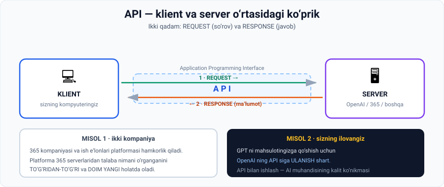

# 2-dars. API bilan ishlash

## 🎬 Boshlashdan oldin

Ob-havo ilovangizni oching. U haroratni **qayerdan** oldi?

Telefoningizda meteostansiya yo'q. Ilova **boshqa kompaniyaning serveriga** so'rov yubordi va javob oldi.

> Bu qanday sodir bo'ldi? Javob — **API**. Va bu dars uni tushuntiradi.

---

## 1. API nima

> **Ba'zi veb-sayt egalari ma'lumot chiqarishni osonlashtirish uchun API — Application Programming Interfaces dan foydalanadilar.**

> ## **API — bu KLIENT (masalan sizning kompyuteringiz) va SERVER o'rtasidagi KO'PRIK. U ularga muloqot qilish imkonini beradi.**
>
> **Klient bu ko'prik orqali SO'ROV yuboradi, server esa kerakli MA'LUMOT bilan javob beradi.**



---

## 2. Ikki asosiy qadam

> **Jarayon ikki asosiy qadamdan iborat:**

| Qadam | Nomi | Nima bo'ladi |
|---|---|---|
| **1** | **API request** | Klient serverga so'rov yuboradi |
| **2** | **API response** | Server ma'lumot bilan javob beradi |

---

## 3. Ma'ruzadagi misol: ikki kompaniya

> **Ikkita kompaniyani tasavvur qiling: 365 kompaniyasi va ish e'lonlari platformasi hamkorlik qilmoqchi.**
>
> **Agar 365 kompaniyasi talaba qancha o'rganganligi haqidagi YANGILANGAN ma'lumotni ish e'lonlari platformasi bilan bo'lishmoqchi bo'lsa — ular API dan foydalanishi mumkin.**
>
> **Shu tarzda platforma eng so'nggi talaba ma'lumotini TO'G'RIDAN-TO'G'RI 365 serverlaridan oladi.**

**Jarayon:**

```
Ish e'lonlari platformasi  ──[ API request ]──→  365 serverlari
Ish e'lonlari platformasi  ←──[ ma'lumot ]────  365 serverlari
```

> 💡 **Nima uchun bu qulay?** Muqobil — 365 har hafta Excel fayl yuborishi. Bu **sekin**, **eskirgan** va **qo'l mehnati**. API esa — **real vaqtda va avtomatik**.

---

## 4. 🔑 AI uchun nima uchun muhim

> **GPT kabi foundation modelni OpenAI dan mahsulotingizga integratsiya qilish uchun siz OpenAI ning API siga ULANISHINGIZ kerak.**
>
> **Bu ulanish OpenAI xizmatlariga so'rov yuborish va javob olish uchun ZARUR** — bu sizga ilovangizda ularning foundation modellaridan foydalanish imkonini beradi.

### Yakuniy xulosa

> ## **API lardan foydalanish — AI ishlab chiquvchilari va muhandislari arsenaliga kerak bo'lgan yana bir HAL QILUVCHI KO'NIKMA.**

*(05-modulning 10-darsidagi **"Model as a Service"** ni eslang. API — aynan shu xizmatga kirish yo'li.)*

---

## 5. 💻 Amaliyot: API mantiqini kodda ko'ring

Internet ham, kutubxona ham kerak emas — bu **soxta (mock) API**, faqat mantiqni ko'rsatish uchun.

```python
# ===== "SERVER" tomoni =====
BAZA = {
    "talaba_101": {"ism": "Ali",    "kurslar": 7, "soatlar": 42, "sertifikat": 3},
    "talaba_102": {"ism": "Dilnoza","kurslar": 12,"soatlar": 89, "sertifikat": 6},
    "talaba_103": {"ism": "Bobur",  "kurslar": 3, "soatlar": 15, "sertifikat": 1},
}

def api_endpoint(sorov):
    """Server so'rovni qabul qiladi va javob qaytaradi."""
    talaba_id = sorov.get("talaba_id")
    if talaba_id not in BAZA:
        return {"status": 404, "xato": "Talaba topilmadi"}
    return {"status": 200, "malumot": BAZA[talaba_id]}

# ===== "KLIENT" tomoni (ish e'lonlari platformasi) =====
def klient_sorov(talaba_id):
    print(f"\n[KLIENT] --- REQUEST ---> {{'talaba_id': '{talaba_id}'}}")
    javob = api_endpoint({"talaba_id": talaba_id})
    print(f"[SERVER] <-- RESPONSE --- {javob}")
    if javob["status"] == 200:
        m = javob["malumot"]
        print(f"[KLIENT] Natija: {m['ism']} - {m['kurslar']} kurs, "
              f"{m['soatlar']} soat, {m['sertifikat']} sertifikat")
    else:
        print(f"[KLIENT] Xato: {javob['xato']}")

print("=== API SIMULYATSIYASI ===")
for tid in ["talaba_101", "talaba_102", "talaba_999"]:
    klient_sorov(tid)

print("\n\n=== NIMA UCHUN API, EXCEL EMAS ===")
print("  Excel fayl:  har hafta qo'lda yuboriladi -> ESKIRGAN ma'lumot")
print("  API:         so'ralganda darrov          -> DOIM YANGI ma'lumot")
```

### Haqiqiy natija

```
=== API SIMULYATSIYASI ===

[KLIENT] --- REQUEST ---> {'talaba_id': 'talaba_101'}
[SERVER] <-- RESPONSE --- {'status': 200, 'malumot': {'ism': 'Ali', 'kurslar': 7, 'soatlar': 42, 'sertifikat': 3}}
[KLIENT] Natija: Ali - 7 kurs, 42 soat, 3 sertifikat

[KLIENT] --- REQUEST ---> {'talaba_id': 'talaba_102'}
[SERVER] <-- RESPONSE --- {'status': 200, 'malumot': {'ism': 'Dilnoza', 'kurslar': 12, 'soatlar': 89, 'sertifikat': 6}}
[KLIENT] Natija: Dilnoza - 12 kurs, 89 soat, 6 sertifikat

[KLIENT] --- REQUEST ---> {'talaba_id': 'talaba_999'}
[SERVER] <-- RESPONSE --- {'status': 404, 'xato': 'Talaba topilmadi'}
[KLIENT] Xato: Talaba topilmadi


=== NIMA UCHUN API, EXCEL EMAS ===
  Excel fayl:  har hafta qo'lda yuboriladi -> ESKIRGAN ma'lumot
  API:         so'ralganda darrov          -> DOIM YANGI ma'lumot
```

### 🔑 Uchta kuzatuv

**1. `REQUEST` va `RESPONSE` — aniq ikki qadam.** Ma'ruzada aytilgani aynan shu.

**2. `status: 200` va `status: 404`.** Real API lar ham shunday **status kod** qaytaradi. `200` = muvaffaqiyat, `404` = topilmadi, `401` = ruxsat yo'q, `429` = juda ko'p so'rov.

**3. Klient serverning ICHIDA nima borligini bilmaydi.** U faqat **so'rov formatini** va **javob formatini** biladi. Bu — API ning butun g'oyasi.

> 🔗 OpenAI API si ham xuddi shunday ishlaydi: siz `{"model": "gpt-4o", "messages": [...]}` yuborasiz, u javob qaytaradi. GPT ichida nima bo'layotgani sizga ko'rinmaydi.

---

## 6. ⚡ Amaliy topshiriqlar

### 🟢 Oson — 10 daqiqa · **API larni atrofingizda toping**

Har bir ilova qanday ma'lumotni **boshqa serverdan** oladi?

| Ilova | Qanday ma'lumot API orqali keladi? |
|---|---|
| Ob-havo ilovasi | |
| Navigator | |
| Bank ilovasi | |
| Taksi chaqirish ilovasi | |
| Onlayn do'kon (to'lov) | |
| ChatGPT mobil ilovasi | |

### 🟡 O'rta — 25 daqiqa · **API'ni kengaytiring**

Yuqoridagi kodni oling va:

1. **Yangi endpoint** qo'shing — barcha talabalar ro'yxatini qaytaradigan:
   ```python
   def api_barcha_talabalar():
       return {"status": 200, "malumot": list(BAZA.keys())}
   ```
2. **Filtr** qo'shing: faqat **5 dan ortiq kurs** tugatganlar.
3. **Ruxsat tekshiruvi** qo'shing — `api_key` bo'lmasa `401` qaytarsin:
   ```python
   def api_endpoint(sorov, api_key=None):
       if api_key != "MAXFIY_KALIT":
           return {"status": 401, "xato": "Ruxsat yo'q"}
       ...
   ```
4. **Savol:** nima uchun real API lar **kalit** talab qiladi? Kamida 3 sabab.

<details>
<summary>💡 4-savol ilgagi</summary>

(a) **Kim ishlatayotganini bilish** — hisob-kitob uchun; (b) **suiiste'moldan himoya** — cheksiz so'rov yuborishning oldini olish; (c) **to'lov** — har bir so'rov pul turadi; (d) **xavfsizlik** — maxfiy ma'lumotga faqat ruxsat berilganlar kirishi.

</details>

### 🔴 Qiyin — mini-loyiha · **O'z API integratsiyangizni rejalashtiring**

```
MAHSULOT: ______________________________________

1 · Qanday TASHQI ma'lumot kerak?
   ______________________________________________

2 · Qanday API dan olasiz?
   ______________________________________________

3 · SO'ROV (request) nima yuboradi?
   {
     "____________": "____________",
     "____________": "____________"
   }

4 · JAVOB (response) nima qaytaradi?
   {
     "____________": "____________"
   }

5 · Xatolarni qanday boshqarasiz?
   • Server javob bermasa:     ______________
   • Ruxsat yo'q bo'lsa:       ______________
   • Limitdan oshsangiz:       ______________

6 · Bu API PULLIKMI? Oyiga taxminiy narx?
   ______________________________________________
```

> 💰 6-savol — 06-modulning 2-darsini eslang. API narxi **ilovangizning asosiy xarajati** bo'lishi mumkin.

---

## 7. 🧠 O'zini tekshirish savollari

1. API nimaning qisqartmasi?
2. API ni ta'riflang.
3. Klient va server nima qiladi?
4. Jarayonning ikki asosiy qadami qaysi?
5. Ma'ruzadagi ikki kompaniya misolini tushuntiring.
6. Platforma nima uchun API dan foydalanadi?
7. GPT ni mahsulotingizga qo'shish uchun nima kerak?
8. Ma'ruzaning yakuniy xulosasi nima?

<details>
<summary>✅ Javoblar</summary>

1. **Application Programming Interface.**
2. **Klient va server o'rtasidagi ko'prik** — ularga muloqot qilish imkonini beradi.
3. **Klient so'rov yuboradi**, **server kerakli ma'lumot bilan javob beradi**.
4. **API request** va **API response**.
5. **365 kompaniyasi** talaba qancha o'rganganligi haqidagi yangilangan ma'lumotni **ish e'lonlari platformasi** bilan API orqali bo'lishadi.
6. **Eng so'nggi talaba ma'lumotini to'g'ridan-to'g'ri 365 serverlaridan olish** uchun.
7. **OpenAI ning API siga ulanish** — so'rov yuborish va javob olish uchun.
8. API lardan foydalanish — AI ishlab chiquvchilari va muhandislari uchun **hal qiluvchi ko'nikma**.

</details>

---

## 📌 Xulosa

```
KLIENT  ──[ 1 · REQUEST ]──→  API  ──→  SERVER
KLIENT  ←──[ 2 · RESPONSE ]──  API  ←──  SERVER

Misol:  ish e'lonlari platformasi  ⇄  365 serverlari
AI da:  sizning ilovangiz          ⇄  OpenAI serverlari

API = "Model as a Service" ga kirish yo'li
```

---

## 🔖 Atamalar

| Atama | Inglizcha | Izoh |
|---|---|---|
| API | *Application Programming Interface* | Klient–server ko'prigi |
| Klient | *client* | So'rov yuboruvchi tomon |
| Server | *server* | Javob beruvchi tomon |
| So'rov | *request* | Klientdan serverga xabar |
| Javob | *response* | Serverdan klientga ma'lumot |
| Endpoint | *endpoint* | API ning aniq manzili |
| Status kod | *status code* | Natija holati (200, 404, 401...) |
| API kalit | *API key* | Kirish uchun maxfiy identifikator |

---

⬅️ [Oldingi: Python dasturlash](01-Python-programming.md) · ➡️ [Keyingi: Vector databases](03-Vector-databases.md)
