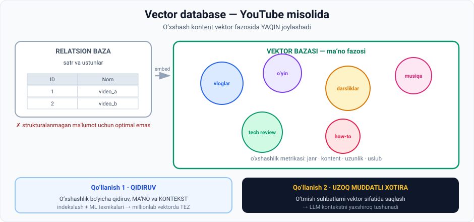

# 3-dars. Vector databases

## 🎬 Boshlashdan oldin

YouTube'da bitta video ko'rdingiz. 3 soniyadan keyin yon tomonda **o'nlab o'xshash video** paydo bo'ldi.

YouTube'da **milliardlab** video bor. U qanday qilib **shu 3 soniyada** aynan o'xshashlarini topdi?

> Javob — **vector database**. Va bu dars uni tushuntiradi.

---

## 1. Relatsion baza yetmaydi

> **Relatsion ma'lumotlar bazalari axborotni SATR va USTUNLARDA tashkil qiladi.**
>
> **Bu ularni STRUKTURALANGAN ma'lumot uchun mukammal qiladi, lekin ular MATN, RASM, VIDEO va AUDIO kabi STRUKTURALANMAGAN ma'lumot bilan ishlashda OPTIMAL EMAS.**

*(02-modulning 1-darsini eslang: dunyodagi ma'lumotning **80–90%** i strukturalanmagan.)*

### Yechim

> **Multimediyani kompyuter tushunadigan formatga aylantirish uchun biz VECTOR EMBEDDINGS dan foydalanamiz — ular keyin VECTOR DATABASE da saqlanadi va tashkil qilinadi.**

> ## **Mohiyatan, vector database da bizda O'XSHASHLIGIGA QARAB guruhlangan sonlar massivlari bor.**



---

## 2. 📺 YouTube misoli

> **Millionlab video bilan YouTube ma'lumotlar bazasini tasavvur qiling.**
>
> **Bu videolarni JANRIGA qarab guruhlash mumkin:**

| | | |
|---|---|---|
| vloglar | o'yin videolari | darsliklar |
| how-to videolar | tech sharhlar | musiqa |

### Maqsad

> **Maqsad — barcha videolarni INDEKSLASH va ularni JUDA TEZ topish hamda qidirish imkonini beradigan tarzda tashkil qilish.**

### Qanday amalga oshiriladi

> **Buning uchun vektorlar bazada shunday tashkil qilinadiki, O'XSHASH KONTENTLI VIDEOLAR vektor fazosida BIR-BIRIGA YAQINROQ joylashadi.**
>
> **Bu tashkilot vektorlar bir-biridan qanchalik YAQIN yoki UZOQ ekanini o'lchaydigan O'XSHASHLIK METRIKALARIGA asoslangan.**

**Bu nima bilan talqin qilinadi:**

```
Videolar orasidagi farq:  janr · kontent · uzunlik · uslubiy o'xshashlik
```

*(05-modulning 3-darsidagi kosinus o'xshashligini eslang — bu aynan o'sha metrika.)*

---

## 3. ⚡ Tezlik muammosi

> **LLM ni o'qitish uchun qancha ma'lumot ishlatilishi mumkinligini o'ylab ko'ring.**
>
> **Ba'zi hollarda bizda MILLIONLAB VA MILLIONLAB vector embedding bo'lishi mumkin — bu millionlab vektorni so'rov qilish va o'xshashlik qidirish JUDA SEKIN bo'lishini anglatadi.**

### Yechim

> **Ma'lumotni tez topishni ta'minlash uchun vector database lar INDEKSLASHGA tayanadi va samarali qidirish imkonini beruvchi ML TEXNIKALARIDAN foydalanadi.**

> 🔍 **Analogiya:** kitob oxiridagi alifboli ko'rsatkich. Kitobni boshdan-oxir o'qib chiqmaysiz — ko'rsatkichdan sahifa raqamini topasiz. Vector database ham xuddi shunday **oldindan tayyorlangan indeks** quradi.

---

## 4. Ikkita asosiy qo'llanish

### 4.1. Qidiruv (search)

> **Men bu yerda tasvirlagan vector database qo'llanishi — QIDIRUV haqida.**
>
> **Biz vector database lardan O'XSHASHLIK QIDIRUVI va SO'ZLARNING MA'NOSI hamda KONTEKSTIGA asoslangan qidiruv uchun foydalanishimiz mumkin.**

### 4.2. ⭐ LLM larga uzoq muddatli xotira berish

> **Bundan tashqari, vector database larning eng ajoyib qo'llanishlaridan biri —**
>
> ## **GPT va Gemini kabi LLM larga UZOQ MUDDATLI XOTIRA berish** —
> **o'tmish muloqotlarni yoki o'rganilgan ma'lumotni VEKTOR sifatida saqlash orqali.**
>
> **Model kontekstni yaxshiroq tushunish uchun bu ma'lumotga murojaat qila oladi.**

**Ma'ruzadagi misol:**

> **Masalan, agar siz LLM ni chatbot yordamchi sifatida ishlatsangiz, u siz bilan va o'xshash mijozlar bilan bo'lgan OLDINGI SUHBATLAR haqidagi ma'lumotni saqlashi va YANADA XABARDOR javoblar berishi mumkin.**

> 💡 **Nima uchun bu kerak?** LLM ning **kontekst oynasi cheklangan** — u bir vaqtda faqat ma'lum hajmdagi matnni ko'ra oladi. Vector database esa **cheksiz xotira** rolini o'ynaydi: kerakli bo'lakni topib, kontekstga qo'shadi.
>
> Bu — aynan **RAG** (05-modulning 8-darsi).

---

## 5. 🗄 Mashhur vector database lar

> **AI loyihalaringiz uchun mashhur vector database larni ko'rib chiqing:**

| Baza | Open source mi? |
|---|---|
| **Pinecone** | ❌ **Yo'q** — bu ba'zi loyihalarni cheklashi mumkin |
| **Weaviate** | ✅ Ha |
| **Milvus** | ✅ Ha |
| **Chroma** | ✅ Ha |
| **Elasticsearch** | ✅ Ha |

> **Pinecone juda mashhur bo'lsa-da, u open source EMAS** — bu ba'zi loyihalarni cheklashi mumkin.
>
> **Aksincha, Weaviate, Milvus, Chroma va Elasticsearch mashhur open source alternativalar taklif qiladi.**

> 🔗 **Tanish nomlar:** **Chroma** — 01-modulning 1-darsidagi demoda ishlatilgan. **Pinecone** — kursning **Vector Databases** modulida o'rganiladi.

---

## 6. 💻 Amaliyot: indekslash nima uchun kerakligini ko'ring

Hech narsa o'rnatmasdan ishlaydi.

```python
import math

# YouTube videolari: [ta'lim, o'yin-kulgi, musiqa, texnologiya]
VIDEOLAR = {
    "Python darsligi":     [0.9, 0.1, 0.0, 0.8],
    "JavaScript kursi":    [0.9, 0.1, 0.0, 0.7],
    "Telefon sharhi":      [0.3, 0.4, 0.0, 0.9],
    "Noutbuk sharhi":      [0.3, 0.4, 0.0, 0.9],
    "Gitara darsi":        [0.8, 0.3, 0.9, 0.0],
    "Konsert yozuvi":      [0.0, 0.8, 0.9, 0.0],
    "O'yin streami":       [0.0, 0.9, 0.1, 0.3],
    "O'yin sharhi":        [0.2, 0.8, 0.1, 0.4],
}

def kosinus(a, b):
    sk = sum(x*y for x, y in zip(a, b))
    na = math.sqrt(sum(x*x for x in a))
    nb = math.sqrt(sum(y*y for y in b))
    return sk / (na*nb) if na and nb else 0

# ===== 1. KLASTERLASH: o'xshash videolar yonma-yon =====
print("=== 1. VEKTOR FAZOSIDAGI KLASTERLAR ===\n")
korilgan = set()
for nom, v in VIDEOLAR.items():
    if nom in korilgan:
        continue
    guruh = [k for k, u in VIDEOLAR.items() if kosinus(v, u) > 0.90]
    korilgan.update(guruh)
    print(f"  Klaster: {guruh}")

# ===== 2. QIDIRUV =====
print("\n=== 2. O'XSHASHLIK QIDIRUVI ===")
sorov = "Python darsligi"
natija = sorted(((kosinus(VIDEOLAR[sorov], v), k)
                 for k, v in VIDEOLAR.items() if k != sorov), reverse=True)
print(f"\n  '{sorov}' ni ko'rgan foydalanuvchiga tavsiya:")
for skor, nom in natija[:3]:
    print(f"    {skor:.3f}  {nom}")

# ===== 3. INDEKSLASH NIMA UCHUN KERAK =====
print("\n\n=== 3. INDEKSLASHSIZ VA INDEKS BILAN ===\n")
for n in (1_000, 1_000_000, 1_000_000_000):
    tolik = n                              # hammasini tekshirish
    indeks = math.log2(n)                  # indeks bilan (taxminiy)
    print(f"  {n:>15,} vektor:  to'liq qidiruv = {tolik:>15,} taqqoslash"
          f"  |  indeks bilan ~ {indeks:>5.0f}")
print("\n  Shuning uchun vector database lar INDEKSLASH va ML texnikalariga tayanadi.")
```

### Haqiqiy natija

```
=== 1. VEKTOR FAZOSIDAGI KLASTERLAR ===

  Klaster: ['Python darsligi', 'JavaScript kursi']
  Klaster: ['Telefon sharhi', 'Noutbuk sharhi']
  Klaster: ['Gitara darsi']
  Klaster: ['Konsert yozuvi']
  Klaster: ["O'yin streami", "O'yin sharhi"]

=== 2. O'XSHASHLIK QIDIRUVI ===

  'Python darsligi' ni ko'rgan foydalanuvchiga tavsiya:
    0.998  JavaScript kursi
    0.828  Telefon sharhi
    0.828  Noutbuk sharhi


=== 3. INDEKSLASHSIZ VA INDEKS BILAN ===

            1,000 vektor:  to'liq qidiruv =           1,000 taqqoslash  |  indeks bilan ~    10
        1,000,000 vektor:  to'liq qidiruv =       1,000,000 taqqoslash  |  indeks bilan ~    20
    1,000,000,000 vektor:  to'liq qidiruv =   1,000,000,000 taqqoslash  |  indeks bilan ~    30

  Shuning uchun vector database lar INDEKSLASH va ML texnikalariga tayanadi.
```

### 🔑 Uchta kuzatuv

**1. Klasterlar o'z-o'zidan hosil bo'ldi.** Hech kim "Python va JavaScript o'xshash" demadi. **Vektorlar o'zi aytdi.**

**2. Tavsiya ishladi.** `Python darsligi` → `JavaScript kursi` (0.997). Bu — YouTube yon paneli mantiqining eng sodda ko'rinishi.

**3. Uchinchi blok — eng muhimi.** 1 milliard vektorda:
```
to'liq qidiruv:  1 000 000 000 taqqoslash  →  soatlar
indeks bilan:              ~30 taqqoslash  →  millisoniyalar
```
Aynan shuning uchun **indekslash** vector database ning yuragi.

---

## 7. ⚡ Amaliy topshiriqlar

### 🟢 Oson — 10 daqiqa · **Qaysi baza kerak?**

| № | Ma'lumot | Relatsion / Vector ? |
|---|---|---|
| 1 | Xodimlar ro'yxati: ism, lavozim, maosh | |
| 2 | 1 mln mahsulot rasmi | |
| 3 | Bank tranzaksiyalari | |
| 4 | Mijozlar bilan chat tarixi (semantik qidiruv uchun) | |
| 5 | Talabalar baholari jadvali | |
| 6 | Podkastlar audio arxivi | |

<details>
<summary>✅ Javoblar</summary>

**Relatsion:** 1, 3, 5 — strukturalangan, satr-ustun
**Vector:** 2, 4, 6 — strukturalanmagan, ma'no bo'yicha qidiriladi

</details>

### 🟡 O'rta — 25 daqiqa · **O'z tavsiya tizimingiz**

Yuqoridagi kodni oling va **o'z kontent bazangizni** yarating (kitoblar, filmlar, mahsulotlar — 10 ta element, 4–5 o'lcham).

```python
MENING_BAZAM = {
    "____________": [_, _, _, _],
    # 10 tagacha
}
```

**Sinovlar:**
1. Klasterlar mantiqiy chiqdimi?
2. `> 0.90` chegarasini `0.95` va `0.80` ga o'zgartiring. Klasterlar soni qanday o'zgardi?
3. Tavsiya **noto'g'ri** chiqqan bitta holatni toping. Nima uchun? Qanday o'lcham qo'shish kerak?

### 🔴 Qiyin — tadqiqot · **Vector database tanlang**

```
LOYIHA: ______________________________________

1 · TALABLAR:
   Nechta vektor kutyapsiz?          ______
   Kuniga nechta so'rov?             ______
   Ma'lumot maxfiymi?                ha / yo'q
   Byudjetingiz bormi?               ha / yo'q

2 · VARIANTLARNI TAQQOSLANG (saytlariga kiring):

   Baza          Open source  Bepul limit   Narx   Qulaylik
   Pinecone      yo'q         ________      ____   ________
   Weaviate      ha           ________      ____   ________
   Milvus        ha           ________      ____   ________
   Chroma        ha           ________      ____   ________
   Elasticsearch ha           ________      ____   ________

3 · QAROR: ______________  Sabab: ______________

4 · Nima uchun ma'ruzachi Pinecone open source EMASLIGINI
   alohida ta'kidlaydi? Qanday loyihalar cheklanadi?
   ______________________________________________
```

---

## 8. 🧠 O'zini tekshirish savollari

1. Relatsion baza nima uchun strukturalanmagan ma'lumot uchun optimal emas?
2. Multimediyani kompyuter tushunadigan formatga qanday aylantiramiz?
3. Vector database da nima saqlanadi?
4. YouTube misolida maqsad nima?
5. Vektorlar bazada qanday tashkil qilinadi?
6. O'xshashlik metrikalari nimani o'lchaydi?
7. Millionlab vektorda qidiruv nima uchun sekin? Yechim nima?
8. Vector database ning ikki asosiy qo'llanishini ayting.
9. LLM larga uzoq muddatli xotira qanday beriladi?
10. Beshta mashhur vector database ni sanang. Qaysi biri open source emas?

<details>
<summary>✅ Javoblar</summary>

1. U axborotni **satr va ustunlarda** tashkil qiladi — bu **strukturalangan** ma'lumot uchun mukammal, lekin matn, rasm, video, audio uchun **optimal emas**.
2. **Vector embeddings** orqali.
3. **O'xshashligiga qarab guruhlangan sonlar massivlari** (vektorlar).
4. Barcha videolarni **indekslash** va **juda tez topish hamda qidirish** imkonini beradigan tarzda tashkil qilish.
5. **O'xshash kontentli videolar vektor fazosida bir-biriga yaqinroq** joylashadi.
6. Vektorlar bir-biridan **qanchalik yaqin yoki uzoq** ekanini — janr, kontent, uzunlik, uslubiy o'xshashlik.
7. Chunki **millionlab vektorni** so'rov qilish juda sekin. Yechim: **indekslash** va **ML texnikalari**.
8. (a) **Qidiruv** — o'xshashlik va ma'no/kontekst bo'yicha; (b) **LLM larga uzoq muddatli xotira** berish.
9. **O'tmish muloqotlarni yoki o'rganilgan ma'lumotni vektor sifatida saqlash** orqali — model kontekstni yaxshiroq tushunish uchun murojaat qiladi.
10. **Pinecone, Weaviate, Milvus, Chroma, Elasticsearch.** **Pinecone** open source emas.

</details>

---

## 📌 Xulosa

```
Strukturalanmagan ma'lumot (matn, rasm, video, audio)
        ↓ vector embeddings
VECTOR DATABASE
        ↓ o'xshashlik metrikalari
o'xshash kontent → YAQIN joylashadi
        ↓ indekslash + ML texnikalari
millionlab vektorda TEZ qidiruv

Ikki qo'llanish:
  1. QIDIRUV — ma'no va kontekst bo'yicha
  2. LLM ga UZOQ MUDDATLI XOTIRA

Pinecone (yopiq) · Weaviate · Milvus · Chroma · Elasticsearch (ochiq)
```

---

## 🔖 Atamalar

| Atama | Inglizcha | Izoh |
|---|---|---|
| Relatsion baza | *relational database* | Satr-ustunli klassik baza |
| Vector database | *vector database* | Vektorlarni saqlovchi baza |
| Vector embedding | *vector embedding* | Ma'noning sonli ko'rinishi |
| O'xshashlik metrikasi | *similarity metric* | Vektorlar yaqinligi o'lchovi |
| Indekslash | *indexing* | Tez qidiruv uchun tuzilma qurish |
| Uzoq muddatli xotira | *long-term memory* | O'tmish muloqotlarni saqlash |
| Klaster | *cluster* | O'xshash elementlar guruhi |

---

⬅️ [Oldingi: API bilan ishlash](02-Working-with-APIs.md) · ➡️ [Keyingi: Open source ning ahamiyati](04-The-importance-of-open-source.md)
