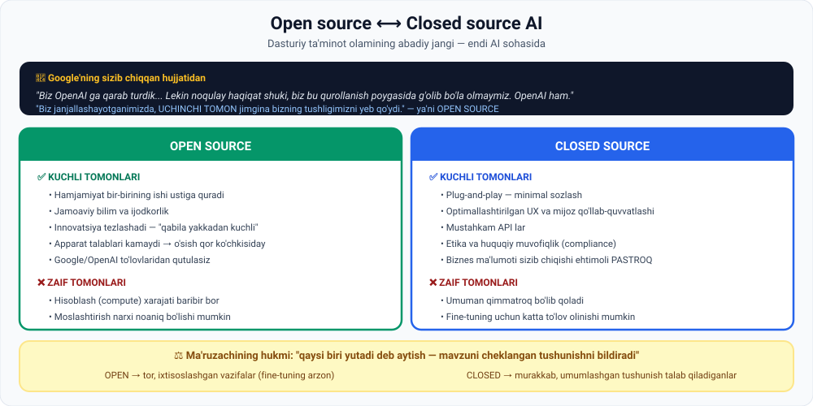

# 4-dars. Open source ning ahamiyati

## 🎬 Boshlashdan oldin

2023-yilda Google'dan **ichki hujjat sizib chiqdi**. Uning sarlavhasi taxminan shunday edi:

> *"Bizda ham, OpenAI da ham himoya devori (moat) yo'q."*

Bu — dunyoning eng kuchli texnologiya kompaniyasi **o'z ichida** aytgan gap.

> Bu dars — o'sha hujjat va u ochib bergan haqiqat haqida.

---

## 1. Sizib chiqqan hujjat

> **Biz OpenAI ga qarab, yelkamiz osha ko'p qaradik. Kim keyingi bosqichni bosib o'tadi? Keyingi harakat qanday bo'ladi?**
>
> **Lekin NOQULAY HAQIQAT shuki — biz bu qurollanish poygasida g'olib bo'ladigan holatda emasmiz. OpenAI ham emas.**
>
> **Biz janjallashayotganimizda, UCHINCHI TOMON jimgina bizning tushligimizni yeb qo'ydi.**

### Uchinchi tomon kim?

> **Sizib chiqqan Google hujjatiga ko'ra, paydo bo'layotgan uchinchi tomon tahdidi OPEN SOURCE MODELLARIDAN keladi — bu Google va OpenAI uchun jiddiy tashvish.**

### Eng keskin jumla

> ## **Muallif keskin ta'kidlaydi: Google yoki OpenAI da o'z AI modellarini yaxshiroq qiladigan "MAXFIY RETSEPT" (secret sauce) YO'Q.**



---

## 2. ⚔️ Ziddiyat

Ma'ruzachi o'zi savol beradi:

> **Lekin biz aytgan edik-ku: Sam Altman va boshqa big tech rahbarlari dunyoda LLM qurish uchun resurs va ko'nikmaga ega tashkilotlar JUDA KAM bo'ladi deb hisoblashadi?**
>
> **Hammani boshqaradigan bitta model bo'lmaydimi?**
>
> **Xo'sh, ko'raylik.**

*(05-modulning 9-darsini eslang — o'sha yerda ham ma'ruzachi bu bashoratga shubha bildirgandi.)*

---

## 3. Open source ning kuchi

> **Dasturiy ta'minot ishlab chiqish olamidagi abadiy janglardan biri — OCHIQ va YOPIQ kod o'rtasidagi kurash.**
>
> **Bugun bu to'qnashuv AI sanoati evolyutsiyasida sezilarli rol o'ynaydi.**

### Asosiy fikr

> **Kam tashkilotda o'z proprietary LLM larini qurish uchun resurs borligi rost — lekin bu QOLGANLAR OPEN SOURCE AI ASOSIDA VERSIYALAR QURA OLMAYDI degani EMAS.**

> **Hamma big tech firmalarining GPT va Gemini kabi proprietary yopiq foundation modellari o'rtasidagi jangga qarab turgan bir paytda, OPEN SOURCE AI ning tez o'sishi PARDA ORTIDA sodir bo'lmoqda va uni sezish kerak.**

### Nima uchun open source tez rivojlanadi

> **Open source dasturiy ta'minot MALAKALI VA MOTIVATSIYALI SHAXSLAR HAMJAMIYATI tomonidan ishlab chiqiladi — ular bir-birining ishi ustiga qura oladi va ochiq kirish beradi.**
>
> **Bunday hamkorlik muhiti innovatsiyani TEZLASHTIRADI** — bu open source ning asosiy kuchi:
>
> ## **JAMOAVIY BILIM va IJODKORLIKKA tayanish qobiliyati.**
>
> **"Qabila yakka shaxsdan kuchliroq", desak bo'ladi.**

### Burilish nuqtasi

> **Open source AI o'sishini kuchaytirgan kritik omillardan biri — foydalanuvchilar AI ishlab chiqish uchun APPARAT TALABLARINI KAMAYTIRA olishdi.**
>
> **Bu sodir bo'lgach, innovatsiya va model yaxshilanishlari QOR KO'CHKISIGA aylandi.**

---

## 4. Sifat farqi yopilmoqda

> **Sizib chiqqan Google hujjati sifat jihatidan tafovut HAYRATLANARLI TEZLIKDA yopilayotganini ochib beradi.**
>
> **Shuningdek, ba'zi open source modellar TENG SHAROITDA (pound for pound) GPT va Gemini dan KO'RA QOBILIYATLIROQ ekanini qayd etadi.**

### Open source hamjamiyati nimalarga erishdi

| Yutuq |
|---|
| **Katta til modellarini SMARTFONLARDA ishlatish** |
| **Masshtablanadigan SHAXSIY AI** ishlab chiqish |

> **Shuning uchun proprietary LLM ishlab chiquvchilari tabiiy ravishda TAHDID SEZADILAR** — ular AI modellariga katta sarmoya kiritishgan va **sezilarli daromad kutishmoqda**.
>
> **Ammo open source hamjamiyati TEZ MAYDONNI EGALLAMOQDA.**

---

## 5. ✅ Closed source ning afzalliklari

> **Yopiq yechimlar odatda AMALGA OSHIRISH OSONROQ** — minimal sozlash bilan **plug-and-play** qulaylik taklif qiladi.

### Narx haqida nozik fikr

> **Open source AI modelidan foydalanish Google yoki OpenAI to'lovlaridan qutulish demakdir — LEKIN SIZ BARIBIR HISOBLASH (compute) XARAJATLARINI to'laysiz.**
>
> **Bundan tashqari, open source AI ni MOSLASHTIRISH va FINE-TUNE qilish xarajatlari OpenAI olayotgan umumiy to'lovdan oshib ketishi yoki ketmasligi NOANIQ va SUBYEKTIV.**

> 💰 **Bu juda muhim nuqta.** "Open source = bepul" degan tasavvur **noto'g'ri**. Siz **litsenziya to'lamaysiz**, lekin:
> - server / GPU ijarasi
> - muhandis ish haqi
> - sozlash va qo'llab-quvvatlash vaqti
>
> — bularning hammasi **pul**.

### Yana qanday afzalliklar

> **Oson integratsiyadan tashqari, closed source AI taklif qiladi:**

| Afzallik |
|---|
| **Optimallashtirilgan foydalanuvchi tajribasi (UX)** |
| **Mijozlarni qo'llab-quvvatlash** |
| **Mustahkam API lar** |
| **Etika va huquqiy muvofiqlik (compliance)** |

> **Bu yirik korxonalar uchun qanchalik muhimligini tasavvur qila olasiz.**

### ⭐ Yana bir kritik afzallik

> **Closed source ning yana bir kritik foydasi — biznes ma'lumotingizning OMMAGA SIZIB CHIQISH EHTIMOLI PASTROQ bo'lishi kerak — bu ENG MUHIM ahamiyatga ega.**

---

## 6. 🦙 Llama sizib chiqishi — kutilmagan natija

> **2023-yilda Meta ning Llama AI modeli sizib chiqishi — u BUTUNLAY TASODIFIY bo'lmagan bo'lishi ham mumkin — FOYDALI bo'lib chiqdi.**
>
> **Chiqarilgach, open source hamjamiyati Llama ustiga infratuzilma qura boshladi va BEXOSDAN Meta ning AI takliflarini kuchaytirdi.**

### Xulosa

> **Ma'lum ma'noda aytishimiz mumkin: big tech firmalaridan biri OPEN SOURCE YONDASHUVNI QUCHOQ OCHIB QARSHI OLDI** va **LLM qurish uchun zarur ulkan resurslar hamda dastlabki sarmoyani HAMJAMIYAT RIVOJLANISHI KUCHI bilan birlashtirdi.**

> 🤔 **"Butunlay tasodifiy bo'lmagan bo'lishi ham mumkin"** — ma'ruzachi ehtiyotkorlik bilan ishora qiladi: bu **strategiya** bo'lishi mumkin edi.

---

## 7. ⚖️ Qaysi biri yutadi?

> **Qaysi maktab g'olib chiqishini BILMAYMIZ, va closed source yoki open source modellar vaqt o'tishi bilan yutadi deb aytish MAVZUNI CHEKLANGAN TUSHUNISHNI bildiradi.**
>
> **Kelajakda ham CHEKSIZ MUVAFFAQIYATLI closed source, ham open source AI loyihalari bo'lishi ehtimoli katta.**

### Ma'ruzachining bashorati

| Qaysi holda | Qaysi biri ustun |
|---|---|
| **Tor, ixtisoslashgan AI talab qiladigan holatlar** | ✅ **OPEN SOURCE** |
| **Murakkab, umumlashgan tushunish va ko'nikma talab qiladigan vazifalar** | ✅ **CLOSED SOURCE** |

> **Bunday DOMENGA XOS muammolar BAZAVIY MODELNI FINE-TUNE QILISH orqali ajoyib hal qilinadi.**
>
> **Bunday hollarda GPT kabi KENGROQ modelni tor muammoni yechish uchun ishlatish ANCHA QIMMATROQ bo'lardi.**

### ⚠️ Muhim nuans

> **Bundan tashqari, closed source modelni fine-tune qilish qimmat bo'lishi mumkin, chunki ba'zi kompaniyalar sezilarli to'lov oladi.**
>
> **Closed source modellar umuman olganda QIMMATROQ bo'lib qolishi ehtimoli katta** — o'qitilgan **ulkan datasetlari** tufayli.
>
> **Ular UMUMLASHGAN TUSHUNISH va KO'NIKMA talab qiladigan murakkab vazifalarda ham KUCHLIROQ bo'ladi.**

### Big tech ning hal qiluvchi ustunligi

> ## **Big tech firmalarining hal qiluvchi afzalligi — ularda PROPRIETARY MA'LUMOT SOTIB OLISH uchun resurs bor.**
>
> **Bu ularga yanada mustahkam foundation modellar qurish va shuning uchun UNUMDORLIK SIFATIDAGI FARQNI KENGAYTIRISH imkonini beradi.**

*(06-modulning 4-darsini eslang: kontent litsenziyalash, $1–5 mln/yil. Ana shu — o'sha ustunlik.)*

---

## 8. 📊 To'liq solishtiruv

| Mezon | Open source | Closed source |
|---|---|---|
| **Litsenziya to'lovi** | ✅ Yo'q | ❌ Bor |
| **Compute xarajati** | ❌ Bor | ⚠️ Narxga kiritilgan |
| **Amalga oshirish** | ⚠️ Sozlash kerak | ✅ **Plug-and-play** |
| **UX va qo'llab-quvvatlash** | ⚠️ Hamjamiyat | ✅ **Professional** |
| **API mustahkamligi** | O'zgaruvchan | ✅ **Yuqori** |
| **Etika/huquqiy muvofiqlik** | ⚠️ O'zingiz | ✅ **Ta'minlangan** |
| **Ma'lumot maxfiyligi** | ✅ O'zingizda | ⚠️ Tashqi provayder |
| **Innovatsiya tezligi** | ✅ **Juda tez** | O'rtacha |
| **Tor vazifalar** | ✅ **Ustun** | Qimmat |
| **Murakkab, umumiy vazifalar** | ⚠️ | ✅ **Ustun** |
| **Proprietary ma'lumot** | ❌ | ✅ **Big tech ustunligi** |

---

## 9. ⚡ Amaliy topshiriqlar

### 🟢 Oson — 10 daqiqa · **Qaysisini tanlaysiz?**

| № | Holat | Open / Closed ? |
|---|---|---|
| 1 | Startap tez prototip qurmoqchi | |
| 2 | Kasalxona bemor ma'lumoti bilan ishlaydi | |
| 3 | Faqat huquqiy hujjatlarni tahlil qiluvchi tizim | |
| 4 | Yirik bank, muvofiqlik talablari qat'iy | |
| 5 | O'zbek tilida ishlaydigan ixtisoslashgan model | |
| 6 | Umumiy maqsadli chatbot, tez ishga tushirish kerak | |

<details>
<summary>✅ Javoblar</summary>

**Closed:** 1, 4, 6 — tezlik, muvofiqlik, plug-and-play
**Open:** 2, 3, 5 — maxfiylik, tor domen, mahalliy fine-tuning

**Diqqat:** 2-holat bahsli. Closed provayderlar ham maxfiylik kafolatlarini taklif qiladi, lekin ma'lumot **o'z serveringizdan chiqmasligi** faqat open source bilan mumkin.

</details>

### 🟡 O'rta — 25 daqiqa · **Haqiqiy narxni hisoblang**

"Open source = bepul" degan tasavvurni tekshiring:

```
LOYIHA: kuniga 10 000 so'rovli chatbot

CLOSED SOURCE (API):
   1 so'rov narxi:        $______
   Oyiga (300k so'rov):   $______
   Muhandis vaqti:        ___ soat/oy × $___ = $______
   JAMI:                  $______

OPEN SOURCE (o'z serveringizda):
   GPU server ijarasi:    $______/oy
   Muhandis vaqti (sozlash + qo'llab-quvvatlash):
                          ___ soat/oy × $___ = $______
   Fine-tuning (bir marta): $______
   JAMI:                  $______

QAROR: __________  Sabab: __________________________

Nechta so'rovda ular TENGLASHADI?  ______
```

### 🔴 Qiyin — muhokama · **"Maxfiy retsept yo'q" — rostmi?**

```
1. GOOGLE HUJJATINING DA'VOSI:
   "Google yoki OpenAI da maxfiy retsept yo'q"
   Bu qanday dalillar bilan asoslanadi?
   • _______________________________________
   • _______________________________________

2. QARSHI DALILLAR:
   Big tech da NIMA bor, hamjamiyatda yo'q?
   • _______________________________________
   • _______________________________________
   • _______________________________________

3. HUJJAT 2023-YILDA YOZILGAN. BUGUN NIMA O'ZGARDI?
   Tadqiqot qiling:
   • Eng kuchli ochiq model bugun qaysi?  ____________
   • U yopiq modellardan qanchalik orqada? ___________
   • Tafovut yopildimi yoki kengaydimi?   ____________

4. SIZNING BASHORATINGIZ (5 jumla):
   ______________________________________________
   ______________________________________________

5. O'ZBEKISTON UCHUN:
   Mahalliy kompaniyalar uchun qaysi yo'l amaliyroq?
   ______________________________________________
```

> 💡 **2-savol ilgagi:** ma'ruzaning o'zi javob beradi — **proprietary ma'lumot sotib olish uchun resurs**. Bu — hamjamiyatda yo'q narsa.

---

## 10. 🧠 O'zini tekshirish savollari

1. Sizib chiqqan Google hujjati nima deydi? Uchinchi tomon kim?
2. Hujjatning eng keskin da'vosi nima?
3. Nima uchun open source innovatsiyasi tez?
4. Open source o'sishini kuchaytirgan kritik omil nima?
5. Hujjat sifat tafovuti haqida nima deydi?
6. Open source hamjamiyati nimalarga erishdi?
7. Closed source ning afzalliklarini sanang (kamida 5 ta).
8. Open source bepulmi? Tushuntiring.
9. Llama sizib chiqishi qanday natija berdi?
10. Ma'ruzachi qaysi biri yutadi deb hisoblaydi?
11. Open source qaysi holatlarda ustun? Closed source-chi?
12. Big tech ning hal qiluvchi ustunligi nima?

<details>
<summary>✅ Javoblar</summary>

1. Google ham, OpenAI ham bu poygada **g'olib bo'la olmasligi**; uchinchi tomon — **open source modellari**.
2. Google yoki OpenAI da o'z modellarini yaxshiroq qiladigan **"maxfiy retsept" yo'q**.
3. **Malakali va motivatsiyali shaxslar hamjamiyati** bir-birining ishi ustiga quradi va ochiq kirish beradi — **jamoaviy bilim va ijodkorlik**.
4. Foydalanuvchilar **apparat talablarini kamaytira olishdi** — shundan keyin yaxshilanishlar **qor ko'chkisiga** aylandi.
5. Sifat tafovuti **hayratlanarli tezlikda yopilmoqda**; ba'zi ochiq modellar **teng sharoitda GPT va Gemini dan qobiliyatliroq**.
6. **LLM larni smartfonlarda ishlatish** va **masshtablanadigan shaxsiy AI** ishlab chiqish.
7. **Plug-and-play qulaylik**, **optimallashtirilgan UX**, **mijoz qo'llab-quvvatlashi**, **mustahkam API lar**, **etika va huquqiy muvofiqlik**, **ma'lumot sizib chiqishi ehtimoli pastroq**.
8. **Yo'q.** Google/OpenAI to'lovlaridan qutulasiz, lekin **hisoblash (compute) xarajatlari** baribir bor; moslashtirish va fine-tuning narxi **oshib ketishi mumkin**.
9. Open source hamjamiyati **Llama ustiga infratuzilma qura boshladi** va **bexosdan Meta ning AI takliflarini kuchaytirdi**.
10. **Bilmaymiz** — biri yutadi deb aytish **mavzuni cheklangan tushunishni** bildiradi. Ikkalasida ham muvaffaqiyatli loyihalar bo'ladi.
11. **Open source** — tor, ixtisoslashgan, domenga xos vazifalar (fine-tuning arzon). **Closed source** — murakkab, umumlashgan tushunish talab qiladiganlar.
12. **Proprietary ma'lumot sotib olish uchun resurs** — bu ularga mustahkamroq modellar qurish va **unumdorlik farqini kengaytirish** imkonini beradi.

</details>

---

## 📌 Xulosa

```
Google sizib chiqqan hujjati:
  "Bizda ham, OpenAI da ham MAXFIY RETSEPT yo'q"
  Uchinchi tomon = OPEN SOURCE

OPEN SOURCE                    CLOSED SOURCE
  jamoaviy bilim                 plug-and-play
  tez innovatsiya                UX + qo'llab-quvvatlash
  apparat talabi kamaydi         mustahkam API
  litsenziya to'lovi yo'q        etika/huquqiy muvofiqlik
  ⚠️ compute baribir pul         ⚠️ umuman qimmatroq

Kim yutadi?  IKKALASI HAM
  tor, ixtisoslashgan  →  OPEN
  murakkab, umumiy     →  CLOSED

Big tech ustunligi: PROPRIETARY MA'LUMOT sotib olish resursi
```

---

## 🔖 Atamalar

| Atama | Inglizcha | Izoh |
|---|---|---|
| Open source | *open source* | Ochiq kodli |
| Closed source / proprietary | *closed source* | Yopiq, egalik qilinadigan |
| Maxfiy retsept | *secret sauce* | Raqobatchida yo'q noyob ustunlik |
| Plug-and-play | *plug-and-play* | Sozlashsiz darrov ishlaydigan |
| Compute xarajati | *compute cost* | Hisoblash resurslari narxi |
| Muvofiqlik | *compliance* | Qonun va standartlarga mos kelish |
| Domenga xos | *domain-specific* | Aniq sohaga tegishli |
| Teng sharoitda | *pound for pound* | Bir xil o'lchamda taqqoslaganda |

---

⬅️ [Oldingi: Vector databases](03-Vector-databases.md) · ➡️ [Keyingi: Hugging Face](05-Hugging-Face.md)
