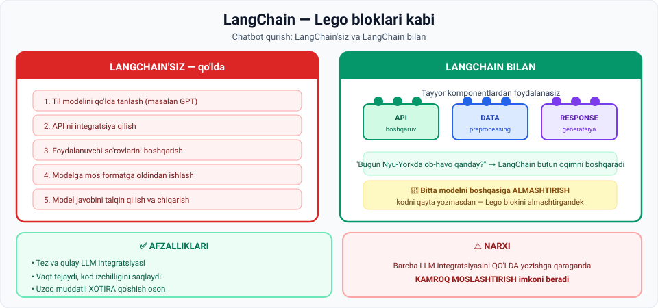

# 6-dars. LangChain

## 🎬 Boshlashdan oldin

Siz GPT bilan ilova qurdingiz. Uch oy o'tdi. Endi boshqa model **arzonroq va tezroq** bo'lib chiqdi.

Almashtirmoqchisiz. Necha kun ketadi?

> **LangChain'siz:** haftalar — barcha API chaqiruvlari, formatlar, javob qayta ishlash qaytadan yoziladi.
> **LangChain bilan:** bir necha qator.
>
> Bu dars aynan shu farq haqida.

---

## 1. LangChain nima

> **LangChain — AI quvvatlangan ilovalar ishlab chiqish uchun qimmatli vosita.** U **Python va JavaScript**da mavjud **OPEN SOURCE ORKESTRATSIYA MUHITI**.

### Asosiy imkoniyat

> **U sizga ilova qurish va u bilan XOHLAGAN foundation modelingizni ishlatish imkonini beradi.**
>
> **Kodni QAYTA YOZISH shart emas** — chunki LangChain ning **funksiyalar va obyekt klasslari** kabi **MODULAR KOMPONENTLARI** bir foundation modelni boshqasiga **strukturalangan, oson amalga oshiriladigan tarzda** almashtira oladi.

---

## 2. 🧱 Lego analogiyasi

> ## **Xuddi LEGO bloklaridan qurish kabi — siz bir bo'lakni boshqasiga oson almashtira olasiz va hech qanday muammosiz qurishni davom ettirasiz.**



> **Xuddi shunday, LangChain ishlab chiquvchilarga BIR NECHA foundation model va TASHQI MA'LUMOT MANBALARINI integratsiya qilish imkonini beradi.**

### Platforma nima

> **Platforma mohiyatan KUTUBXONA vazifasini bajaradi** — u **keng ishlatiladigan dasturlash komponentlari va naqshlari** to'plamini taklif qiladi.
>
> **Bu vositalar ishlab chiquvchilarga til modellari bilan SAMARALI ishlashga yordam berish uchun moslashtirilgan** — murakkab vazifalarni soddalashtiradi.
>
> **Bu ishlab chiquvchilarga VAQT TEJAYDI va ilovalarini IZCHIL BO'LMAGAN KODDAN saqlaydi.**

---

## 3. 📖 Ma'ruzadagi misol: chatbot integratsiyasi

### ❌ LangChain'siz

> **Aytaylik, siz mahsulotingizga AI chatbot integratsiya qilmoqchisiz.**
>
> **LangChain'siz siz:**

| Qadam | Nima qilasiz |
|---|---|
| 1 | **Qo'lda til modelini tanlaysiz** (masalan OpenAI ning GPT si) |
| 2 | **API ni integratsiya qilasiz** |
| 3 | **Foydalanuvchi so'rovlarini boshqarasiz** |
| 4 | Ularni **modelga mos formatga oldindan ishlaysiz** |
| 5 | **Til modeli javoblarini talqin qilib**, foydalanuvchiga aniq javob berasiz |

> **Bu jarayon API lar, so'rovlarni boshqarish va Python'da ma'lumot formatlash bo'yicha BATAFSIL BILIM talab qiladi.**

### ✅ LangChain bilan

> **Muqobil ravishda, LangChain sizga chatbot qurish uchun OLDINDAN TAYYORLANGAN KOMPONENTLARDAN foydalanish imkonini beradi.**
>
> **Siz bu komponentlardan API o'zaro ta'siri, ma'lumotni oldindan ishlash va javob generatsiyasini boshqarish uchun foydalanasiz.**

**Misol:**

> **Masalan, agar foydalanuvchi `"Bugun Nyu-Yorkda ob-havo qanday?"` deb so'rasa —**
>
> **LangChain BUTUN ISH OQIMINI boshqara oladi: savolni tushunishdan tortib, mos javobni olib kelish va formatlashgacha** — bu **murakkablik va kerakli kod miqdorini sezilarli kamaytiradi**.

---

## 4. ⚖️ Afzallik va narxi

### Afzallik

> **Bu vositaning afzalligi — u ishlab chiquvchilarga LLM larni ilovalariga integratsiya qilishning TEZ va QULAY yo'lini beradi.**

### ⚠️ Narxi

> **Ayni paytda, LangChain barcha LLM integratsiyalarini QO'LDA yozishga qaraganda KAMROQ MOSLASHTIRISH imkonini beradi.**

> 🎯 **Bu — muhandislikning klassik trade-off i:** framework tezlik beradi, lekin **erkinlikni cheklaydi**. Xuddi tayyor kiyim va tikilgan kostyum kabi.

---

## 5. 🧠 Yana bir muhim qo'llanish: uzoq muddatli xotira

> **LangChain ning yana bir tez-tez uchraydigan qo'llanish holati — bunday ilovalarga UZOQ MUDDATLI XOTIRA qo'shish:**
>
> **chatbotlar · virtual yordamchilar · mijozlarni qo'llab-quvvatlash tizimlari**
>
> **Bu AI tizimlarga OLDINGI SUHBATLAR TARIXINI hisobga olish orqali o'z muloqotlarini yaxshilash va AQLLIROQ bo'lish imkonini beradi.**

> 🔗 **Oldingi darsni eslang** — vector database ham aynan shu vazifani bajaradi. LangChain esa uni **ilovaga ulash** vositasi. Ikkisi birgalikda ishlaydi.

---

## 6. 📊 Solishtiruv

| Mezon | LangChain'siz | LangChain bilan |
|---|---|---|
| **Kod hajmi** | ❌ Ko'p | ✅ **Kam** |
| **Ishga tushirish vaqti** | ❌ Uzoq | ✅ **Tez** |
| **Zarur bilim** | ❌ API, formatlash, so'rov boshqaruvi | ✅ **Kamroq** |
| **Modelni almashtirish** | ❌ Kodni qayta yozish | ✅ **Lego bloki kabi** |
| **Kod izchilligi** | ⚠️ Xavf ostida | ✅ **Saqlanadi** |
| **Uzoq muddatli xotira** | ❌ O'zingiz quriladi | ✅ **Tayyor** |
| **Moslashtirish erkinligi** | ✅ **To'liq** | ⚠️ Kamroq |

---

## 7. ⚡ Amaliy topshiriqlar

### 🟢 Oson — 10 daqiqa · **Terminlarni bog'lang**

| Tushuncha | LangChain'da nima? |
|---|---|
| Lego bloki | |
| Bloklarni almashtirish | |
| Bloklar to'plami quti | |
| Qurilgan uy | |
| Yangi blok qo'shish | |

<details>
<summary>✅ Javoblar</summary>

Modular komponent (funksiya, obyekt klassi) · Foundation modelni almashtirish · Kutubxona (tayyor komponentlar to'plami) · AI ilova · Tashqi ma'lumot manbasini yoki xotirani qo'shish

</details>

### 🟡 O'rta — 25 daqiqa · **5 qadamni yozing**

Ma'ruzadagi LangChain'siz 5 qadamni o'z loyihangiz uchun batafsil yozing:

```
LOYIHA: ______________________________________

1 · MODEL TANLASH
   Qaysi model va nega:  ______________________
   Muqobil variantlar:   ______________________

2 · API INTEGRATSIYA
   Qanday kutubxona kerak: ____________________
   Autentifikatsiya:       ____________________

3 · SO'ROVLARNI BOSHQARISH
   Foydalanuvchi nima yozadi: _________________
   Validatsiya kerakmi:       _________________

4 · FORMATGA OLDINDAN ISHLASH
   Modelga qanday formatda beriladi: __________

5 · JAVOBNI TALQIN QILISH
   Model nima qaytaradi:  ____________________
   Foydalanuvchi nimani ko'radi: _____________

SAVOL: LangChain bu 5 qadamdan nechtasini o'z zimmasiga oladi?
       ______
```

### 🔴 Qiyin — muhokama · **Framework ishlatish kerakmi?**

```
1. LANGCHAIN ISHLATISH FOYDASI:
   • _______________________________________
   • _______________________________________
   • _______________________________________

2. QO'LDA YOZISH FOYDASI:
   • _______________________________________
   • _______________________________________

3. QACHON LANGCHAIN ISHLATMASLIK KERAK?
   ______________________________________________

4. "Kamroq moslashtirish" — bu qachon MUAMMO bo'ladi?
   Aniq misol keltiring:
   ______________________________________________

5. Siz yangi jamoada texnik qaror qabul qilyapsiz.
   LangChain ni tanlaysizmi? 5 jumlada asoslang:
   ______________________________________________
   ______________________________________________
```

> 💡 **Ilgak:** 01-modulning 1-darsidagi demo — LangChain bilan **5 daqiqada** qurilgan. Qo'lda yozilganda necha soat ketardi?

---

## 8. 🧠 O'zini tekshirish savollari

1. LangChain nima va qaysi tillarda mavjud?
2. Uning asosiy imkoniyati nima?
3. Modular komponentlar nima qila oladi?
4. Lego analogiyasini tushuntiring.
5. LangChain platformasi mohiyatan nima?
6. U ishlab chiquvchilarga nima beradi?
7. LangChain'siz chatbot qurishning 5 qadamini sanang.
8. Bu qanday bilim talab qiladi?
9. LangChain bilan ob-havo savoli qanday boshqariladi?
10. LangChain ning asosiy afzalligi va asosiy kamchiligi nima?
11. Yana qanday muhim qo'llanish holati bor?

<details>
<summary>✅ Javoblar</summary>

1. AI quvvatlangan ilovalar uchun **open source orkestratsiya muhiti**; **Python va JavaScript**da.
2. Ilova qurish va u bilan **xohlagan foundation modelni** ishlatish — **kodni qayta yozmasdan**.
3. Bir foundation modelni boshqasiga **strukturalangan, oson amalga oshiriladigan tarzda almashtirish**.
4. Bir bo'lakni boshqasiga **oson almashtirasiz** va **muammosiz qurishni davom ettirasiz**.
5. **Kutubxona** — keng ishlatiladigan **dasturlash komponentlari va naqshlari** to'plami.
6. **Vaqt tejaydi** va ilovalarni **izchil bo'lmagan koddan** saqlaydi.
7. Model tanlash · API integratsiyasi · so'rovlarni boshqarish · formatga oldindan ishlash · javobni talqin qilish.
8. **API lar, so'rovlarni boshqarish va Python'da ma'lumot formatlash** bo'yicha batafsil bilim.
9. LangChain **butun ish oqimini** boshqaradi — savolni tushunishdan javobni olib kelish va formatlashgacha.
10. **Afzallik:** LLM larni integratsiya qilishning **tez va qulay** yo'li. **Kamchilik:** qo'lda yozishga qaraganda **kamroq moslashtirish**.
11. Chatbotlar, virtual yordamchilar va mijozlarni qo'llab-quvvatlash tizimlariga **uzoq muddatli xotira** qo'shish.

</details>

---

## 📌 Xulosa

```
LANGCHAIN = open source ORKESTRATSIYA muhiti (Python, JavaScript)

  🧱 Lego bloklari:  modelni ALMASHTIRISH — kodni qayta yozmasdan
  📚 Kutubxona:      tayyor komponentlar va naqshlar
  🧠 Xotira:         uzoq muddatli suhbat tarixi

LangChain'siz: 5 qadam qo'lda (model, API, so'rov, format, javob)
LangChain bilan: butun ish oqimi boshqariladi

⚖️ Narxi: KAMROQ moslashtirish erkinligi
```

---

## 🔖 Atamalar

| Atama | Inglizcha | Izoh |
|---|---|---|
| Orkestratsiya muhiti | *orchestration environment* | Komponentlarni bog'lash tizimi |
| Modular komponent | *modular component* | Almashtiriladigan mustaqil qism |
| Obyekt klassi | *object class* | Dasturlashdagi shablon |
| Ish oqimi | *workflow* | Ketma-ket bajariladigan jarayon |
| Oldindan ishlash | *pre-processing* | Kirish ma'lumotini tayyorlash |
| Kod izchilligi | *code consistency* | Kodning bir xil uslubda bo'lishi |
| Moslashtirish | *customization* | O'z ehtiyojiga sozlash |

---

⬅️ [Oldingi: Hugging Face](05-Hugging-Face.md) · ➡️ [Keyingi: AI baholash vositalari](07-AI-evaluation-tools.md)
