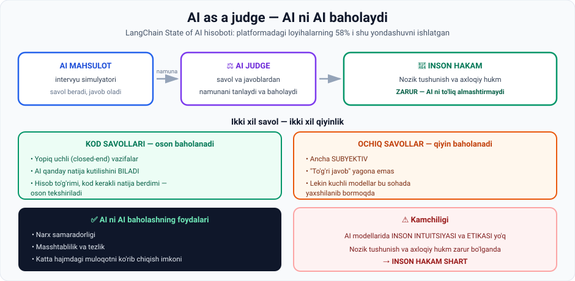

# 7-dars. AI baholash vositalari

## 🎬 Boshlashdan oldin

Siz AI mahsulot qurdingiz. Ishlayapti — sinab ko'rdingiz, javoblar yaxshi.

Endi uni **10 000 foydalanuvchiga** chiqarasiz.

> **Savol:** ular beradigan 10 000 xil savolga model **qanday javob berishini** qayerdan bilasiz?
>
> Hammasini o'zingiz o'qib chiqasizmi? Bu dars — o'sha muammoning javobi.

---

## 1. Real hikoya

> **Kursning boshida men jamoamiz bir necha oy oldin GPT quvvatlangan intervyu simulyatori ilovasini qurgani haqida aytgandim.**
>
> **Ishlab chiqish jarayonidagi ENG QIYIN BOSQICH intervyu savollari bazasini tayyorlash yoki ishlab chiquvchilarning ishi EMAS edi.**
>
> ## **Buning o'rniga biz eng ko'p vaqtni AI ni PROMPT ENGINEERING qilish va uning javoblarini SHAKLLANTIRISHGA sarflaganimizni aniqladik.**

*(05-modulning 8-darsida ham xuddi shu aytilgan edi. Bu — takror emas, **ta'kid**.)*

### Bu nimani ochib berdi

> ## **Bu AI mahsulot quruvchi HAR KIM duch keladigan HAYOTIY MUAMMONI ko'rsatdi: MODEL BAHOLASH (model evaluation).**

---

## 2. ⚠️ Nima uchun baholash shart

> **AI quvvatlangan mahsulot qurganingizdan so'ng, sizga uning chiqishini sinashning ISHONCHLI USULI kerak.**

### Baholashni o'tkazib yuborsangiz

> **Agar baholash bosqichini o'tkazib yuborsangiz, siz shunday AI mahsulot bilan ishga tushish xavfini olasiz:**

| Xavf | Izoh |
|---|---|
| **Gallyutsinatsiya qiladi** | *(06-modulning 1-darsi)* |
| **Izchil bo'lmagan javoblar beradi** | *(o'sha dars)* |
| ⚖️ **Etik muammolarga ega** | **"bugungi kunda ehtimol ENG KATTA deal-breaker"** |
| **Umuman talab darajasida emas** | Kutilganidek ishlamaydi |

> 🚨 **"Probably the biggest deal-breaker"** — ma'ruzachi etikani boshqa muammolardan **ustun** qo'yadi. Texnik xato tuzatiladi. Etik janjal — brendni yo'q qiladi.

---

## 3. ⭐ Yechim: AI as a judge

> ## **Shuning uchun biz mashhur "AI AS A JUDGE" yondashuvidan foydalanishga qaror qildik —**
> **bu mohiyatan BIR AI ning chiqishini BOSHQA AI ga baholatishni anglatadi.**



### Qanday ishlaydi

> **AI hakam AI intervyu simulyatoridan savol va javoblar NAMUNASINI tanlaydi va baholaydi.**

---

## 4. Ikki xil savol — ikki xil qiyinlik

> **Bizning ilovamiz o'quvchilarga ikki asosiy turdagi savol berish imkonini beradigan tarzda qurilgan:**
>
> **OCHIQ UCHLI (open-ended) va KOD savollari.**
>
> **AI nuqtai nazaridan bu ikkisi JUDA FARQLI.**

### Kod savollari — oson

> **Kod savollari YOPIQ UCHLI (closed-end) vazifalar va ochiq uchlilardan ANCHA OSON baholanadi.**
>
> **Kod savollari bilan AI vazifadan qanday turdagi chiqish kutilishini BILADI va shuning uchun:**
> - vosita **to'g'ri hisobladimi**
> - uning kodi **berilgan natijani ishlab chiqardimi**
>
> — buni **oson baholay oladi**.

### Ochiq savollar — qiyin

> **Ochiq uchli savollar ancha SUBYEKTIV va baholash QIYIN**, lekin **kuchli modellar bu faoliyatda yaxshilanib bormoqda**.

---

## 5. 📊 Bu qanchalik keng tarqalgan

> **LangChain ning "State of AI" hisobotiga ko'ra:**
>
> ## **ularning platformasida qurilgan loyihalarning 58% i "AI as a judge" dan foydalangan** —
>
> **bu AI ishlab chiqish siklining ushbu qismining ortib borayotgan ahamiyatini ko'rsatadi.**

---

## 6. ✅ Foydalari va ⚠️ chegarasi

### AI ni AI baholashning sezilarli foydalari

| Foyda |
|---|
| **Narx samaradorligi** (cost effectiveness) |
| **Masshtablilik** (scalability) |
| **Tezlik** (speed) |
| **Mijozlar bilan KATTA HAJMDAGI muloqotni ko'rib chiqish imkoni** |

> **Bu ayniqsa muhim, agar sizda MINGLAB yoki O'N MINGLAB foydalanuvchi bo'lsa va AI quvvatlangan ilovani ishga tushirmoqchi bo'lsangiz.**

### ⚠️ Boshqa tomondan

> **AI modellarida INSON INTUITSIYASI va ETIKASI YO'Q** — bu **nozik tushunish va axloqiy hukmlar hal qiluvchi bo'lgan kontekstlarda qiyinchiliklarga olib kelishi mumkin.**
>
> ## **Shuning uchun baholash jarayoniga INSON HAKAMLARNI jalb qilish ham SHART.**

> 🤝 **Xulosa: AI + inson, AI o'rniga inson emas.** Bu — 06-modulning 1-darsidagi "oltin qoida"ning aynan takrori: **mutaxassis AI bilan ishlaydi**.

---

## 7. 💻 Amaliyot: AI hakamni quring

Hech narsa o'rnatmasdan ishlaydi. Bu — **AI as a judge** mantiqi, soddalashtirilgan.

```python
# ===== BAHOLANADIGAN JAVOBLAR =====
JAVOBLAR = [
    # (savol turi, savol, AI javobi, to'g'ri natija)
    ("kod",   "1 dan 10 gacha juft sonlar yig'indisi",  "30",  "30"),
    ("kod",   "5 faktoriali",                           "120", "120"),
    ("kod",   "['a','b'] ro'yxati uzunligi",            "3",   "2"),
    ("ochiq", "Machine learning nima?",
     "Machine learning - ma'lumotdan naqshlarni o'rganib bashorat qiladigan AI sohasi.", None),
    ("ochiq", "Machine learning nima?", "Bu kompyuter narsasi.", None),
    ("ochiq", "Machine learning nima?", "", None),
]

# ===== AI HAKAM =====
def hakam_kod(javob, kutilgan):
    """Yopiq uchli: to'g'ri javob MA'LUM -> oson baholanadi."""
    ok = javob.strip() == kutilgan.strip()
    return (10 if ok else 0), ("to'g'ri" if ok else f"xato (kutilgan: {kutilgan})")

def hakam_ochiq(javob):
    """Ochiq uchli: to'g'ri javob YAGONA EMAS -> mezonlar bo'yicha ball."""
    if not javob.strip():
        return 0, "javob bo'sh"
    ball, izoh = 0, []
    if len(javob.split()) >= 8:
        ball += 3; izoh.append("yetarli uzunlik")
    else:
        izoh.append("juda qisqa")
    kalit = ["ma'lumot", "naqsh", "bashorat", "o'rgan", "model", "algoritm"]
    topildi = [k for k in kalit if k in javob.lower()]
    ball += min(len(topildi) * 2, 5)
    izoh.append(f"kalit tushunchalar: {len(topildi)}")
    if javob.strip().endswith("."):
        ball += 2; izoh.append("tugallangan")
    return min(ball, 10), " | ".join(izoh)

print("=== AI AS A JUDGE ===\n")
kod_ball, kod_soni, ochiq_ball, ochiq_soni = 0, 0, 0, 0
for turi, savol, javob, kutilgan in JAVOBLAR:
    if turi == "kod":
        ball, izoh = hakam_kod(javob, kutilgan)
        kod_ball += ball; kod_soni += 1
    else:
        ball, izoh = hakam_ochiq(javob)
        ochiq_ball += ball; ochiq_soni += 1
    belgi = "OK" if ball >= 7 else ("??" if ball >= 4 else "XX")
    print(f"[{turi:<5}] {belgi}  {ball:>2}/10  {izoh}")
    print(f"         javob: {javob[:60] or '(bo_sh)'}\n")

print("=== XULOSA ===")
print(f"  Kod savollari:    {kod_ball/kod_soni:.1f}/10  <- oson va ISHONCHLI baholanadi")
print(f"  Ochiq savollar:   {ochiq_ball/ochiq_soni:.1f}/10  <- subyektiv, EHTIYOT bo'ling")
print("\n  ⚠️ Ochiq savollar uchun INSON HAKAM ham kerak.")
```

### Haqiqiy natija

```
=== AI AS A JUDGE ===

[kod  ] OK  10/10  to'g'ri
         javob: 30

[kod  ] OK  10/10  to'g'ri
         javob: 120

[kod  ] XX   0/10  xato (kutilgan: 2)
         javob: 3

[ochiq] OK  10/10  yetarli uzunlik | kalit tushunchalar: 4 | tugallangan
         javob: Machine learning - ma'lumotdan naqshlarni o'rganib bashorat

[ochiq] XX   2/10  juda qisqa | kalit tushunchalar: 0 | tugallangan
         javob: Bu kompyuter narsasi.

[ochiq] XX   0/10  javob bo'sh
         javob: (bo_sh)

=== XULOSA ===
  Kod savollari:    6.7/10  <- oson va ISHONCHLI baholanadi
  Ochiq savollar:   4.0/10  <- subyektiv, EHTIYOT bo'ling
```

### 🔑 Uchta kuzatuv

**1. `hakam_kod` — ikki qatorlik funksiya.** Chunki **to'g'ri javob ma'lum**. Bu — ma'ruzadagi "closed-end tasks".

**2. `hakam_ochiq` — o'nlab qator va baribir nomukammal.** U **uzunlik**, **kalit so'zlar** va **tugallanganlikni** sanaydi. Lekin u **haqiqatan tushunmaydi**.

**3. Uchinchi ochiq javob — `"Bu kompyuter narsasi."`** Hakam unga 2/10 berdi. To'g'ri. Lekin agar javob **chiroyli yozilgan, uzun va kalit so'zlarga to'la, ammo NOTO'G'RI** bo'lsa-chi? Hakam yuqori ball berardi.

> ⚠️ **Mana shu — nima uchun inson hakam kerak.** AI hakam **shaklni** o'lchaydi. **Mazmun to'g'riligini** va **axloqiy jihatni** faqat odam baholay oladi.

---

## 8. ⚡ Amaliy topshiriqlar

### 🟢 Oson — 10 daqiqa · **Yopiq mi, ochiq mi?**

| № | Savol | Yopiq / Ochiq ? | Baholash oson mi? |
|---|---|---|---|
| 1 | "2 + 2 nechchi?" | | |
| 2 | "Bu kodda xato bormi?" | | |
| 3 | "Yaxshi rahbar qanday bo'ladi?" | | |
| 4 | "Bu funksiya `[1,2,3]` uchun nima qaytaradi?" | | |
| 5 | "Ushbu she'r qanday taassurot qoldiradi?" | | |
| 6 | "Toshkent poytaxtmi?" | | |

<details>
<summary>✅ Javoblar</summary>

**Yopiq (oson):** 1, 2, 4, 6 — to'g'ri javob **ma'lum**
**Ochiq (qiyin):** 3, 5 — **subyektiv**, yagona to'g'ri javob yo'q

</details>

### 🟡 O'rta — 30 daqiqa · **Hakamni aldang**

Yuqoridagi kodni oling va:

1. **Yuqori ball oladigan, lekin NOTO'G'RI** javob yozing:
   ```python
   ("ochiq", "Machine learning nima?",
    "Machine learning - ma'lumot va algoritm yordamida naqshlarni model orqali
     bashorat qiladigan kvant fizikasi sohasi.", None),
   ```
   Hakam necha ball berdi? ______

2. **Bu nimani ko'rsatadi?**
   ______________________________________________

3. Hakamni yaxshilashga urinib ko'ring — **fakt tekshiruvi** qo'shing:
   ```python
   NOTOGRI_TUSHUNCHALAR = ["kvant fizikasi", "biologiya", "kimyo"]
   ```

4. **Savol:** har bir noto'g'ri tushuncha uchun qoida yozish **masshtablanadimi**?
   *(02-modulning 2-darsidagi rule-based NLP ni eslang!)*

### 🔴 Qiyin — mini-loyiha · **O'z baholash tizimingiz**

```
MAHSULOT: ______________________________________

1 · NIMANI BAHOLAYSIZ?
   [ ] Javob to'g'riligi      Qanday: ______________
   [ ] Format va uslub        Qanday: ______________
   [ ] Tezlik                 Qanday: ______________
   [ ] Etik jihat             Qanday: ______________
   [ ] Xavfsizlik             Qanday: ______________

2 · QAYSI QISMINI AI HAKAM QILADI?
   ______________________________________________

3 · QAYSI QISMINI INSON QILISHI SHART?
   ______________________________________________
   NEGA aynan inson: ____________________________

4 · NAMUNA HAJMI
   Kuniga nechta muloqot bo'ladi?     ______
   Nechtasini AI hakam ko'radi?       ______
   Nechtasini inson ko'radi?          ______
   Qanday tanlanadi (tasodifiy? shubhali?)  ________

5 · ISHGA TUSHIRISH MEZONI
   Qanday ball ostida ishga TUSHIRMAYSIZ?  ______
```

---

## 9. 🧠 O'zini tekshirish savollari

1. Intervyu simulyatori loyihasida eng qiyin bosqich nima bo'ldi?
2. Bu qanday hayotiy muammoni ochib berdi?
3. Baholashni o'tkazib yuborsangiz, qanday xavflar bor? 4 tasini sanang.
4. Ma'ruzachi qaysi xavfni "eng katta deal-breaker" deb ataydi?
5. "AI as a judge" nima?
6. AI hakam nima qiladi?
7. Ikki turdagi savol qaysi? Qaysi biri oson baholanadi va nega?
8. LangChain hisobotiga ko'ra loyihalarning necha foizi bu yondashuvni ishlatgan?
9. AI ni AI baholashning to'rtta foydasini ayting.
10. Bu ayniqsa qachon muhim?
11. AI hakamning cheklovi nima va yechim qanday?

<details>
<summary>✅ Javoblar</summary>

1. **Prompt engineering** va **javoblarni shakllantirish** — baza tayyorlash yoki ishlab chiquvchilar ishi emas.
2. **Model baholash (model evaluation).**
3. **Gallyutsinatsiya**, **izchil bo'lmagan javoblar**, **etik muammolar**, **talab darajasida emaslik**.
4. **Etik muammolarni** — "bugungi kunda ehtimol eng katta deal-breaker".
5. **Bir AI ning chiqishini boshqa AI ga baholatish.**
6. AI mahsulotdan **savol va javoblar namunasini tanlaydi va baholaydi**.
7. **Ochiq uchli** va **kod** savollari. **Kod** savollari oson — ular **yopiq uchli**, AI **qanday chiqish kutilishini biladi**.
8. **58%.**
9. **Narx samaradorligi, masshtablilik, tezlik, katta hajmdagi muloqotni ko'rib chiqish imkoni.**
10. **Minglab yoki o'n minglab foydalanuvchi** bo'lganda.
11. AI modellarida **inson intuitsiyasi va etikasi yo'q**. Yechim: baholash jarayoniga **inson hakamlarni jalb qilish**.

</details>

---

## 📌 Xulosa

```
AI mahsulot tayyor  →  10 000 foydalanuvchi  →  qanday tekshirasiz?

  ❌ Baholashsiz:  gallyutsinatsiya · izchilsizlik · ETIK MUAMMO

  ✅ AI AS A JUDGE:  bir AI boshqasini baholaydi
       LangChain hisoboti: loyihalarning 58% i

  KOD savollari    →  yopiq uchli  →  OSON baholanadi
  OCHIQ savollar   →  subyektiv    →  QIYIN

  Foydalari:  narx · masshtab · tezlik · katta hajm

  ⚠️ AI da INSON INTUITSIYASI va ETIKASI yo'q
     →  INSON HAKAM ham SHART
```

---

## 🔖 Atamalar

| Atama | Inglizcha | Izoh |
|---|---|---|
| Model baholash | *model evaluation* | Chiqish sifatini tekshirish |
| AI as a judge | *AI as a judge* | AI ni AI baholashi |
| Yopiq uchli vazifa | *closed-end task* | To'g'ri javob ma'lum |
| Ochiq uchli savol | *open-ended question* | Yagona to'g'ri javob yo'q |
| Deal-breaker | *deal-breaker* | Hammasini buzadigan omil |
| Namuna | *sample* | Tekshirish uchun tanlangan qism |
| Inson hakam | *human judge* | Baholovchi odam |

---

⬅️ [Oldingi: LangChain](06-LangChain.md) · 🏠 [Modul boshiga](README.md)

➡️ **Keyingi:** **08-modul: AI sohasidagi lavozimlar**
