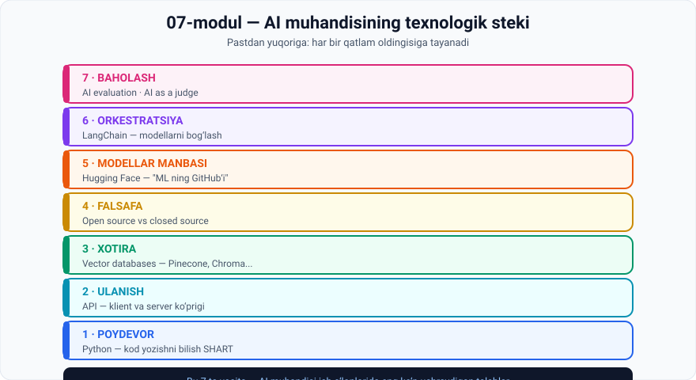

# 07-Modul · AI tech stack

## 🛠 Bir jumlada

> **Oldingi modullar AI NIMA ekanini o'rgatdi. Bu modul AI muhandisi HAR KUNI NIMA BILAN ishlashini ko'rsatadi.**

Bu 7 ta vosita — AI muhandisi ish e'lonlarida eng ko'p uchraydigan talablar.

---

## 🗺 Modul xaritasi



---

## 📚 Darslar

| № | Dars | Asosiy g'oya | Amaliyot |
|---|---|---|---|
| 1 | [Python dasturlash](01-Python-programming.md) | No-code yetmaydi — **kod bilish SHART** | 3 ta topshiriq |
| 2 | [API bilan ishlash](02-Working-with-APIs.md) | Klient ⟷ server ko'prigi: request + response | 💻 Mock API |
| 3 | [Vector databases](03-Vector-databases.md) | Ma'no bo'yicha qidiruv + LLM ga **uzoq muddatli xotira** | 💻 Klasterlash va indekslash |
| 4 | [Open source ning ahamiyati](04-The-importance-of-open-source.md) ⭐ | Google sizib chiqqan hujjati: **"maxfiy retsept yo'q"** | 3 ta topshiriq |
| 5 | [Hugging Face](05-Hugging-Face.md) | "ML ning GitHub'i" — pre-trained modellar bepul | 3 ta topshiriq |
| 6 | [LangChain](06-LangChain.md) | **Lego bloklari** — modelni almashtirish oson | 3 ta topshiriq |
| 7 | [AI baholash vositalari](07-AI-evaluation-tools.md) ⭐ | **AI as a judge** · loyihalarning **58%** i ishlatadi | 💻 AI hakam |

⭐ = eng ko'p muhokamaga sabab bo'ladigan darslar

---

## 🎯 Modul yakunida siz bilasiz

**Poydevor:**
- [ ] No-code qayerda yetadi va qayerda **kod shart** ekanini aytasiz
- [ ] Kod qanday **uchta imkoniyat** berishini bilasiz
- [ ] Uchta asosiy Python kutubxonasi va IDE variantlarini sanaysiz

**Ulanish:**
- [ ] **API** ni ta'riflaysiz va **request/response** ni tushuntirasiz
- [ ] GPT ni mahsulotingizga qo'shish uchun nima kerakligini bilasiz

**Xotira:**
- [ ] Relatsion va **vector database** farqini aytasiz
- [ ] **Indekslash** nima uchun zarurligini raqam bilan ko'rsatasiz
- [ ] Vector DB ning **ikki qo'llanishini** bilasiz
- [ ] 5 ta mashhur vector DB ni va qaysi biri **open source emasligini** bilasiz

**Falsafa:**
- [ ] Google sizib chiqqan hujjatining **asosiy da'vosini** aytasiz
- [ ] Open source nima uchun tez rivojlanishini tushuntirasiz
- [ ] **"Open source = bepul emas"** — nima uchun ekanini bilasiz
- [ ] Qaysi holatda qaysi biri ustunligini aytasiz
- [ ] Big tech ning **hal qiluvchi ustunligini** bilasiz

**Vositalar:**
- [ ] **Hugging Face** nima qilishini va nima uchun "ML ning GitHub'i" ekanini bilasiz
- [ ] **LangChain** ning Lego analogiyasini va uning **narxini** tushuntirasiz
- [ ] **AI as a judge** nima va nima uchun **inson hakam ham shart** ekanini bilasiz
- [ ] 💻 Uchta Python skriptini o'zingiz ishga tushirgansiz

---

## 🖼 Modul grafikalari

| Fayl | Nima ko'rsatadi |
|---|---|
| [`00-module-map.svg`](assets/00-module-map.svg) | 7 qatlamli tech stack |
| [`02-api.svg`](assets/02-api.svg) | Klient ⟷ API ⟷ server |
| [`03-vector-db.svg`](assets/03-vector-db.svg) | YouTube klasterlari vektor fazosida |
| [`04-open-vs-closed.svg`](assets/04-open-vs-closed.svg) | Google hujjati + to'liq solishtiruv |
| [`06-langchain.svg`](assets/06-langchain.svg) | LangChain'siz 5 qadam ⟷ Lego bloklari |
| [`07-ai-as-judge.svg`](assets/07-ai-as-judge.svg) | AI hakam + inson hakam |

---

## 💻 Python amaliyotlari

Barchasi **hech qanday kutubxona o'rnatmasdan** ishlaydi.

| Dars | Skript nima qiladi | Nima o'rgatadi |
|---|---|---|
| 2 | Mock API: request → response, status kodlar | API ning aniq mantiqi |
| 3 | Videolarni klasterlaydi, tavsiya beradi, indeksni solishtiradi | 1 mlrd vektor: **1 mlrd → ~30** taqqoslash |
| 7 | Kod va ochiq javoblarni baholaydi | Nima uchun **ochiq savollar qiyin** |

> 🏆 **Eng ta'sirli natija:** 7-darsdagi skript ko'rsatadi — AI hakam **shaklni** o'lchaydi, **mazmun to'g'riligini** emas. Chiroyli yozilgan noto'g'ri javob yuqori ball oladi. Aynan shuning uchun **inson hakam shart**.

---

## ⚡ Amaliy topshiriqlar xaritasi

| Dars | 🟢 Oson | 🟡 O'rta | 🔴 Qiyin |
|---|---|---|---|
| 1 | Python o'rnating | No-code chegarasini toping | 90 kunlik Python rejasi |
| 2 | API larni atrofingizda toping | API'ni kengaytiring | O'z API integratsiyangiz |
| 3 | Qaysi baza kerak? | O'z tavsiya tizimingiz | Vector DB tanlang |
| 4 | Qaysisini tanlaysiz? | Haqiqiy narxni hisoblang | "Maxfiy retsept yo'q" — rostmi? |
| 5 | Platformani o'rganing | Modelni tanlang | Model tanlash strategiyasi |
| 6 | Terminlarni bog'lang | 5 qadamni yozing | Framework ishlatish kerakmi? |
| 7 | Yopiq mi, ochiq mi? | Hakamni aldang | O'z baholash tizimingiz |

> 💼 **Eng amaliy topshiriq:** 5-darsdagi 🟡 **"Modelni tanlang"** — u sizni Hugging Face'da real model kartochkasi va litsenziyasini o'qishga majbur qiladi. Bu — ish kunining haqiqiy qismi.

---

## 🔗 Modullar orasidagi bog'liqlik

```
01-modul  ─  demo: LangChain + Chroma + OpenAI API   →  bu modulda TUSHUNTIRILADI
02-modul  ─  strukturalanmagan ma'lumot 80–90%       →  vector database
05-modul  ─  vector embeddings                        →  vector database
05-modul  ─  RAG                                      →  LangChain + vector DB
05-modul  ─  foundation models, Buy vs Make           →  open source uchinchi yo'l
05-modul  ─  prompt engineering eng ko'p vaqt oladi   →  baholash muammosi
06-modul  ─  gallyutsinatsiya va izchilsizlik         →  AI as a judge
    ↓
07-modul  ─  BU MUAMMOLAR BILAN ISHLAYDIGAN VOSITALAR   ← siz shu yerdasiz
    ↓
08-modul  ─  Bu vositalar bilan ishlaydigan ODAMLAR (lavozimlar)
```

> 💡 **01-modulning birinchi darsiga qayting.** O'shanda 5 daqiqada qurilgan demo — **LangChain**, **Chroma vector database** va **OpenAI API**. Uchalasi ham shu modulda tushuntirildi. **Doira yopildi.**

---

## 📖 Umumiy atamalar lug'ati

| Atama | Inglizcha | Izoh |
|---|---|---|
| No-code / low-code | *no-code / low-code* | Kodsiz yoki kam kodli vositalar |
| IDE | *IDE* | Kod yozish muhiti |
| API | *Application Programming Interface* | Klient–server ko'prigi |
| So'rov / Javob | *request / response* | API ning ikki qadami |
| Endpoint | *endpoint* | API ning aniq manzili |
| Status kod | *status code* | Natija holati (200, 404, 401) |
| API kalit | *API key* | Kirish uchun maxfiy identifikator |
| Relatsion baza | *relational database* | Satr-ustunli klassik baza |
| Vector database | *vector database* | Vektorlarni saqlovchi baza |
| Indekslash | *indexing* | Tez qidiruv uchun tuzilma |
| Uzoq muddatli xotira | *long-term memory* | O'tmish muloqotlarni saqlash |
| Open source | *open source* | Ochiq kodli |
| Closed source | *closed source* | Yopiq, egalik qilinadigan |
| Maxfiy retsept | *secret sauce* | Noyob raqobat ustunligi |
| Plug-and-play | *plug-and-play* | Sozlashsiz darrov ishlaydigan |
| Compute xarajati | *compute cost* | Hisoblash resurslari narxi |
| Muvofiqlik | *compliance* | Qonun va standartlarga mos kelish |
| Pre-trained model | *pre-trained model* | Oldindan o'qitilgan model |
| Demokratlashtirish | *democratize* | Hammaga ochiq qilish |
| Model kartochkasi | *model card* | Model hujjati va ogohlantirishlari |
| Orkestratsiya muhiti | *orchestration environment* | Komponentlarni bog'lash tizimi |
| Modular komponent | *modular component* | Almashtiriladigan qism |
| Ish oqimi | *workflow* | Ketma-ket jarayon |
| Model baholash | *model evaluation* | Chiqish sifatini tekshirish |
| AI as a judge | *AI as a judge* | AI ni AI baholashi |
| Yopiq/ochiq uchli | *closed-end / open-ended* | To'g'ri javob ma'lum / noma'lum |

---

## ✅ Yakuniy test

Har bir darsdagi **"O'zini tekshirish savollari"** — jami **69 ta savol**.

**55 tasidan ko'prog'iga** javob bera olsangiz — modulni o'zlashtirdingiz.

---

## ➡️ Keyingi qadam

**08-modul: AI sohasidagi lavozimlar** ga o'ting
