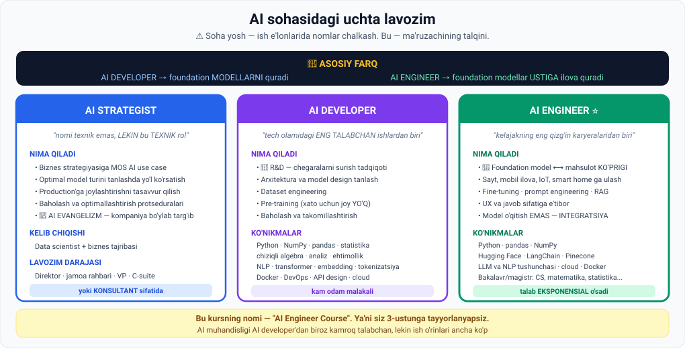

# 1-dars. AI Strategist

## 🎬 Boshlashdan oldin

Bir kompaniya AI ga $2 million sarfladi. Uch loyiha boshladi. Barchasi to'xtadi.

Nima uchun? Modellar yomonmi? Muhandislar zaifmi?

> **Yo'q. Reja yo'q edi.**
>
> Bu dars — o'sha rejani tuzadigan odam haqida.

---

## 1. Muammo

> **Bugun hamma AI ning inqilobiy salohiyati haqida hayajonda, LEKIN BARCHA KOMPANIYALAR AI DAN FOYDA KO'RMAYDI** — ko'pincha ular uni **strategik amalga oshira olmagani** uchun.

> **Aniq rejasiz AI loyihalarini boshlash va innovatsiya hamda biznes natijalari o'z-o'zidan yuzaga keladi deb umid qilish YETARLI EMAS.**

### Yechim

> **Ideal holda, kompaniyangizda bu yo'lni boshqaradigan AI STRATEGIST bo'lishi kerak** — u **eng boshidan umumiy biznes strategiyasi va kompaniya maqsadlariga** e'tibor qaratadi.



---

## 2. 🔑 Asosiy tamoyil

> ## **AI strategiyasi muvaffaqiyatli bo'lishi uchun u firmaning UMUMIY BIZNES STRATEGIYASI bilan MUVOFIQ bo'lishi kerak.**

---

## 3. AI biznesga qanday foyda beradi

> **AI biznesingizga foyda beradigan bir necha asosiy yo'l bor:**

| № | Yo'l |
|---|---|
| 1 | **Yaxshiroq mahsulot va xizmatlar sotishga** yordam beradi |
| 2 | Kompaniyaning **jarayonlarini yaxshilaydi** |
| 3 | **Qaror qabul qilishni** osonlashtiradi |

---

## 4. AI strategist nima qiladi

### 4.1. Use case larni topish

> **AI strategist kompaniyaning umumiy biznes strategiyasini ko'rib chiqadi va biznesga tegishli BIR NECHA AI USE CASE ni aniqlaydi va xaritalaydi.**
>
> **Kompaniya biznes strategiyasiga ENG MOS keladigan va ENG YUQORI TA'SIRGA ega bo'lishi kutilayotgan use case larni tanlaydi.**

### 4.2. ⚠️ Bu texnik rol

> ## **Nomi texnik bo'lmagandek eshitilishiga qaramay, AI strategist — HAQIQATAN TEXNIK ROL.**

> **Amalga oshiriladigan AI use case larni aniqlash va taklif qilishdan tashqari, AI strategist kompaniyaga AMALDA BAJARISHGA yordam bera olishi kerak.**

### 4.3. To'rtta amaliy vazifa

| № | Vazifa |
|---|---|
| 1 | **Optimal AI model turini** aniqlashda yo'l ko'rsatish — turli yechimlarning **unumdorligi** va **narxini** hisobga olib |
| 2 | Kompaniya framework va modelga qaror qilgach, **AI model production'ga qanday joylashtirilishini** va mavjud mahsulotlarga **integratsiya qilinishini** tasavvur qilish |
| 3 | Kompaniyaga joylashtirilgan AI modellarining unumdorligini **baholash va optimallashtirish** uchun **protseduralar o'rnatish** |
| 4 | 📣 **AI evangelizm** |

### 4.4. AI evangelizm

> **AI strategist hissasining e'tibordan chetda qolmasligi kerak bo'lgan yana bir kritik jihati — AI EVANGELIZM.**
>
> **Bu kompaniya bo'ylab AI ni qabul qilishni TARG'IB QILISH va xodimlar AI biznesga qanday raqobatbardosh bo'lishga yordam berishini TUSHUNISHINI ta'minlash demakdir.**

> 💡 **Nima uchun bu kerak?** Eng zo'r AI tizim ham **hech kim ishlatmasa** befoyda. Odamlar qo'rqadi, ishonmaydi yoki shunchaki bilmaydi. Evangelizm — bu **texnik emas, insoniy** ish.

---

## 5. 👤 Kelib chiqishi

> **Bu YANGI rol va talablar O'ZGARUVCHAN**, lekin ko'p hollarda nomzod:
>
> ## **DATA, MACHINE LEARNING va AI bo'yicha keng texnik ma'lumotga ega DATA SCIENTIST bo'ladi.**

> **Karyerasi davomida ular KO'PLAB BIZNES MANFAATDORLARI bilan ishlay olishgan va BIZNES QIYMATNI NIMA HARAKATLANTIRISHINI tushunishadi.**
>
> **Yaxshi data strategist texnik yechim qurish uchun NIMA KERAKLIGINI biladi va loyihaning TA'SIRINI TASAVVUR QILA OLADIGAN biznes zukkoligiga ega.**

---

## 6. 🎯 Zarur ko'nikmalar

> **AI strategist quyidagi kritik ko'nikmalarga ega bo'lishi kerak:**

### Texnik va strategik

| Ko'nikma |
|---|
| **Keng qamrovli biznes tushunchasi** |
| **ML va AI bo'yicha strategik va texnik ekspertiza** — ideal holda **ishlab chiqish tajribasi** bilan |

### Soft skills

> **Bundan tashqari, ularga kuchli SOFT SKILL lar kerak:**

| Ko'nikma | Nima uchun |
|---|---|
| **Ajoyib muloqot** | Top-menejment va manfaatdorlar bilan |
| **Loyiha boshqaruvi** | Samarali hamkorlik uchun |

---

## 7. 💰 Nima uchun bunchalik qimmat

> **Tasavvur qilganingizdek, bunday keng qamrovli va xilma-xil ma'lumotga ega shaxslarni topish NODIR va QIYIN.**
>
> ## **Va tashkilotlar AI strategistlarga JUDA YAXSHI to'lashga tayyor.**

### Lavozim darajasi

> **Odatda AI strategistlar quyidagicha yollanadi:**
> - **Direktor** yoki maxsus jamoa **rahbari**
> - **VP** (vitse-prezident) roli
> - Yoki kompaniyalar AI ni **quchoq ochib qarshi olmoqchi bo'lsa** — **C-suite** roli

---

## 8. 🤝 Muqobil: konsultant

> **AI strategist profili hozir qanchalik nodir ekanini, ularning sezilarli kompensatsiyasini va ba'zan AI joriy etish BIR MARTALIK VAQTINCHALIK LOYIHA sifatida ko'rilishi mumkinligini hisobga olsak —**
>
> **ba'zi firmalar to'liq stavkali xodim emas, KONSULTANT sifatida keladigan AI strategistlarni yollashi mumkin.**

| | Afzallik | Kamchilik |
|---|---|---|
| **Konsultant** | ✅ **Arzonroq narx**<br>✅ Ko'p kompaniya bilan ishlaydi va **sohaning eng yaxshi amaliyotlarini** ulasha oladi | ❌ Biznesni **chuqur tushunishga vaqti yetmasligi** mumkin<br>❌ AI strategiyasi **bir martalik loyihaga** aylanishi mumkin |

---

## 9. ⚡ Amaliy topshiriqlar

### 🟢 Oson — 10 daqiqa · **Use case ni baholang**

Kompaniya: **onlayn kitob do'koni**. Quyidagi AI g'oyalarni baholang:

| № | AI g'oya | Biznes strategiyaga mos mi? | Ta'siri (1–5) |
|---|---|---|---|
| 1 | Kitob tavsiyasi tizimi | | |
| 2 | Ofisda AI kofe mashinasi | | |
| 3 | Mijoz savollariga chatbot | | |
| 4 | Kitob muqovalarini AI bilan chizish | | |
| 5 | Talab prognozi (ombor uchun) | | |
| 6 | Xodimlar uchun AI she'r generatori | | |

**Savol:** AI strategist qaysi 2 tasini tanlaydi va nega?

### 🟡 O'rta — 30 daqiqa · **AI strategiyasini tuzing**

O'zingiz biladigan tashkilotni tanlang (ish joyingiz, universitet, mahalliy biznes):

```
TASHKILOT: ______________________________________

1 · BIZNES STRATEGIYASI (AI dan oldin!)
   Asosiy maqsad:      ______________________
   Eng katta muammo:   ______________________
   Raqobat ustunligi:  ______________________

2 · AI USE CASE LAR (kamida 5 ta)
   Use case                    Mos mi?  Ta'sir(1-5)
   ________________________    ______   ___
   ________________________    ______   ___
   ________________________    ______   ___
   ________________________    ______   ___
   ________________________    ______   ___

3 · TANLANGAN 2 TA (eng mos + eng yuqori ta'sir)
   a) ______________________  Nega: ______________
   b) ______________________  Nega: ______________

4 · AMALGA OSHIRISH (birinchisi uchun)
   Qanday model turi:      ______________________
   Unumdorlik ⟷ narx:     ______________________
   Production'ga qanday:   ______________________
   Qanday baholaymiz:      ______________________

5 · EVANGELIZM
   Kimlar qarshilik qiladi:  ____________________
   Ularni qanday ishontiramiz: __________________
```

### 🔴 Qiyin — karyera · **O'zingizni baholang**

AI strategist bo'lish uchun **uchta narsa** kerak. O'zingizni baholang:

```
1 · TEXNIK EKSPERTIZA (ML/AI)          hozir: ___/10
   Nima yetishmayapti: __________________________
   Qanday to'ldiraman: __________________________

2 · BIZNES TUSHUNCHASI                 hozir: ___/10
   Nima yetishmayapti: __________________________
   Qanday to'ldiraman: __________________________

3 · SOFT SKILLS (muloqot, loyiha boshqaruvi)  hozir: ___/10
   Nima yetishmayapti: __________________________
   Qanday to'ldiraman: __________________________

SAVOL: Ma'ruza aytadi — bunday odamlarni topish NODIR.
       Nima uchun aynan bu UCHTALIK kamdan-kam uchraydi?
       ______________________________________________

XULOSA: Sizga eng yaqin yo'l qaysi?
   [ ] AI Strategist   [ ] AI Developer   [ ] AI Engineer
   Nega: ________________________________________
```

---

## 10. 🧠 O'zini tekshirish savollari

1. Nima uchun ba'zi kompaniyalar AI dan foyda ko'rmaydi?
2. AI strategiyasining muvaffaqiyat sharti nima?
3. AI biznesga qanday uchta yo'l bilan foyda beradi?
4. AI strategist use case lar bilan nima qiladi?
5. Bu texnik rolmi? Tushuntiring.
6. Uning to'rtta amaliy vazifasini sanang.
7. AI evangelizm nima?
8. Tipik kelib chiqishi qanday?
9. Qanday ko'nikmalar kerak? Texnik va soft skills.
10. Nima uchun ular yuqori maosh oladi?
11. Qanday lavozim darajalarida yollanadi?
12. Konsultant variantining afzalligi va kamchiligi nima?

<details>
<summary>✅ Javoblar</summary>

1. Ular AI ni **strategik amalga oshira olmaydilar** — aniq rejasiz loyihalar boshlashadi.
2. U firmaning **umumiy biznes strategiyasi bilan muvofiq** bo'lishi kerak.
3. **Yaxshiroq mahsulot/xizmat sotish**, **jarayonlarni yaxshilash**, **qaror qabul qilishni osonlashtirish**.
4. Biznesga tegishli **bir necha use case ni aniqlaydi va xaritalaydi**; **eng mos va eng yuqori ta'sirlisi** tanlanadi.
5. **Ha** — nomi texnik bo'lmagandek eshitilsa ham, u kompaniyaga **amalda bajarishga** yordam berishi kerak.
6. (a) **Optimal model turini** tanlashda yo'l ko'rsatish; (b) **production'ga joylashtirish** va integratsiyani tasavvur qilish; (c) **baholash va optimallashtirish protseduralari**; (d) **AI evangelizm**.
7. Kompaniya bo'ylab **AI ni qabul qilishni targ'ib qilish** va xodimlar AI biznesga qanday yordam berishini tushunishini ta'minlash.
8. **Data, ML va AI bo'yicha keng texnik ma'lumotga ega data scientist** — ko'p **biznes manfaatdorlari** bilan ishlagan.
9. **Texnik/strategik:** keng biznes tushunchasi, ML va AI ekspertizasi (ideal — ishlab chiqish tajribasi bilan). **Soft:** ajoyib **muloqot** va **loyiha boshqaruvi**.
10. Bunday **keng qamrovli va xilma-xil ma'lumotga ega** shaxslarni topish **nodir va qiyin**.
11. **Direktor**, jamoa **rahbari**, **VP**, yoki **C-suite**.
12. ✅ **Arzonroq** va **soha eng yaxshi amaliyotlarini** ulashadi. ❌ Biznesni **chuqur tushunishga vaqti yetmasligi** mumkin, strategiya **bir martalik loyihaga** aylanishi mumkin.

</details>

---

## 📌 Xulosa

```
Muammo:  AI loyihalari REJASIZ boshlanadi → natija yo'q
              ↓
AI STRATEGIST
              ↓
   AI strategiyasi ⟷ BIZNES strategiyasi   (muvofiq bo'lishi SHART)
              ↓
   use case topish → model tanlash → production →
   baholash protsedurasi → 📣 EVANGELIZM

Kelib chiqishi:  data scientist + biznes tajribasi
Ko'nikmalar:     texnik + biznes + soft skills   ← NODIR birikma
Darajasi:        direktor · VP · C-suite   yoki   konsultant
```

---

## 🔖 Atamalar

| Atama | Inglizcha | Izoh |
|---|---|---|
| AI strategist | *AI strategist* | AI yo'nalishini belgilaydigan rahbar |
| Use case | *use case* | Amaliy qo'llanish holati |
| Manfaatdor | *stakeholder* | Loyihaga qiziqqan tomon |
| Biznes zukkoligi | *business acumen* | Biznesni tushunish qobiliyati |
| AI evangelizm | *AI evangelism* | AI ni targ'ib qilish |
| Production | *production* | Real ishlash muhiti |
| Soft skills | *soft skills* | Muloqot, boshqaruv ko'nikmalari |
| C-suite | *C-suite* | Oliy rahbariyat (CEO, CTO...) |

---

🏠 [Modul boshiga](README.md) · ➡️ [Keyingi: AI Developer](02-AI-developer.md)
