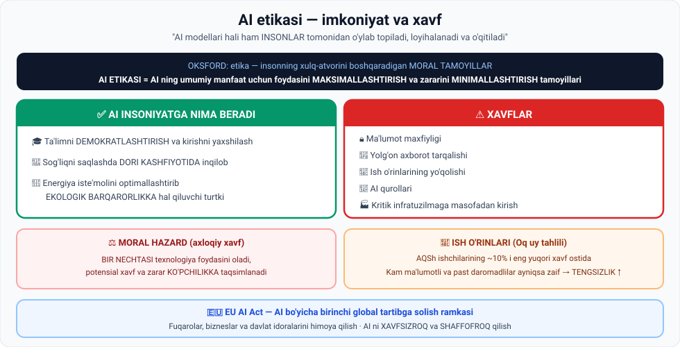

# 1-dars. AI etikasi

## 🎬 Boshlashdan oldin

AI ni ko'pincha **kompyuterning aqli** deb tasavvur qilamiz — inson nazoratidan tashqaridagi narsa.

Lekin bir savol bering: **kim uni yaratdi?**

> Kim ma'lumotni tanladi? Kim arxitekturaga qaror qildi? Kim "bu javob yaxshi, bu yomon" deb belgiladi?
>
> **Har birida — odam.** Bu dars aynan shu haqda.

---

## 1. Ta'riflar

> **Oksford lug'ati ETIKANI insonning xulq-atvorini boshqaradigan MORAL TAMOYILLAR deb ta'riflaydi.**

> ## **AI ETIKASI — AI ning UMUMIY MANFAAT uchun foydasini MAKSIMALLASHTIRISH va uning rivojlanishidan kelib chiqadigan potensial ZARARNI MINIMALLASHTIRISH uchun moral tamoyillar to'plami.**



---

## 2. 🔑 Eng muhim g'oya: mas'uliyat

> **AI ni kompyuterning aqli deb o'ylash va uni inson nazoratidan tashqaridagi narsa deb qabul qilish TABIIY.**
>
> ## **LEKIN AI modellari bu bosqichda HALI HAM INSONLAR tomonidan o'ylab topiladi, loyihalanadi, ishlab chiqiladi, o'qitiladi va takomillashtiriladi.**

### Shundan kelib chiqadigan savol

> **Shuning uchun AI etikasi hal qilishi kerak bo'lgan HAYOTIY masala:**
>
> - **AI ishlab chiqishda INSON MAS'ULIYATINI aniqlash**
> - **AI ishga tushgach, uning HARAKATLARI UCHUN KIM JAVOBGAR ekanini belgilash**

> ⚖️ **Bu — hali javobi yo'q savol.** Agar avtonom avtomobil odamni urib yuborsa — kim javobgar? Haydovchimi? Ishlab chiqaruvchimi? Algoritm yozgan dasturchimi? O'quv ma'lumotini tanlagan odammi?

---

## 3. ✅ AI insoniyatga nima berishi mumkin

> **Sun'iy intellekt insoniyatga yordam bera olishini aytish — KAMSITISH bo'lardi.**

| Soha | Nima beradi |
|---|---|
| 🎓 **Ta'lim** | **Demokratlashtirish** va kirishni yaxshilash |
| 💊 **Sog'liqni saqlash** | **Dori kashfiyotida inqilob** |
| 🌱 **Ekologiya** | Energiya iste'molini optimallashtirish orqali **barqarorlikka hal qiluvchi turtki** |

---

## 4. ⚠️ Xavflar

> **Ayni paytda AI ning keng qamrovli qabul qilinishi jiddiy qiyinchiliklar tug'diradi** — boshqa xavflar qatorida:

| Xavf |
|---|
| 🔒 **Ma'lumot maxfiyligi** |
| 📰 **Yolg'on axborot tarqalishi** |
| 💼 **Ish o'rinlarining yo'qolishi** |

### Yanada jiddiy xavflar

> **Robototexnika va AI dagi yutuqlar QOBILIYATLI AI QUROLLARI ishlab chiqarishni mumkin qiladigan kundan uzoq emasmiz.**
>
> **Bundan tashqari, AI mamlakatning KRITIK INFRATUZILMA tizimlariga MASOFADAN kirib borib, uning iqtisodiyotini FALAJ QILISHI mumkin.**

---

## 5. ⚖️ Moral hazard

> **Bu masalalar ko'plab hukumatlarni tashvishga solmoqda va ular BIRINCHI bo'lib qobiliyatliroq AI ishlab chiqishga intilmoqda.**

> ## **Bu MORAL HAZARD ning klassik namunasi — unda BIR NECHTASI texnologiya foydasini oladi, potensial XAVF va ZARAR esa KO'PCHILIKKA taqsimlanadi.**

### Oqibati

> **Bu dinamika AI ishlab chiqishda CHEGARALARNI SURISH rag'batini oshiradigan muhit yaratadi** — bog'liq xavflarga qaramay.

### Yechim

> **Shuning uchun XALQARO HAMJAMIYAT AI etikasi bo'yicha bahsni rag'batlantirishi va BARQAROR AI RIVOJLANISH TAMOYILLARI bo'yicha kelishishi kerak.**

---

## 6. 💼 Ijtimoiy-iqtisodiy qiyinchiliklar

> **Xavfsizlik xavflaridan tashqari, AI jiddiy ijtimoiy-iqtisodiy qiyinchiliklar tug'diradi.**
>
> **AI tufayli KO'P ISH O'RNI ORTIQCHA bo'lib qolishi kutilmoqda.**

### Oq uy tahlili

> **AQSh Oq uyi tahliliga ko'ra, AQSh ishchilarining taxminan 10% i tez rivojlanayotgan AI dan ENG JIDDIY buzilish xavfi ostidagi ishlarda ishlaydi.**

### ⚠️ Tengsizlik xavfi

> **Bundan tashqari, hisobot shuni aniqladi: KAM MA'LUMOTLI va PAST DAROMADLI ishchilar AI ga ayniqsa zaif** —
>
> **bu texnologiya TENGSIZLIKNI KUCHAYTIRISHI xavfini oshiradi.**

### Lekin faqat ular emas

> **Ammo ko'plab ekspertlar ishdan bo'shatish faqat kam ma'lumotli ishchilarga kelmayotganiga ishonishadi.**
>
> **Aksincha, AI innovatsiyasining oldingi safida turgan Nvidia bosh direktori JENSEN HUANG aytadi:**
>
> ## **bolalar endi DASTURLASHNI O'RGANISHI SHART EMAS.**
>
> **Buning oqibatlarini tasavvur qiling.**

> 🤔 **Bu jumla bahsli va uni turlicha talqin qilish mumkin.** Ehtimol u "dasturlash keraksiz" degani emas, balki "AI bilan tabiiy tilda gaplashish yangi dasturlashga aylanadi" degani. Lekin ma'ruzachi buni **ataylab** ochiq qoldiradi — sizni o'ylantirish uchun.
>
> **Amaliy fikr:** siz hozir Python o'rganyapsiz. Bu qarorni qanday himoya qilasiz?

---

## 7. 🛠 Etik AI ni QURISH dan boshlanadi

> ## **AI ni etik ISHLATISH — uni etik QURISHDAN boshlanadi.**

### Ma'lumot mas'uliyati

> **Buning uchun AI ishlab chiquvchilari AI modellari uchun ishlatiladigan O'QUV MA'LUMOTIGA nisbatan ETIK STANDARTLARGA rioya qilishlari kerak.**

### ⚠️ Nozik ziddiyat

> **Iloji boricha ko'proq ma'lumotdan foydalanish TABIIY, va buni qilmaganlar ehtimol KAMROQ MUKAMMAL modellar ishlab chiqadi.**

> **LEKIN:**
>
> - **Kerakli foydalanuvchi ruxsatisiz SHAXSIY MA'LUMOT bilan AI o'qitish**
> - **Sayt siyosatiga ZID web-scraped ma'lumot bilan o'qitish**
>
> ## **NOETIK va INTELLEKTUAL MULK O'G'IRLIGI (IP theft) sifatida ko'rilishi mumkin.**

*(06-modulning 4-darsini eslang: The New York Times, Shutterstock, John Grisham sud da'volari. Mana ularning huquqiy asosi.)*

---

## 8. 🏛 Hukumatlar harakatga keldi

> **Dunyo bo'ylab hukumatlar HARAKAT QILISH VAQTI kelganini tushunishadi.**

### 🇻🇦 Papa ham fikr bildirdi

> **Hatto Papa Italiyadagi G7 sammitida AI haqida fikr bildirdi.**
>
> **U gen AI deepfake orqali Balenciaga palto va oq xoch kiygan holda YOLG'ON tasvirlangan birinchi global shaxslardan biri edi.**
>
> **Uning e'tiborini MUKAMMAL ISHONARLI, LEKIN YOLG'ON tasvirlar ishlab chiqara oladigan texnologiyaning paydo bo'lishi tortdi.**

**Uning pozitsiyasi:**

> **Natijada u AI ni TARTIBGA SOLISHNI yoqlab chiqdi va aytdiki:**
>
> ## **AI yangi ERKINLIKLAR beradi, LEKIN "TEXNO-DIKTATURA" xavfini ham.**

### 🇪🇺 EU AI Act

> **Yevropa Ittifoqi AI bo'yicha TARTIBGA SOLISH RAMKASINI joriy qilgan BIRINCHI global o'yinchi bo'ldi** — u **EU AI Act** deb nomlanadi.

**Maqsadi:**

> **Ushbu EI qonunchiligi FUQAROLAR, BIZNESLAR va DAVLAT IDORALARINI himoya qilishni maqsad qiladi** — AI ishlab chiqishni **XAVFSIZROQ va SHAFFOFROQ** qilish orqali.

**Ishlab chiquvchilar uchun nima anglatadi:**

> **Bunday qonunchilik talablariga rioya qilish uchun AI ishlab chiquvchilari zarur investitsiyalarni amalga oshirishlari kerak:**
>
> - Modellarini **BIAS va DISKRIMINATSIYADAN** himoya qilish
> - **Iste'molchi maxfiyligini** himoya qilish
> - **EI standartlariga muvofiqlikni** ta'minlash

**Iqtisodiy jihat:**

> **Dastlab bu qo'shimcha xarajatlarni talab qiladi, lekin keyin MUVOFIQ tashkilotlar MAS'ULIYATLI AI ning foydalarini olish imkoniyatiga ega bo'ladi.**

---

## 9. 🌍 Yakuniy umid

> **Umid qilamizki, global kuchlar tez orada MILLIY CHEGARALARDAN OSHIB O'TADIGAN AI BOSHQARUVI uchun YAGONA RAMKA bo'yicha kelishadilar.**
>
> **Bu O'YIN MAYDONINI TENGLASHTIRADI va AI texnologiyalarini INSON FAROVONLIGI hamda XAVFSIZLIGINI ustuvor qo'yadigan tarzda ilgari surishda XALQARO HAMKORLIKNI osonlashtiradi.**

---

## 10. ⚡ Amaliy topshiriqlar

### 🟢 Oson — 15 daqiqa · **Kim javobgar?**

Har bir holatda **kim javobgar** deb o'ylaysiz?

| № | Holat | Kim javobgar? |
|---|---|---|
| 1 | AI chatbot noto'g'ri tibbiy maslahat berdi | |
| 2 | AI ishga qabul tizimi ayollarni kamsitdi | |
| 3 | Deepfake video siyosatchi obro'sini to'kdi | |
| 4 | AI yozgan kod ma'lumot sizishiga olib keldi | |
| 5 | AI o'qitilgan ma'lumot mualliflik huquqini buzdi | |

**Variantlar:** foydalanuvchi · ilova ishlab chiquvchisi · model egasi · ma'lumot yig'uvchi · hech kim · hammasi

**Muhokama:** qaysi holatda javob **eng oson**, qaysida **eng qiyin**? Nega?

### 🟡 O'rta — 30 daqiqa · **AI ta'sirini o'z hududingizda baholang**

Oq uy tahliliga ko'ra AQSh ishchilarining ~10% i xavf ostida.

```
1. O'Z HUDUDINGIZDA 10 TA KASBNI SANANG:

   Kasb                    AI xavfi(1-5)  Nega
   ____________________    ___            ______________
   ____________________    ___            ______________
   ____________________    ___            ______________
   ____________________    ___            ______________
   ____________________    ___            ______________
   ____________________    ___            ______________
   ____________________    ___            ______________
   ____________________    ___            ______________
   ____________________    ___            ______________
   ____________________    ___            ______________

2. Nechtasi 4-5 ball oldi?  ______  ( ____% )

3. Ma'lumot darajasi bilan bog'liqlik bormi?
   ______________________________________________

4. TENGSIZLIK xavfi sizning hududingizda ham bormi?
   ______________________________________________

5. NIMA QILISH KERAK?
   Hukumat:      ______________________________
   Kompaniyalar: ______________________________
   Odamlar:      ______________________________
```

### 🔴 Qiyin — insho · **Jensen Huang haqmi?**

> **"Bolalar endi dasturlashni o'rganishi shart emas."** — Nvidia CEO si

```
1. UNING POZITSIYASINI ENG KUCHLI SHAKLDA BAYON QILING:
   ______________________________________________
   ______________________________________________

2. QARSHI DALILLAR:
   • _______________________________________
   • _______________________________________
   • _______________________________________

3. SIZ HOZIR PYTHON O'RGANYAPSIZ. Bu qarorni himoya qiling:
   ______________________________________________
   ______________________________________________

4. NIMA O'ZGARADI, NIMA QOLADI?
   AI o'rniga qiladi:      ________________________
   Odam baribir kerak:     ________________________

5. AGAR U HAQ BO'LSA — bolalarni nimaga o'rgatish kerak?
   ______________________________________________
```

> 💡 **Ilgak:** 06-modulning 1-darsidagi "oltin qoida"ni eslang — *"mutaxassis AI bilan ishlaydi va AI suhbat oynasi ichida fikr yuritadi"*. Buning uchun **mutaxassis bo'lish** kerak. Mutaxassislik esa — o'rganishdan keladi.

---

## 11. 🧠 O'zini tekshirish savollari

1. Oksford lug'atiga ko'ra etika nima?
2. AI etikasining ta'rifini ayting.
3. Nima uchun AI ni inson nazoratidan tashqarida deb o'ylash noto'g'ri?
4. AI etikasi hal qilishi kerak bo'lgan hayotiy masala nima?
5. AI insoniyatga qanday uchta yo'l bilan yordam bera oladi?
6. Qanday xavflar bor? Kamida 5 tasini sanang.
7. Moral hazard nima? Uni AI kontekstida tushuntiring.
8. Oq uy tahliliga ko'ra nechta ishchi xavf ostida?
9. Kimlar ayniqsa zaif va bu qanday xavf tug'diradi?
10. Jensen Huang nima dedi?
11. Etik AI nimadan boshlanadi?
12. Qanday ma'lumot bilan o'qitish noetik hisoblanadi?
13. Papa nima uchun AI haqida fikr bildirdi va nimani yoqladi?
14. EU AI Act nima va uning maqsadi qanday?
15. Ishlab chiquvchilar qanday investitsiyalar qilishi kerak?

<details>
<summary>✅ Javoblar</summary>

1. Insonning **xulq-atvorini boshqaradigan moral tamoyillar**.
2. AI ning **umumiy manfaat uchun foydasini maksimallashtirish** va rivojlanishidan kelib chiqadigan **potensial zararni minimallashtirish** uchun moral tamoyillar to'plami.
3. Chunki AI modellari **hali ham insonlar tomonidan o'ylab topiladi, loyihalanadi, ishlab chiqiladi, o'qitiladi va takomillashtiriladi**.
4. AI ishlab chiqishda **inson mas'uliyatini** aniqlash va AI ishga tushgach **uning harakatlari uchun kim javobgar** ekanini belgilash.
5. **Ta'limni demokratlashtirish**, **dori kashfiyotida inqilob**, **energiya iste'molini optimallashtirib ekologik barqarorlik**.
6. **Ma'lumot maxfiyligi, yolg'on axborot, ish o'rinlari yo'qolishi, AI qurollari, kritik infratuzilmaga masofadan kirish.**
7. **Bir nechtasi texnologiya foydasini oladi, potensial xavf va zarar ko'pchilikka taqsimlanadi.** Bu chegaralarni surish rag'batini oshiradi.
8. AQSh ishchilarining taxminan **10%** i.
9. **Kam ma'lumotli va past daromadli** ishchilar — bu **tengsizlikni kuchaytirish** xavfini oshiradi.
10. **"Bolalar endi dasturlashni o'rganishi shart emas."**
11. Uni **etik qurishdan**.
12. **Kerakli foydalanuvchi ruxsatisiz shaxsiy ma'lumot** bilan; **sayt siyosatiga zid web-scraped ma'lumot** bilan — bu **IP o'g'irligi** sifatida ko'rilishi mumkin.
13. U **deepfake orqali yolg'on tasvirlangan** birinchi global shaxslardan biri edi. **AI ni tartibga solishni** yoqladi; AI yangi erkinliklar beradi, lekin **"texno-diktatura"** xavfini ham.
14. AI bo'yicha **birinchi global tartibga solish ramkasi**. Maqsadi — **fuqarolar, bizneslar va davlat idoralarini himoya qilish**, AI ni **xavfsizroq va shaffofroq** qilish.
15. Modellarni **bias va diskriminatsiyadan** himoya qilish, **iste'molchi maxfiyligini** himoya qilish, **EI standartlariga muvofiqlikni** ta'minlash.

</details>

---

## 📌 Xulosa

```
AI ETIKASI = foydani MAKSIMALLASHTIRISH + zararni MINIMALLASHTIRISH

🔑 Asosiy haqiqat: AI ni HALI HAM INSONLAR quradi
   → kim MAS'UL? — hali javobi yo'q savol

✅ FOYDA:   ta'lim · dori kashfiyoti · ekologiya
⚠️ XAVF:    maxfiylik · yolg'on axborot · ish o'rinlari ·
            AI qurollari · kritik infratuzilma

⚖️ MORAL HAZARD: foydani bir nechtasi, xavfni ko'pchilik oladi

💼 ~10% ishchi xavf ostida  →  kam ma'lumotlilar ayniqsa zaif
                             →  TENGSIZLIK ↑

🛠 Etik ISHLATISH = etik QURISHDAN boshlanadi
   ruxsatsiz shaxsiy ma'lumot / siyosatga zid scraping = IP O'G'IRLIGI

🏛 EU AI Act — birinchi global ramka
🌍 Kerak: milliy chegaralardan oshib o'tadigan YAGONA ramka
```

---

## 🔖 Atamalar

| Atama | Inglizcha | Izoh |
|---|---|---|
| AI etikasi | *AI ethics* | AI ning moral tamoyillari |
| Mas'uliyat | *accountability* | Javobgarlik |
| Moral hazard | *moral hazard* | Foyda birga, xavf boshqaga |
| Ish o'rni yo'qolishi | *job displacement* | AI tufayli ishning ortiqcha bo'lishi |
| Deepfake | *deepfake* | AI yaratgan soxta tasvir/video |
| Texno-diktatura | *tech dictatorship* | Texnologiya orqali nazorat |
| IP o'g'irligi | *IP theft* | Intellektual mulk o'g'irligi |
| EU AI Act | *EU AI Act* | Yevropa Ittifoqining AI qonuni |
| Muvofiqlik | *compliance* | Standartlarga mos kelish |
| Diskriminatsiya | *discrimination* | Kamsitish |
| AI boshqaruvi | *AI governance* | AI ni tartibga solish tizimi |

---

🏠 [Modul boshiga](README.md) · ➡️ [Keyingi: AI ning kelajagi](02-Future-of-AI.md)
