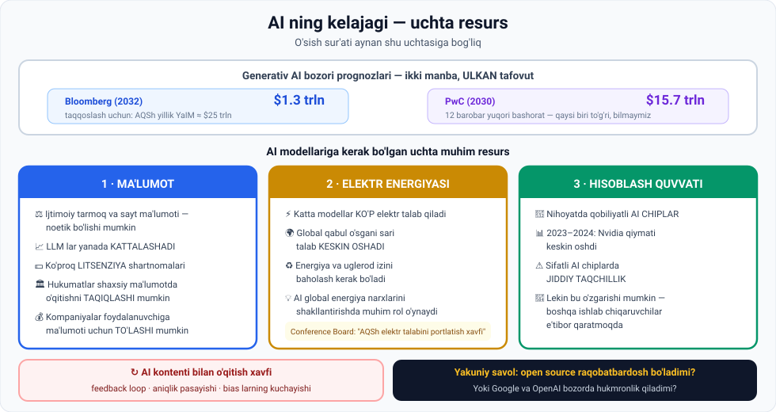

# 2-dars. AI ning kelajagi

## 🎬 Boshlashdan oldin

Ikkita nufuzli tashkilot generativ AI bozorini bashorat qildi:

```
Bloomberg (2032):  $1.3 trillion
PwC (2030):       $15.7 trillion
```

**12 barobar farq.** Ikkalasi ham professional. Ikkalasi ham jiddiy tahlil qilgan.

> Bu — bu darsning birinchi saboqi: **hech kim aniq bilmaydi**. Lekin nimadan bog'liqligini bilamiz.

---

## 1. 📈 Bozor prognozlari

> **Bloomberg xabar berishicha, 2032-yilga borib generativ AI bozori $1.3 TRILLIONGA yetishi mumkin** — taqqoslash uchun **AQSh ning yillik YaIM si taxminan $25 trillion**.

> **PricewaterhouseCoopers (PwC) yanada optimistik — u generativ AI bozori 2030-yilga borib $15.7 TRILLIONGA yetishini bashorat qilmoqda.**

### Ma'ruzachining halol xulosasi

> **Ikki prognoz o'rtasida ULKAN TAFOVUT bor. Qaysi biri to'g'ri chiqishini BILMAYMIZ.**
>
> ## **Biz bilamizki, AI sektori MISLI KO'RILMAGAN O'SISHNI boshdan kechiradi.**
>
> **Bu texnologiya uzluksiz rivojlanadi va yaxshilanadi.**



---

## 2. 🔑 O'sish sur'ati nimaga bog'liq

> **Ammo o'sish sur'ati bir necha kritik omilga bog'liq.**
>
> ## **AI modellariga kerak bo'lgan uchta muhim resurs:**
> ## **ELEKTR ENERGIYASI · MA'LUMOT · HISOBLASH QUVVATI**

---

## 3. 1️⃣ Ma'lumot

### Etik muammo

> **Yangi o'quv ma'lumotining mavjudligi ancha NOZIK MAVZU** — chunki **ijtimoiy tarmoq ma'lumoti** va **sayt proprietary ma'lumotidan** ulkan foundation modellarni o'qitish uchun foydalanish **NOETIK bo'lishi mumkin**.

### Ziddiyat

> **Ayni paytda LLM lar YANADA KATTALASHISHI ko'rinib turibdi.**
>
> **Internetning eng katta ma'lumot egalari bu masalaga qanday yondashishini kuzatish QIZIQARLI bo'ladi.**

### Uchta ehtimoliy stsenariy

| № | Stsenariy |
|---|---|
| 1 | **Ehtimol OpenAI e'lon qilganlaridan ham KO'PROQ litsenziya shartnomalarini ko'ramiz** |
| 2 | **Ba'zi mintaqalarda hukumatlar AI tartibga solishni joriy qilib**, ma'lum kelishuvlarsiz **foydalanuvchilarning shaxsiy ma'lumoti bilan modellarni o'qitishni TAQIQLASHI mumkin** |
| 3 | **Hatto LLM ishlab chiqaruvchi tashkilotlar FOYDALANUVCHILARGA shaxsiy ma'lumotiga kirish va u bilan model o'qitish uchun PUL TO'LASHGA tayyor bo'lishini ko'rishimiz mumkin** |

> 💰 **3-stsenariy juda qiziq.** Bugun sizning ma'lumotingiz **bepul** olinadi. Ertaga u **sotib olinishi** mumkin. Bu — 06-modulning 4-darsidagi litsenziyalash mantiqining **shaxsiy darajaga** kengayishi.

### ⚠️ AI kontenti muammosi

> **AI ishlab chiquvchilari internetdagi AI TOMONIDAN YARATILGAN KONTENT hajmining ortib borishi tug'dirgan qiyinchilikni qanday hal qilishini ko'rish qiziqarli bo'ladi.**
>
> **Agar bu kontent yangi AI modellarini o'qitish uchun ishlatilsa, u:**
>
> - **FEEDBACK LOOP lar** yaratishi
> - **AI modellarining ANIQLIGINI PASAYTIRISHI**
> - **Mavjud BIAS larni KUCHAYTIRISHI**
>
> mumkin.

*(06-modulning 4-darsidagi **model collapse** simulyatsiyasini eslang — 5 avlodda sifat 5/5 dan 1/5 ga tushgandi.)*

---

## 4. 2️⃣ Elektr energiyasi

> **Ikkinchidan, biz KATTA va MUKAMMAL til modellari SEZILARLI ELEKTR ENERGIYASINI talab qilishini hisobga olishimiz kerak.**

### O'sish

> **Odamlar AI uchun yangi qo'llanishlar topgani va AI modellarining qabul qilinishi global miqyosda o'sgani sari —**
>
> ## **umumiy foydalanish, demak AI uchun ELEKTR TALABI KESKIN OSHADI (skyrocket).**

### Nimani baholash kerak

> **Ma'lum bir nuqtada biz quyidagilarni baholashimiz kerak:**
> - AI ning **global energiya va uglerod izi** (carbon footprint)
> - AI xizmatlariga bo'lgan talab **global energiya narxlariga** qanday ta'sir qilishi

### The Conference Board hisoboti

> **Mustaqil biznes a'zoligi va tadqiqot uyushmasi The Conference Board hisobotining sarlavhasini ko'rib chiqing:**
>
> ## **"AI ning ko'tarilishi AQSh elektr talabini PORTLATISH va tarmoqni ORTIQCHA YUKLASH bilan tahdid qilmoqda — lekin ayni paytda YANGI SAMARADORLIKLARNI ham va'da qilmoqda."**

> **Hozircha ko'rinib turibdiki, AI KELAJAKDAGI ENERGIYA NARXLARINI shakllantirishda muhim rol o'ynaydi.**

---

## 5. 3️⃣ Hisoblash quvvati

> **Nihoyat, zamonaviy gen AI modellarini ishlab chiqish va ishlatish uchun bizga HISOBLASH QUVVATI kerak — NIHOYATDA QOBILIYATLI AI CHIPLAR.**

### Nvidia hikoyasi

> **2023 va 2024-yillarda AQSh chip ishlab chiqaruvchisi NVIDIA qiymati KESKIN OSHDI** — chunki u **ChatGPT yaratgan AI shov-shuvi** tufayli o'sib borayotgan **yarimo'tkazgichlarga bo'lgan talabdan** foyda ko'rish uchun **eng yaxshi holatda** bo'lib qoldi.

### Taqchillik

> **Sifatli AI chiplarda JIDDIY TAQCHILLIK borga o'xshaydi.**

### Lekin bu o'zgarishi mumkin

> **Ammo bu o'zgarishi mumkin, chunki Nvidia ning ulkan foydasi BOSHQA YARIMO'TKAZGICH ISHLAB CHIQARUVCHILARINING e'tiborini tortdi.**

---

## 6. 🔀 Yakuniy syujet chizig'i

> **AI sanoatidagi boshqa asosiy syujet chizig'i:**
>
> ## **OPEN SOURCE hamjamiyati ishlab chiqqan AI modellari CLOSED SOURCE AI bilan RAQOBATBARDOSH bo'ladimi?**
>
> **Yoki Google va OpenAI kabi big tech firmalari bozorda HUKMRONLIK QILISHDA davom etadimi?**

*(07-modulning 4-darsini eslang — sizib chiqqan Google hujjati. Bu — o'sha savolning davomi.)*

---

## 7. 🎬 Kursning yakuni

> **Natijadan qat'i nazar, AI ning hayotimizning turli jihatlariga ko'rsatadigan O'ZGARTIRUVCHI TA'SIRINI o'z ko'zimiz bilan ko'rish HAYAJONLI bo'ladi —**
>
> ## **ehtimol bu INTERNETNING RAQAMLI INQILOBI keltirgan o'zgarishlardan ham OSHIB KETADI.**

> **Intro to AI kursining oxirigacha qolganingiz uchun rahmat aytmoqchiman.**
>
> **Siz bilan bo'lish chinakam zavq bo'ldi.**
>
> **Umid qilamanki, siz ko'p narsa o'rgandingiz.**

---

## 8. 📊 Uchta resurs — jamlangan ko'rinish

| Resurs | Muammo | Ehtimoliy yechim/rivojlanish |
|---|---|---|
| 💾 **Ma'lumot** | Etik masalalar, tugab qolish, AI kontenti | Ko'proq **litsenziya shartnomalari**, tartibga solish, **foydalanuvchiga to'lash** |
| ⚡ **Elektr** | Talab **keskin oshadi**, tarmoqqa yuk | Samaradorlik, **uglerod izini baholash** |
| 🔲 **Chiplar** | **Jiddiy taqchillik** | Boshqa ishlab chiqaruvchilar bozorga kirmoqda |

---

## 9. ⚡ Amaliy topshiriqlar

### 🟢 Oson — 15 daqiqa · **Prognozlarni tekshiring**

```
1. IKKI PROGNOZ:
   Bloomberg (2032):  $1.3 trln
   PwC (2030):        $15.7 trln
   Farq:              ____ barobar

2. Nima uchun bunday katta tafovut bo'lishi mumkin?
   • Sabab 1: ______________________________
   • Sabab 2: ______________________________
   • Sabab 3: ______________________________

3. TADQIQOT: bugungi holatni qidiring
   Joriy generativ AI bozori hajmi:  $______
   Qaysi prognozga yaqinroq:         ______________

4. Sizning bashoratingiz (2030):     $______
   Nega: ____________________________________
```

### 🟡 O'rta — 25 daqiqa · **Energiya izini hisoblang**

Hech narsa o'rnatmasdan ishlaydi:

```python
# Taxminiy o'quv qiymatlari (aniq raqamlar emas!)
WH_PER_SOROV = 3.0        # 1 ta LLM so'rovi taxminan (vatt-soat)
WH_PER_QIDIRUV = 0.3      # oddiy veb-qidiruv

SENARIYLAR = [
    ("Siz (kuniga 20 so'rov)",           20 * 365),
    ("Kichik jamoa (50 kishi)",          20 * 365 * 50),
    ("Kompaniya (10 000 xodim)",         20 * 365 * 10_000),
    ("1 mln foydalanuvchili ilova",      20 * 365 * 1_000_000),
]

print("AI ENERGIYA IZI - YILLIK TAXMIN\n")
print("Senariy".ljust(34) + "So'rovlar".rjust(16) + "kWh".rjust(14) + "Uy (yil)".rjust(12))
print("-" * 76)
UY_YILLIK_KWH = 3600      # o'rtacha uyning yillik iste'moli

for nom, sorovlar in SENARIYLAR:
    kwh = sorovlar * WH_PER_SOROV / 1000
    uylar = kwh / UY_YILLIK_KWH
    print(nom.ljust(34) + f"{sorovlar:>16,}" + f"{kwh:>14,.0f}" + f"{uylar:>12,.1f}")

print("\n=== AI SO'ROVI VA ODDIY QIDIRUV ===")
print(f"  1 ta LLM so'rovi   ~ {WH_PER_SOROV} Wh")
print(f"  1 ta veb-qidiruv   ~ {WH_PER_QIDIRUV} Wh")
print(f"  Farq: {WH_PER_SOROV/WH_PER_QIDIRUV:.0f} barobar")
print("\n  Shuning uchun 'AI global energiya narxlarini shakllantiradi'.")
```

**Haqiqiy natija:**

```
AI ENERGIYA IZI - YILLIK TAXMIN

Senariy                                  So'rovlar           kWh    Uy (yil)
----------------------------------------------------------------------------
Siz (kuniga 20 so'rov)                       7,300            22         0.0
Kichik jamoa (50 kishi)                    365,000         1,095         0.3
Kompaniya (10 000 xodim)                73,000,000       219,000        60.8
1 mln foydalanuvchili ilova          7,300,000,000    21,900,000     6,083.3

=== AI SO'ROVI VA ODDIY QIDIRUV ===
  1 ta LLM so'rovi   ~ 3.0 Wh
  1 ta veb-qidiruv   ~ 0.3 Wh
  Farq: 10 barobar

  Shuning uchun 'AI global energiya narxlarini shakllantiradi'.
```

**Savollar:**
1. Bitta odam uchun energiya izi **sezilarlimi**? ______
2. 1 mln foydalanuvchili ilova **necha uyga teng**? ______
3. Endi tasavvur qiling: **milliardlab** foydalanuvchi. Nima bo'ladi?
4. Bu 06-modulning 2-darsidagi **budjet** mavzusiga qanday bog'lanadi?

> ⚠️ **Eslatma:** koddagi raqamlar — **o'quv maqsadidagi taxmin**. Real qiymatlar modelga, apparatga va provayder samaradorligiga qarab keskin farq qiladi.

### 🔴 Qiyin — insho · **Uchta resurs, uchta bashorat**

Kursning yakuniy topshirig'i:

```
━━━ 1 · MA'LUMOT ━━━
   5 yildan keyin AI modellari ma'lumotni qayerdan oladi?
   ______________________________________________
   Foydalanuvchilarga to'lash amaliyotga kiradimi?  ha / yo'q
   Nega: ________________________________________

━━━ 2 · ENERGIYA ━━━
   AI energiya iste'moli qanday hal qilinadi?
   [ ] Samaraliroq chiplar    [ ] Kichikroq modellar
   [ ] Qayta tiklanuvchi energiya  [ ] Tartibga solish
   [ ] Hech qanday — muammo o'sib boradi
   Tushuntiring: ________________________________

━━━ 3 · CHIPLAR ━━━
   Nvidia monopoliyasi davom etadimi?  ha / yo'q
   Kim raqobat qila oladi: ______________________

━━━ 4 · OPEN VS CLOSED ━━━
   5 yildan keyin qaysi biri ustun bo'ladi?
   ______________________________________________

━━━ 5 · SIZNING O'RNINGIZ ━━━
   Bu manzarada SIZ qayerda bo'lasiz?
   Lavozim:      ______________________________
   Soha:         ______________________________
   Nima quriladi: _____________________________

━━━ 6 · YAKUNIY FIKR (10 jumla) ━━━
   Ma'ruzachi aytadi: AI ta'siri internet inqilobidan ham
   oshib ketishi mumkin. Rozimisiz?
   ______________________________________________
   ______________________________________________
   ______________________________________________
```

---

## 10. 🧠 O'zini tekshirish savollari

1. Bloomberg va PwC qanday prognozlar bergan?
2. Ma'ruzachi bu prognozlar haqida nima deydi?
3. Nima aniq ma'lum?
4. AI modellariga kerak bo'lgan uchta resurs qaysi?
5. Ma'lumot bo'yicha qanday etik muammo bor?
6. Uchta ehtimoliy stsenariyni ayting.
7. AI kontenti bilan o'qitish qanday xavf tug'diradi? 3 tasini sanang.
8. Elektr talabi nima uchun oshadi?
9. Nimani baholash kerak bo'ladi?
10. The Conference Board hisoboti nima deydi?
11. Nvidia bilan nima bo'ldi va nima uchun?
12. Chiplar bo'yicha vaziyat qanday va u o'zgarishi mumkinmi?
13. AI sanoatidagi asosiy ochiq savol nima?

<details>
<summary>✅ Javoblar</summary>

1. **Bloomberg:** 2032-yilga **$1.3 trillion**. **PwC:** 2030-yilga **$15.7 trillion**.
2. Ular o'rtasida **ulkan tafovut** bor va **qaysi biri to'g'ri chiqishini bilmaymiz**.
3. AI sektori **misli ko'rilmagan o'sishni** boshdan kechiradi; texnologiya **uzluksiz rivojlanadi va yaxshilanadi**.
4. **Elektr energiyasi, ma'lumot, hisoblash quvvati.**
5. **Ijtimoiy tarmoq** va **sayt proprietary ma'lumotidan** ulkan modellarni o'qitish **noetik bo'lishi mumkin**.
6. (a) **Ko'proq litsenziya shartnomalari**; (b) hukumatlar **shaxsiy ma'lumot bilan o'qitishni taqiqlashi**; (c) tashkilotlar **foydalanuvchilarga ma'lumoti uchun pul to'lashi**.
7. **Feedback loop lar** yaratishi, **aniqlikni pasaytirishi**, **bias larni kuchaytirishi**.
8. Odamlar **yangi qo'llanishlar topgani** va AI **global miqyosda qabul qilingani** sari umumiy foydalanish oshadi.
9. AI ning **global energiya va uglerod izini**, hamda uning **global energiya narxlariga ta'sirini**.
10. AI ning ko'tarilishi **AQSh elektr talabini portlatish va tarmoqni ortiqcha yuklash** bilan tahdid qilmoqda, lekin **yangi samaradorliklarni** ham va'da qilmoqda.
11. Uning **qiymati keskin oshdi** — ChatGPT yaratgan AI shov-shuvi tufayli **yarimo'tkazgichlarga talabdan foyda ko'rish uchun eng yaxshi holatda** bo'lgani uchun.
12. Sifatli AI chiplarda **jiddiy taqchillik**. **Ha, o'zgarishi mumkin** — Nvidia ning ulkan foydasi **boshqa ishlab chiqaruvchilarning e'tiborini** tortdi.
13. **Open source modellar closed source bilan raqobatbardosh bo'ladimi**, yoki **big tech hukmronlikda davom etadimi**.

</details>

---

## 📌 Xulosa

```
PROGNOZLAR:  Bloomberg $1.3 trln  ⟷  PwC $15.7 trln
             (hech kim aniq bilmaydi, lekin o'sish MISLI KO'RILMAGAN)

O'SISH SUR'ATI UCHTA RESURSGA BOG'LIQ:

  💾 MA'LUMOT    →  etika · tugash · AI kontenti qaytishi
                    litsenziyalar · tartibga solish · foydalanuvchiga to'lash?

  ⚡ ELEKTR      →  talab KESKIN OSHADI
                    uglerod izi · global energiya narxlari

  🔲 CHIPLAR     →  Nvidia ko'tarildi · taqchillik
                    raqobatchilar kelmoqda

🔀 Ochiq savol:  OPEN SOURCE  vs  BIG TECH  —  kim ustun?

🌍 AI ta'siri INTERNET INQILOBIDAN ham oshib ketishi mumkin
```

---

## 🔖 Atamalar

| Atama | Inglizcha | Izoh |
|---|---|---|
| Prognoz | *forecast* | Kelajak bashorati |
| YaIM | *GDP* | Yalpi ichki mahsulot |
| Feedback loop | *feedback loop* | O'z-o'zini kuchaytiruvchi sikl |
| Uglerod izi | *carbon footprint* | Chiqarilgan CO₂ miqdori |
| Yarimo'tkazgich | *semiconductor* | Chip material asosi |
| Taqchillik | *shortage* | Yetishmovchilik |
| Litsenziya shartnomasi | *licensing deal* | Ma'lumotdan foydalanish kelishuvi |
| O'zgartiruvchi ta'sir | *transformative impact* | Tubdan o'zgartiruvchi ta'sir |

---

⬅️ [Oldingi: AI etikasi](01-AI-ethics.md) · 🏠 [Modul boshiga](README.md)

🎓 **Intro to AI bo'limi tugadi!** Keyingi qadam — **Python moduli** (10-bo'lim).
