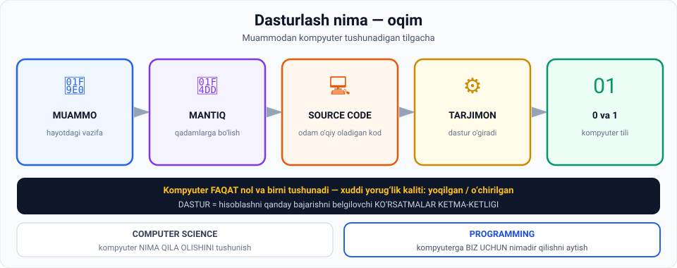

# 1-dars. Dasturlash bir necha daqiqada tushuntirildi

## 🎬 Boshlashdan oldin

Kompyuterga ingliz tilida mukammal yechim yozib bering — u **tushunmaydi**.

O'zbek tilida? Ham tushunmaydi.

> Kompyuter **faqat ikkita narsani** biladi: **0** va **1**. Xuddi yorug'lik kaliti kabi — **yoqilgan** yoki **o'chirilgan**.
>
> Unda biz u bilan qanday gaplashamiz? Bu dars — o'sha ko'prik haqida.

---

## 1. Muammodan yechimga

> **Hammamiz kundalik hayotda ma'lum vazifalarga duch kelamiz.**
>
> **Ko'pini o'zimiz hal qila olamiz, boshqalarini — ayniqsa murakkabroqlarini — KOMPYUTER yordamida hal qilish mumkin.**

### Muammo

> **Faraz qiling, siz hal qilinishi kerak bo'lgan muammoni aniqladingiz va uni yechish uchun bajarilishi kerak bo'lgan qadamlarni bilasiz.**
>
> **Hatto mantiqingizni mukammal tuzib, ajoyib yechimni ingliz tilida yozsangiz ham — KOMPYUTER UNI TUSHUNMAYDI**, chunki u **faqat nol va birlarni** tushunadi. **Boshqa hech qanday simvolni emas.**

> ## **Yorug'lik kaliti kabi: u ikkita holatni taniydi — YOQILGAN va O'CHIRILGAN.**



---

## 2. Source code — ko'prik

> **Real hayotdagi muammoni kompyuterga yetkazish uchun siz maxsus turdagi matn yaratishingiz kerak** — u **SOURCE CODE** yoki **odam o'qiy oladigan kod** deb ataladi.
>
> **Dasturiy ta'minot uni o'qiy oladi va keyin kompyuterga nol va birlar shaklida yetkazadi.**

---

## 3. 📖 Ta'riflar

> ## **DASTUR — hisoblashni QANDAY BAJARISHNI belgilovchi KO'RSATMALAR KETMA-KETLIGI.**

> **Shuning uchun dasturlash tushunchasining rasmiy ta'rifi quyidagicha:**
>
> ## **Vazifani olib, uni kompyuter tushuna oladigan va bajara oladigan DASTURLASH TILIDA yozib qo'yish.**

---

## 4. ⚠️ Muhim farq: Computer Science ≠ Programming

> **Dasturlash uchun siz "geek" yoki kompyuter olimi bo'lishingiz SHART EMAS.**
>
> **Aslida, kompyuter fanlari (computer science) predmeti — dasturlashni o'rganish EMAS.**
>
> **Bu turli narsalar va bu boshlovchilarni chalkashtirishi mumkin.**

| | Nima bilan shug'ullanadi |
|---|---|
| **Computer Science** | Kompyuter **nima qila olishini TUSHUNISH** |
| **Programming** | Kompyuterga **biz uchun nimadir qilishni AYTISH** |

---

## 5. 🌍 Nima uchun ko'p til bor

> **Bugun biz yashayotgan dunyoni o'ylab ko'ring: u yerda MINGDAN ORTIQ dasturlash tili bor, va har bir til ANIQ VAZIFALARNI bajarish uchun mo'ljallangan.**
>
> **Shuning uchun muammoingiz qaysi sohaga tegishli bo'lishiga qarab, faqat BA'ZI tillar foydali bo'la oladi.**

### Ma'ruzadagi misollar

| Til | Nimaga yaxshi | Nimaga mos emas |
|---|---|---|
| **PHP** | Veb-dasturlash | Qurilmalarni dasturlash |
| **C++** | Qurilmalarni dasturlash | — |
| **Python va R** | **Data scientist** va **moliya** sohasi vakillarining sevimli vositalari | — |

### ⚠️ Keng tarqalgan noto'g'ri tasavvur

> **Tajribali dasturchi bilan uchrashganingizda, u mavjud BARCHA tillarda dastur yoza oladi deb o'ylamang.**
>
> **Aksincha, ehtimol u BITTA yoki bir necha til bilan ishlay oladi — LEKIN ularni YAXSHI EGALLAGAN.**

> 💡 **Bu — boshlovchilar uchun katta yengillik.** Siz "hamma tilni bilishingiz" shart emas. **Bittasini yaxshi** bilish yetadi.

---

## 6. 🧠 Ikkita asosiy ko'nikma

### 6.1. Muammoni yechish va abstrakt fikrlash

> **Birinchidan, dasturlash MUAMMONI YECHISH ko'nikmalarini talab qiladi va ABSTRAKT FIKRLASHNI o'z ichiga oladi.**
>
> **Siz vazifangizni mukammal tushunishingiz va uni kompyuter bajara oladigan KO'RSATMALAR KETMA-KETLIGIGA yoki kichikroq hisoblash qadamlariga BO'LISHINGIZ kerak.**

**Ma'ruzadagi misol:**

> **Jon dan boshlig'i quyidagini so'radi: har qanday songa 10 qo'shadigan dastur yarating.**
>
> **To'g'ri mulohaza: agar X — noma'lum bo'lsa, bizga X + 10 natijasi kerak.**

### 6.2. Mexanistik fikrlash

> **Bu qadamlarni dasturlash tilida yaratganingizdan so'ng, siz TOZA, YAXSHI TUZILGAN kod satrlarini yozishni boshlaysiz.**
>
> **Shuning uchun rivojlantirilishi kerak bo'lgan ikkinchi hal qiluvchi ko'nikma — MEXANISTIK FIKRLASH.**

### ⚠️ Kompyuter faqat aytilganini bajaradi

> **AI ni chetga qo'yadigan bo'lsak, kompyuterlar faqat siz OCHIQ-OYDIN so'ragan narsani bajara oladi.**
>
> **Ular sizning ko'rsatmalaringiz orqali NAZARDA TUTGAN narsangizni tushunmaydi.**
>
> **Hatto AI ham ba'zan sizning niyatingizni noto'g'ri talqin qilishi mumkin.**

---

## 7. 🤖 AI davrida ham kod bilish nima uchun kerak

Bu — ma'ruzaning eng zamonaviy va muhim qismi:

> **Shuning uchun siz kompyuter bajara oladigan ANIQ kod yozishni o'rganishingiz kerak** — u siz tomonidan yoki AI tomonidan talqin qilinishidan qat'i nazar.

> **Xayriyatki, AI ba'zan talqin qilishda bizdan ustun kelsa ham —**
>
> ## **KOD KO'RSATMALARINI MAS'ULIYAT BILAN TUSHUNISH, NAZORAT QILISH va MOSLASHTIRISHDA ODAMLAR YAKUNIY QAROR QABUL QILUVCHI bo'lib qoladi.**

### Shuning uchun

> **Aynan shuning uchun dasturlash tili SINTAKSISINI mustahkam bilish va kodni O'QIY hamda YOZA olish — ENG MUHIM.**
>
> **Bu sizning fikrlash jarayoningizga ijobiy ta'sir qiladi — muammolarni kompyuter bajara oladigan qismlarga bo'lishga yordam berish orqali.**

> ## **Bu ko'nikma AI BILAN ISHLAGANDA HAM ZARUR, chunki kuchli dasturlash ko'nikmalari sizga imkon beradi:**
> - **AI ning xulq-atvorini TUSHUNISH**
> - **Samarali DEBUG qilish**
> - **Barcha jumboq bo'laklarini BOG'LASH**

> 💡 **06-modulning 1-darsini eslang** — *"mutaxassis AI bilan ishlaydi va AI suhbat oynasi ichida fikr yuritadi"*. Mana o'sha "mutaxassislik" nimadan iborat.

---

## 8. Jon ning masalasi — yechim

> **Yuqorida keltirgan misolimizda Jon quyidagi kichik vazifalar haqida o'ylashi kerak:**
>
> **Birinchidan, u X ni argument sifatida qabul qiladigan FUNKSIYA aniqlashi va keyin chiqish sifatida X + 10 ga teng YANGI O'ZGARUVCHINI qaytarishi kerak.**

```python
def qoshish(x):
    natija = x + 10
    return natija

print(qoshish(5))    # 15
```

---

## 9. ✍️ Kodlash uslubi

> **Qaysi muammoga duch kelishingiz yoki qaysi dasturlash tilidan foydalanishingizdan qat'i nazar, KODLASH USLUBINGIZ hal qiluvchi ahamiyatga ega.**

### Nima uchun

> **Esda tuting: uchta kod satri tushunish uchun juda oddiy.**
>
> **Ammo amalda siz ehtimol BOSHQA ODAMLARGA yuborilishi kerak bo'lgan YUZLAB kod satri bilan ishlaysiz.**

### ❌ Yomon kod nimaga o'xshaydi

> **Agar ishingiz:**
> - **o'qish qiyin**
> - **keraksiz murakkab**
> - **hech qanday ma'no anglatmaydigan o'zgaruvchi nomlariga to'la**
>
> **bo'lsa — u boshqa dasturchilar tomonidan YOMON QABUL QILINADI.**

**Misol:**

```python
# ❌ YOMON
a = 5
b = a + 10
print(b)

# ✅ YAXSHI
boshlangich_son = 5
natija = boshlangich_son + 10
print(natija)
```

> **Shuning uchun kurs davomida biz kodingizni tashkil qilishga yordam beradigan ENG YAXSHI AMALIYOTLARGA e'tibor qaratamiz.**

---

## 10. Yakuniy fikr

> **Dasturlash mashqlari ajoyib, chunki ular sizning MEXANISTIK FIKRLASH va MUAMMONI YECHISH qobiliyatlaringizni rivojlantiradi.**
>
> **Bu quyidagilarni o'z ichiga oladi:**
> - **muammolarni shakllantirish**
> - **ularni ma'noli qadamlarga bo'lish**
> - **bu qadamlarni kompyuterga TASHKIL QILINGAN tarzda yetkazish**

---

## 11. ⚡ Amaliy topshiriqlar

### 🟢 Oson — 10 daqiqa · **Vazifani qadamlarga bo'ling**

Dasturlash tilini bilish shart emas — **o'zbek tilida** yozing:

```
VAZIFA 1: "Ro'yxatdagi eng katta sonni top"
   1. ______________________________________
   2. ______________________________________
   3. ______________________________________

VAZIFA 2: "Choy damla"
   1. ______________________________________
   2. ______________________________________
   3. ______________________________________
   4. ______________________________________
   5. ______________________________________

VAZIFA 3: "Talabaning o'rtacha bahosini hisobla"
   1. ______________________________________
   2. ______________________________________
   3. ______________________________________
```

**Muhokama:** 2-vazifada **"suvni qaynat"** deb yozdingizmi? Kompyuter uchun bu **yetarli emas**. U "qaynatish" nima ekanini bilmaydi. Har bir qadamni **yanada mayda** qadamlarga bo'lish kerak.

> 🎯 Mana shu — **abstrakt fikrlash**ning mohiyati.

### 🟡 O'rta — 20 daqiqa · **Kod uslubini tuzating**

Quyidagi kod **ishlaydi**, lekin **yomon yozilgan**. Uni tuzating:

```python
a=10
b=20
c=a*b
d=c/2
print(d)
```

**Vazifalar:**
1. O'zgaruvchilarga **ma'noli nom** bering (bu — to'g'ri to'rtburchak yuzi va uchburchak yuzi hisobi).
2. **Bo'shliqlar** qo'ying (`a=10` → `a = 10`).
3. **Izoh** qo'shing.
4. Natijani **tushunarli** chop eting.

<details>
<summary>✅ Namuna yechim</summary>

```python
# To'rtburchak va uchburchak yuzini hisoblash
tomon_a = 10
tomon_b = 20

tortburchak_yuzi = tomon_a * tomon_b
uchburchak_yuzi = tortburchak_yuzi / 2

print("Uchburchak yuzi:", uchburchak_yuzi)
```

Kod **bir xil ishlaydi**, lekin uni **6 oydan keyin** o'qiganingizda tushunasiz.

</details>

### 🔴 Qiyin — muhokama · **AI davrida dasturlash**

Ma'ruza aytadi: kod bilish AI bilan ishlashda ham **zarur**.

```
1. AI ENDI KOD YOZA OLADI. Unda nima uchun o'rganamiz?
   Ma'ruzadan 3 ta sabab:
   a) _______________________________________
   b) _______________________________________
   c) _______________________________________

2. SINOV: ChatGPT'ga biror kod yozdiring
   Vazifa: ______________________________________
   Kod to'g'ri ishladimi?  ha / yo'q
   Agar YO'Q — xatoni topa oldingizmi?  ha / yo'q
   Buning uchun nima kerak bo'ldi?  ________________

3. 09-modulning 1-darsini eslang:
   Jensen Huang "bolalar dasturlashni o'rganishi shart emas" dedi.
   Bu dars unga QANDAY javob beradi?
   ______________________________________________

4. SIZNING POZITSIYANGIZ (5 jumla):
   ______________________________________________
   ______________________________________________
```

---

## 12. 🧠 O'zini tekshirish savollari

1. Nima uchun kompyuter ingliz tilidagi mukammal yechimni tushunmaydi?
2. Kompyuter nimaga qiyoslanadi?
3. Source code nima?
4. Dasturning ta'rifini ayting.
5. Dasturlashning rasmiy ta'rifi nima?
6. Computer science va programming farqi nima?
7. Nechta dasturlash tili bor? Ular nima uchun turlicha?
8. PHP, C++, Python va R — har biri nimaga mos?
9. Tajribali dasturchi haqidagi noto'g'ri tasavvur nima?
10. Ikkita asosiy ko'nikma qaysi?
11. Kompyuter nima qila oladi va nima qila olmaydi?
12. AI davrida ham kod bilish nima uchun zarur? 3 sabab.
13. Kodlash uslubi nima uchun muhim?
14. Yomon kod qanday belgilarga ega?

<details>
<summary>✅ Javoblar</summary>

1. Chunki u **faqat nol va birlarni** tushunadi, **boshqa hech qanday simvolni emas**.
2. **Yorug'lik kalitiga** — ikkita holat: **yoqilgan** va **o'chirilgan**.
3. **Odam o'qiy oladigan kod** — dasturiy ta'minot uni o'qib, kompyuterga **nol va birlar** shaklida yetkazadi.
4. **Hisoblashni qanday bajarishni belgilovchi ko'rsatmalar ketma-ketligi.**
5. **Vazifani olib, uni kompyuter tushuna va bajara oladigan dasturlash tilida yozib qo'yish.**
6. **Computer science** — kompyuter **nima qila olishini tushunish**. **Programming** — kompyuterga **biz uchun nimadir qilishni aytish**.
7. **Mingdan ortiq.** Har bir til **aniq vazifalarni** bajarish uchun mo'ljallangan.
8. **PHP** — veb (qurilmalar uchun emas); **C++** — qurilmalar; **Python va R** — **data science va moliya**.
9. U **barcha tillarda** dastur yoza oladi deb o'ylash. Aslida u **bitta yoki bir nechtasini yaxshi egallagan**.
10. **Muammoni yechish** (abstrakt fikrlash) va **mexanistik fikrlash**.
11. Faqat siz **ochiq-oydin so'ragan** narsani bajaradi; ko'rsatmalaringiz orqali **nazarda tutgan** narsangizni tushunmaydi.
12. (a) **AI xulq-atvorini tushunish**; (b) samarali **debug qilish**; (c) **barcha jumboq bo'laklarini bog'lash**. Bundan tashqari, odamlar kodni **mas'uliyat bilan nazorat qilishda yakuniy qaror qabul qiluvchi** bo'lib qoladi.
13. Amalda siz **yuzlab kod satri** bilan ishlaysiz va ular **boshqa odamlarga** yuboriladi.
14. **O'qish qiyin**, **keraksiz murakkab**, **hech qanday ma'no anglatmaydigan o'zgaruvchi nomlariga to'la**.

</details>

---

## 📌 Xulosa

```
MUAMMO  →  mantiqni qadamlarga bo'lish  →  SOURCE CODE
                                              ↓ tarjimon
                                          0 va 1
                                              ↓
                                          KOMPYUTER

DASTUR = ko'rsatmalar ketma-ketligi
DASTURLASH = vazifani kompyuter tili bilan yozish

Computer Science  →  kompyuter NIMA QILA OLADI
Programming       →  kompyuterga NIMA QILISHNI AYTISH

Ikki ko'nikma:  muammoni yechish (abstrakt) + mexanistik fikrlash

⚠️ AI davrida ham: sintaksisni bilish → AI ni tushunish, debug, bog'lash
✍️ Kod uslubi: ma'noli nomlar, soddalik, o'qilishi oson
```

---

## 🔖 Atamalar

| Atama | Inglizcha | Izoh |
|---|---|---|
| Source code | *source code* | Odam o'qiy oladigan dastur matni |
| Dastur | *program* | Ko'rsatmalar ketma-ketligi |
| Dasturlash | *programming* | Vazifani kod bilan yozish |
| Kompyuter fanlari | *computer science* | Kompyuter imkoniyatlarini o'rganish |
| Abstrakt fikrlash | *abstract thinking* | Muammoni qismlarga bo'lish |
| Mexanistik fikrlash | *mechanistic thinking* | Aniq va tartibli ko'rsatma yozish |
| Sintaksis | *syntax* | Til qoidalari |
| Debug | *debug* | Xatoni topish va tuzatish |
| Funksiya | *function* | Argument olib, natija qaytaruvchi blok |
| Argument | *argument* | Funksiyaga beriladigan qiymat |

---

🏠 [Modul boshiga](README.md) · ➡️ [Keyingi: Nima uchun Python](02-Why-Python.md)
