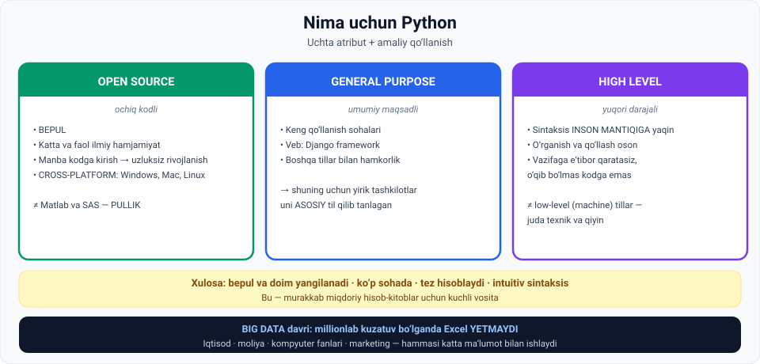

# 2-dars. Nima uchun Python

## 🎬 Boshlashdan oldin

Mingdan ortiq dasturlash tili bor. Nima uchun aynan **Python**?

Va nima uchun **data scientist** lar deyarli har doim uni tanlaydi?

> Javob **ikkita** — texnik va amaliy. Bu dars ikkalasini ham beradi.

---

## 1. Ikkita asosiy sabab

> **Garchi ba'zilaringiz uchun yangi bo'lsa-da, Python dasturlash sahnasida YIGIRMA YILDAN ORTIQ vaqtdan beri turibdi.**

> **Python o'rganishingiz kerak bo'lgan IKKITA asosiy sabab bor:**

| № | Sabab |
|---|---|
| **1** | Boshqa dasturlash tillariga nisbatan bir necha **TEXNIK AFZALLIKKA** ega |
| **2** | Uning **AMALIY QO'LLANISHI** bir necha sohani qamrab oladi |

### Qayerda kuchli

> **U murakkab vazifalarni hal qilishda kuchli hisoblash vositasi:**
>
> **moliya · ekonometrika · iqtisod · data science · machine learning**

> **Shuning uchun u kod yozishni o'rganayotgan va DATA SCIENTIST sifatida karyera qurishga qat'iy qaror qilgan odam uchun MUKAMMAL SAKRASH TAXTASI.**

---

## 2. 📖 Texnik ta'rif

> **Mana Python ning biroz texnikroq tavsifi:**
>
> ## **Bu OPEN SOURCE, GENERAL PURPOSE, HIGH LEVEL dasturlash tili.**

Bu ta'rifni **uch qismga** bo'lib tushunamiz.



---

## 3. 1️⃣ Open source — ochiq kodli

> ## **Open source BEPUL degani.**

### Hamjamiyat

> **Python katta va faol ilmiy hamjamiyatga ega** — ular **dasturiy ta'minotning manba kodiga kirish** imkoniga ega va **foydalanuvchilar ehtiyojiga qarab uning uzluksiz rivojlanishi va yangilanishiga hissa qo'shadilar.**

### Natija: cross-platform

> **Bu Python ning CROSS-PLATFORM bo'lishining asosiy sababi.**
>
> **U barcha asosiy operatsion tizimlar uchun mavjud: Windows, Mac va Linux.**
>
> **Foydasi shundaki, Python ni HAR QAYERDA tez qo'llash mumkin.**

### ⚖️ Taqqoslash

> **Moliyaviy va ekonometrik vazifalarni hal qilish uchun ishlatiladigan MATLAB va SAS kabi domenga xos tillar — PULLIK.**
>
> **Bu tilning ommaboplilikda rol o'ynaydi.**

---

## 4. 2️⃣ General purpose — umumiy maqsadli

> **Uni qo'llash mumkin bo'lgan KENG SOHALAR to'plami mavjud.**
>
> **Masalan, Python DJANGO framework orqali veb-dasturlash uchun ishlatilishi mumkin** — garchi bu kurs doirasidan tashqarida bo'lsa ham.

### Nima uchun bu muhim

> **Siz qo'llanishning KENG KO'LAMI va boshqa dasturlash tillari bilan HAMKORLIK QILA OLISHIDAN xabardor bo'lishingiz kerak.**
>
> **Bu ba'zi yirik tashkilotlar nima uchun Python ni O'ZLARINING ASOSIY dasturlash tili sifatida tanlaganini tushuntirishi mumkin.**

---

## 5. 3️⃣ High level — yuqori darajali

> **Bu biroz texnikroq.**

### Nima gap

> **Umuman aytganda, kompyuterlar faqat PAST DARAJALI tillarda yozilgan dasturlarni ishga tushira oladi** — ular **machine languages** deb ham ataladi.
>
> **Shuning uchun YUQORI DARAJALI tilda yozilgan dastur bajarilishidan oldin PAST DARAJALI tilga tarjima qilinishi kerak.**
>
> **Bu jarayon vaqt oladi.**
>
> **Bu tarjimani siz uchun bajaradigan maxsus dasturiy ta'minot va ilovalar mavjud.**

*(Oldingi darsni eslang — "tarjimon" bosqichi aynan shu.)*

### ✅ Afzalliklari ulkan

> **Yuqori darajali tildan foydalanishning afzalliklari ULKAN.**
>
> **Past darajali dasturlash tillarini kodlash va tushunish QIYIN — ular JUDA TEXNIK.**

> ## **Yuqori darajali tillar INSON MANTIQIGA ANCHA YAQIN sintaksisdan foydalanadi** —
> **bu tilni o'rganish va qo'llashni OSONLASHTIRADI.**
>
> **Bu dasturchiga o'qib bo'lmaydigan kod satrlarini tushunishga urinish o'rniga, QO'LDAGI VAZIFAGA e'tibor qaratish imkonini beradi.**

---

## 6. 📊 Xulosa: to'rtta texnik afzallik

> **Python ni boshqa dasturlash tillaridan ko'ra ko'pincha afzal ko'riladigan kuchli tilga aylantiradigan texnik afzalliklarni umumlashtirsak:**

| № | Afzallik |
|---|---|
| **1** | **Bepul** va **doimiy yangilanadi** |
| **2** | **Ko'p domenda** ishlatilishi mumkin |
| **3** | Hisob-kitoblarni qayta ishlash uchun **ko'p vaqt talab qilmaydi** |
| **4** | Murakkab miqdoriy hisob-kitoblarga imkon beruvchi **intuitiv sintaksis** |

---

## 7. 📈 Amaliy qo'llanish: big data davri

> **Hozirgacha aytganlarimiz Python ning ULKAN AMALIY QO'LLANILISHINI ko'rsatadi.**
>
> ## **Biz BIG DATA davrida yashayotganimiz aniq.**

### Kimlar katta ma'lumot bilan ishlaydi

> **Turli sohalardagi odamlar — iqtisod, moliya, kompyuter fanlari, marketing va boshqa ko'plab soha vakillari — ULKAN hajmdagi ma'lumotni olishlari mumkin.**

### Big data qachon boshlanadi

> **Bizda MILLIONLAB KUZATUV bo'lganda big data haqida gapira olamiz.**

### ⚠️ Excel yetmaydi

> **Bunday vaziyatlarda Microsoft Excel kabi an'anaviy ma'lumotni qayta ishlash ilovalarining hisoblash imkoniyatlari YETARLI EMAS bo'lib qoladi.**
>
> **Bizga qo'llanish sohasidan qat'i nazar, big data bilan taxminan bir xil tarzda kurashish uchun ANCHA KUCHLIROQ VOSITA kerak.**

> 🔗 **02-modulning 1-darsini eslang:** dunyodagi ma'lumotning 80–90% i strukturalanmagan. Excel esa **faqat satr-ustun** bilan ishlaydi. Mana nima uchun Python.

---

## 8. 💻 Python'ni his qiling

Agar Python o'rnatilgan bo'lsa, sinab ko'ring. Bo'lmasa — keyingi modulda o'rnatamiz.

```python
# Python sintaksisi inson mantiqiga qanchalik yaqin?

sonlar = [12, 45, 7, 89, 23, 56]

print("Ro'yxat:", sonlar)
print("Eng katta:", max(sonlar))
print("Eng kichik:", min(sonlar))
print("Yig'indi:", sum(sonlar))
print("O'rtacha:", sum(sonlar) / len(sonlar))

# 50 dan katta sonlarni tanlash - bitta qatorda
kattalar = [s for s in sonlar if s > 50]
print("50 dan katta:", kattalar)

# O'qing: "sonlar ichidagi har bir s uchun, agar s 50 dan katta bo'lsa"
# Bu deyarli ingliz tili, shunday emasmi?
```

**Natija:**

```
Ro'yxat: [12, 45, 7, 89, 23, 56]
Eng katta: 89
Eng kichik: 7
Yig'indi: 232
O'rtacha: 38.666666666666664
50 dan katta: [89, 56]
```

> 💡 **Diqqat qiling:** `max`, `min`, `sum`, `if`, `for` — bularning hammasi **oddiy inglizcha so'zlar**. Mana shu — **high level** ning ma'nosi.

---

## 9. ⚡ Amaliy topshiriqlar

### 🟢 Oson — 10 daqiqa · **Atributlarni bog'lang**

| Xususiyat | Qaysi atribut? |
|---|---|
| Windows, Mac va Linux'da ishlaydi | |
| Bepul | |
| Django bilan veb-sayt qurish mumkin | |
| `if x > 5:` — deyarli ingliz tili | |
| Katta ilmiy hamjamiyat rivojlantiradi | |
| Kompyuter uchun tarjima qilinishi kerak | |
| Boshqa tillar bilan hamkorlik qiladi | |

**Variantlar:** open source · general purpose · high level

<details>
<summary>✅ Javoblar</summary>

Cross-platform → **open source** natijasi · Bepul → **open source** · Django → **general purpose** · Ingliz tiliga o'xshash → **high level** · Hamjamiyat → **open source** · Tarjima → **high level** · Hamkorlik → **general purpose**

</details>

### 🟡 O'rta — 20 daqiqa · **Excel'ning chegarasini toping**

```
1. Excel'da nechta qator bo'lishi mumkin?  (qidiring)  ______

2. Sizda 5 MILLION qatorli ma'lumot bor. Excel ochadimi?  ha / yo'q

3. TAJRIBA: Excel'da 100 000 qatorli fayl yarating
   (formula bilan to'ldiring) va oching.
   Necha soniya ochildi?  ______
   Kompyuter sekinlashdimi?  ha / yo'q

4. Endi Python bilan (agar o'rnatilgan bo'lsa):
   ```python
   sonlar = list(range(1, 5_000_001))
   print(len(sonlar), sum(sonlar))
   ```
   Necha soniya ketdi?  ______

5. XULOSA: nima uchun data scientist larga Excel yetmaydi?
   ______________________________________________
```

### 🔴 Qiyin — tadqiqot · **Tilni tanlash**

```
1. UCHTA VAZIFA, UCHTA TIL:

   Vazifa                          Qaysi til?   Nega?
   Veb-sayt backend'i              _________    _____________
   Mikrokontroller (Arduino)       _________    _____________
   Ma'lumot tahlili va ML          _________    _____________

2. TIOBE INDEKSI (ma'ruzada eslatilgan):
   Saytga kiring va toping:
   Python hozir nechanchi o'rinda?  ______
   Birinchi 5 talik:  ________________________

3. O'ZBEKISTON BOZORI:
   hh.uz yoki boshqa saytda qidiring:
   "Python" bo'yicha nechta e'lon:     ______
   "Java" bo'yicha:                    ______
   "JavaScript" bo'yicha:              ______

4. XULOSA: Python o'rganish qarori sizning hududingizda
   ham mantiqiymi?  ha / yo'q
   ______________________________________________

5. MA'RUZA AYTADI: tajribali dasturchi bir-ikki tilni
   YAXSHI biladi. Sizning rejangiz:
   1-til (chuqur):     ______________
   2-til (keyinroq):   ______________
```

---

## 10. 🧠 O'zini tekshirish savollari

1. Python qancha vaqtdan beri mavjud?
2. Python o'rganishning ikkita asosiy sababi nima?
3. Python qaysi sohalarda kuchli hisoblash vositasi?
4. Python ning texnik ta'rifini ayting (uch atribut).
5. Open source nimani anglatadi? Hamjamiyat nima qiladi?
6. Cross-platform nima va uning foydasi qanday?
7. Matlab va SAS bilan farqi nima?
8. General purpose nimani anglatadi? Misol keltiring.
9. High level nima? Past darajali tillardan farqi?
10. Yuqori darajali tilning afzalligi nima?
11. To'rtta texnik afzallikni sanang.
12. Big data qachon boshlanadi?
13. Nima uchun Excel yetarli emas?

<details>
<summary>✅ Javoblar</summary>

1. **Yigirma yildan ortiq.**
2. (a) Boshqa tillarga nisbatan **texnik afzalliklari**; (b) **amaliy qo'llanishi** bir necha sohani qamrab oladi.
3. **Moliya, ekonometrika, iqtisod, data science, machine learning.**
4. **Open source, general purpose, high level** dasturlash tili.
5. **Bepul.** Hamjamiyat **manba kodga kirish** imkoniga ega va **foydalanuvchilar ehtiyojiga qarab uzluksiz rivojlanish va yangilanishga** hissa qo'shadi.
6. **Barcha asosiy operatsion tizimlar** (Windows, Mac, Linux) uchun mavjudlik. Foydasi: Python ni **har qayerda tez qo'llash** mumkin.
7. **Matlab va SAS pullik**, Python bepul. Bu ommaboplilikda rol o'ynaydi.
8. **Keng sohalar to'plamida** qo'llanishi. Misol: **Django** framework orqali veb-dasturlash.
9. Kompyuterlar faqat **past darajali (machine) tillarni** ishga tushiradi; yuqori darajali til avval **tarjima qilinishi** kerak. Past darajali tillar **juda texnik va qiyin**.
10. Sintaksis **inson mantiqiga ancha yaqin** → o'rganish va qo'llash oson; dasturchi **vazifaga** e'tibor qaratadi.
11. **Bepul va doimiy yangilanadi · ko'p domenda ishlatiladi · hisob-kitoblarga ko'p vaqt ketmaydi · intuitiv sintaksis.**
12. **Millionlab kuzatuv** bo'lganda.
13. Bunday vaziyatlarda uning **hisoblash imkoniyatlari yetarli emas** bo'lib qoladi.

</details>

---

## 📌 Xulosa

```
PYTHON = open source + general purpose + high level

  OPEN SOURCE      →  bepul · faol hamjamiyat · cross-platform
                      (≠ Matlab, SAS — pullik)

  GENERAL PURPOSE  →  keng sohalar · Django · boshqa tillar bilan hamkorlik
                      → yirik tashkilotlar uni ASOSIY til qilib tanladi

  HIGH LEVEL       →  sintaksis inson mantiqiga yaqin
                      → vazifaga e'tibor, kodni tushunishga emas

4 ta afzallik: bepul · ko'p domen · tez · intuitiv sintaksis

BIG DATA = millionlab kuzatuv  →  Excel YETMAYDI  →  Python
```

---

## 🔖 Atamalar

| Atama | Inglizcha | Izoh |
|---|---|---|
| Open source | *open source* | Ochiq kodli, bepul |
| General purpose | *general purpose* | Umumiy maqsadli |
| High level | *high level* | Inson mantiqiga yaqin til |
| Low level / machine language | *low level* | Kompyuter tiliga yaqin |
| Cross-platform | *cross-platform* | Barcha OS da ishlaydigan |
| Manba kod | *source code* | Dasturning ochiq matni |
| Domenga xos til | *domain-specific language* | Bitta sohaga mo'ljallangan |
| Framework | *framework* | Tayyor tuzilma va vositalar to'plami |
| Ekonometrika | *econometrics* | Iqtisodda statistik usullar |
| Big data | *big data* | Millionlab kuzatuvli ma'lumot |
| Kuzatuv | *observation* | Ma'lumot to'plamidagi bitta yozuv |
| Sakrash taxtasi | *stepping stone* | Keyingi bosqichga o'tish vositasi |

---

⬅️ [Oldingi: Dasturlash tushuntirildi](01-Programming-explained.md) · 🏠 [Modul boshiga](README.md)

➡️ **Keyingi:** **11-modul: Muhitni sozlash**
