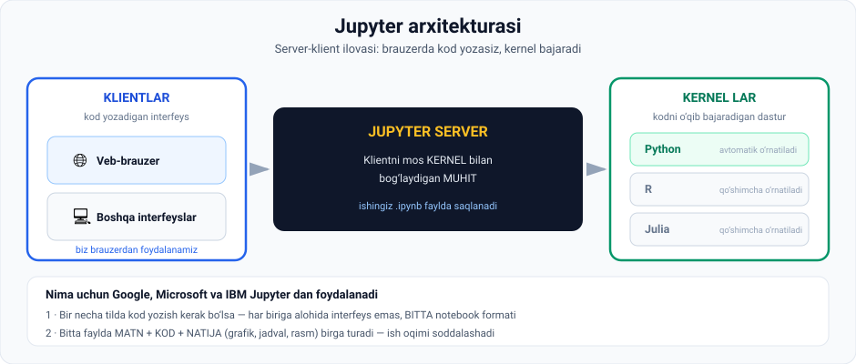

# 1-dars. Jupyter bilan tanishuv

## 🎬 Boshlashdan oldin

Mantiqiy savol: nima uchun **"Python"** deb ataladigan bitta dastur yo'q — uni o'rnatasiz, u o'zi yangilanadi va hammasi silliq ishlaydi?

> **Afsuski, unday emas.** Reallik bilan hisoblashishimiz kerak.
>
> Bu dars nima uchun **ikkita** narsa kerakligini tushuntiradi.

---

## 1. Python — bu til, dastur emas

> **Birinchidan, PYTHON — bu DASTURLASH TILI.** U sizga kompyuter bilan muloqot qilish imkonini beradi.
>
> **Buni amalga oshirish uchun sizga maxsus dasturiy ta'minot yoki ilova yordami kerak** — aynan **Jupyter Notebook** ilovasi, uni ko'pincha oddiygina **Jupyter** deb atashadi.

### Jupyter nima

> ## **Bu SERVER-KLIENT ilovasi** — u sizga kodni **VEB-BRAUZER orqali tahrirlash** imkonini beradi.



---

## 2. 🏗 Arxitektura

Ma'ruzadagi grafikni tushunamiz. **Barcha birliklar turli dasturiy ta'minotni ifodalaydi.**

### Bir tomonda: kernel lar

> **Bir tomonda sizda bir necha TIL KERNELI bor.**
>
> **Bular Python, R yoki Julia kabi ANIQ dasturlash tilida kodni O'QISH va BAJARISH uchun mo'ljallangan dasturlar.**

| Kernel | Holati |
|---|---|
| **Python** | ✅ **Jupyter o'rnatilishi bilan doim keladi** |
| **R** | Qo'shimcha o'rnatilishi mumkin |
| **Julia** | Qo'shimcha o'rnatilishi mumkin |

### Boshqa tomonda: klientlar

> **Boshqa tomonda sizda kod yozishingiz mumkin bo'lgan turli interfeyslar bor.**
>
> **Ular KLIENT larni ifodalaydi. Bunday klientga misol — VEB-BRAUZER.**

### O'rtada: server

> ## **JUPYTER SERVER klient MOS KELUVCHI TIL KERNELI bilan bog'lanadigan MUHITNI taqdim etadi.**

> **Bizning holatimizda biz PYTHON ga va klient yoki INTERAKTIV SHELL sifatida VEB-BRAUZERGA e'tibor qaratamiz.**

---

## 3. 📄 Notebook fayli

> **Sizning ishingiz NOTEBOOK HUJJATIDA saqlanadi.**
>
> **Va biz qat'iy ravishda Python tilidan foydalanganimiz uchun, u IPython notebook fayli deb ataladi —**
>
> ## **fayl formati: `.ipynb`**

> 💡 **Nomdan qo'rqmang.** `IPython` — bu Jupyter ning **ajdodi**. Bu format bugungi kunda **meros (legacy)** nom sifatida qolgan.

---

## 4. 🏢 Nima uchun Google, Microsoft va IBM Jupyter dan foydalanadi

> **Aytilganlarning barchasini hisobga olsak, Jupyter nima uchun Google, Microsoft va IBM kabi ko'plab yirik korporatsiyalarda ishlatilishini tushuntira olamiz.**
>
> **Uning dizayni tufayli u dasturlash tushunchalarini NAMOYISH QILISH va O'QITISH uchun juda mos.**

### Sabab 1 — bitta format, ko'p til

> **Yirik korporatsiyalarda ma'lum bir vazifani hal qilish bir necha tilda kod yozishni talab qilishi mumkin** — masalan **Python, R, Julia yoki PHP**.
>
> **Har bir til kerneli uchun turli interfeys o'rnatish o'rniga, Jupyter sizga BIR XIL notebook fayl strukturasidan foydalanish imkonini beradi.**
>
> **Oddiygina: siz yaratgan har bir notebook siz so'ragan til kerneliga ulanadi.**

**Bonus:**

> **Shuni ham hisobga oling: bu fayl LOKAL yoki UZOQDAGI SERVERDA oson saqlanishi mumkin.**
>
> **Shuning uchun Jupyter korporatsiyadagi jamoalar o'rtasidagi muloqotni JUDA OSONLASHTIRADI.**

### Sabab 2 — hammasi bitta faylda

> **Ikkinchidan, Jupyter — kodingizning turli qismini bajarganingizda har safar yangi oyna ochadigan matn muharriri EMAS** (ba'zi boshqa dasturlarda shunday bo'ladi).

> ## **BITTA faylda sizda quyidagilar bo'lishi mumkin:**

| Nima | Izoh |
|---|---|
| 📝 **Toza matn** | O'quvchiga xabar yetkazadi |
| 💻 **Kompyuter kodi** | Masalan Python |
| 📊 **Natija** | Boy matn: **natijalar, figuralar, grafiklar, rasmlar** va boshqalar |

> **Bu ish oqimi jarayonini nihoyatda soddalashtiradi, va Jupyter Notebook boshqa dasturiy paketlardan tobora ko'proq afzal ko'rilmoqda.**
>
> **Shuning uchun biz ham undan foydalanamiz.**

---

## 5. Keyingi qadam

> **Keyingi qadam — ANACONDA ni o'rnatish**, bu **Python dasturlash tilini** ham, **Jupyter Notebook ilovasini** ham o'z ichiga olgan dasturiy paket.

---

## 6. 📊 Nima nima ekanini aralashtirmang

| Nom | Bu nima |
|---|---|
| **Python** | **Dasturlash tili** |
| **Jupyter** | **Ilova** — brauzerda kod yozish muhiti |
| **Kernel** | **Dastur** — kodni o'qib bajaradi |
| **Anaconda** | **Paket** — Python + Jupyter + kutubxonalar |
| **`.ipynb`** | **Fayl formati** — notebook hujjati |
| **IPython** | Jupyter ning **ajdodi** (meros nom) |

---

## 7. ⚡ Amaliy topshiriqlar

### 🟢 Oson — 5 daqiqa · **Kim kim?**

| Ta'rif | Nima? |
|---|---|
| Kodni o'qib bajaradigan dastur | |
| Kod yozadigan interfeys | |
| Klient va kernelni bog'laydigan muhit | |
| Ishingiz saqlanadigan fayl | |
| Python + Jupyter + kutubxonalar to'plami | |

<details>
<summary>✅ Javoblar</summary>

Kernel · Klient (veb-brauzer) · Jupyter server · `.ipynb` notebook · Anaconda

</details>

### 🟡 O'rta — 15 daqiqa · **Jupyter'ning afzalligini isbotlang**

Ikkita ssenariyni solishtiring:

```
SSENARIY A — oddiy matn muharriri
   1. Kod yozasiz          →  fayl.py
   2. Terminal ochasiz     →  python fayl.py
   3. Natijani ko'rasiz    →  terminalda
   4. Grafik chizmoqchi    →  ______________
   5. Izoh qo'shmoqchi     →  ______________
   6. Hamkasbga yubordingiz — u nimani ko'radi?  ______

SSENARIY B — Jupyter
   1. Kod yozasiz          →  yacheykada
   2. Ishga tushirasiz     →  Shift+Enter
   3. Natijani ko'rasiz    →  ______________
   4. Grafik chizmoqchi    →  ______________
   5. Izoh qo'shmoqchi     →  ______________
   6. Hamkasbga yubordingiz — u nimani ko'radi?  ______

XULOSA: 6-qadamdagi farq nima uchun MUHIM?
   ______________________________________________
```

### 🔴 Qiyin — muhokama · **Nima uchun bitta dastur yo'q?**

```
1. Ma'ruza aytadi: Python — TIL, Jupyter — ILOVA.
   Nima uchun ular ALOHIDA?
   ______________________________________________

2. AVZALLIK: alohida bo'lgani nima beradi?
   • ______________________________________
   • ______________________________________

3. KAMCHILIK: boshlovchi uchun nima qiyin?
   • ______________________________________

4. BOSHQA VARIANTLAR (tadqiqot):
   Jupyter'dan boshqa Python muhitlarini qidiring:
   a) ________________  Nimasi bilan farq qiladi: ______
   b) ________________  Nimasi bilan farq qiladi: ______
   c) ________________  Nimasi bilan farq qiladi: ______

5. Kurs nima uchun aynan Jupyter ni tanladi?
   Ma'ruzadan 2 ta sabab:
   ______________________________________________
```

<details>
<summary>💡 4-savol ilgagi</summary>

**VS Code** (universal muharrir, kengaytma bilan) · **PyCharm** (professional IDE) · **Google Colab** (brauzerda, o'rnatishsiz) · **Spyder** (ilmiy hisob-kitoblar uchun)

</details>

---

## 8. 🧠 O'zini tekshirish savollari

1. Python nima — til mi, dastur mi?
2. Jupyter nima va u qanday turdagi ilova?
3. Kernel nima? Qaysi kernel doim o'rnatilgan bo'ladi?
4. Klient nima? Biz qaysi klientdan foydalanamiz?
5. Jupyter server nima qiladi?
6. Ishingiz qanday faylda saqlanadi? Format nomi?
7. IPython nima?
8. Nima uchun yirik korporatsiyalar Jupyter dan foydalanadi? Ikki sabab.
9. Bitta Jupyter faylida nimalar bo'lishi mumkin?
10. Anaconda nima?

<details>
<summary>✅ Javoblar</summary>

1. **Dasturlash tili** — u kompyuter bilan muloqot qilish imkonini beradi.
2. **Jupyter Notebook ilovasi** — **server-klient** ilovasi, kodni **veb-brauzer** orqali tahrirlash imkonini beradi.
3. **Aniq dasturlash tilida kodni o'qish va bajarish uchun mo'ljallangan dastur.** **Python** kerneli doim keladi.
4. **Kod yozish mumkin bo'lgan interfeys.** Biz **veb-brauzerdan** foydalanamiz.
5. **Klient mos keluvchi til kerneli bilan bog'lanadigan muhitni** taqdim etadi.
6. **Notebook hujjatida** — **IPython notebook** fayli, format **`.ipynb`**.
7. Jupyter ning **ajdodi**; `.ipynb` — **meros (legacy)** fayl formati.
8. (a) **Bir necha tilda** ishlash uchun har biriga alohida interfeys emas, **bitta notebook formati**; (b) **bitta faylda matn + kod + natija** birga turadi.
9. **Toza matn**, **kompyuter kodi** va **natija** (natijalar, figuralar, grafiklar, rasmlar).
10. **Python** dasturlash tilini ham, **Jupyter Notebook** ilovasini ham o'z ichiga olgan **dasturiy paket**.

</details>

---

## 📌 Xulosa

```
PYTHON = til        JUPYTER = ilova       ANACONDA = ikkalasini o'rnatuvchi paket

  KLIENTLAR            JUPYTER SERVER            KERNEL LAR
  veb-brauzer     ⟷    klientni kernel bilan  ⟷  Python (doim)
  boshqa interfeys      BOG'LAYDI                 R, Julia (qo'shimcha)
                             ↓
                    ish .ipynb faylda saqlanadi

Nima uchun korporatsiyalar tanlaydi:
  1. Bitta format — ko'p til
  2. Bitta faylda: MATN + KOD + NATIJA
```

---

## 🔖 Atamalar

| Atama | Inglizcha | Izoh |
|---|---|---|
| Kernel | *kernel* | Kodni o'qib bajaruvchi dastur |
| Klient | *client* | Kod yoziladigan interfeys |
| Server-klient ilovasi | *server-client application* | Ikki qismli arxitektura |
| Interaktiv shell | *interactive shell* | Kod yozib darrov natija olish muhiti |
| Notebook | *notebook* | Matn + kod + natija fayli |
| `.ipynb` | *IPython notebook* | Jupyter fayl formati |
| Meros format | *legacy format* | Eski, lekin saqlanib qolgan nom |
| Ish oqimi | *workflow* | Ish jarayoni ketma-ketligi |

---

🏠 [Modul boshiga](README.md) · ➡️ [Keyingi: Anaconda o'rnatish](02-Installing-Anaconda.md)
