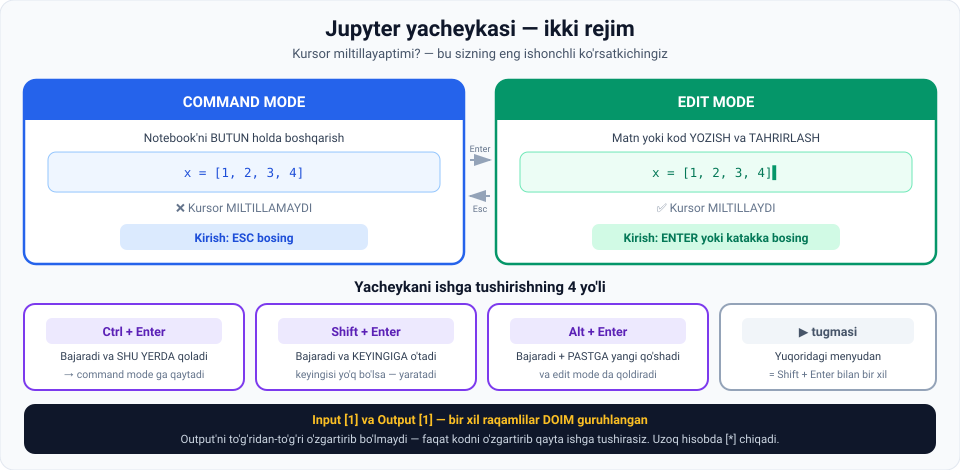

# 4-dars. Notebook fayllari bilan ishlash

## 🎬 Boshlashdan oldin

Bu darsda siz **birinchi Python kodingizni** yozasiz va ishga tushirasiz.

> Va **eng muhim ko'nikmani** o'rganasiz: kursor **miltillayaptimi yoki yo'qmi** — bu Jupyter'da hamma narsani hal qiladi.

---

## 1. Yacheyka (cell)

> **Birinchidan, bu yerda ko'rayotgan maydon YACHEYKA (cell) deb ataladi.**
>
> ## **Aynan shu yerda siz matn va kod berasiz.**

---

## 2. 🔄 Ikkita rejim

> **Ikkinchidan, Jupyter yacheykalarini boshqarishning IKKI REJIMI borligini yodda tuting.**



### Command mode

> **Siz hozir COMMAND MODE dasiz.**
>
> **Bu rejim notebook'ni BUTUN holda boshqarish yoki tashkil qilishni o'z ichiga oladi.**

### Edit mode

> **Boshqa rejim — EDIT MODE — matn yoki kodni YOZISH va TAHRIRLASH imkonini beradi.**

**Unga kirish:**

> **Kirish maydoni deb belgilangan kulrang katakka bosing, yoki yacheykani tanlab ENTER bosing.**
>
> **Shundan so'ng siz KURSORNI ko'rasiz va kod yozishni boshlashingiz mumkin.**

**Undan chiqish:**

> **Edit mode ni yopish uchun hujjatning boshqa joyiga bosing yoki ESCAPE tugmasini bosing.**
>
> **Tabiiyki, ikkisidan birini qilganingizda siz COMMAND MODE ga qaytasiz.**
>
> **Shuning uchun kursor yo'qoldi.**

---

## 3. 🔑 Eng muhim ko'rsatkich

> **Command mode da ekaningizga ishonch hosil qilmoqchi bo'lsangiz — shunchaki ESCAPE bosing.**
>
> **Buni qilish sizni doim edit mode dan chiqaradi.**

> ## **MILTILLAYOTGAN KURSOR — kod yozishga tayyor ekaningizning ENG YAXSHI KO'RSATKICHI.**
>
> **Uni ko'rsangiz — siz EDIT MODE dasiz.**
>
> **Agar u ko'rinmasa** — bu ESCAPE bosgandan yoki yacheykadan tashqariga bosgandan keyin sodir bo'lishi mumkin — **siz COMMAND MODE ga kirgansiz.**

---

## 4. 💻 Birinchi kod

Ma'ruzadagi misolni takrorlaymiz:

```python
x = [1, 2, 3, 4]
x
```

> **Men X ni to'rtta son — 1, 2, 3 va 4 — ro'yxati sifatida aniqlaydigan qisqa kod satrini yozaman.**
>
> **Shundan so'ng men kompyuterdan bu ro'yxatni ko'rsatishni so'rashim mumkin — `x` deb yozib, yacheykani ishga tushirib.**

**Natija:**

```
[1, 2, 3, 4]
```

---

## 5. ▶️ Ishga tushirishning 4 yo'li

### 1-yo'l · `Ctrl + Enter`

> **Birinchisi — Ctrl ni ushlab, Enter bosish.**
>
> **Buni qilish orqali mashina yacheykadagi kodni bajaradi va MEN SHU YERDA QOLAMAN** — ya'ni men boshqa yacheyka yaratmagan yoki tanlamagan bo'laman.
>
> **Shuning uchun men COMMAND MODE ga ham qaytaman.**

### 2-yo'l · `Shift + Enter`

> **Ikkinchi variant kodni yanada RAVON yozishga imkon beradi.**
>
> **Xuddi shu kodni bajarish uchun Shift ni ushlab, Enter bosing.**
>
> **Oldingi ikki satr bajariladi va kod yozishingiz mumkin bo'lgan YANGI YACHEYKA yaratiladi.**

> ⚠️ **Muhim nuans:** yangi yacheyka **faqat** siz yozayotgan yacheykadan **keyin boshqa yacheyka bo'lmasa** yaratiladi.
>
> **Aks holda** Jupyter sizni **keyingi yacheykaga**, **command mode da** (edit mode da emas) olib boradi.

### 3-yo'l · ▶️ tugmasi

> **Yacheykani ishga tushirishning uchinchi yo'li — yuqori menyudagi kichik uchburchak ikonkasini bosish.**
>
> **Bu variant Shift + Enter kombinatsiyasi bilan AYNAN BIR XIL ishlaydi.**

### 4-yo'l · `Alt + Enter`

> **Nihoyat, Alt + Enter joriy yacheykani ishga tushiradi, PASTGA yangisini qo'shadi va sizni EDIT MODE ga qo'yadi** — shunda siz **darrov kod yozishni davom ettira olasiz**.

---

## 6. 📊 Input va Output

> **Kirish maydoni bilan BIR XIL raqamli chiqish maydoni paydo bo'lganini kuzating.**
>
> ## **Bir xil raqamli Input va Output maydonlari DOIM guruhlangan.**
>
> **Chiqish — tegishli kirishda berilgan kodga mashinaning javobi.**

### ⚠️ Chiqishni o'zgartirib bo'lmaydi

> **Diqqat: siz chiqishning O'ZINI o'zgartira olmaysiz.**
>
> **Siz faqat KODNI o'zgartirib, kerak bo'lsa yacheykani QAYTA ishga tushira olasiz.**

**Misol:**

> **Masalan, ro'yxatingizga 5 sonini qo'shish uchun edit mode ga qayting, 5 ni yozing.**
>
> **Keyin yana Ctrl + Enter bosing.**
>
> **Ko'ring — chiqish o'zgardi, ro'yxatda 5 qiymati ko'rinmoqda.**

```python
x = [1, 2, 3, 4, 5]
x
```

```
[1, 2, 3, 4, 5]
```

---

## 7. ⭐ Yulduzcha `[*]`

> **Qiziq tomoni: kompyuterdan og'irroq hisob-kitob talab qiladigan murakkabroq kod bilan ishlaganingizda, kod ishlayotgan paytda yacheyka yonidagi KVADRAT QAVSLAR ichida kichik YULDUZCHA paydo bo'ladi.**

```
In [*]:   ← hozir ishlayapti
In [7]:   ← tugadi, 7-marta bajarildi
```

### To'xtatish

> **Ba'zan bu jarayon tugash uchun juda uzoq davom etadi.**
>
> **Uni to'xtatish yoki "buzish" (break) uchun klassik STOP belgisini bosish yordam beradi.**

---

## 8. 📊 To'rtta yo'lni solishtirish

| Usul | Bajaradi | Keyin qayerda qolasiz | Yangi yacheyka |
|---|---|---|---|
| **`Ctrl + Enter`** | ✅ | **Shu yacheykada**, command mode | ❌ |
| **`Shift + Enter`** | ✅ | **Keyingi yacheykada** | ✅ (agar keyingisi yo'q bo'lsa) |
| **▶️ tugmasi** | ✅ | Keyingi yacheykada | ✅ (Shift+Enter bilan bir xil) |
| **`Alt + Enter`** | ✅ | **Yangi yacheykada**, edit mode | ✅ **doim** |

> 💡 **Amaliy maslahat:**
> - Bitta yacheykani **qayta-qayta sinayotganda** → `Ctrl + Enter`
> - **Ketma-ket yozayotganda** → `Shift + Enter`
> - **Tez yozib ketayotganda** → `Alt + Enter`

---

## 9. ⚡ Amaliy topshiriqlar

### 🟢 Oson — 15 daqiqa · **To'rtta usulni sinang**

Jupyter'da yangi notebook oching:

```
☐ 1. Birinchi yacheykaga yozing:  x = [1, 2, 3, 4]
☐ 2. Ikkinchi qatorga:            x
☐ 3. Ctrl + Enter bosing
      Kursor qayerda?  ______________
      Yangi yacheyka yaratildimi?  ha / yo'q

☐ 4. Yacheykani tahrirlang: 5 ni qo'shing
☐ 5. Shift + Enter bosing
      Kursor qayerda?  ______________
      Yangi yacheyka yaratildimi?  ha / yo'q

☐ 6. Yangi yacheykaga:  y = x * 2
☐ 7. Alt + Enter bosing
      Kursor qayerda?  ______________
      Qaysi rejimda?  ______________

☐ 8. Yuqoridagi ▶️ tugmasini sinang
      Shift + Enter bilan bir xilmi?  ha / yo'q
```

**Savol:** `y = x * 2` nima qaytardi? Kutganingizdek bo'ldimi?

<details>
<summary>💡 Javob</summary>

`[1, 2, 3, 4, 5, 1, 2, 3, 4, 5]` — ro'yxat **ikki marta takrorlandi**, sonlar **ikkiga ko'paytirilmadi**!

Python'da `ro'yxat * 2` — bu **takrorlash**, matematik ko'paytirish emas. Buni **17-modulda** (Sequences) batafsil ko'ramiz.

</details>

### 🟡 O'rta — 15 daqiqa · **Input/Output raqamlarini kuzating**

```
1. Yangi notebook oching
2. Uchta yacheyka yarating:
   [1]:  a = 10
   [2]:  b = 20
   [3]:  a + b

3. Ularni TARTIB BILAN ishga tushiring.
   Raqamlar: In[1], In[2], In[3]  ✓

4. Endi BIRINCHI yacheykani qayta ishga tushiring.
   Uning raqami nima bo'ldi?  In[____]

5. Ikkinchisini qayta ishga tushiring.
   In[____]

6. XULOSA: raqamlar nimani bildiradi?
   ______________________________________________

7. SAVOL: agar 3-yacheykani BIRINCHI ishga tushirsangiz,
   nima bo'ladi?  Sinab ko'ring (kernel'ni qayta ishga
   tushirgandan keyin).
   ______________________________________________
```

<details>
<summary>💡 Javob ilgagi</summary>

Raqamlar **bajarilish tartibini** ko'rsatadi, yacheyka **joylashuvini** emas. Har safar qayta ishga tushirilganda raqam **oshadi**.

7-savol: `NameError` — chunki `a` va `b` hali aniqlanmagan. Bu — Jupyter'ning eng keng tarqalgan tuzog'i.

</details>

### 🔴 Qiyin — tajriba · **Yulduzchani ko'ring**

```python
# Bu kodni yacheykaga qo'ying va ishga tushiring
import time

print("Boshlandi...")
time.sleep(10)          # 10 soniya kutadi
print("Tugadi!")
```

```
1. Ishga tushiring va yacheyka yonidagi qavsni kuzating.
   Nima ko'rdingiz?  In[____]

2. Endi qayta ishga tushiring va STOP tugmasini bosing.
   Nima bo'ldi?  ______________________________
   Qanday xabar chiqdi?  ______________________

3. SAVOL: real ishda qachon STOP kerak bo'ladi?
   • ______________________________________
   • ______________________________________

4. Endi 10 ni 100 ga o'zgartiring va ishga tushiring.
   Boshqa yacheykani ishga tushira olasizmi?  ha / yo'q
   Nima uchun?  ______________________________
```

<details>
<summary>💡 4-savol javobi</summary>

**Yo'q.** Kernel **band** — u navbatdagi yacheykalarni **navbatga qo'yadi** va birinchisi tugagach bajaradi. Shuning uchun uzoq hisob-kitobni to'xtatish tugmasi muhim.

</details>

---

## 10. 🧠 O'zini tekshirish savollari

1. Yacheyka nima va u nima uchun?
2. Ikkita rejim qaysi va har biri nima uchun?
3. Edit mode ga qanday kiriladi? Ikki yo'lni ayting.
4. Command mode ga qanday qaytiladi?
5. Qaysi rejimda ekaningizni qanday bilasiz?
6. Kodni ishga tushirishning 4 yo'lini ayting.
7. `Ctrl + Enter` va `Shift + Enter` farqi nima?
8. `Shift + Enter` qachon yangi yacheyka yaratadi?
9. `Alt + Enter` nima qiladi?
10. Input va Output raqamlari nimani bildiradi?
11. Output'ni o'zgartirish mumkinmi?
12. `[*]` nimani bildiradi va uni qanday to'xtatish mumkin?

<details>
<summary>✅ Javoblar</summary>

1. **Matn va kod beriladigan maydon.**
2. **Command mode** — notebook'ni **butun holda boshqarish/tashkil qilish**. **Edit mode** — matn yoki kodni **yozish va tahrirlash**.
3. (a) **Kulrang katakka bosish**; (b) yacheykani tanlab **Enter** bosish.
4. **Hujjatning boshqa joyiga bosish** yoki **Escape** bosish.
5. **Miltillayotgan kursor** bo'yicha: bor — **edit mode**, yo'q — **command mode**.
6. **`Ctrl+Enter`**, **`Shift+Enter`**, **▶️ tugmasi**, **`Alt+Enter`**.
7. **`Ctrl+Enter`** — bajaradi va **shu yerda qoladi** (command mode ga qaytadi). **`Shift+Enter`** — bajaradi va **keyingisiga o'tadi**.
8. Faqat joriy yacheykadan **keyin boshqa yacheyka bo'lmasa**.
9. Joriy yacheykani bajaradi, **pastga yangisini qo'shadi** va **edit mode da** qoldiradi.
10. Bir xil raqamlilar **doim guruhlangan**; Output — Input'dagi kodga **mashinaning javobi**.
11. **Yo'q** — faqat **kodni o'zgartirib**, yacheykani **qayta ishga tushirish** mumkin.
12. Kod **hozir ishlayotganini**. **Stop belgisini** bosib to'xtatish mumkin.

</details>

---

## 📌 Xulosa

```
YACHEYKA (cell) — matn va kod maydoni

  COMMAND MODE  ⟷  EDIT MODE
  (Esc)            (Enter yoki katakka bosish)
  kursor YO'Q      kursor MILTILLAYDI

ISHGA TUSHIRISH:
  Ctrl + Enter   →  shu yerda qoladi
  Shift + Enter  →  keyingisiga o'tadi
  Alt + Enter    →  yangi yacheyka + edit mode
  ▶️ tugmasi      →  = Shift + Enter

In [3]  ⟷  Out [3]     bir xil raqam = juftlik
In [*]                  hozir ishlayapti → STOP bilan to'xtatiladi
```

---

## 🔖 Atamalar

| Atama | Inglizcha | Izoh |
|---|---|---|
| Yacheyka | *cell* | Kod yoki matn maydoni |
| Command mode | *command mode* | Notebook'ni boshqarish rejimi |
| Edit mode | *edit mode* | Yozish va tahrirlash rejimi |
| Kursor | *cursor* | Miltillovchi yozuv belgisi |
| Input / Output | *input / output* | Kirish va chiqish maydonlari |
| Ro'yxat | *list* | `[1, 2, 3]` ko'rinishidagi ma'lumot turi |
| Break / Stop | *interrupt* | Bajarilishni to'xtatish |

---

⬅️ [Oldingi: Jupyter'dan foydalanish](03-Introduction-to-Using-Jupyter.md) · ➡️ [Keyingi: Tezkor tugmalar](05-Using-Shortcuts.md)
