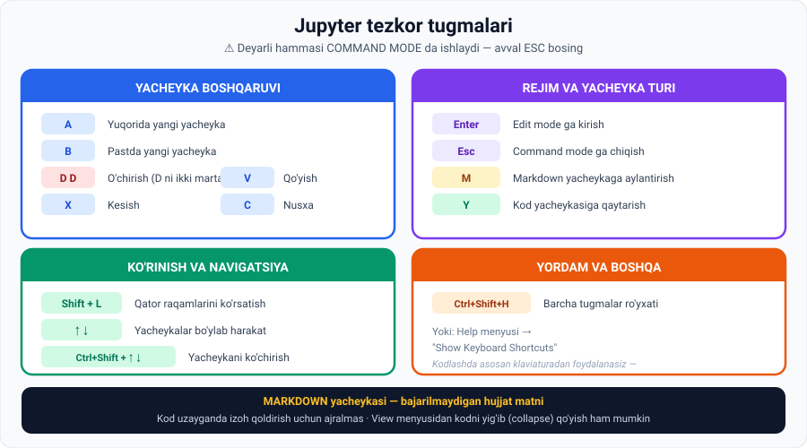

# 5-dars. Tezkor tugmalardan foydalanish

## 🎬 Boshlashdan oldin

> **"Biz ergonomika tarafdorlari bo'lganimiz uchun, klaviatura tugmalariga o'rganib qolishingizni tavsiya qilamiz.**
>
> **Kod yozganda siz asosan KLAVIATURADAN foydalanasiz, shuning uchun tezroq ishlash imkonini beradigan turli kombinatsiyalarni yodlash arziydi."**

Bu dars — ma'ruzachining o'z so'zi bilan aytganda, **uzun, lekin AJRALMAS**.

---

## 1. Tezkor tugmalar ro'yxatini ochish

> **Avval command mode da ekaningizga ishonch hosil qiling.**
>
> **Buni hech bir yacheykada kursor miltillamayotganini tasdiqlash orqali tekshirishingiz mumkin, yoki shunchaki ESCAPE bosing.**

**Ro'yxatni ochish — ikki yo'l:**

| Yo'l |
|---|
| **Help** menyusi → **Show Keyboard Shortcuts** |
| **`Ctrl + Shift + H`** |

> **Yangi oyna paydo bo'ladi** — u **chapda har bir amalni**, **o'ngda esa unga mos tezkor tugmani** ko'rsatadi.

**Yopish:**

> **Escape tugmasi**, **oynaning o'ng pastidagi Close tugmasi**, yoki **ekranning boshqa joyiga bosish**.



---

## 2. 👁 Ko'rinishni boshqarish

### Kodni yig'ish (collapse)

Ma'ruzadagi misol:

```python
# x qiymati 3 + 5 ga teng
x = 3 + 5
print(x)
```

```
8
```

> **View menyusini oching va siz elementlarni yig'ish (collapse) variantini ko'rasiz.**
>
> **Masalan, yozgan kodingizni yashirish uchun COLLAPSE SELECTED CODE ni tanlang.**
>
> **Ko'ring — kod yo'qoldi, faqat IZOH va NATIJA qoldi.**
>
> **Qaytarish uchun xuddi shu menyudan EXPAND SELECTED CODE ni tanlang.**

**Nima uchun bu kerak:**

> **Bu misolda natija ko'p joy egallamaydi.**
>
> **Lekin bu imkoniyat UZUN KOD bilan ishlaganda ayniqsa foydali bo'ladi.**

### Qator raqamlari — `Shift + L`

> **Yana bir eslatishga arziydigan tugma — `Shift + L`.**
>
> **Tezkor tugmalar menyusida siz `Shift + L` qator raqamlarini ko'rsatish yoki yashirish uchun ishlatilishini ko'rasiz.**

**Nima uchun kerak:**

> **Yana, qator raqamlari qisqa kod uchun keraksiz tuyulishi mumkin, lekin kodingiz o'sgani sari ular FOYDALI bo'ladi** —
>
> **ayniqsa boshqalar bilan hamkorlikda ishni tekshirish yoki ko'rib chiqishda.**

> 💡 **Nima uchun?** Xato xabari **qator raqamini** ko'rsatadi. Hamkasbingiz *"14-qatorda muammo bor"* deganda — siz uni **darrov topasiz**.

---

## 3. ✂️ Yacheyka amallari

> **Yacheykalarni KESISH, NUSXALASH, QO'YISH va O'CHIRISH mumkinligi nihoyatda foydali.**
>
> **Bu yacheyka darajasidagi buyruqlarni qo'llash uchun har bir ikonka ustiga kursorni olib boring va funksiyasini ko'ring, keyin bosing.**

### Ma'ruzadagi amaliyot

| Tugma | Amal | Ma'ruzadagi tavsif |
|---|---|---|
| **`X`** | **Kesish** | *"Men bu yacheykani tanlab, X tugmasini bosib kesaman"* |
| **`V`** | **Qo'yish** | *"Yuqoriga ko'chib, to'g'ridan-to'g'ri V bosaman"* |
| **`C`** | **Nusxa** | *"Endi men xuddi shu yacheykani nusxalash uchun C bosaman"* |

> **Esda tuting: notebook faylingiz bo'ylab harakatlanish uchun doim O'Q TUGMALARIDAN foydalanishingiz mumkin.**

### Yacheykani ko'chirish

> **Keyingisi: `Ctrl + Shift` ni ushlab, YUQORI yoki PASTGA o'q bosish tanlangan yacheykani yuqoriga yoki pastga ko'chirish imkonini beradi.**
>
> **Diqqat: tegishli CHIQISH MAYDONI ham o'z kirish yacheykasi bilan birga ko'chadi.**

---

## 4. ➕ Yacheyka qo'shish va o'chirish

> **Yana uchta tugma kodlashingizni ancha tezlashtirishi mumkin.**

| Tugma | Nima qiladi |
|---|---|
| **`A`** | Tanlangan yacheykadan **YUQORIDA** yangi bo'sh yacheyka qo'shadi |
| **`B`** | Tanlangan yacheykadan **PASTDA** yangi yacheyka qo'shadi |
| **`D` `D`** | Yacheykani **O'CHIRADI** (`D` ni **ikki marta** bosish) |

> 🧠 **Yodlash uchun:** `A` = **A**bove (yuqorida) · `B` = **B**elow (pastda) · `D` = **D**elete (o'chirish)

---

## 5. 📝 Markdown yacheykasi

> **Hozirgacha ko'rgan barcha yacheykalar KOD yacheykalari edi.**
>
> **Ko'raylik, MARKDOWN yacheykasi nima?**

### Ta'rif

> ## **Bu qat'iy ravishda HUJJAT MATNINI o'z ichiga oladigan, KOD SIFATIDA BAJARILMAYDIGAN yacheyka.**
>
> **U siz fayl o'quvchisiga qoldirmoqchi bo'lgan xabarni o'z ichiga oladi.**

### Aylantirish

| Yo'nalish | Qanday |
|---|---|
| **Kod → Markdown** | Ro'yxatdan **Markdown** ni tanlang yoki **`M`** bosing |
| **Markdown → Kod** | Ro'yxatdan **Code** ni tanlang yoki **`Y`** bosing |

> **Yacheykaga kirish uchun Enter bosing va matn yozing.**
>
> **Yacheykani ishga tushirganimda, natija oddiy bayonot bo'ladi.**

**Misol:**

```markdown
## Ma'lumotni tayyorlash

Quyidagi kod mijoz sharhlarini yuklaydi va tozalaydi.
Manba: `sharhlar.csv`
```

---

## 6. ✅ Jupyter'ning ikkita afzalligi

Ma'ruza yakunida ikkita asosiy afzallik keltiriladi:

### Afzallik 1 — Markdown

> **Birinchidan, kodingiz uzayganda MARKDOWN yacheykalari foydali bo'lib chiqadi** —
>
> **ular sizga izoh qoldirish va yaratgan yechimingizni tushuntirish imkonini beradi.**
>
> **Aynan shuning uchun amaliyotchilar ulardan foydalanishni yaxshi ko'radi.**

### Afzallik 2 — tanlab bajarish

> **Bu ilovadan foydalanishning boshqa foydasi — siz XOHLAGAN yacheykani tanlab bajarishingiz mumkin.**
>
> ## **Ma'lum bir yacheykani ishga tushirish uchun oldingi BARCHA yacheykalarni ishga tushirishingiz SHART EMAS.**
>
> **Bu muammoni QISMLARGA bo'lib hal qilish imkonini beradi va KO'P HISOBLASH VAQTINI TEJAYDI.**

> ⚠️ **Lekin ehtiyot bo'ling!** Bu erkinlikning **teskari tomoni** ham bor: agar yacheykalarni **tartibsiz** ishga tushirsangiz, notebook **boshqa kompyuterda ishlamasligi** mumkin. Buni **7-darsda** (Restarting the Kernel) hal qilamiz.

---

## 7. 📋 To'liq shpargalka

⚠️ **Deyarli hammasi COMMAND MODE da ishlaydi** — avval `Esc` bosing.

### Rejim

| Tugma | Amal |
|---|---|
| `Enter` | Edit mode ga kirish |
| `Esc` | Command mode ga chiqish |

### Bajarish

| Tugma | Amal |
|---|---|
| `Ctrl + Enter` | Bajarish, shu yerda qolish |
| `Shift + Enter` | Bajarish, keyingisiga o'tish |
| `Alt + Enter` | Bajarish + pastda yangi yacheyka |

### Yacheyka boshqaruvi

| Tugma | Amal |
|---|---|
| `A` | Yuqorida yangi yacheyka |
| `B` | Pastda yangi yacheyka |
| `D` `D` | O'chirish |
| `X` | Kesish |
| `C` | Nusxalash |
| `V` | Qo'yish |
| `Ctrl+Shift + ↑ ↓` | Yacheykani ko'chirish |
| `↑` `↓` | Yacheykalar bo'ylab harakat |

### Yacheyka turi

| Tugma | Amal |
|---|---|
| `M` | Markdown ga aylantirish |
| `Y` | Kod yacheykasiga qaytarish |

### Ko'rinish va yordam

| Tugma | Amal |
|---|---|
| `Shift + L` | Qator raqamlari |
| `Ctrl + Shift + H` | Barcha tugmalar ro'yxati |

---

## 8. ⚡ Amaliy topshiriqlar

### 🟢 Oson — 20 daqiqa · **Sichqonchasiz ishlang**

Yangi notebook oching va **faqat klaviatura bilan** bajaring:

```
☐ 1.  Esc bosing (command mode)
☐ 2.  B bosing — pastda yangi yacheyka
☐ 3.  B ni yana 2 marta bosing — jami 4 ta yacheyka
☐ 4.  ↑ ↓ o'qlari bilan yuqoriga-pastga yuring
☐ 5.  2-yacheykada turing → M bosing (markdown)
☐ 6.  Enter → yozing: "## Mening birinchi notebookim"
☐ 7.  Ctrl+Enter → sarlavha chiqdimi?  ha / yo'q
☐ 8.  Esc → 3-yacheykaga o'ting
☐ 9.  Enter → yozing: x = 42
☐ 10. Shift+Enter
☐ 11. Esc → C bosing (nusxa) → V bosing (qo'yish)
☐ 12. Ctrl+Shift+↑ — yacheykani yuqoriga ko'chiring
☐ 13. D D — o'chiring
☐ 14. Shift+L — qator raqamlari chiqdimi?  ha / yo'q
☐ 15. Ctrl+Shift+H — ro'yxatni oching, 3 ta YANGI tugma toping:

      ____________  →  ______________________
      ____________  →  ______________________
      ____________  →  ______________________
```

**Savol:** butun mashqni **sichqonchasiz** bajara oldingizmi? Necha daqiqa ketdi?

### 🟡 O'rta — 20 daqiqa · **Markdown bilan hujjat yarating**

Notebook'ni **o'qiladigan hujjatga** aylantiring:

```
Struktura:

[Markdown]  # Talabalar baholari tahlili
[Markdown]  ## 1. Ma'lumotni tayyorlash
[Code]      baholar = [85, 92, 78, 95, 88]
[Markdown]  ## 2. Statistika
[Code]      print("O'rtacha:", sum(baholar) / len(baholar))
            print("Eng yuqori:", max(baholar))
            print("Eng past:", min(baholar))
[Markdown]  ## 3. Xulosa
[Markdown]  O'rtacha baho ____ ni tashkil qildi.
```

**Vazifalar:**
1. Shu strukturani yarating (`M` va `Y` dan foydalaning).
2. Markdown'da `#`, `##`, `**qalin**` ni sinang.
3. `View → Collapse Selected Code` bilan kodni yashiring.
4. **Savol:** kodni yashirganda hujjat **kimga** foydali bo'ladi?

<details>
<summary>💡 Javob</summary>

**Texnik bo'lmagan o'quvchiga** — rahbar, mijoz, hamkasb. Ular **natijani** ko'rishadi, kod ularni chalg'itmaydi. Bu — Jupyter'ning **hisobot vositasi** sifatidagi kuchi.

</details>

### 🔴 Qiyin — tezlik · **Kodlash tezligingizni o'lchang**

```
VAZIFA: quyidagi notebook'ni ikki marta yarating

   [Markdown]  # Hisobot
   [Code]      a = 10
   [Code]      b = 20
   [Code]      print(a + b)
   [Markdown]  ## Natija: 30

1-URINISH — faqat SICHQONCHA bilan
   (menyulardan tugmalarni bosing)
   Vaqt: ______ soniya

2-URINISH — faqat KLAVIATURA bilan
   Vaqt: ______ soniya

FARQ: ______ soniya  ( ______% tezroq )

3. Endi tasavvur qiling: kuniga 100 ta shunday amal.
   Yiliga qancha vaqt tejaysiz?  ______ soat

4. Ma'ruzachi "ergonomika" haqida gapiradi. Bu nimani
   anglatadi va nima uchun muhim?
   ______________________________________________
```

---

## 9. 🧠 O'zini tekshirish savollari

1. Tezkor tugmalar ro'yxatini qanday ochish mumkin? Ikki yo'l.
2. Ro'yxatni ochishdan oldin qaysi rejimda bo'lish kerak?
3. `Collapse Selected Code` nima qiladi va qachon foydali?
4. `Shift + L` nima qiladi va nima uchun kerak?
5. `X`, `C`, `V` tugmalari nima qiladi?
6. Yacheykani yuqoriga/pastga qanday ko'chirasiz? Chiqish maydoni-chi?
7. `A`, `B`, `D D` nima qiladi?
8. Markdown yacheykasi nima?
9. Kod → markdown va markdown → kod aylantirish qanday?
10. Jupyter'ning ikkita afzalligi nima?
11. Nima uchun tanlab bajarish vaqt tejaydi?

<details>
<summary>✅ Javoblar</summary>

1. **Help menyusi → Show Keyboard Shortcuts**, yoki **`Ctrl + Shift + H`**.
2. **Command mode** da — kursor miltillamasligi kerak (`Esc`).
3. Yozgan kodni **yashiradi**, faqat **izoh va natija** qoladi. **Uzun kod** bilan ishlaganda foydali.
4. **Qator raqamlarini** ko'rsatadi/yashiradi. Kod o'sganda, ayniqsa **hamkorlikda tekshirish** uchun foydali.
5. `X` — **kesish**, `C` — **nusxalash**, `V` — **qo'yish**.
6. **`Ctrl + Shift` + ↑/↓**. **Chiqish maydoni ham o'z kirish yacheykasi bilan birga ko'chadi.**
7. `A` — **yuqorida** yangi yacheyka; `B` — **pastda**; `D` ni **ikki marta** — **o'chirish**.
8. **Qat'iy hujjat matnini** o'z ichiga oladigan, **kod sifatida bajarilmaydigan** yacheyka.
9. **`M`** — markdown ga; **`Y`** — kod yacheykasiga. Yoki ochiladigan ro'yxatdan.
10. (a) **Markdown** — izoh qoldirish va yechimni tushuntirish; (b) **xohlagan yacheykani tanlab bajarish**.
11. Ma'lum bir yacheykani ishga tushirish uchun **oldingi barcha yacheykalarni** ishga tushirish **shart emas** — muammoni **qismlarga** bo'lib hal qilish mumkin.

</details>

---

## 📌 Xulosa

```
⚠️ Avval Esc — command mode

REJIM        Enter / Esc
BAJARISH     Ctrl+Enter · Shift+Enter · Alt+Enter
QO'SHISH     A (yuqorida) · B (pastda) · D D (o'chirish)
BUFER        X (kes) · C (nusxa) · V (qo'y)
KO'CHIRISH   Ctrl+Shift + ↑↓  (chiqish ham birga ko'chadi)
TURI         M (markdown) · Y (kod)
KO'RINISH    Shift+L (qator raqamlari) · View → Collapse
YORDAM       Ctrl+Shift+H

Jupyter afzalliklari:
  1. MARKDOWN — izoh va tushuntirish
  2. TANLAB BAJARISH — hisoblash vaqtini tejaydi
```

---

## 🔖 Atamalar

| Atama | Inglizcha | Izoh |
|---|---|---|
| Tezkor tugma | *shortcut* | Klaviatura kombinatsiyasi |
| Markdown | *Markdown* | Matn formatlash tili |
| Collapse / Expand | *collapse / expand* | Yig'ish / yoyish |
| Qator raqami | *line number* | Kod satrining raqami |
| Buferga olish | *cut / copy / paste* | Kesish / nusxalash / qo'yish |
| Ergonomika | *ergonomics* | Qulay va samarali ish tashkili |

---

⬅️ [Oldingi: Notebook fayllari](04-Working-with-Notebook-Files.md) · ➡️ [Keyingi: Xato xabarlari](06-Handling-Error-Messages.md)
