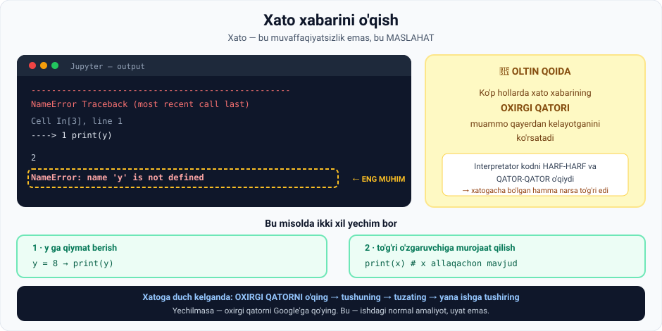

# 6-dars. Xato xabarlari bilan ishlash

## 🎬 Boshlashdan oldin

> **"Chet tilida yoki hatto ona tilimizda gapirganda ba'zan xato qilamiz. Kod yozganda ham vaziyat farq qilmaydi.**
>
> **Dasturlashning ajoyib tomoni shundaki — SIZ XATOINGIZ HAQIDA XABARDOR QILINASIZ."**

Bu dars — kursning eng **psixologik** darsi. U sizga texnik ko'nikma emas, **munosabat** o'rgatadi.

---

## 1. Xato — bu normal

> **Python, boshqa har qanday dasturlash tili kabi, siz undan tushunmaydigan narsani so'raganingizda XATO XABARINI ko'rsatadi.**

---

## 2. 📖 Ma'ruzadagi misol

### To'g'ri kod

```python
x = 5 + 3
print(x)
```

```
8
```

> **Biz `x` besh va uchning yig'indisiga — ya'ni sakkizga — teng bo'lishini belgilash uchun bu yacheykani bajaramiz.**
>
> **Keyin `print(x)` orqali Python'dan `x` qiymatini ko'rsatishini so'raymiz.**
>
> **Chiqish maydonida biz kutgan narsani ko'ramiz: sakkiz qiymati.**
>
> **Bu biz TO'G'RI ishlaganimizni va Python sintaksisiga rioya qilganimizni anglatadi.**

### Xato kod

```python
print(y)
```

> **Lekin biz teskarisini qilib, Python qoidalarini e'tiborsiz qoldirib, `y` qiymatini ko'rsatishni so'rasak nima bo'ladi?**
>
> **Biz XATO XABARINI olamiz.**



---

## 3. 🔑 Eng muhim qoida

> **Bu muammoni hal qilish uchun Jupyter'ning o'zi bizga yordam beradi** — u **imkoni boricha** operatsiyani bajarishga nima to'sqinlik qilayotganini tushuntiradi.

> **Iltimos, eslang, va bu NIHOYATDA MUHIM:**
>
> ## **G'oya shundaki — bu MASLAHATDAN kodimizni yaxshilash uchun foydalanish, toki kerakli natijani olguncha.**

### Misolni tahlil qilamiz

> **Bu misolda bizda NAME ERROR bor.**
>
> **Jupyter hatto ANIQ aytmoqda: u `y` deganda nimani nazarda tutayotganimizni tushunmayapti.**

### Mantiq

> **Mana shu payt siz — dasturchi sifatida — bu qanday turdagi xato ekanini anglashingiz kerak.**
>
> **Interpretator kodingizni HARF-HARF va QATOR-QATOR o'qiyotganini hisobga olsak —**
>
> **bu `y` gacha yozganimizda hech qanday xato bo'lmaganini anglatadi.**
>
> **Shuning uchun xato o'sha harfga bog'liq ko'rinadi, va xato xabarining OXIRGI QATORI buni tasdiqlaydi.**

> ## **⚠️ ESLANG: KO'P HOLLARDA xato xabarining OXIRGI QATORI muammo qayerdan kelayotganini ko'rsatadi.**

---

## 4. ✅ Ikkita yechim

> **Keyin, dasturchi sifatida biz bu aniq muammoni IKKI YO'L bilan hal qila olishimizni anglaymiz.**

| № | Yechim |
|---|---|
| **1** | **`y` uchun qiymat berish** |
| **2** | Biz shunchaki **to'g'ri o'zgaruvchiga murojaat qilmaganimizni** taxmin qilish |

```python
# 1-yechim
y = 8
print(y)          # 8

# 2-yechim
print(x)          # 8  — x allaqachon mavjud
```

> **Shuning uchun biz `y` ni `x` bilan almashtirib, yacheykani qayta bajarib, qoniqarli natijani olishimiz mumkin.**

---

## 5. ⚠️ Bir nechta xato bir vaqtda

> **"Qiyin emasdek eshitiladi, to'g'rimi? Ha, lekin bu faqat boshlanishi."**

### Muhim tushuncha

> ## **Muammo uchun BITTA sabab borligiga kafolat YO'Q ekanini anglash muhim.**

**Ma'ruzadagi misol:**

```python
prnt(y)
```

> **Masalan, agar siz `prnt(y)` deb yozsangiz, Jupyter shunchaki birinchi to'rt harf nima uchun turganini tushunmayotganini bildiradi.**
>
> **Kodchining vazifasi — ularga kerak bo'lgan buyruq `prnt` emas, `print` ekanini eslash bo'ladi.**
>
> **Oxir-oqibat, siz shunchaki YOZUV XATOSI (typo) qilgan bo'lishingiz mumkin.**

**Lekin:**

> **Biroq, buni tuzatib, kodni qayta bajarganingizda — siz YANA xato xabarini olasiz.**
>
> **Hech bo'lmaganda bu tanish ko'rinadi.**
>
> **Siz misolimiz doirasida uni qanday hal qilishni bilasiz.**
>
> **Shuning uchun `y` ni `x` bilan almashtirish nihoyat to'g'ri natijaga olib kelishi mumkin.**

```python
prnt(y)     →  NameError: name 'prnt' is not defined
print(y)    →  NameError: name 'y' is not defined      ← yana xato!
print(x)    →  8                                        ← nihoyat
```

> 💡 **Mana shu — dasturlashning haqiqiy tajribasi.** Xatolar **qatlam-qatlam** keladi. Bittasini tuzatasiz — keyingisi ko'rinadi. Bu **normal**.

---

## 6. 🧠 Uchta muhim xulosa

### 1. Jupyter har doim ham aniq aytmaydi

> **Biz Jupyter aniq bir paytda so'rovimizni nima uchun bajara olmaganining ANIQ SABABINI doim aytishiga tayanа olmaymiz.**
>
> **Uning takliflarida qanchalik aniq va to'g'ri bo'lishi hayratlanarli, lekin ajablanmang.**
>
> **Ba'zan olingan xato xabarlari bizga — dasturchilarga — juda tushunarli bo'lmaydi.**
>
> **Shuning uchun xabarlarni TUSHUNISH va muammoni qanday hal qilishga QAROR QILISH bizning ishimiz bo'ladi.**

### 2. Har bir dasturchi xato ko'rgan

> **Unutmang: kod yozish — ma'lum analitik vazifalarni hal qilish uchun dasturlash tilidan foydalanish demakdir.**
>
> ## **Shuning uchun HAR BIR DASTURCHI o'z yo'lida SON-SANOQSIZ xato xabariga duch kelgan.**
>
> **Muhimi — ular bilan qanday ishlashni bilish. Tushunishga va hal qilishga harakat qiling.**

### 3. ⚠️ Mukammal kod haqida

> ## **VA BIRINCHI URINISHDAN MUKAMMAL KOD YOZA OLISHINGIZNI DA'VO QILMANG. BU IMKONSIZ.**

**Ma'ruzachining ko'rsatmasi:**

> ## **Vazifangizdan VOZ KECHMANG va qancha kerak bo'lsa, shuncha xatoga javob berishga tayyor bo'ling.**

---

## 7. 🔍 Yordam qayerdan olish

### Google

> **Albatta, bu yordam olish joyi yo'q degani emas.**
>
> **Masalan, siz XATONI GOOGLE'GA QO'YISHINGIZ mumkin.**
>
> ## **Shunchaki xato xabarining OXIRGI QATORINI onlayn qo'ying va muammoni o'zingiz hal qilishga yordam beradigan mavzu yoki post borligini ko'ring.**

**Nima uchun bu muhim:**

> **Bu yondashuv kurs davomida afzal ko'rilmaydi yoki kerak bo'lmaydi deb o'ylayman, lekin u sizga kursni tugatgandan keyin yoki mustaqil dasturchi bo'lganingizda katta xizmat qiladi.**
>
> ## **Boshqacha aytganda, XATONI GOOGLE'GA QO'YISH — bu ishda qiladigan narsangiz. Shuning uchun bunga o'rganib qolish yaxshi.**

### Q&A forumi

> **Bu strategiya ishlaydimi yoki yo'qmi — siz Q&A forumida tegishli xatoni qidirishingiz mumkin.**
>
> **Muqobil ravishda, u yerda javob topolmasangiz yoki takrorlanuvchi muammoga duch kelsangiz — o'zingiz savol berishdan tortinmang.**

---

## 8. 📋 Savol berish shabloni

> **Faqat buni qilganingizda quyidagi tuzilmaga rioya qiling:**

| № | Nima berish kerak |
|---|---|
| **1** | **Vazifangiz nima** va **qanday natijaga** intilayotganingiz |
| **2** | Kursning **aniq ma'ruzasi yoki bo'limiga** ishora (agar mumkin bo'lsa) |
| **3** | Xato xabarini olishdan oldin **bajargan ANIQ kodingizni** joylashtiring |
| **4** | Xato xabarining **skrinshoti** yoki hech bo'lmaganda **eng oxirgi qatori** — *"O'sha juda muhim"* |
| **5** | Muammo haqida **ulasha oladigan boshqa hamma narsa** |

> **Bunday ma'lumotga ega bo'lish bizga sizga yaxshiroq yordam berishda nihoyatda ko'mak beradi.**
>
> **Shuning uchun uni berishga vaqt ajratsangiz, biz juda minnatdor bo'lamiz.**

---

## 9. 💻 Amaliyot: xatolar bilan tanishing

Jupyter'da har birini alohida yacheykada sinang:

```python
# 1 · NameError
print(mavjud_emas)

# 2 · SyntaxError
print("salom"

# 3 · TypeError
"matn" + 5

# 4 · IndexError
royxat = [1, 2, 3]
print(royxat[10])

# 5 · ZeroDivisionError
print(10 / 0)

# 6 · IndentationError
def salom():
print("salom")
```

**Har biri uchun jadval to'ldiring:**

| № | Xato nomi | Oxirgi qator nima dedi? | Qanday tuzatdingiz? |
|---|---|---|---|
| 1 | | | |
| 2 | | | |
| 3 | | | |
| 4 | | | |
| 5 | | | |
| 6 | | | |

<details>
<summary>✅ Javoblar</summary>

| № | Xato | Oxirgi qator | Yechim |
|---|---|---|---|
| 1 | `NameError` | `name 'mavjud_emas' is not defined` | O'zgaruvchini avval aniqlang |
| 2 | `SyntaxError` | `'(' was never closed` | Yopuvchi qavs `)` qo'ying |
| 3 | `TypeError` | `can only concatenate str (not "int") to str` | `"matn" + str(5)` |
| 4 | `IndexError` | `list index out of range` | Indeks 0–2 oralig'ida bo'lsin |
| 5 | `ZeroDivisionError` | `division by zero` | Nolga bo'lmang |
| 6 | `IndentationError` | `expected an indented block` | Funksiya ichini **4 bo'shliq** bilan chekintiring |

</details>

---

## 10. ⚡ Amaliy topshiriqlar

### 🟢 Oson — 15 daqiqa · **Xatoni Google'ga qo'ying**

Ma'ruza aytadi: **oxirgi qatorni Google'ga qo'ying** — bu ishda qiladigan narsangiz.

```
1. Yuqoridagi 6 ta xatodan BITTASINI tanlang
   Tanlangan: ______________________________

2. Oxirgi qatorni ANIQ nusxalang:
   ______________________________________________

3. Google'ga qo'ying. Nechta natija chiqdi?  ______

4. Birinchi 3 ta natijani oching:
   a) Sayt: ______________  Foydali bo'ldimi? ha/yo'q
   b) Sayt: ______________  Foydali bo'ldimi? ha/yo'q
   c) Sayt: ______________  Foydali bo'ldimi? ha/yo'q

5. Yechimni topdingizmi?  ha / yo'q
   Necha daqiqada?  ______

6. XULOSA: bu ko'nikma qanchalik muhim?
   ______________________________________________
```

### 🟡 O'rta — 20 daqiqa · **Qatlamli xatoni yeching**

Bu kodda **uchta** xato bor. Ularni **birma-bir** toping:

```python
sonlar = [10, 20, 30
o'rtacha = sum(sonlar) / lenn(sonlar)
prnt("O'rtacha:", o'rtacha)
```

```
1-XATO
   Xabar oxirgi qatori: __________________________
   Tuzatish:            __________________________

2-XATO (birinchisini tuzatgandan keyin)
   Xabar oxirgi qatori: __________________________
   Tuzatish:            __________________________

3-XATO
   Xabar oxirgi qatori: __________________________
   Tuzatish:            __________________________

Yakuniy ishlaydigan kod:
   ______________________________________________
   ______________________________________________
   ______________________________________________
```

> 💡 **Diqqat:** o'zgaruvchi nomida apostrof (`o'rtacha`) ham muammo tug'diradi! Python'da o'zgaruvchi nomida `'` **ishlatib bo'lmaydi**.

<details>
<summary>✅ To'g'ri kod</summary>

```python
sonlar = [10, 20, 30]
ortacha = sum(sonlar) / len(sonlar)
print("O'rtacha:", ortacha)
```

Xatolar: (1) yopilmagan `]`; (2) `lenn` → `len` **va** `o'rtacha` → `ortacha`; (3) `prnt` → `print`.

</details>

### 🔴 Qiyin — amaliyot · **Savol berish shablonini to'ldiring**

Farazan siz Q&A forumiga savol berасiz. Ma'ruzadagi **5 punktli** shablonni to'ldiring:

```
━━━ 1. VAZIFA VA KUTILGAN NATIJA ━━━
   Men nima qilmoqchiman:
   ______________________________________________
   Qanday natija kutyapman:
   ______________________________________________

━━━ 2. MA'RUZA / BO'LIM ━━━
   Modul: ______  Dars: ______

━━━ 3. ANIQ KOD ━━━
   ```
   ______________________________________________
   ______________________________________________
   ```

━━━ 4. XATO XABARI (OXIRGI QATOR — ENG MUHIM) ━━━
   ______________________________________________

━━━ 5. QO'SHIMCHA MA'LUMOT ━━━
   Nimalarni sinab ko'rdim:
   ______________________________________________
   Python versiyam: ______  OS: ______

SAVOL: nima uchun 4-punkt "juda muhim" deb ta'kidlanadi?
   ______________________________________________
```

---

## 11. 🧠 O'zini tekshirish savollari

1. Dasturlashning "ajoyib tomoni" nima?
2. Python qachon xato xabarini ko'rsatadi?
3. Xato xabarining g'oyasi nima?
4. Ma'ruzadagi misolda qanday xato yuz berdi?
5. Interpretator kodni qanday o'qiydi va bu nimani anglatadi?
6. **Eng muhim qoida** nima?
7. Misoldagi muammoni qanday ikki yo'l bilan hal qilish mumkin?
8. Bitta muammo uchun bitta sabab bo'lishi kafolatlanganmi?
9. `prnt` misolida nechta xato bor edi?
10. Jupyter har doim aniq sababni aytadimi?
11. Ma'ruzachi mukammal kod haqida nima deydi?
12. Google'da nimani qidirish kerak?
13. Savol berish shablonining 5 punktini sanang.

<details>
<summary>✅ Javoblar</summary>

1. **Siz xatoingiz haqida xabardor qilinasiz.**
2. Siz undan **tushunmaydigan** narsani so'raganingizda.
3. Bu **maslahatdan** kodni **yaxshilash** uchun foydalanish — kerakli natijani olguncha.
4. **NameError** — Jupyter `y` deganda nimani nazarda tutayotganimizni tushunmadi.
5. **Harf-harf va qator-qator.** Bu xatogacha yozilgan hamma narsa **to'g'ri** ekanini anglatadi.
6. **Ko'p hollarda xato xabarining oxirgi qatori muammo qayerdan kelayotganini ko'rsatadi.**
7. (a) **`y` uchun qiymat berish**; (b) **to'g'ri o'zgaruvchiga** (`x`) murojaat qilish.
8. **Yo'q** — bitta sabab borligiga **kafolat yo'q**.
9. **Ikkita:** avval `prnt` (typo), keyin tuzatilgach — `y` aniqlanmagani.
10. **Yo'q.** Ba'zan xabarlar dasturchiga **tushunarli bo'lmaydi** — ularni tushunish **bizning ishimiz**.
11. **Birinchi urinishdan mukammal kod yozish IMKONSIZ.** Vazifadan **voz kechmang** va **qancha kerak bo'lsa shuncha** xatoga javob bering.
12. Xato xabarining **oxirgi qatorini**.
13. (1) **Vazifa va kutilgan natija**; (2) **ma'ruza/bo'lim**; (3) **aniq kod**; (4) **xato xabari — oxirgi qator**; (5) **qo'shimcha ma'lumot**.

</details>

---

## 📌 Xulosa

```
XATO ≠ muvaffaqiyatsizlik      XATO = MASLAHAT

  Interpretator: HARF-HARF, QATOR-QATOR o'qiydi
       ↓
  🔑 OXIRGI QATOR = muammo qayerda

  ⚠️ Bitta sabab kafolatlanmagan — xatolar QATLAM-QATLAM keladi
     prnt(y) → print(y) → print(x)  ✓

MUNOSABAT:
  • Har bir dasturchi son-sanoqsiz xato ko'rgan
  • Birinchi urinishdan mukammal kod — IMKONSIZ
  • Vazifadan VOZ KECHMANG

YORDAM:
  1. Oxirgi qatorni GOOGLE'ga  ← bu ishda qiladigan narsangiz
  2. Q&A forumi — 5 punktli shablon bilan
```

---

## 🔖 Atamalar

| Atama | Inglizcha | Izoh |
|---|---|---|
| Xato xabari | *error message* | Python ning xato haqidagi javobi |
| NameError | *NameError* | Aniqlanmagan nomga murojaat |
| SyntaxError | *SyntaxError* | Til qoidasi buzilgan |
| TypeError | *TypeError* | Mos kelmaydigan tur |
| IndexError | *IndexError* | Ro'yxat chegarasidan chiqish |
| Interpretator | *interpreter* | Kodni o'qib bajaruvchi dastur |
| Typo | *typo* | Yozuv xatosi |
| Traceback | *traceback* | Xato yo'lini ko'rsatuvchi hisobot |

---

⬅️ [Oldingi: Tezkor tugmalar](05-Using-Shortcuts.md) · ➡️ [Keyingi: Kernel'ni qayta ishga tushirish](07-Restarting-the-Kernel.md)
